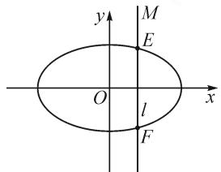
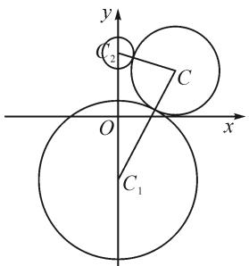
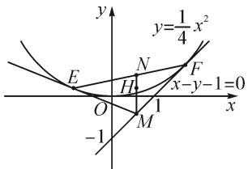
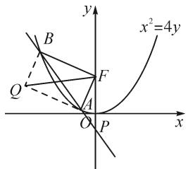
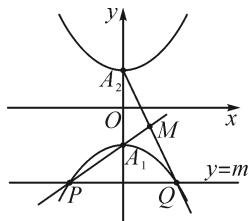

# 求曲线轨迹方程的五种常用方法例析

# ●甘肃省天水市第九中学 李春林

求曲线轨迹方程的问题,历来是高考数学的重点、难点问题之一.许多学生面对这类问题,常常感到束手无策.为此,笔者综合平时的教学,梳理归纳出以下五种求轨迹方程的常用方法.

# 1 直接法

若动点 M 满足的几何条件是用等量关系给出的, 求动点 M 的轨迹方程可按建系、设点、代入、化简、证明五个步骤进行.

典例 1 如图 1, 已知椭圆 $C: \frac{x^{2}}{5} + \frac{y^{2}}{4} = 1$ , 直线 l 与 x 轴垂直, 交椭圆 C 于 E, F 两点, M 是 l 上满足 $\overrightarrow{ME} \cdot \overrightarrow{MF} = 4$ 的点, 求点 M 的轨迹方程.

text_image

y
M
E
O
l
x
F

图 1

解: 设点 $M(x, y)$ ，则 E，
F 两点的横坐标为 x. 由 $\frac{x^{2}}{5} + \frac{y^{2}}{4} = 1$ ，得 $5y^{2} = 20 - 4x^{2}$ ， $y = \pm \sqrt{\frac{20 - 4x^{2}}{5}}$ .

所以 E, F 两点的坐标分别为 $\left(x, \sqrt{\frac{20-4x^{2}}{5}}\right)$ , $\left(x,-\sqrt{\frac{20-4x^{2}}{5}}\right)$ .

又 $\overrightarrow{ME}\cdot\overrightarrow{MF}=4$ ，则

$$
\left(0, \sqrt {\frac {2 0 - 4 x ^ {2}}{5}} - y\right) \cdot \left(0, - \sqrt {\frac {2 0 - 4 x ^ {2}}{5}} - y\right) = 4.
$$

所以 $y^{2}-\frac{20-4x^{2}}{5}=4$ ，即 $\frac{x^{2}}{10}+\frac{y^{2}}{8}=1$ .

又因为直线 l 与椭圆 C 交于两点，所以 $-\sqrt{5}<x<\sqrt{5}$ .

故点 M 的轨迹方程为 $\frac{x^{2}}{10} + \frac{y^{2}}{8} = 1 (-\sqrt{5} < x < \sqrt{5})$ .

点评:本题中向量关系 $\overrightarrow{ME}\cdot\overrightarrow{MF}=4$ 是核心条件.设点 $M(x,y)$ 则可计算出E,F的坐标,进而将向量关系转化为x,y的代数关系,化简整理即得点M的轨迹方程.

# 2 定义法

若动点 M 的轨迹符合常见曲线(直线、圆、圆锥曲线等)的定义时,则可抓住曲线的几何特征,直接得出点 M 的轨迹方程.

典例 2 如图 2, 已知圆 $x^{2}+(y+4)^{2}=25$ 的圆心为 $C_{1}$ ，圆 $x^{2}+(y-4)^{2}=1$ 的圆心为 $C_{2}$ ，某动圆 C 分别与圆 $C_{1}$ 、圆 $C_{2}$ 相外切，求动圆圆心 C 的轨迹方程.

解：由已知，点 $C_{1}(0,-4)$ , $C_{2}(0,4)$ , $r_{1}=5$ , $r_{2}=1$ .

设动圆 C 的半径为 r，则由圆 C 分别与圆 $C_{1}$ 、圆 $C_{2}$ 相外切，得 $\left|CC_{1}\right|=r+5,\left|CC_{2}\right|=r+1.$

text_image

y
C₂
C
O
x
C₁

图 2

所以 $\left|CC_{1}\right|-\left|CC_{2}\right|=4<8.$

即点 C 到两定点 $C_{1}, C_{2}$ 的距离之差为常数 4，所以动圆圆心的 C 的轨迹是以 $C_{1}, C_{2}$ 为焦点的双曲线的上支.

由题意, 得 2a=4, 2c= $\left|C_{1}C_{2}\right|=8$ .

所以 $b^{2}=c^{2}-a^{2}=12.$

故动圆圆心 C 的轨迹方程是 $\frac{y^{2}}{4}-\frac{x^{2}}{12}=1(y\geqslant2)$ .

点评:利用已知条件,分析得出动圆圆心 C 的轨迹符合双曲线(上支)定义,从而结合已知条件,直接得出轨迹方程.

# 3 相关点法

如果两点 P, Q 之间存在某种确定的运动规律，并且这两点中某点的轨迹方程是已知的，这时可以建立点 P, Q 的坐标关系，通过代换求出另一点的轨迹方程.

典例 3 如图 3, 已知抛物线 $C: y = \frac{1}{4} x^{2}$ ，动点 M 在直线 x - y - 1 = 0 上，直线 ME, MF 与抛物线 C 分别相切于点 E, F，线段 EF 的中点为 N，动点 H满足 $\overrightarrow{HM}=2\overrightarrow{NH}$ ，求点H的轨迹方程.

text_image

y
y=\frac{1}{4}x^2
E
N
F
x-y-1=0
O
H
1
M
-1
x

图3

解:由题意,可设点 $E\left(x_{1},\frac{1}{4}x_{1}^{2}\right)$ , $F\left(x_{2},\frac{1}{4}x_{2}^{2}\right)$ $(x_{1}\neq x_{2})$ .

因为 $y'=\frac{1}{2}x$ ，所以切线 ME 的方程为

$$
2 x _ {1} x - 4 y - x _ {1} ^ {2} = 0; \tag {①}
$$

切线 $MF$ 的方程为

$$
2 x _ {2} x - 4 y - x _ {2} ^ {2} = 0. \tag {②}
$$

由①②联立, 得 M 点横、纵坐标分别为

$$
x _ {M} = \frac {x _ {1} + x _ {2}}{2}, y _ {M} = \frac {x _ {1} x _ {2}}{4}.
$$

由 $\overrightarrow{HM}=2\overrightarrow{NH}$ ，结合图3可知H为 $\triangle MEF$ 的重心，设为 $(x_{H},y_{H})$ ，则

$$
x _ {H} = \frac {x _ {1} + x _ {2} + x _ {M}}{3} = x _ {M}, \tag {③}
$$

$$
y _ {H} = \frac {y _ {1} + y _ {2} + y _ {M}}{3} = \frac {x _ {1} ^ {2} + x _ {2} ^ {2} + x _ {1} x _ {2}}{1 2} =
$$

$$
\frac {(x _ {1} + x _ {2}) ^ {2} - x _ {1} x _ {2}}{1 2} = \frac {4 x _ {M} ^ {2} - 4 y _ {M}}{1 2} = \frac {x _ {M} ^ {2} - y _ {M}}{3}. \tag {④}
$$

由③④，得 $\left\{\begin{aligned}x_{M}&=x_{H},\\ y_{M}&=-3y_{H}+x_{M}^{2}.\end{aligned}\right.$

由点 M 在直线 l 上, 得 $x_{M}-y_{M}-1=0$ .

所以 $y_{H}=\frac{1}{3}x_{H}^{2}-\frac{1}{3}x_{H}+\frac{1}{3}.$

故点 H 的轨迹方程为 $y=\frac{1}{3}x^{2}-\frac{1}{3}x+\frac{1}{3}$ .

点评: 确定点 H 与点 M 的坐标关系后, 由点 M 在已知直线上, 通过代换即可求出点 H 轨迹方程. 这类问题确立两动点坐标关系是解题的关键.

# 4 参数法

在求动点的轨迹方程时,若动点的横坐标与纵坐标之间的关系很难直接找到,这时可以引入参数 t 分别建立点 P 的横坐标及纵坐标与 t 的函数关系: $\left\{\begin{aligned}x=f(t),\\ y=g(t),\end{aligned}\right.$ 然后消去参数 t,即得关于 x,y 的普通方程 $f(x,y)=0$ .

典例 4 如图 4, 已知点 $P(0, -1)$ , 直线 l 过点 P 且与抛物线 $C: x^{2} = 4y$ 相交于 A, B 两点, 动点 Q 满足 $\overrightarrow{FA} + \overrightarrow{FB} = \overrightarrow{FQ}$ , 求点 Q 的轨迹方程.

text_image

x^2=4y
y
B
F
Q
A
O
P
x

图 4

解:由题意,可设直线 l 的方程为 y=kx-1,设点 $Q(x,y)$ , $A(x_{1},y_{1})$ , $B(x_{2},y_{2})$ .

由 $\left\{\begin{aligned}y=kx-1,\\ x^{2}=4y,\end{aligned}\right.$ 得 $x^{2}-4kx+4=0.$

因为直线 l 与抛物线 C: $x^{2}=4y$ 交于 A, B 两点，所以 $x_{1}+x_{2}=4k$ ，且 $\Delta=16k^{2}-16>0$ 。

解得 k<-1，或 k>1。

因为 $\overrightarrow{FA} +\overrightarrow{FB} = \overrightarrow{FQ}$ ，所以

$$
(x _ {1}, y _ {1} - 1) + (x _ {2}, y _ {2} - 1) = (x, y - 1).
$$

故 $\left\{\begin{aligned}x&=x_{1}+x_{2}=4k,\\ y&=y_{1}+y_{2}-1=k(x_{1}+x_{2})-3=4k^{2}-3.\end{aligned}\right.$

由 $\left\{\begin{aligned}x=4k,\\ y=4k^{2}-3,\end{aligned}\right.$ 消去 k，得 $y=\frac{1}{4}x^{2}-3.$

因为 $x = 4k$ ( $k < -1$ , 或 $k > 1$ ), 所以 $x < -4$ , 或 $x > 4$ .

故点 Q 的轨迹方程为 $y=\frac{1}{4}x^{2}-3(x<-4$ 或 x>4).

点评:引入参数 k, 表示直线 l 的斜率, 进而建立动点 Q 的坐标与参数 k 之间的关系, 最后消去参数 k 即得点 Q 的轨迹方程. 恰当引参, 建立动点 Q 的坐标与参数 k 的关系是解题的关键.

# 5 交轨法

如果两条动曲线相交于一点,求该交点的轨迹方程时,可先将两条动曲线的轨迹方程联立,得出交点 $M(x,y)$ ,其中 $\left\{\begin{aligned}x=f(t),\\ y=g(t)\end{aligned}\right.$ (t为参数),然后再消去t,得方程 $f(x,y)=0$ 即得点M的轨迹方程.

典例 5 如图 5, 双曲线 $C: \frac{y^{2}}{4} - \frac{x^{2}}{3} = 1$ 与 y 轴的交点分别为 $A_{1}(0, -2)$ , $A_{2}(0, 2)$ , 直线 l: y = m 与该双曲线交于点 P, Q, 直线 $A_{1}P$ 与直线 $A_{2}Q$ 相交于点 M, 试求点 M 的轨迹方程.

text_image

y
A₂
O
x
M
A₁
P
Q
y=m

图 5

解: 设 $P(x_{1}, m)$ , $Q(-x_{1}, m)$ , $M(x, y)$ .

由点 P 在双曲线上, 得

$$
\frac {m ^ {2}}{4} - \frac {x _ {1} {} ^ {2}}{3} = 1. \tag {⑤}
$$

当 $x_{1} \neq 0$ 时，直线 $PA_{1}$ 的方程为

$$
y + 2 = \frac {m + 2}{x _ {1}} x; \tag {6}
$$

直线 $QA_{2}$ 的方程为

$$
y - 2 = \frac {2 - m}{x _ {1}} x. \tag {⑦}
$$

由⑥×⑦，得

$$
y ^ {2} - 4 = \frac {4 - m ^ {2}}{x _ {1} ^ {2}} x ^ {2}. \tag {8}
$$

由⑤得 $x_{1}^{2}=\frac{3m^{2}-12}{4}$ ，再代入⑧，得 $y^{2}-4=-\frac{4}{3}x^{2}$ .

化简整理, 得 $\frac{y^{2}}{4} + \frac{x^{2}}{3} = 1$ .

当 $x_{1}=0$ 时, 可知点 M 的坐标为 $(0, \pm2)$ 也满足 $\frac{y^{2}}{4} + \frac{x^{2}}{3} = 1$ .

综上，点 M 的轨迹方程为 $\frac{y^{2}}{4} + \frac{x^{2}}{3} = 1$ .

点评:巧妙地引入双参数 $x_{1}$ 与 m, 进而得到两动直线的方程. 联立求出交点 $M(x,y)$ , 然后整理出 x, y, $x_{1}$ , m 间的关系, 最后再消去 $x_{1}$ 与 m, 即得点 M 的轨迹方程.

# 6 小结

求曲线轨迹方程的问题,涉及知识点多,范围广,交汇性强,运算与推理比较复杂.但只要理解和把握问题的本质,熟练运用上述五种常用方法,综合分析,灵活应用,就能逐渐走出求轨迹方程的困境.Z