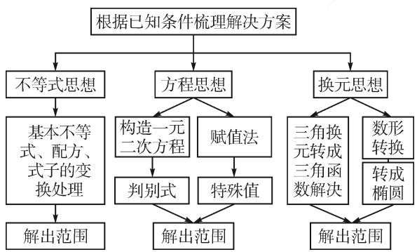
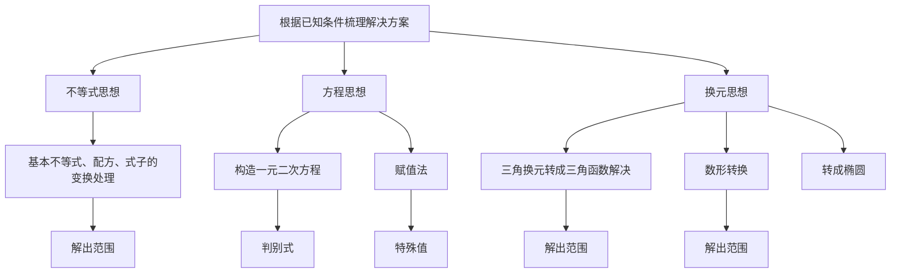
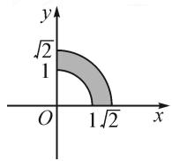
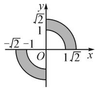
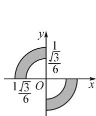
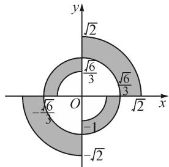

讲题比赛特等奖获奖论文之十二：

# 追本溯源:2022 年全国新高考Ⅱ卷 第 12 题的解法研究

# - 四川外语学院重庆第二外国语学校 黄国强 秦君

摘要:以 2022 年全国新高考Ⅱ卷第 12 题为不等式原型,从教材出发多角度审视试题,通过分析试题可以寻求多种解题方法,并一题多解.本题的解法中体现了数学学科知识的综合应用,以此提升学生的数学运算能力和逻辑推理能力.

关键词: 不等式; 一题多解; 运算能力

# 1 试题再现

若 x, y 为实数，满足 $x^{2} + y^{2} - xy = 1$ ，则（）.

A. $x+y\leqslant1$

B. $x + y \geqslant -2$

C. $x^{2}+y^{2}\geqslant1$

D. $x^{2} + y^{2}\leqslant 2$

# 2 试题分析

全国新高考Ⅱ卷第12题,利用已知代数关系考查不等关系.该试题可参考人教A版数学必修一(2019版)第二章复习参考题综合应用第5题,因此我们很容易想到利用不等式相关知识寻找突破口,同时还可以利用方程思想、换元思想等通法和赋值法(秒杀)进行判断.

# 3 思维导图

本题目具体解题思路见图1.

flowchart

图1

# 4 具体解法

方法 1: 不等式法.

解:由 $x^{2}+y^{2}-xy=1$ ，得 $(x+y)^{2}=1+3xy\leqslant1+\frac{3(x+y)^{2}}{4}$ .

由 $(x + y)^2 \leqslant 4$ ，得 $-2 \leqslant x + y \leqslant 2$ . 故排除选项 A.  
由 $x^2 + y^2 - xy = 1$ ，得 $x^2 + y^2 = 1 + xy \leqslant 1 + \frac{x^2 + y^2}{2}$ ，所以 $x^2 + y^2 \leqslant 2$ . 故选项 D 正确.

因为 $x^{2} + y^{2} - 1 = xy = \left[\frac{(x + y)^{2} - (x^{2} + y^{2})}{2}\right]$ 所以 $1 = \frac{3(x^2 + y^2)}{2} - \frac{(x + y)^2}{2}$ ，则 $x^{2} + y^{2} = \frac{2}{3} + \frac{(x + y)^2}{3} \geqslant \frac{2}{3}$ . 故排除选项 C.

所以选择: BD.

方法总结:该方法学生容易想到用不等式相关知识来解决,但求出 $x^{2}+y^{2}\geqslant\frac{2}{3}$ 对数学的运算要求较高,不易想到.该题在选项上兼顾基础性、综合性,考验学生的数学推理、数学运算等核心素养.

方法 2: 方程思想.

解: 令 $x^{2} + y^{2} = \frac{x^{2} + y^{2}}{x^{2} + y^{2} - xy} = \frac{1 + t^{2}}{1 + t^{2} - t} = k$ (令 $t = \frac{y}{x}$ 且 $x \neq 0$ ).

于是 $(k - 1)t^2 -kt + k - 1 = 0(k\neq 1)$ ，则由 $\Delta =$ $k^2 -4(k - 1)^2\geqslant 0$ ，得 $\frac{2}{3}\leqslant k\leqslant 2$ ，即 $\frac{2}{3}\leqslant x^2 +y^2\leqslant 2$ ，当 $x = 0$ 或 $k = 1$ 符合条件.

又 $(x + y)^2 = x^2 +y^2 +2xy = \frac{x^2 + y^2 + 2xy}{x^2 + y^2 - xy} =$ $\frac{1 + t^2 + 2t}{1 + t^2 - t} = k(t = \frac{y}{x}$ 且 $x\neq 0)$

于是 $(k - 1)t^{2} - (k + 2)t + (k - 1) = 0$ ( $k \neq 1$ ), 则 $\Delta = (k + 2)^{2} - 4(k - 1)^{2} \geqslant 0$ , 得 $k \leqslant 4$ , 即 $-2 \leqslant x + y \leqslant 2$ , 当 $x = 0$ 或 $k = 1$ 时符合条件.

方法总结:该方法采用方程思想,利用方程有解,建立判别式的不等关系.

方法 3: 换元法一.

解:由 $x^{2}+y^{2}-xy=1$ , 得

$$
\left(x - \frac {y}{2}\right) ^ {2} + \left(\frac {\sqrt {3}}{2} y\right) ^ {2} = 1.
$$

令 $\left\{ \begin{array}{l} x - \frac{y}{2} = \cos \theta, \\ \frac{\sqrt{3}}{2} y = \sin \theta, \end{array} \right.$ 则 $\left\{ \begin{array}{l} x = \frac{\sqrt{3}}{3} \sin \theta + \cos \theta, \\ y = \frac{2\sqrt{3}}{3} \sin \theta, \end{array} \right.$ 从而得 $x + y = 2\sin \left(\theta +\frac{\pi}{6}\right)$ ，即 $-2\leqslant x + y\leqslant 2;x^{2} + y^{2} =$ $\frac{2}{3}\sin \left(2\theta -\frac{\pi}{6}\right) + \frac{4}{3}$ 即 $\frac{2}{3}\leqslant x^2 +y^2\leqslant 2.$

方法总结:该方法对综合能力的要求较高,学生不易想到.此解法可参考人教版教材2019选择性必修—第89页中第10题圆的参数方程.

方法 4: 换元法二.

解: 令 $x=a+b, y=a-b$ ，由 $x^{2}+y^{2}-xy=1$ ，得 $a^{2}+\frac{b^{2}}{\frac{1}{3}}=1$ （椭圆），所以 $x+y=2a\in[-2,2]$ .

又因为 $x^{2} + y^{2} = 2(a^{2} + b^{2}) = 2(1 - 3b^{2} + b^{2}) = 2(1 - 2b^{2})$ ，且 $b\in \left(-\frac{\sqrt{3}}{3}\frac{\sqrt{3}}{3}\right)$ （椭圆上的点到原点的距离），所以 $\frac{2}{3}\leqslant x^2 +y^2\leqslant 2.$

方法总结:该方法参考了文卫星编著的《挑战压轴题——高考数学》2020版第15页考点延伸第3题的解法.此方法的核心之处在于将代数关系转化为椭圆方程,巧妙换元转化成学生熟悉的知识.该解法是数转形,对数学抽象、数学建模、逻辑推理等核心素养提出了较高要求.

方法 5: 赋值法(秒杀).

解: 对于 $x^{2} + y^{2} - xy = 1$ ，令 x = y，则 $x^{2} + y^{2} - x^{2} = 1$ ，解得 $\left\{\begin{aligned}x &= 1,\\ y &= 1,\end{aligned}\right.$ 或 $\left\{\begin{aligned}x &= -1,\\ y &= -1.\end{aligned}\right.$ 检验排除 A 选项.

再令 $x = -y$ ，由 $x^{2} + y^{2} + x^{2} = 1$ ，得 $\left\{ \begin{array}{l}x = \frac{\sqrt{3}}{3},\\ y = -\frac{\sqrt{3}}{3}, \end{array} \right.$ 或 $\left\{ \begin{array}{ll}x = -\frac{\sqrt{3}}{3},\\ y = \frac{\sqrt{3}}{3}. \end{array} \right.$ 检验排除C选项.

方法总结: 利用等式结构特征适当赋值, 巧妙地排除不符合的选项.

# 5 拓展延伸

对于上述解法 4, 实际是将代数问题巧妙地转换成几何问题, 人教 A 版 (2019 版) 数学选择性必修一第 143 页的回顾与思考中提出方程与曲线的关系“方程 $f(x,y)=0$ 是曲线的方程”.

故令 $f(x,y)=x^{2}+y^{2}-xy-1=0$ ，能否判断点 $(x,y)$ 的运动轨迹(区域)呢？

答案是肯定的.下面我们介绍绘图方法,大致判断点 $(x,y)$ 的轨迹区域.

不难发现 $f(x,y)=f(-x,-y)$ ， $f(-x,y)=f(x,-y)$ .

接下来只讨论两种情况：

(1) 当 $x > 0, y > 0$ 时， $x^2 + y^2 = 1 + xy > 1$ ，则表示点 $(x, y)$ 到原点距离大于 1；又因为 $x^2 + y^2 \leqslant 2$ ，则表示点 $(x, y)$ 到原点距离小于 $\sqrt{2}$ .

在第一象限作出图 2, 由 $f(x,y)=f(-x,-y)$ 在第三象限作出图 3.

  
图 2

  
图 3

(2) 当 x<0, y>0 时， $x^{2}+y^{2}=1+xy<1$ 表示点 $(x,y)$ 到原点距离小于 1，又因为 $x^{2}+y^{2}\geqslant\frac{2}{3}$ 表示点 $(x,y)$ 到原点距离大于 $\frac{\sqrt{6}}{3}$ ，所以根据对称性可在第二、四象限作出图 4 及 $f(x,y)=0$ 对应的图 5.

text_image

y
1/√3/6
1√3/6 O x

图 4

text_image

y
√2
√6/3
√6/3
-√6/3
O
-1
√2
x

图5

选项分析: 图 5 为点 $(x,y)$ 的轨迹区域, 是人教版必修五(2008 版)第三章简单的线性规划知识, 选项 A, B 表示点 $(x,y)$ 与直线 $x+y=1,x+y=-2$ 的位置关系, 选项 C, D 表示点 $(x,y)$ 与圆 $x^{2}+y^{2}=1,x^{2}+y^{2}=2$ 的位置关系.

# 6 试题链接

给两个试题供读者练习.

链接 1 若正实数 x, y 满足 $2x + y + 6 = xy$ ，则 xy 的最小值是 \_\_\_\_.

链接 2 已知正实数 x, y, z 满足 $x^{2} + y^{2} + z^{2} = 1$ ，则 $xy + yz$ 的最大值为 \_\_\_\_.

参考答案:(1)18,(2) $\frac{\sqrt{2}}{2}$ .Z