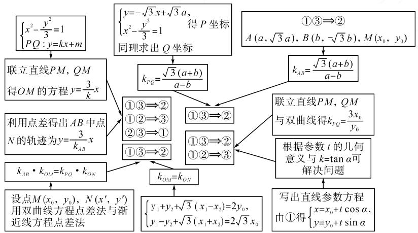
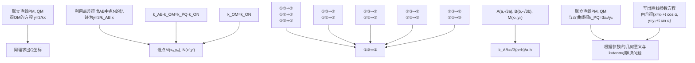
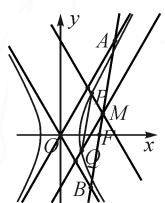

讲题比赛特等奖获奖论文之十三：

# 追本溯源:2022年新高考Ⅱ卷第21题解法探究

# ●四川外语学院重庆第二外国语学校 李中勇 郭万里 秦君

摘要:通过对试题的研究,采用解析几何常规方法,从设直线和点入手,运用设而不求的思想解决问题;也可以从新教材中寻找本题的突破点,根据条件联想中点弦问题,利用点差法,并研究弦中点轨迹方程;还可以利用直线参数方程解决问题.通过思维导图的形式呈现解题思路,在解法中发现规律,拓展结论,从而实现从常规解法到妙解的突破.通过试题的深度研究,找到学生的困难所在,为后续的教学做好铺垫,经历解题的研究过程,引导学生学会如何去探索一个题,如何做到一题多解、举一反三.

关键词: 思维导图; 点差法; 轨迹方程; 一题多解

# 1 试题再现

(2022年新高考Ⅱ卷第21题)已知双曲线 $C:\frac{x^{2}}{a^{2}}-\frac{y^{2}}{b^{2}}=1(a>0,b>0)$ 的右焦点为 $F(2,0)$ ，渐近线方程为 $y=\pm\sqrt{3}x$ .

(1) 求 C 的方程；

(2) 过点 $F$ 的直线与 $C$ 的两条渐近线分别交于 $A, B$ 两点，点 $P(x_{1}, y_{1}), Q(x_{2}, y_{2})$ 在 $C$ 上，且 $x_{1} > x_{2} > 0, y_{1} > 0$ . 过点 $P$ 且斜率为 $-\sqrt{3}$ 的直线与过点 $Q$ 且斜率为 $\sqrt{3}$ 的直线交于点 $M$ . 从下面①②③中选取两个作为条件，证明另外一个成立：

①M 在 AB 上；② $PQ \parallel AB$ ；③ $\left| MA \right| = \left| MB \right|$ .

# 2 第(2)问解法分析

思路 1: 此题涉及直线 PQ 与双曲线相交, 因此可以利用解析几何常规处理方法, 先从设直线着手. 设出直线 PQ 的方程, 与双曲线方程联立, 由韦达定理得出 $x_{1} + x_{2}, x_{1}x_{2}$ . 以 P, Q 的坐标为载体, 根据直线 PM, QM 的斜率, 可以利用直线方程的点斜式写出 PM, QM 直线方程, 联立得出点 M 的坐标, 进而得出

点 M 的轨迹方程.同时,可以用点差法研究 AB 中点 N 的轨迹.对照二者的轨迹方程,可以任意选择 ①③⇒②或 ①②⇒③或 ②③⇒①.

思路 2:从条件入手,不同的条件对应不同的解法思路.

(1)若条件中有 $PQ \parallel AB$ 与 $\left| MA \right| = \left| MB \right|$ ，结合中点坐标公式 $\left\{\begin{aligned} x_{0} &= \frac{x_{1} + x_{2}}{2}, \\ y_{0} &= \frac{y_{1} + y_{2}}{2}\end{aligned}\right.$ 与斜率的坐标表示 $k = \frac{y_{2} - y_{1}}{x_{2} - x_{1}}$ ，可以从设点的坐标入手，寻找坐标之间关系，从而达成目标.

(2) 参考新人教 A 版选择性必修第一册 (2020 年 5 月第 1 版) 第 128 页习题 3.2 拓广探索第 13 题, 根据直线 PQ 与双曲线相交, 并结合 $\left| MA \right| = \left| MB \right|$ , 可以联想到中点弦问题.

(3) 参考新人教 A 版选择性必修第一册 (2020 年 5 月第 1 版) 第 68 页探究与发现, 根据① M 在 AB 上, 及③ $\left| MA \right| = \left| MB \right|$ , 可以联想到利用直线参数方程中 t 的几何意义和倾斜角 $\alpha$ 来解决问题.

解法思维导图如图 1 所示.

flowchart

图1

# 3 具体解法

解法 1: 轨迹探索.

如图 2, 设直线 PQ 的方程为 $y = kx + m (k \neq 0)$ ，将直线 PQ 的方程与双曲线 $C: x^{2} - \frac{y^{2}}{3} = 1$ 联立，消去 y，可得

$$
(3 - k ^ {2}) x ^ {2} - 2 k m x - m ^ {2} - 3 = 0.
$$

由韦达定理可得， $x_{1} + x_{2} = \frac{2km}{3 - k^{2}}, x_{1}x_{2} = -\frac{m^{2} + 3}{3 - k^{2}}$ （隐含条件 $k^2 - 3 > 0$ ）.

设点 M 的坐标为 $(x_{M}, y_{M})$ ，则

$$
\left\{ \begin{array}{l} y _ {M} - y _ {1} = - \sqrt {3} \left(x _ {M} - x _ {1}\right), \\ y _ {M} - y _ {2} = \sqrt {3} \left(x _ {M} - x _ {2}\right). \end{array} \right.
$$

两式相减，得 $y_{1} - y_{2} = 2\sqrt{3} x_{M} - \sqrt{3}(x_{1} + x_{2})$ ，又 $y_{1} - y_{2} = kx_{1} + m - kx_{2} - m = k(x_{1} - x_{2})$ ，故

  
图 2

$$
2 \sqrt {3} x _ {M} = k \left(x _ {1} - x _ {2}\right) + \sqrt {3} \left(x _ {1} + x _ {2}\right).
$$

因为 $x_{1} - x_{2} = \sqrt{(x_{1} + x_{2})^{2} - 4x_{1}x_{2}} = \frac{2\sqrt{3(m^{2} + 3 - k^{2})}}{k^{2} - 3}$ 所以

$$
x _ {M} = \frac {- k \sqrt {m ^ {2} + 3 - k ^ {2}} + k m}{3 - k ^ {2}}.
$$

同理消去 $x_{M}$ ，得 $2y_{M} = k(x_{1} + x_{2}) + \sqrt{3}(x_{1} - x_{2}) + 2m$ ，解得 $y_{M} = \frac{-3\sqrt{m^{2} + 3 - k^{2}} + 3m}{3 - k^{2}} = \frac{3}{k} x_{M}$

因此，点 M 的轨迹为直线 $y=\frac{3}{k}x$ ，其中 k 为直线 PQ 的斜率.

设 $A(x_{3},y_{3})$ , $B(x_{4},y_{4})$ , AB 中点为 $N(x_{0},y_{0})$ .

由 $\left\{\begin{aligned}x_{3}^{2}-\frac{y_{3}^{2}}{3}&=0,\\ x_{4}^{2}-\frac{y_{4}^{2}}{3}&=0,\end{aligned}\right.$ 得

$$
\left(x _ {3} - x _ {4}\right) \left(x _ {3} + x _ {4}\right) = \frac {\left(y _ {3} - y _ {4}\right) \left(y _ {3} + y _ {4}\right)}{3}.
$$

所以 $3=\frac{(y_{3}-y_{4})(y_{3}+y_{4})}{(x_{3}-x_{4})(x_{3}+x_{4})}$ ，即 $k_{AB}\cdot\frac{y_{0}}{x_{0}}=3$ ，故 AB 中点 N 的轨迹为直线 $y=\frac{3}{k_{AB}}x$ 。

若选择①②⇒③.

因为点 M 的轨迹为直线 $y=\frac{3}{k}x$ ，AB 中点 N 的轨迹为直线 $y=\frac{3}{k_{AB}}x$ 。由 $PQ \parallel AB, k=k_{AB}$ ，则点 M，N 重合，所以 $|MA|=|MB|$ 。

若选择①③⇒②.

若点 M, N 重合, 则 $k = k_{AB}$ , 所以 $PQ \parallel AB$ .

若选择②③⇒①.

因为 $PQ \parallel AB, k = k_{AB}$ ，则 M, N 重合，所以 M 在 AB 上.

解法 2: 选择①③⇒②, 通过寻找点之间的关系, 利用中点和斜率坐标表示.

由题意，可设 $A(a, \sqrt{3} a), B(b, -\sqrt{3} b), M(x_0, y_0)$ .

由 $|MA| = |MB|$ ，可得 $\left\{\begin{aligned}x_{0}&=\frac{a+b}{2},\\ y_{0}&=\frac{\sqrt{3}(a-b)}{2}.\end{aligned}\right.$

故直线 $PM:y = -\sqrt{3}\left(x - \frac{a + b}{2}\right) + \frac{\sqrt{3}(a - b)}{2},$ 即 $y = -\sqrt{3} x + \sqrt{3} a.$

联立 $\left\{\begin{aligned}y&=-\sqrt{3}x+\sqrt{3}a,\\ x^{2}-\frac{y^{2}}{3}&=1,\end{aligned}\right.$ 得

$$
\left\{ \begin{array}{l} x _ {1} = \frac {a ^ {2} + 1}{2 a}, \\ y _ {1} = \frac {\sqrt {3} (a ^ {2} - 1)}{2 a}. \end{array} \right.
$$

直线 $QM:y = \sqrt{3}\left(x - \frac{a + b}{2}\right) + \frac{\sqrt{3}(a - b)}{2}$ ，即

$$
y = \sqrt {3} x - \sqrt {3} b.
$$

同理，联立 $\left\{ \begin{array}{l} y = \sqrt{3} x - \sqrt{3} b, \\ x^2 - \frac{y^2}{3} = 1, \end{array} \right.$ 得 $\left\{ \begin{array}{l} x_2 = \frac{b^2 + 1}{2b}, \\ y_2 = \frac{\sqrt{3}(1 - b^2)}{2b}. \end{array} \right.$

所以 $k_{PQ}=\frac{y_{1}-y_{2}}{x_{1}-x_{2}}=\frac{\frac{\sqrt{3}(a^{2}-1)}{2a}-\frac{\sqrt{3}(1-b^{2})}{2b}}{\frac{a^{2}+1}{2a}-\frac{b^{2}+1}{2b}}=$

$$
\frac {\sqrt {3} (a + b) (a b - 1)}{(a - b) (a b - 1)} = \frac {\sqrt {3} (a + b)}{a - b}.
$$

因为 $k_{AB}=\frac{\sqrt{3}a+\sqrt{3b}}{a-b}=\frac{\sqrt{3}(a+b)}{a-b}$ ，所以 $k_{PQ}=k_{AB}$ ，即 $PQ \parallel AB$ .

解法 3: 选择①③⇒②, 双曲线的点差法与退化双曲线(渐近线)的点差法相结合.

由题意, 可设 $P(x_{1}, y_{1})$ , $Q(x_{2}, y_{2})$ , $M(x_{0}, y_{0})$ , N 为 PQ 的中点.

前面已经由点差法得到 $k_{AB} \cdot k_{OM} = 3$ .

同理可得 $k_{PQ} \cdot k_{ON} = 3$ .

即 $k_{AB} \cdot k_{OM} = k_{PQ} \cdot k_{ON}$

因为 $\frac{k_{ON}}{\sqrt{3}} = \frac{y_1 + y_2}{\sqrt{3}(x_1 + x_2)} = \frac{\sqrt{3}(x_1 - x_2)}{y_1 - y_2} =$ $\frac{y_1 + y_2 + \sqrt{3}(x_1 - x_2)}{y_1 - y_2 + \sqrt{3}(x_1 + x_2)}$ ，又由

$$
\left\{ \begin{array}{l} y _ {1} - y _ {0} = - \sqrt {3} \left(x _ {1} - x _ {0}\right), \\ y _ {2} - y _ {0} = \sqrt {3} \left(x _ {2} - x _ {0}\right), \end{array} \right.
$$

得 $\left\{\begin{aligned}y_{1}+y_{2}+\sqrt{3}(x_{1}-x_{2})&=2y_{0},\\ y_{1}-y_{2}+\sqrt{3}(x_{1}+x_{2})&=2\sqrt{3}x_{0}.\end{aligned}\right.$

所以 $\frac{k_{ON}}{\sqrt{3}} = \frac{y_1 + y_2 + \sqrt{3}(x_1 - x_2)}{y_1 - y_2 + \sqrt{3}(x_1 + x_2)} = \frac{y_0}{\sqrt{3}x_0}$ 即 $k_{ON} = k_{OM}$

综上可得 $k_{AB}=k_{PQ}$ ，即 $PQ \parallel AB$ .

(下转第10页)

当 $x \in (x_1, 0)$ 时， $g(x) < \frac{1}{a}$ ，则 $f'(x) < 0$ 。于是 $f(x)$ 在 $(-1, x_1)$ 上单调递增，在 $(x_1, 0)$ 上单调递减，又 $f(0) = 0$ ，所以 $f(x_1) > 0$ 。而 $x \to -1$ 时， $f(x) \to -\infty$ ，所以 $f(x)$ 在区间 $(-1, 0)$ 恰有一个零点。

(ii) 当 $x \in (0, x_2)$ 时， $g(x) < \frac{1}{a}$ ，则 $f'(x) < 0$ ；当 $x \in (x_2, +\infty)$ 时， $g(x) > \frac{1}{a}$ ，则 $f'(x) > 0$ 。于是 $f(x)$ 在 $(0, x_2)$ 上单调递减，在 $(x_2, +\infty)$ 上单调递增，又 $f(0) = 0$ ，所以 $f(x_2) < 0$ 。而 $x \to +\infty$ 时， $f(x) \to +\infty$ ，所以若 $f(x)$ 在区间 $(0, +\infty)$ 恰有一个零点。

综上所述，a 的取值范围为 $(-∞, -1)$ .

# 3 链接高考

链接1（2022年浙江温岭中学模拟题）已知函数 $f(x) = a\ln x + \mathrm{e}^{-x}(x - 1)$ .

(1) 当 a=1 时, 求曲线 $y=f(x)$ 在点 $(1,f(1))$ 处的切线方程;

(2) 证明: 当 $a \geqslant 0$ 时, $f(x)$ 有且只有一个零点;

(3) 若 $f(x)$ 在区间 $(0,1)$ ， $(1,+\infty)$ 各恰有一个零点，求 a 的取值范围.

链接 2 （2018 年全国高考理科第 21 题）已知函数 $f(x)=\mathrm{e}^{x}-ax^{2}$ .

(1) 若 a=1，证明：当 $x \geqslant 0$ 时， $f(x) \geqslant 1$ ;

(2) 若 $f(x)$ 在 $(0, +\infty)$ 只有一个零点，求 a 的值.

2022年全国高考乙卷第21题在考查导数的基本运算法则、基本性质等知识点的同时，考查学生的运算求解、数学分析等关键能力以及转化与化归、数形结合等思想方法，较好地考查学生学科核心素养。题目的求解，需要学生有较强的逻辑思维转换能力与代数计算能力。不难发现，上述解法2和解法3的解答过程都围绕“分参”展开，归纳起来无外乎两类：一类是等式关系转化为参数与函数图象的交点问题；另一类就是函数的切线与函数图象的交点问题。通过对分离参数法的再思考，在解决可分参的问题时，指导学生抓住问题的本质，掌握通性、通法，让学生可以触类旁通、事半功倍，达成练一题、学一法、会一类、通一片的效果。在解题教学中，教师要有意识地引导学生探究问题的本质，注重解题过程，从繁杂的试题以及多变的解法中，追根溯源，探寻不变的本质，从而真正达到事半功倍的效果。

# 参考文献：

[1]陈志康,陈雨瑾.零点存在性定理中的“取点”问题[J].上

海中学数学,2022(4):25-27,37. Z

# (上接第6页)

解法 4: 设 $M(x_{0}, y_{0})$ ，则直线 PM 的方程为

$$
y = - \sqrt {3} (x - x _ {0}) + y _ {0}.
$$

联立 $\left\{\begin{aligned}y&=-\sqrt{3}(x-x_{0})+y_{0},\\ x^{2}-\frac{y^{2}}{3}&=1,\end{aligned}\right.$ 得

$$
2 \sqrt {3} x _ {1} = \frac {3}{\sqrt {3} x _ {0} + y _ {0}} + \sqrt {3} x _ {0} + y _ {0}.
$$

直线 $QM:y = \sqrt{3} (x - x_0) + y_0$

联立 $\left\{\begin{aligned}y&=\sqrt{3}(x-x_{0})+y_{0},\\ x^{2}-\frac{y^{2}}{3}&=1,\end{aligned}\right.$ 得

$$
2 \sqrt {3} x _ {2} = \frac {3}{\sqrt {3} x _ {0} - y _ {0}} + \sqrt {3} x _ {0} - y _ {0}.
$$

故 $x_{1} + x_{2} = \frac{3x_{0}}{3x_{0}^{2} - y_{0}^{2}} +x_{0},y_{1} + y_{2} = \frac{3y_{0}}{3x_{0}^{2} - y_{0}^{2}} +y_{0}.$

由 $\left\{\begin{aligned}x_{1}^{2}-\frac{y_{1}^{2}}{3}&=1,\\ x_{2}^{2}-\frac{y_{2}^{2}}{3}&=1,\end{aligned}\right.$ 得

$$
\left(x _ {1} - x _ {2}\right) \left(x _ {1} + x _ {2}\right) = \frac {\left(y _ {1} - y _ {2}\right) \left(y _ {1} + y _ {2}\right)}{3}.
$$

即 $k_{PQ}=\frac{3(x_{1}+x_{2})}{y_{1}+y_{2}}=\frac{3x_{0}}{y_{0}}.$

选择①M 在直线 AB 上, 则设直线 AB 的参数方程为 $\left\{\begin{aligned} x &= x_{0} + t \cos \alpha, \\ y &= y_{0} + t \sin \alpha \end{aligned}\right.$ (t 为参数).

代入 $x^{2} - \frac{y^{2}}{3} = 1$ ，整理得 $(3\cos^2\alpha -\sin^2\alpha)t^2 +$ $(6x_0\cos \alpha -2y_0\sin \alpha)t + 3x_0^2 -y_0^2 -3 = 0.$

若选择② $PQ \parallel AB$ ，则 $k_{AB} = k_{PQ}$ 即 $\frac{\sin \alpha}{\cos \alpha} = \frac{3x_{0}}{y_{0}}$ .

于是 $t_1 + t_2 = -\frac{6x_0\cos\alpha - 2y_0\sin\alpha}{3\cos^2\alpha - \sin^2\alpha} = 0$ ，则根据参数 $t$ 的几何意义，可得 $\left|MA\right| = \left|MB\right|$

若选择 ③ $|MA| = |MB|$ ，则 $t_1 + t_2 = 0$ ，即 $\frac{6x_0\cos\alpha - 2y_0\sin\alpha}{3\cos^2\alpha - \sin^2\alpha} = 0$ ，整理得 $\frac{\sin\alpha}{\cos\alpha} = \frac{3x_0}{y_0}$ .

即 $k_{AB}=k_{PQ}$ ，所以 $PQ \parallel AB$ .

# 4 思考与延伸

思考:在上述试题解法中,并没有用到直线 AB 过双曲线的右焦点 F 这一条件,因此直线 AB 不经过双曲线的焦点 F,本题的结论依然成立.

延伸结论: 已知 A, B 是双曲线 $\frac{x^{2}}{a^{2}} - \frac{y^{2}}{b^{2}} = 1 (a > 0, b > 0)$ 上两点, M 为线段 AB 的中点, 过点 M 分别作两条与渐近线平行的直线, 与双曲线分别交于 P, Q 两点, 可得 $PQ \parallel AB$ .

链接:已知双曲线 $\Gamma:\frac{x^{2}}{a^{2}}-\frac{y^{2}}{b^{2}}=1(a>0,b>0)$ 过点 $(\sqrt{3},\sqrt{6})$ ，且 $\Gamma$ 的渐近线方程为 $y=\pm\sqrt{3}x$ .

(1) 求 $\Gamma$ 的方程；

(2)如图3,过原点O作相互垂直的直线 $l_{1},l_{2}$ 分别交双曲线于A, 图3B两点和C,D两点,A,D在x轴同侧.设直线AD与渐近线分别交于M,N两点,是否存在直线AD使M,N为线段AD的三等分点?若存在,求出直线AD的方程;若不存在,请说明理由.Z

text_image

l₂
Q N
y
M
A
l₂
O
x
B
C

图3