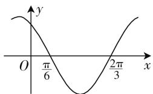

# 2020 年高考三角函数试题评析与备考建议\*

● 内江师范学院数学与信息科学学院 樊红玉  
● 内江师范学院数学与信息科学学院 李红霞  
● 内江师范学院数学与信息科学学院 赵思林

三角函数是高中数学的基本内容,具有鲜明的独特性和规律性,是高考的必考内容.纵观2020年全国各地的高考数学试卷,对三角函数的考查题型、分值趋于稳定,但也出现了一些新特点和新题型.

# 一、三角函数命题特点分析

<table><tr><td>序号</td><td>卷型</td><td>题号</td><td>分值</td><td>考查知识点</td></tr><tr><td rowspan="2">1</td><td rowspan="2">全国卷I</td><td>7</td><td>5</td><td>图像与性质</td></tr><tr><td>9</td><td>5</td><td>恒等变换、求值</td></tr><tr><td rowspan="3">2</td><td rowspan="3">全国卷II</td><td>2</td><td>5</td><td>三角符号判断</td></tr><tr><td>17</td><td>12</td><td>解三角形</td></tr><tr><td>21</td><td>12</td><td>三角证明</td></tr><tr><td rowspan="2">3</td><td rowspan="2">全国卷III</td><td>9</td><td>5</td><td>恒等变换、求值</td></tr><tr><td>16</td><td>5</td><td>图像与性质</td></tr><tr><td rowspan="3">4</td><td rowspan="3">北京卷</td><td>9</td><td>4</td><td>恒等变换</td></tr><tr><td>14</td><td>5</td><td>性质、最值</td></tr><tr><td>17</td><td>13</td><td>解三角形</td></tr><tr><td rowspan="3">5</td><td rowspan="3">江苏卷</td><td>8</td><td>5</td><td>恒等变换</td></tr><tr><td>10</td><td>5</td><td>图像变换</td></tr><tr><td>16</td><td>14</td><td>解三角形</td></tr><tr><td rowspan="2">6</td><td rowspan="2">天津卷</td><td>8</td><td>5</td><td>图像与性质</td></tr><tr><td>16</td><td>14</td><td>解三角形</td></tr><tr><td rowspan="3">7</td><td rowspan="3">浙江卷</td><td>4</td><td>4</td><td>图像与性质</td></tr><tr><td>13</td><td>6</td><td>恒等变换、求值</td></tr><tr><td>18</td><td>14</td><td>解三角形</td></tr></table>

<table><tr><td rowspan="3">8</td><td rowspan="3">山东卷</td><td>10</td><td>5</td><td>图像与性质</td></tr><tr><td>15</td><td>5</td><td>实际问题</td></tr><tr><td>17</td><td>10</td><td>解三角形</td></tr><tr><td>9</td><td>上海卷</td><td>18</td><td>14</td><td>恒等变换</td></tr></table>

# 1. 题型结构与分值

2020 年三角函数试题多以选择题或填空题搭配解答题的形式出现,解答题主要考查三角函数与解三角形的交汇问题,选择题与填空题主要考查三角函数图像、性质以及求值问题,属于低、中档题,要求学生具有一定的三角恒等变换能力.总体来看,分值在 10—29 分不等,占比最高可达 19.3%,相较于往年,题型、题量趋于稳定.

# 2. 试题特点

从客观题看,该年高考三角函数对函数的图像问题考查较为频繁,如:根据图像求解析式、图像变换问题等,6大地区高考卷都对其进行了考查,本类题属于基础题,题目顺序相对靠前,难度较低,以图像为载体,考查学生看图、读图、想图、用图能力和直观想象素养,渗透数形结合思想,这与“新课标”要求培养学生的六大数学核心素养相呼应.另外,客观题还重视考查三角恒等变换与给式求值问题,这类题考查方式灵活,解题思路多样,有助于激发学生的创新能力,考查多层次的数学思想,如化归与转化思想、方程思想等.

主观题大部分与解三角形内容关联考查,考查风格趋于平稳,较过去几年,淡化了与平面向量交汇问题的考查.从上表来看,解三角形问题所占比例较大,包括求边、求角、求面积、最值等问题,要求学生能够理解数学本质,灵活运用正弦、余弦定理,具备三角恒等变换的能力.同时,山东卷第15题利用“零件制作”巧设问题,以劳动实习为试题背景,体现了五育并举的育人方针,考查三角函数在实际生活中的运用.同时,与“新课标”所要求的“高中数学课程要关注数学与人类社会生活更紧密的关联”一致[1].此外,全国卷Ⅱ第21题以三角证明为压轴题,此题形式新颖,串联了导数、函数、不等式各大核心章节的内容,稳中求活,注重与其他知识的运用,知识跨度更宽,考查范围更广,也预示未来对三角函数的考查方式会更加多样.

总体上,试题考查的题量、难度趋于稳定,注重学生分析、解决问题的能力,能将各大版块联结,注重知识的模块化.除去2020年考查的这几类题型外,还有三角函数与其他数学知识点的交汇,如与平面向量、解析几何的交汇,三角应用问题,再如振动波、测量等与实际生活有关的问题.虽然在2020的高考试题中这几类题型没有出现,但也应该值得注意.

# 二、三角函数典型例题精析

# 1. 求值

求值问题是三角函数的基本问题,包含给角求值、给式求值、给值求角三类题型,具有一定的综合性、灵活性、技巧性.

例 1 （2020 年全国卷Ⅲ理 9）已知 $2\tan\theta - \tan\left(\theta + \frac{\pi}{4}\right) = 7$ ，则 $\tan\theta = (\quad)$ .

A.-2

B.-1

C. 1

D. 2

分析: 利用两角和的正切公式化简, 得到关于 $\tan\theta$ 的一个二元一次方程, 解方程即可求解.

评注:本题主要考查两角和的正切公式,同时结合方程思想,考查学生的数学运算能力.

# 2. 图像与性质

三角函数图像与性质问题是高考的热点问题,图像是研究性质的基础,图像是对性质的直观表达,二者相辅相成,高考数学往往将二者结合考查,要求学生有一定综合能力.

例 2 （2020 年山东卷理 10）图 1 是函数 $y = \sin(\omega x + \varphi)$ 的部分图像，则 $\sin(\omega x + \varphi) = (\quad)$ .

A. $\sin\left(x+\frac{\pi}{3}\right)$

B. $\sin \left(\frac{\pi}{3} - 2x\right)$

C. $\cos \left(2x + \frac{\pi}{6}\right)$

line

| x | y |
|---|---|
| 0 | y |
| π/6 | y |
| 2π/3 | y |

图1

D. $\cos \left(\frac{5\pi}{6} - 2x\right)$

解析:由函数图像知, $\frac{T}{2}=\frac{2\pi}{3}-\frac{\pi}{6}=\frac{\pi}{2}$ ,则 $|\omega|=$ $\frac{2\pi}{\pi}=2$ ,所以A选项排除.

而当 $x$ 取 $\frac{\pi}{6}$ 与 $\frac{2\pi}{3}$ 中点，即 $x = \frac{5\pi}{12}$ 时， $y$ 取得最小值-1，故有 $2 \times \frac{5\pi}{12} + \varphi = \frac{3\pi}{2} + 2k\pi (k \in \mathbf{Z})$ ，解得 $\varphi = 2k\pi + \frac{2}{3}\pi (k \in \mathbf{Z})$

因此 $y = \sin \left(2x + \frac{2}{3}\pi + 2k\pi\right) = \sin \left(2x + \frac{2}{3}\pi\right) =$ $\sin \left(2x + \frac{\pi}{6} + \frac{\pi}{2}\right) = \cos \left(2x + \frac{\pi}{6}\right) = \sin \left(\frac{\pi}{3} - 2x\right)$ ，且 $\cos \left(2x + \frac{\pi}{6}\right) = -\cos \left(\frac{5\pi}{6} - 2x\right)$ ，D错误.

故选 BC.

评注:根据图像确定函数解析式是三角函数的基本问题,注重考查学生获取、处理信息的能力,这类问题的解决在于关键点的选取,如零点、最值点的利用.

# 3. 解三角形

从 2020 年高考试题看,三角函数与解三角形交汇问题是考试的热点和重点,这类题型往往以解答题的形式出现,渗透化归与转化思想、方程思想,注重对正弦、余弦定理、三角恒等变换及相关性质的综合运用,一般需要将其化为 $A \sin(\omega x + \varphi)$ 的形式,以便研究其性质.

例3（2020年浙江卷理18)在锐角 $\triangle ABC$ 中，角 $A, B, C$ 的对边分别为 $a, b, c$ 且 $2b\sin A = \sqrt{3} a$ .

(I) 求角 B;

(Ⅱ) 求 $\cos A + \cos B + \cos C$ 的取值范围.

解析:(Ⅰ)由正弦定理得, $2b\sin A=\sqrt{3}a$ 可化为 $2\sin B\sin A=\sqrt{3}\sin A$ .

因为 $0 < A < \frac{\pi}{2}, \sin A \neq 0$ ，所以 $\sin B = \frac{\sqrt{3}}{2}$ .

又因为 $0 < B < \frac{\pi}{2}$ , 所以 $B = \frac{\pi}{3}$ .

（Ⅱ）由（Ⅰ）得 $B = \frac{\pi}{3}$ ，因此 $\cos A + \cos B + \cos C = \cos A + \cos \frac{\pi}{3} + \cos \left(\frac{2\pi}{3} - A\right) = \frac{\sqrt{3}}{2}\sin A + \frac{1}{2}\cos A + \frac{1}{2} = \sin \left(A + \frac{\pi}{6}\right) + \frac{1}{2}$ .

又因为 $\triangle ABC$ 为锐角三角形, 所以有 $0 < \frac{2}{3}\pi - A < \frac{\pi}{2}$ 且 $0 < A < \frac{\pi}{2}$ , 解得 $\frac{\pi}{6} < A < \frac{\pi}{2}$ .

而 $\frac{\pi}{3} < A + \frac{\pi}{6} < \frac{2\pi}{3}$ , 因此有 $\sin \left(A + \frac{\pi}{6}\right) \in \left(\frac{\sqrt{3}}{2}, 1\right]$ , 进而有 $\sin \left(A + \frac{\pi}{6}\right) \in \left(\frac{\sqrt{3} + 1}{2}, \frac{3}{2}\right]$ .

故 $\cos A + \cos B + \cos C$ 的取值范围为 $\left(\frac{\sqrt{3} + 1}{2}, \frac{3}{2}\right]$ .

点评:在解决三角函数最值与解三角形的综合问题时,应注意角的范围.其本质上还是三角函数的最值问题,需注意三角形中隐含的角、边的限制条件,解决方法依旧是利用三角函数有界性.

# 4. 三角证明

三角证明试题变化灵活,难以找到其规律性,涉及多个板块知识,常与导数、函数、不等式等专题结合,渗透函数与方程思想、化归与转化思想.从往年高考试题中看,三角证明问题考查较少,近几年几乎没有涉及,对于习惯做三角常规题的学生而言,无疑是比较新颖的,同时也是挑战.

例 4 （2020 年全国卷Ⅱ理 21）已知函数 $f(x)=\sin^{2}x\sin2x$ .

(I) 讨论 $f(x)$ 在区间 $(0, \pi)$ 的单调性；

(Ⅱ) 证明: $|f(x)| \leqslant \frac{3\sqrt{3}}{8}$ ;

（Ⅲ）设 $n \in N^{*}$ ，证明： $\sin^{2}x\sin^{2}2x\sin^{2}4x\cdots$ $\sin^{2}2^{n}x\leqslant\frac{3^{n}}{4^{n}}.$

解析：（I）由函数 $f(x)=\sin^{2}x\sin2x=2\sin^{3}x\cos x$ 可知， $f'(x)=2\sin^{2}x(3\cos^{2}x-\sin^{2}x)=2\sin^{2}x(4\cos^{2}x-1)=2\sin^{2}x(2\cos x+1)(2\cos x-1)$ .

令 $f'(x)=0$ , 可得 $x_{1}=\frac{\pi}{3}, x_{2}=\frac{2\pi}{3}$ .

当 $x\in\left(0,\frac{\pi}{3}\right)$ 时， $f'(x)>0$ ，此时 $f(x)$ 单调递增；当 $x\in\left(\frac{\pi}{3},\frac{2\pi}{3}\right)$ 时， $f'(x)<0$ ，此时 $f(x)$ 单调递减；当 $x\in\left(\frac{2\pi}{3},\pi\right)$ 时， $f'(x)>0$ ，此时 $f(x)$ 单调递增.

（Ⅱ）观察函数可发现， $f(x+\pi)=\sin^{2}(x+\pi)\sin[2(x+\pi)]=\sin^{2}x\sin2x=f(x)$ ，因此， $f(x)$ 的周期为 $\pi$ .

由（I）可知，因为 $f(0) = f(\pi) = 0, f\left(\frac{\pi}{3}\right) =$

$$
\begin{array}{l} \left(\frac {\sqrt {3}}{2}\right) ^ {2} \times \frac {\sqrt {3}}{2} = \frac {3 \sqrt {3}}{8}, f \left(\frac {2 \pi}{3}\right) = \left(\frac {\sqrt {3}}{2}\right) ^ {2} \times \left(- \frac {\sqrt {3}}{2}\right) = \\ - \frac {3 \sqrt {3}}{8}, \text {所以} [ f (x) ] _ {\max} = \frac {3 \sqrt {3}}{8}, [ f (x) ] _ {\min} = - \frac {3 \sqrt {3}}{8}. \\ \end{array}
$$

故 $|f(x)|\leqslant\frac{3\sqrt{3}}{8}$ .

（Ⅲ）因为 $\sin^{2}x\sin^{2}2x\sin^{2}4x\cdots\sin^{2}2^{n}x=\left[\sin^{3}x\cdot\sin^{3}2x\sin^{3}4x\cdots\sin^{3}2^{n}x\right]^{\frac{2}{3}}=\left[\sin x\left(\sin^{2}x\sin2x\right)\cdot\left(\sin^{2}2x\sin4x\right)\cdots\left(\sin^{2}2^{n-1}x\sin2^{n}x\right)\sin^{2}2^{n}x\right]^{\frac{2}{3}}$ .

由（Ⅱ）得 $\left[\sin x\left(\sin^{2}x\sin2x\right)\left(\sin^{2}2x\sin4x\right)\cdots\right]$

$$
\begin{array}{l} \left. \left(\sin^ {2} 2 ^ {n - 1} x \sin 2 ^ {n} x\right) \sin^ {2} 2 ^ {n} x \right] ^ {- \frac {2}{3}} \leqslant \left[ \sin x \times \frac {3 \sqrt {3}}{8} \times \frac {3 \sqrt {3}}{8} \times \right. \\ \left. \dots \times \frac {3 \sqrt {3}}{8} \times \sin^ {2} 2 ^ {n} x \right] ^ {\frac {2}{3}} \leqslant \left[ \left(\frac {3 \sqrt {3}}{8}\right) ^ {n} \right] ^ {\frac {2}{3}} = \left(\frac {3}{4}\right) ^ {n}. \\ \end{array}
$$

故 $\sin^{2}x\sin^{2}2x\sin^{2}4x\cdots\sin^{2}2^{n}x\leqslant\frac{3^{n}}{4^{n}}.$

点评:本题综合考查导数、三角函数、不等式等知识,解决问题的关键在于从已知条件寻找着手点,对三角函数式合理变形,求证问题.

# 三、备考建议

# 1. 立足教材,狠抓基础

注重对基础知识和基本能力的考查是2020年高考数学的特点之一，高考数学对三角函数专题的考查题型、风格及分值趋于稳定，而高考热点问题往往来源于对教材习题的变形和深入。因此，在备考阶段，应回归课本、狠抓基础，注重把握核心概念，公式法则、例题练习等，能够理解知识的本质，类比、迁移、延伸出新的数学问题。同时，需按照考纲的提示和要求，精准复习，切忌盲目刷题、练题，形成定式思维。

# 2. 掌握方法,攻克难点

数学方法是解决数学问题的根本策略和程序, 是数学思想的具体化反映 $^{[1]}$ . 三角函数考查灵活, 公式变形复杂且巧妙, 难以把握其规律性. 因此, 要注重掌握解题方法, 如对于以性质、图像为主线的题目, 牢记变换法则和辅助角公式, 将其变为一个角的三角函数后再研究其性质; 对化简求值和解三角形问题, 注意已知与未知角、名、次数、系数间的联系, 角边互化, 利用诱导公式和基本关系对其进行转化, 化新为旧等.

# 3. 联系实际, 注重应用

《新课标》指出“高中数学课程要关注数学与人类社会生活更紧密的关联，体现现代数学的本质”[2].从2020年高考试题看，强调三角函数在解三角形中的应用，注重三角函数的工具性和实用性.（下转封三）

综上所述,对任意的 $n \in N^{*}$ , 均有 $T_{n} \geqslant \frac{1}{4n}$ .

# 2. 结论 2(假分数性质) 的运用

例 5 （2001 年全国高考试题·理 20）已知 i, m, n 是正整数，且 $1 < i \leqslant m < n$ .

(1) 证明 $n^{i}A_{m}^{i}<m^{i}A_{n}^{i}$ ;  
(2) 证明 $(1 + m)^n > (1 + n)^m$ .

证明:(1)i,m,n是正整数,且 $1<i\leqslant m<n$ .

由结论 2(假分数性质) 知 $\frac{n-1}{m-1} > \frac{n}{m}, \frac{n-2}{m-2} > \frac{n}{m}, \cdots, \frac{n-i+1}{m-i+1} > \frac{n}{m}.$

上面的 $i - 1$ 个式子两边分别相乘可得

$\frac{(n-1)(n-2)\cdots(n-i+1)}{(m-1)(m-2)\cdots(m-i+1)}>\frac{n^{i-1}}{m^{i-1}}$ ，再两边
分别乘以 $\frac{n}{m}$ 得

$$
\frac {n (n - 1) (n - 2) \cdots (n - i + 1)}{m (m - 1) (m - 2) \cdots (m - i + 1)} > \frac {n ^ {i}}{m ^ {i}},
$$

即 $\frac{A_{n}^{i}}{A_{m}^{i}}>\frac{n^{i}}{m^{i}}$ ，所以 $n^{i}A_{m}^{i}<m^{i}A_{n}^{i}$ .

(2) 证明略.

例 6 （2009 年山东高考试题 · 理 20）等比数列 $\{a_{n}\}$ 的前 n 项和为 $S_{n}$ ，已知对任意的 $n \in N^{*}$ ，点 $(n, S_{n})$ 均在函数 $y = b^{x} + r (b > 0)$ ，且 $b \neq 1, b, r$ 均为常数的图像上.

(1) 求 r 的值.  
(2) 当 $b = 2$ 时, 记 $b_{n} = 2(\log_{2}a_{n} + 1)(n \in \mathbf{N}^{*})$ .

证明:对任意的 $n \in N^{*}$ ，不等式 $\frac{b_{1}+1}{b_{1}} \cdot \frac{b_{2}+1}{b_{2}} \cdot \cdots \cdot \frac{b_{n}+1}{b_{n}} > \sqrt{n+1}$ 成立.

解:(1) 可求得 $r = -1, a_{n} = (b - 1)b^{n-1}$ .  
(2) 当 $b = 2$ 时, $a_{n} = (b - 1)b^{n - 1} = 2^{n - 1}$ ,

$$
b _ {n} = 2 \left(\log_ {2} a _ {n} + 1\right) = 2 \left(\log_ {2} 2 ^ {n - 1} + 1\right) = 2 n.
$$

则 $\frac{b_n + 1}{b_n} = \frac{2n + 1}{2n}$ .

即 $\frac{b_{1}+1}{b_{1}}\cdot\frac{b_{2}+1}{b_{2}}\cdot\cdots\cdot\frac{b_{n}+1}{b_{n}}=\frac{3}{2}\times\frac{5}{4}\times\cdots\times\frac{2n+1}{2n}.$

由结论 2(假分数性质) 得 $\frac{2k+1}{2k} > \frac{2k+2}{2k+1}$ ，两边同乘以 $\frac{2k+1}{2k}$ ，得 $\left(\frac{2k+1}{2k}\right)^{2} > \frac{2k+1}{2k} \cdot \frac{2k+2}{2k+1}$ .

则 $\left(\frac{3}{2}\times\frac{5}{4}\times\cdots\times\frac{2n+1}{2n}\right)^{2}>\frac{3}{2}\times\frac{4}{3}\times\cdots\times\frac{2n+2}{2n+1}=n+1.$

所以不等式 $\frac{b_1 + 1}{b_1} \cdot \frac{b_2 + 1}{b_2} \cdot \dots \cdot \frac{b_n + 1}{b_n} > \sqrt{n + 1}$ 成立.

综上可知,充分挖掘和发挥课本典型例习题的潜在价值,对于培养思维能力,提高解题能力十分有益,同时对于高考命题原则“源于课本而高于课本、出活题、考基础、考能力”也有很强的针对性. W

(上接第23页) 同时,高考数学有加强与实际背景、文化背景联结的趋势.因此,在备考中,应注意联系实际,加强实际应用.

# 4. 适度创新, 渗透思想

数学思想来源于数学基础知识与基本方法,又高于知识与方法,它指导知识与方法的运用 $^{[3]}$ .三角函数问题涉及多维度数学思想,如分类讨论思想、化归与转化思想、函数与方程思想及数形结合思想,其能帮助学生更深入的分析、理解、解决问题.在备考阶段,应注重感悟和理解题目中蕴含的数学思想,把握解题的核心,迁移思想方法,比如全国卷Ⅱ第21题,形式新颖、设问灵活，学生不常接触，若只掌握固定的题型，那么在新颖题型上很可能会吃亏。因此，需注重数学思想的掌握，才能融会贯通，举一反三。

# 参考文献：

[1] 张和平, 贾长虹. 操作·掌握·领悟: 数学思想方法教学的有效模式 [J]. 教学与管理, 2009(15).  
[2] 史宁中. 普通高中数学课程标准(2017年版)解读 [M]. 北京: 高等教育出版社, 2018.  
[3] 谭本远. 获取数学知识的过程分析及其能力培养 [J]. 数学教育学报, 2009, 18(5). F