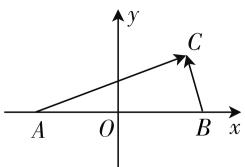

# “一题多解”妙应用,高考真题显身手

# ● 陕西省西安市远东第一中学 牛伟

高中数学,融合了众多的数学知识与数学能力,渗透了众多的思维方法与数学素养.而高考数学更是数学知识、能力、思维方法与素养的综合体现,造就高考数学试题的综合性、复杂性与抽象性,有效提升问题的深度、广度与难度,体现选拔与区分性.从而造成高考数学试题的典型特征,可以从多个角度切入,寻找多种思维方法进行破解,为“一题多解”提供合适的场所.因此,在平时教学过程中,需要教师进行有效筛选与梳理,合理分析与点拨,引导学生寻找问题的突破口与解题思路,潜移默化,提升学生的学习积极性与主动性,培养学生的发散性思维能力.本文结合2020年高考数学中的典型高考真题进行“一题多解”,抛砖引玉,以期为高考复习与备考提供些许帮助.

# 一、组合学生的不同知识体系

“一题多解”有利于克服传统教学中“一法到底”的单一模式，充分考虑不同知识层次水平、不同知识体系掌握情况的学生的适应性发展。借助“一题多解”，合理关注不同层次的学生，其中总有一种方法能比较契合不同基础层次的学生或更能接近不同学生的知识体系，真正达到可以听懂、理解与掌握相关的方法，发现自身不足，合理弥补，有效提升。

例 1 （2020 年北京卷第 14 题）若函数 $f(x)=\sin(x+\varphi)+\cos x$ 的最大值为 2，则常数 $\varphi$ 的一个取值为 \_\_\_\_.

分析: 此题属于开放结论的数学开放题, 结合三角函数关系式所满足的最值情况来确定常数的一个取值问题, 难度不大, 思维多变, 创新性强, 可以从不同知识体系角度来切入与破解.

解法 1: (借助三角恒等变换) 由于函数 $f(x)=\sin(x+\varphi)+\cos x=\sin x\cos\varphi+\cos x\sin\varphi+\cos x=\cos\varphi\sin x+(\sin\varphi+1)\cos x=\sqrt{\cos^{2}\varphi+(\sin\varphi+1)^{2}}\cdot\sin(x+\alpha)$ ，而函数 $f(x)=\sin(x+\varphi)+\cos x$ 的最大值为 2，则有 $\sqrt{\cos^{2}\varphi+(\sin\varphi+1)^{2}}=2$ ，整理有 $\sin\varphi=1$ ，则有 $\varphi=2k\pi+\frac{\pi}{2}(k\in\mathbf{Z})$ ，取常数 $\varphi$ 的一个取值为 $\frac{\pi}{2}$ .
(答案不唯一)

故填答案: $\frac{\pi}{2}$ .(答案不唯一,选择 $2k\pi+\frac{\pi}{2}(k\in \mathbf{Z})$ 中的一个k的值对应的答案即可)

解法2:(借助三角函数性质)由于 $\sin(x+\varphi)\leqslant1,\cos x\leqslant1$ ,而函数 $f(x)=\sin(x+\varphi)+\cos x$ 的最大值为2,结合不等式的性质可知,当且仅当 $\sin(x+\varphi)=1,\cos x=1$ 时取得最大值2,此时 $x=2k\pi(k\in\mathbf{Z})$ $\varphi=2k\pi+\frac{\pi}{2}(k\in\mathbf{Z})$ ,取常数 $\varphi$ 的一个取值为 $\frac{\pi}{2}$ .(答案不唯一)

故填答案: $\frac{\pi}{2}$ .(答案不唯一,选择 $2k\pi+\frac{\pi}{2}(k\in \mathbf{Z})$ 中的一个k的值对应的答案即可)

对于不同学生来说,由于各自知识水平层次、体系的不同,对相关方法的理解与掌握的程度不同;而对于同一学生,由于自身对不同知识体系掌握情况也不尽均衡.借助“一题多解”,实现与不同能力的匹配,选择适合自身能力的方法进行合理思考与破解,为各层次、各不同要求的学生提供破解问题的角度、切入点与思维方法,有效提升问题讲解的针对性、全面性,体现个性化发展.

# 二、培养学生的多种思维能力

“一题多解”有利于克服传统的定向性、专一性的思维定式，合理引导学生从多角度、多途径、多层次寻找破解问题的切入点，进而寻找解题的突破口，实现思维的灵活多样性，发展发散性思维等。借助“一题多解”，开拓解题视野，扩充数学知识，在此基础上进行多种解法的对比与分析，总结解题规律，优化解题思维，提升解题能力，增强思维品质。

例 2 （2020 年全国卷Ⅲ文科第 6 题）在平面内，A, B 是两个定点，C 是动点，若 $\overrightarrow{AC} \cdot \overrightarrow{BC} = 1$ ，则点 C

的轨迹为( ).

A. 圆

B. 椭圆

C. 抛物线

D. 直线

分析:此题以平面解析几何为问题背景,借助两定点与一动点这一“动”一“静”的和谐统一,以及平面向量的数量积关系式的给出,进而来确定动点的轨迹问题.问题简单明了,切入方便快捷,破解思维多样,难度简单适中,适合各层次的学生.

解法 1: (坐标思维) 设 $\left|AB\right|=2a(a>0)$ ，以 AB 的中点 O 为坐标原点建立如图 1 所示的平面直角坐标系，则 $A(-a,0)$ ， $B(a,0)$ ，设 $C(x,y)$ ，可得 $\overrightarrow{AC}=(x+a,y)$ ， $\overrightarrow{BC}$ $=(x-a,y)$ ，那么 $\overrightarrow{AC}\cdot\overrightarrow{BC}=(x+a)(x-a)+y^{2}=x^{2}+y^{2}-a^{2}=1$ ，整理可得 $x^{2}+y^{2}=a^{2}+1$ ，所以点C的轨迹是以AB的中点O为圆心， $\sqrt{a^{2}+1}$ 为半径的圆.

text_image

y
C
A O B x

图 1

故选 A.

解法2:(平面向量思维)设线段AB的中点为O, $|AB|=2a(a>0)$ ,可得 $1=\overrightarrow{AC}\cdot\overrightarrow{BC}=\overrightarrow{CA}\cdot\overrightarrow{CB}=(\overrightarrow{CO}+\overrightarrow{OA})\cdot(\overrightarrow{CO}+\overrightarrow{OB})=(\overrightarrow{CO}+\overrightarrow{OA})\cdot(\overrightarrow{CO}-\overrightarrow{OA})=|\overrightarrow{CO}|^{2}-|\overrightarrow{OA}|^{2}=|\overrightarrow{CO}|^{2}-a^{2}$ ,则有 $|\overrightarrow{CO}|^{2}=a^{2}+1$ ,即 $|\overrightarrow{CO}|=\sqrt{a^{2}+1}$ ,所以点C的轨迹是以AB的中点O为圆心, $\sqrt{a^{2}+1}$ 为半径的圆.

故选 A.

其实,高质量的“一题多解”,对思维能力的提升很有效果,不断引导学生对问题的深入理解,形成多种破解思维与方法,提升数学知识的理解与掌握能力,形成良好的思维品质.

# 三、拓展学生的解题巧技妙法

“一题多解”有利于克服传统的定性的解题方法、思维僵化，合理引导学生跳出问题范畴，从更高、更特殊的角度来审视，有效拓展学生解题的巧技妙法，实现破解问题的灵活性、特殊性等。借助“一题多解”，往往可以突破思维定式，升华数学知识与能力，碰撞出“闪亮”的火花。

例 3 （2020 年全国卷 I 理科第 12 题）若 $2^{a} + \log_{2}a = 4^{b} + 2\log_{4}b$ ，则（）.

A. $a > 2b$

B. a < 2b

C. $a > b^{2}$

D. $a < b^{2}$

分析: 此题以两个分别不同的指数函数、对数函数的方程为问题背景, 结合方程关系式的恒等条件, 以基本初等函数为载体, 进而判断相关参数之间的大小关系. 综合性强, 交汇性好, 采取巧技妙法可以得以破解.

解法 1:（图像分析法）由于 $2^{a} + \log_{2}a = 4^{b} + 2\log_{4}b = 4^{b} + \log_{2}b$ ，设 $2^{a} + \log_{2}a = 4^{b} + \log_{2}b = t$ ，则有 $\log_{2}a = t - 2^{a}, \log_{2}b = t - 4^{b}$ ，可知 a 是函数 $y = \log_{2}x$ 与 $y = t - 2^{x}$ 的图像交点的横坐标，b 是函数 $y = \log_{2}x$ 与 $y = t - 4^{x}$ 的图像交点的横坐标，在同一平面直角坐标系中，函数 $y = t - 2^{x}$ 与 $y = t - 4^{x}$ 的图像均过点 (0, t - 1)，且当 x > 0 时，函数 $y = t - 4^{x}$ 的图像位于函数 $y = t - 2^{x}$ 的图像的下方，直观分析可知 a > b，而由 $2^{a} + \log_{2}a = 4^{b} + \log_{2}b$ ，可得 $2^{a} - 4^{b} = \log_{2}b - \log_{2}a$ ，由于函数 $y = \log_{2}x$ 在区间 (0, +∞) 上是增函数，则有 $\log_{2}a > \log_{2}b$ ，从而 $2^{a} - 4^{b} = \log_{2}b - \log_{2}a < 0$ ，即 $2^{a} < 2^{2b}$ ，由于函数 $y = 2^{x}$ 在区间 (-∞, +∞) 上是增函数，则有 a < 2b.

故选 B.

解法 2: (函数单调性法) 由于 $2^{a} + \log_{2}a = 4^{b} + 2\log_{4}b = 2^{2b} + \log_{2}b$ ，于是构造函数 $f(x) = 2^{x} + \log_{2}x$ ，则函数 $f(x)$ 在区间 $(0, +\infty)$ 上单调递增。又因为 $f(2b) = 2^{2b} + \log_{2}2b = 2^{2b} + \log_{2}b + 1 > 2^{2b} + \log_{2}b = 2^{a} + \log_{2}a = f(a)$ ，可得 a < 2b。

故选 B.

其实,借助“一题多解”,对数学问题的破解有很大的开拓精神,合理拓展思维,利用巧技妙法,完善破解问题,为一些问题的简捷快速处理提供思想引领,也为一些问题的成功破解“画龙点睛”.

其实,借助“一题多解”,适合学生从不同角度表达自己的想法与解法,有效激发学生对数学学习的热情与探究的欲望,从而提升与培养学生的学习兴趣与热情.

结合高考真题的“一题多解”，引导学生在解决具体问题时，根据自身能力水平与知识掌握情况，灵活选择有效的问题切入点，结合自己比较拿手或熟知的解题思路，寻找破解问题的突破口，很好地考查考生的临场应变能力、灵活应用能力，以及分析问题与解决问题的能力等，快速解题，提高效率，提升数学能力，培养数学核心素养. F