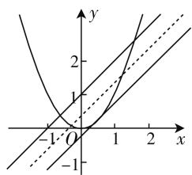

# 双动点巧破解,深探究妙拓展

# ● 江苏省常熟外国语学校 张 英

解析几何中的“双动点”问题,巧妙把平面几何、解析几何与相关的数学知识融合在一起,综合考查数学知识与数学技能,综合性强,立意深远,对学生的数学能力、数学思维等方面都有较高的要求.解决解析几何中的“双动点”问题,要按照“双动点”之间的主次关系,把握“主动支配从动”和“从动跟随主动”,在“动”中找规律,在“动”中取“定”,回归问题实质与本源,化“双动”为“单动”,化“动”为“静”,从而“动中取静”,进而加以分析、转化、处理与应用.

# 一、问题呈现

问题:已知点 P 是直线 $y=x+1$ 上的动点, 点 Q 是抛物线 $y=x^{2}$ 上的动点. 设点 M 为线段 PQ 的中点, O 为坐标原点, 则 $|OM|$ 的最小值为 \_\_\_\_.

此题涉及直线与抛物线上的“双动点”问题,根据题设背景,确定对应的“双动点”所构成线段的中点到坐标原点的距离的最小值问题.破解的关键是抓住问题实质,通过“双动点”找规律,合理从“动”中取“静”,化“动态”为“静态”,结合轨迹方程的求解、几何性质的应用以及柯西不等式的应用等来确定相应的最值问题.

# 二、问题破解

解法1:(轨迹方程+距离转化法)设 $M(x,y)$ ， $P(m,m+1),Q(n,n^{2})$ 。因为点M为线段PQ的中点，所以 $x=\frac{m+n}{2},y=\frac{m+n^{2}+1}{2}$ ，消去参数m，整理可得 $y=x+\frac{n^{2}-n+1}{2}$ ，即点M的轨迹方程为直线 $y=x+\frac{n^{2}-n+1}{2}$ ，那么 $|OM|$ 的最小值为点O到直线 $y=x+\frac{n^{2}-n+1}{2}$ 的距离 $d=\frac{\left|\frac{n^{2}-n+1}{2}\right|}{\sqrt{2}}=\frac{\left(n-\frac{1}{2}\right)^{2}+\frac{3}{4}}{2\sqrt{2}}\geqslant\frac{\frac{3}{4}}{2\sqrt{2}}=\frac{3\sqrt{2}}{16}$ ，当且仅当 $n=\frac{1}{2}$ 时等号成立,所以 $|OM|$ 的最小值为 $\frac{3\sqrt{2}}{16}$ .

故填答案: $\frac{3\sqrt{2}}{16}$ .

点评:根据题目中所要求解的 $|OM|$ 的最小值,自然就要关注点M的轨迹,借助参数法确定点M的轨迹方程,利用点到直线的距离公式加以转化,并通过配方处理,结合二次函数的图像与性质来确定相应的最小值.轨迹方程的求解,为化“动”为“静”的破解指明方向,提供条件.

解法 2: (轨迹方程 + 曲线系法) 设 $M(x, y)$ , $P(m, m+1)$ , $Q(n, n^{2})$ . 因为点 M 为线段 PQ 的中点, 所以 $x = \frac{m+n}{2}$ , $y = \frac{m+n^{2}+1}{2}$ , 消去参数 m, 整理可得 $y = x + \frac{n^{2}-n+1}{2}$ , 即点 M 的轨迹方程为直线 $y = x + \frac{n^{2}-n+1}{2}$ , 其是一族平行直线系方程, 在 y 轴上的截距为 $\frac{n^{2}-n+1}{2} = \frac{1}{2} \left( n - \frac{1}{2} \right)^{2} + \frac{3}{8} \geqslant \frac{3}{8}$ , 当且仅当 $n = \frac{1}{2}$ 时, 离坐标原点 O 最近的直线为 $y = x + \frac{3}{8}$ , 而坐标原点 O 到直线 $y = x + \frac{3}{8}$ 的距离为 $d = \frac{\left| \frac{3}{8} \right|}{\sqrt{2}} = \frac{3\sqrt{2}}{16}$ , 所以 $|OM|$ 的最小值为 $\frac{3\sqrt{2}}{16}$ .

故填答案: $\frac{3\sqrt{2}}{16}$ .

点评:根据题目中所要求解的 $|OM|$ 的最小值,自然就要关注点M的轨迹,借助参数法确定点M的轨迹方程,通过曲线系的几何角度切入,利用截距的最小值的分析来确定离坐标原点O最近的直线方程,再利用点到直线的距离公式来确定相应的最小值问题.轨迹方程的求解,为问题的破解提供各角度的思维方式.

text_image

Mathematical graph showing three intersecting curves with labeled x and y axes, including a point at (0,0) and asymptotes.

图 1

解法3:(几何性质法)如图1所示,过点Q作直线平行于直线 $y=x+1$ ,则点M在两条平行线的中间直线上,由 $y=x^{2}$ ,则 $y^{\prime}=2x=1$ ,解得 $x=\frac{1}{2}$ ,则对应的点 $Q\left(\frac{1}{2},\frac{1}{4}\right)$ ,此时抛物线与直线 $y=x+1$ 平行的切线方程为 $y-\frac{1}{4}=x-\frac{1}{2}$ ,即 $y=x-\frac{1}{4}$ ,而点M为线段PQ的中点,故点M在两条平行线的中间直线y=x+ $\frac{3}{8}$ 上时, $|OM|$ 的距离最小,此时 $d=\frac{\left|\frac{3}{8}\right|}{\sqrt{2}}=\frac{3\sqrt{2}}{16}$ ,所以 $|OM|$ 的最小值为 $\frac{3\sqrt{2}}{16}$ .

故填答案: $\frac{3\sqrt{2}}{16}$ .

点评:根据导数的几何意义,通过求导来确定与已知直线平行的抛物线的切线方程,结合平行直线的性质确定线段 PQ 的中点 M 所对应的直线方程,进而利用点到直线的距离公式来确定相应的最小值问题.几何性质法的应用也为此类问题的进一步提升与拓展提供思维方式.

# 三、变式拓展

探究 1: 保留题目条件, 改变原来简单的“抛物线 $y = x^{2}$ ”为复杂的“曲线 $y = e^{x} - x$ ”, 结合几何性质法的应用, 进而确定 $|OM|$ 的最小值问题, 得以变式与拓展.

变式 1: 已知点 P 是直线 $y = x + 1$ 上的动点, 点 Q 是曲线 $y = e^{x} - x$ 上的动点. 设点 M 为线段 PQ 的中点, O 为坐标原点, 则 $|OM|$ 的最小值为 \_\_\_\_.

解析: 过点 Q 作直线平行于直线 $y = x + 1$ ，则点 M 在两条平行线的中间直线上，由 $y = e^{x} - x$ ，则 $y' = e^{x} - 1 = 1$ ，解得 $x = \ln 2$ ，则对应的点 $Q(\ln 2, 2 - \ln 2)$ ，此时抛物线与直线 $y = x + 1$ 平行的切线方程为 $y - (2 - \ln 2) = x - \ln 2$ ，即 $y = x + 2 - 2\ln 2$ ，而点 M 为线段

PQ 的中点, 故点 M 在两条平行线的中间直线 $y = x + \frac{3 - 2\ln 2}{2}$ 上时, $|OM|$ 的距离最小, 此时 d = $\frac{\left|\frac{3 - 2\ln 2}{2}\right|}{\sqrt{2}} = \frac{\sqrt{2}(3 - 2\ln 2)}{4}$ , 所以 $|OM|$ 的最小值为 $\frac{\sqrt{2}(3 - 2\ln 2)}{4}$ .

故填答案: $\frac{\sqrt{2}(3-2\ln2)}{4}$ .

探究 2: 根据几何性质法破解以上问题的思维, 改变对应的直线与曲线方程, 在不同背景下确定 $\left|OM\right|$ 的最小值问题, 得以变式与拓展.

变式2:已知点P是直线y=2x-14上的动点,点Q是曲线 $y=x+\ln x$ 上的动点.设点M为线段PQ的中点,O为坐标原点,则 $|OM|$ 的最小值为\_\_\_\_.

解析: 过点 Q 作直线平行于直线 y=2x-14，则点 M 在两条平行线的中间直线上，由 $y=x+\ln x$ ，则 $y'=1+\frac{1}{x}=2$ ，解得 x=1，则对应的点 Q(1,1)，此时抛物线与直线 y=2x-14 平行的切线方程为 $y-1=2(x-1)$ ，即 y=2x-1，而点 M 为线段 PQ 的中点，故点 M 在两条平行线的中间直线 $y=2x-\frac{15}{2}$ 上时， $|OM|$ 的距离最小，此时 $d=\frac{\left|\frac{15}{2}\right|}{\sqrt{5}}=\frac{3\sqrt{5}}{2}$ ，所以 $|OM|$ 的最小值为 $\frac{3\sqrt{5}}{2}$ .

故填答案: $\frac{3\sqrt{5}}{2}$ .

点评:抓住问题的实质,利用导数法,巧妙转化“双动点”问题为相应的解析几何问题,借助导数的几何意义、切线方程的求解以及平行线的性质、点到直线的距离公式等来合理转化,巧妙破解.

# 四、解后反思

涉及解析几何中的“双动点”问题,关键要抓住“双动点”中各自运动变化的规律以及两者之间的相互影响与作用,可以以其中一点的“临时不动”而另一点“运动”来体验变化规律,可以以其中一点的“运动”带动另一点的变化来分析,还可以通过“双动点”之间的相互作用来确定,破解方式各样,因题而异. W