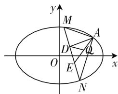
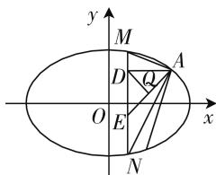

# 圆锥曲线中直线过定点问题的探究与推广

——评析 2020 年新高考卷 I（山东卷）第 22 题

● 江苏省如东高级中学 葛张勇

山东省在 2020 年启用新高考卷, 数学试题的亮点很多. 为了更好地发挥高考试题的引领作用, 把高考试题整合到教学中, 笔者对山东卷第 22 题做了一些探究、拓展, 供大家参考.

# 一、试题呈现

(新高考山东卷)已知椭圆 $C:\frac{x^{2}}{a^{2}}+\frac{y^{2}}{b^{2}}=1(a>b>0)$ 的离心率为 $\frac{\sqrt{2}}{2}$ ，且过点 A(2,1).

(1) 求 C 的方程;  
(2) 点 M, N 在 C 上, 且 $AM \perp AN, AD \perp MN$ , D 为垂足. 证明: 存在定点 Q, 使得 $|DQ|$ 为定值.

解析：（1）设椭圆的焦距为 $2c$ ，由题意，得 $\left\{ \begin{array}{l} \frac{c}{a} = \frac{\sqrt{2}}{2}, \\ \frac{4}{a^2} + \frac{1}{b^2} = 1, \\ a^2 = b^2 + c^2, \end{array} \right.$ 解得 $\left\{ \begin{array}{l} a^2 = 6, \\ b^2 = 3. \end{array} \right.$ 所以椭圆的 $C$ 方程为 $\frac{x^2}{6} +$ $\frac{y^2}{3} = 1.$

text_image

y
M
A
D
O
E
x
N

图 1

text_image

y
M
D
Q
A
O
E
x
N

图 2

(2) 证法一: 设 $M(x_{1}, y_{1}), N(x_{2}, y_{2})$ . 因为 $AM \perp AN$ , 所以 $\overrightarrow{AM} \cdot \overrightarrow{AN} = 0$ , 即 $(x_{1} - 2)(x_{2} - 2) + (y_{1} - 1)(y_{2} - 1) = 0$ . ①  
(i) 如图 1, 当直线 MN 的斜率存在时, 设 MN 方程为 $y = kx + m$ , 联立 $\left\{\begin{aligned}\frac{x^{2}}{6} + \frac{y^{2}}{3} &= 1, \\ y &= kx + m,\end{aligned}\right.$ 消去 y, 并整理得 $(1 + 2k^{2})x^{2} + 4kmx + 2m^{2} - 6 = 0$ , 其中 $\Delta = 16k^{2}m^{2}$

$-4(1+2k^{2})(2m^{2}-6)>0,x_{1}+x_{2}=-\frac{4km}{1+2k^{2}},x_{1}x_{2}=\frac{2m^{2}-6}{1+2k^{2}}$ ，将 $y_{1}=kx_{1}+m,y_{2}=kx_{2}+m$ 代入，得 $y_{1}+y_{2}=\frac{2m}{1+2k^{2}},y_{1}y_{2}=\frac{m^{2}-6k^{2}}{1+2k^{2}}$ ，再代入①，整理可得 $(1+k^{2})\frac{2m^{2}-6}{1+2k^{2}}+(km-2-k)\frac{-4km}{1+2k^{2}}+m^{2}-2m+5=0$ ，即 $4k^{2}+8km+3m^{2}-2m-1=0$ 。因式分解 $(2k+m-1)(2k+3m+1)=0$ ，当因式 $2k+m-1=0$ 时，即m=1-2k,MN方程为 $y=k(x-2)+1$ ，恒过点A(2,1)。因为点A(2,1)不在直线上，舍去。当因式 $2k+3m+1=0$ 时，MN方程为 $y=k\left(x-\frac{2}{3}\right)-\frac{1}{3}$ ，所以直线MN恒过点 $E\left(\frac{2}{3},-\frac{1}{3}\right)$ 。

(ii) 如图 2, 当直线 $MN$ 的斜率不存在时, 设 $M\left(t, \sqrt{3 - \frac{t^2}{2}}\right), N\left(t, -\sqrt{3 - \frac{t^2}{2}}\right)$ , 由 $\overrightarrow{AM} \cdot \overrightarrow{AN} = 0$ , 解得, $t = \frac{2}{3}$ 或 $t = 2$ (舍去), 即直线 $MN$ 过点 $E\left(\frac{2}{3}, -\frac{1}{3}\right)$ .

综上, 直线 MN 过点 $E\left(\frac{2}{3}, -\frac{1}{3}\right)$ .

又因为 $AD \perp MN$ ，此时 $\triangle ADE$ 直角三角形， $AE$ 是斜边，所以点 $D$ 在以 $AE$ 为直径的圆上，所以所求定点 $Q$ 为 $AE$ 的中点，可得 $Q\left(\frac{4}{3}, \frac{1}{3}\right)$ ，此时 $|DQ| = \frac{1}{2} |AP| = \sqrt{\left(2 - \frac{2}{3}\right)^2 + \left(1 + \frac{1}{3}\right)^2} = \frac{2\sqrt{2}}{3}$ 为定值.

说明,在证明直线 MN 过点 $E\left(\frac{2}{3}, -\frac{1}{3}\right)$ 时,亦可将 $2k + 1 + 3m = 0$ 和 $kx - y + m = 0$ 联立变形,即 $3kx - 3y + 3m = 0$ ,与 $2k + 1 + 3m = 0$ 对照系数可得 $x = \frac{2}{3}$ , $y = -\frac{1}{3}$ , 即直线 MN 过点 $E\left(\frac{2}{3}, -\frac{1}{3}\right)$ .

证法二:设直线 AM, AN 的斜率分别为 $k, -\frac{1}{k}$ ，所以直线的方程为 $y - 1 = k(x - 2)$ ，联立 $\left\{\begin{aligned}\frac{x^{2}}{6} + \frac{y^{2}}{3} &= 1, \\ y &= k(x - 2) + 1,\end{aligned}\right.$ 消去 y 并整理，得 $(1 + 2k^{2})x^{2} +$

$$
\begin{array}{l} {4 k (1 - 2 k) x + 2 (1 - 2 k) ^ {2} - 6 = 0, x = \frac {4 k ^ {2} - 4 k - 6}{1 + 2 k ^ {2}},} \\ {\text {所以可得点坐标} M \Big (2 - \frac {4 k + 4}{2 k ^ {2} + 1}, 1 - \frac {4 k ^ {2} + 4 k}{2 k ^ {2} + 1} \Big).} \end{array}
$$

用 $-\frac{1}{k}$ 换k,可得 $N\left(2-\frac{4k^{2}-4k}{k^{2}+2},1+\frac{4k-4}{2k^{2}+1}\right)$ ,

$$
\begin{array}{l} \text {所以} k _ {M N} = \frac {\frac {4 k - 4}{k ^ {2} + 2} + \frac {4 k ^ {2} + 4 k}{2 k ^ {2} + 1}}{- \frac {4 k ^ {2} - 4 k}{k ^ {2} + 2} + \frac {4 k + 4}{2 k ^ {2} + 1}} \\ = \frac {\left(8 k ^ {3} - 8 k ^ {2} + 4 k - 4\right) + \left(4 k ^ {4} + 4 k ^ {3} + 8 k ^ {2} + 8 k\right)}{\left(4 k ^ {3} + 4 k ^ {2} + 8 k ^ {2} + 8\right) - \left(8 k ^ {4} - 8 k ^ {3} - 4 k ^ {2} - 4 k\right)} \\ = \frac {4 k ^ {4} + 1 2 k ^ {3} + 1 2 k - 4}{- 8 k ^ {4} + 1 2 k ^ {3} + 1 2 k + 8} = \frac {k ^ {2} + 3 k - 1}{- 2 k ^ {2} + 3 k + 2}, \\ \end{array}
$$

直线 MN 方程为 $y + \frac{2k^{2} + 4k + 1}{2k^{2} + 1} = \frac{k^{2} + 3k - 1}{-2k^{2} + 3k + 2} \cdot \left(x - \frac{4k^{2} - 4k - 2}{2k^{2} + 1}\right)$ ,

整理得 $(4y + 2x)k^4 +(6x - 6y - 6)k^3 +(-2y-$ $x)k^{2} + (-3y + 3x - 3)k + (-2y - x) = 0$ 对任意的实数 k 恒成立, 所以 $\left\{\begin{aligned}&4y+2x=0,\\ &6x-6y-6=0,\\ &-2y-x=0,\\ &-3y+3x-3=0,\\ &-2y-x=0,\end{aligned}\right.$ 解得 $x=\frac{2}{3}$ ,$y=-\frac{1}{3}$ ，即直线 MN 过点 $E\left(\frac{2}{3},-\frac{1}{3}\right)$ .

也可以整理得直线的方程为 $y + \frac{1}{3} = \frac{k^{2} + 3k - 1}{-2k^{2} + 3k + 2}\left(x - \frac{2}{3}\right)$ ，所以直线 MN 过点 $E\left(\frac{2}{3}, -\frac{1}{3}\right)$ .

上面方法运算量较大,对运算能力要求较高.

通过以上解法发现,第(2)问的本质是直线过定点和隐圆问题,证法一、证法二是直线过定点的通性通法,证法二运算量较大,运算过程烦琐,应在平时教学中总结比较.如何发现直线过定点?思路一,可逆向思考,问题中点D是动点且 $|DQ|$ 是定值,即点D在以某点为圆心的圆上,可以判断 $AD\perp MN$ ,这是确定圆的直径的另一个端点的重要条件.

# 二、拓展与推广

一道高考解析几何题的背景往往是一个性质的特殊情况,如果掌握了试题的原理,就准确理解了试题本质.教学中教师若能充分利用高考试题的资源,通过变式探究,让学生从不同角度认识数学中同一个对象,针对普遍存在的问题全方位多角度进行探究,对学生思维发展和提升有重要作用.下面这道题高三复习中学生做过.

题目 已知椭圆 $C: \frac{x^{2}}{a^{2}} + \frac{y^{2}}{b^{2}} = 1 (a > b > 0)$ 上的点到焦点距离的最大值为 3，最小值为 1.

(1) 求 C 的方程; $\left(\frac{x^{2}}{4}+\frac{y^{2}}{3}=1\right.$ , 过程略  
(2) 若直线 $l: y = kx + m$ 与椭圆交于 A、B 两点（不是左右顶点），且以 AB 为直径的圆过椭圆 C 右顶点，求证：直线 AB 过定点，并求出该定点坐标.

简证：（2）设 $A(x_{1},y_{1}), B(x_{2},y_{2})$ ，联立 $\left\{\begin{aligned}\frac{x^{2}}{4}+\frac{y^{2}}{3}=1,\\ y=kx+m,\end{aligned}\right.$ 消去 y 并整理，得 $(3+4k^{2})x^{2}+8kmx$

$+4m^{2}-12=0$ , 其中 $\Delta=64k^{2}m^{2}-16(3+4k^{2})(m^{2}-3)>0$ , 即 $3+4k^{2}-m^{2}>0$ , $x_{1}+x_{2}=-\frac{8km}{3+4k^{2}}$ , $x_{1}x_{2}$

$= \frac{4m^2 - 12}{3 + 4k^2}$ 将 $y_{1} = kx_{1} + m, y_{2} = kx_{2} + m$ 代入， $y_{1}y_{2}$

$= \frac{4m^2 - 12}{3 + 4k^2}$ . 因为以 $AB$ 为直径的圆过椭圆 $C$ 右顶点 $D(2,0), AD \perp BD$ , 所以 $\overrightarrow{AD} \cdot \overrightarrow{BD} = 0$ , 即 $(x_1 - 2)(x_2)$

$-2)+y_{1}y_{2}=0,x_{1}x_{2}+y_{1}y_{2}-2(x_{1}+x_{2})+4=0$ ，整理可得 $\frac{2(m^{2}-4k)}{3+4k^{2}}+\frac{4(m^{2}-3)}{3+4k^{2}}+\frac{16mk}{3+4k^{2}}+4=0$

$7m^{2}+16mk+4k^{2}=0$ , 即 $m_{1}=-2k, m_{2}=-\frac{2k}{7}$ , 满足 $3+4k^{2}-m^{2}>0$ , 当 $m_{1}=-2k$ 时, 直线 l 方程为 y=$k(x-2)$ ，直线恒过点 $(2,0)$ ，与已知矛盾，舍去。当 $m_{2}=-\frac{2k}{7}$ 时，直线l方程为 $y=k\left(x-\frac{2}{7}\right)$ ，直线恒过点$\left(\frac{2}{7},0\right)$ .

综上可知,直线恒过点 $\left(\frac{2}{7},0\right)$ .

教师在平时的教学中要深刻理解数学概念的本质,引领学生深度挖掘高考试题的背景.引导学生围绕某个数学问题观察分析,自主探究,提出有意义的数学问题.F