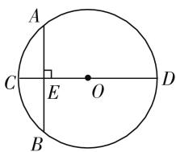
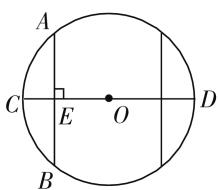
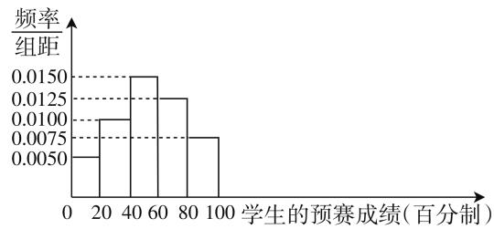

# 培养系统思维,解决概率问题

# ● 安徽省太和县第二中学 刘伟

在高考数学中,概率问题一直是考试的重点,在选择题和计算题中均会考查. 概率问题由于其涉及的方法繁多,要求也不尽相同,容易使学生混淆概念,不能对求解概率问题的方法分类梳理清楚,也不能对症下药. 为了更加高效地解决概率问题,学生应该对其进行一个系统的分类,可以通过直接求解的概率问题就不能去套用公式将其复杂化,而那些涉及分布问题需要公式求解的就应该细致对待,对照解题思路按步骤求解. 概率问题大部分以实际应用为背景,主要考查学生对概率定义的了解以及计算的能力,培养系统思维,将其分类判断,才能在短时间内将问题厘清,对号入座,从而解决问题.

# 一、概率问题系统分类

# 1. 直接求解

概率,是一个事件发生的次数总在一个常数附近摆动,我们称这个常数为这件事情发生的概率.直接求解事件的概率这类问题大多数出现在选择题当中,通过语言或图形的形式间接求解事件发生的概率.需要注意的是学生应该把握求解事件的背景,即总体事件的概率为1,相同的事件在不同的总体事件里概率不一定相同,学生应该明确目标,然后求解.

# 2. 抽样求解

抽样调查求取概率是求解概率十分常用的方法，它从研究对象的全部单位中抽取一部分进行考查与分析，以这部分单位的数量特征去推断总体的数量特征。抽样调查的部分单位往往是能够代表总体单位的。由于抽样方法不一致，有随机抽样、分层抽样等方法，求解的思路也会有差别，抽样调查相比直接求解概率要复杂，学生应该牢记各类抽样方法的解决对象与解决方式，针对问题的性质来求解。

# 3. 分布公式求解

在求解概率类型的问题中,将事件发生的概率规律化并用特殊的分布公式来确定的问题是最为复杂的一类.它是概率事件从随机的个体上升到整体的计算方法,依据随机变量所属类型不同,概率分布也会呈现不同的表现形式,其中正态分布属于比较重要的类型,一方面它是现实生活中各类事件发生概率最常见的分布,另一方面它也常常作为其他分布的极限形式.学生对于分布公式求解的问题应该积累经验,形成系统的解题思路,并且熟记各类分布的应用及求解方法,才能快速并正确解决概率问题.

# 二、直接求解

将事件发生的概率通过图形的方式表现出来,以图形的总体面积为整体事件,待求面积与总体面积之比为事件的概率,或是以长度之比来求概率,这类直接求解概率的题型往往针对于考查学生的计算能力以及对于概率求解的基本知识.

例 1 刘徽是魏晋时期伟大的数学家,他是中国古典数学理论的奠基者之一.他全面证明了《九章算术》中的方法和公式,指出并纠正了其中的错误,更是擅长用代数方法解决几何问题.如

text_image

A
C
E
O
D
B

图1

图 1, 在圆的直径 CD 上任取一点 E, 过点 E 的弦 AB 和 CD 垂直, 则 AB 的长不超过半径的概率是().

A. $\frac{2-\sqrt{3}}{4}$

B. $\frac{1}{3}$

C. $\frac{1}{4}$

D. $1-\frac{\sqrt{3}}{2}$

分析:根据勾股定理以 AB 与 OE 的长度为参数列方程,为解题方便,可设半径为 1,代入后求解方程然后长度做比求得概率.这里需要注意到的是左右均可取点,以半圆为背景求得概率之后还要乘 2,因为事件发生概率的总体事件是一整个圆.

解答:设圆的半径为1,则有 $|AB|=2\sqrt{1^{2}-|OE|^{2}}\leqslant1$ ,解得 $|OE|\geqslant\frac{\sqrt{3}}{2}$ .又E在直径CD上,所以所求的概率为 $\frac{2|CE|}{|CD|}=$

$$
\frac {2 \left(1 - \frac {\sqrt {3}}{2}\right)}{2} = 1 - \frac {\sqrt {3}}{2}.
$$

text_image

A
C E O D
B

图2

故选 D.

# 三、分布公式求解

分布是针对于随机事件发生概率而进行的规律化处理,牢记分布公式,计算不等式来求解概率,这类题型虽然复杂,解题步骤也相对繁冗,却能加强学生对于概率问题深层次的认识.

例 2 某市为提升中学生的数学素养,激发学生学习数学的兴趣,举办了一次“数学文化知识大赛”,此次大赛分为预赛和复赛两个环节.调查可知有8000名学生报名参加了预赛,现随机从预赛学生中抽取100人,统计他们的预赛成绩作为样本,得到如下频率分布直方图.

histogram

| 学生的预赛成绩 (百分制) | 频率/组距 |
|---|---|
| 0-20 | 0.0050 |
| 20-40 | 0.0100 |
| 40-60 | 0.0150 |
| 60-80 | 0.0125 |
| 80-100 | 0.0075 |

图3

(1) 大赛规定,以预赛成绩不低于 80 分为优良,现随机抽取以上样本中预赛成绩不低于 60 分的人,求刚好有一个人成绩为优良的概率.  
(2) 分析频率分布直方图可知: 该市所有学生的预赛成绩 Z 服从正态分布 $N(\mu, \sigma^{2})$ ，其中 $\mu$ 可理解为随机抽取 100 名学生预赛成绩的平均值，且 $\sigma^{2} = 362$ 。请学生利用正态分布的相关知识，估计全体学生中，有多少人预赛成绩不低于 91 分。  
（3）在预赛中，成绩不低于91分的学生即可参加复赛，此次大赛复赛规则如下：①每名学生在复赛初都有初始分，为100分；②答题数量 $n$ 由学生自行决定，每选择一题学生都需要减去一定的分数，其规则为：答第 $k$ 题时减去的分数为 $0.1k(k \in (1,2n))$ ；③每答对一题加1.5分，如若答错，则不加分也不减分；④答完选择的 $n$ 题后，学生的最终分数即为复赛成绩。现有学生甲答对概率均为0.7，且每题答对与否都是相互独立的。现求解学生甲如何选择答题题数 $n$ 才能发挥出最佳水平。

(参考数据： $\sqrt{362}\approx19$ ; 若 $Z\sim N(\mu,\sigma^{2})$ ，则 $P(\mu-\sigma<Z<\mu+\sigma)\approx0.6827, P(\mu-2\sigma<Z<\mu+2\sigma)\approx0.9545, P(\mu-3\sigma<Z<\mu+3\sigma)\approx0.9973)$

分析:以正态分布为背景,求得某一事件发生概率,主要考查学生对于正态分布的应用是否熟练以及排列组合还有期望的了解与应用.

解答:(1)由题意得样本中成绩不低于60分的学生共有:

$$
(0. 0 1 2 5 + 0. 0 0 7 5) \times 2 0 \times 1 0 0 = 4 0 \text {人，}
$$

而成绩优良人数: $0.0075 \times 20 \times 100 = 15$ 人.

记“随机抽取以上样本中预赛成绩不低于60分的人,刚好有一个人成绩为优良”为事件C,

则恰有 1 人预赛成绩优良的概率:

$$
P (C) = \frac {\mathrm{C} _ {2 5} ^ {1} \mathrm{C} _ {1 5} ^ {1}}{\mathrm{C} _ {4 0} ^ {2}} = \frac {2 5}{5 2}.
$$

(2) 由题意知样本中的 100 名学生预赛成绩的平均值为:

$$
\begin{array}{c} {{\overline {{{x}}} = 1 0 \times 0. 1 + 3 0 \times 0. 2 + 5 0 \times 0. 3 + 7 0 \times 0. 2 5}} \\ {{+ 9 0 \times 0. 1 5 = 5 3, \text {则} \mu = 5 3.}} \end{array}
$$

又由 $\sigma^{2}=362$ ，所以 $\sigma=19$ ，

所以 $P(Z \geqslant 91) = P(Z \geqslant \mu + 2\sigma) = \frac{1}{2} [1 - P(\mu - 2\sigma \leqslant \mu + 2\sigma)] \approx 0.02275,$

所以估计全市参加参赛的全体学生中成绩不低于91分的人数为: $8000 \times 0.02275 = 182$ ,

即全市参赛学生中预赛成绩不低于 91 分的人数为 182.

(3) 假设同学甲答对的题数为随机变量 $\xi$ ，则有 $\xi \sim B(n,0.7)$ ，且 $E\xi = 0.7n$ .

以随机变量 X 来表示同学甲答完选择的题目之后所加分数, 则 $X = 1.5\xi$ ,

所以 EX=1.5Eξ=1.05n，

选择求解 n 题, 甲需要减去分数:

$$
0. 1 \times (1 + 2 + 3 + \dots + n) = 0. 0 5 \left(n ^ {2} + n\right).
$$

设甲答完 n 题的分数为 $M(n)$ ,

$$
\begin{array}{r l} & {\text {则} M (n) = 1 0 0 - 0. 0 5 (n ^ {2} + n) + 1. 0 5 n =} \\ & {- 0. 0 5 (n - 1 0) ^ {2} + 1 0 5.} \end{array}
$$

由于 $n \in \mathbf{N}^*$ , 所以当 $n = 10$ 时, $M(n)$ 有最大值为 105,

所以选择答题题数 n=10 才能发挥出最佳水平.

# 四、总结

概率问题的一系列求解方法在实际应用当中有很大的可取性,针对不同类型的概率问题构建不同的解决思路,从而形成系统的解题思维,从简单到复杂,从局部到整体,将概率问题分类整理,就能解决各类概率问题,不仅能够节约解题时间,加强对概率问题的理解,也能锻炼学生的思维,观察到实际生活当中事件发生概率的本质.