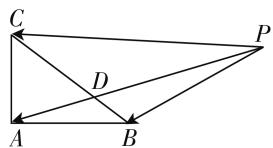
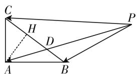
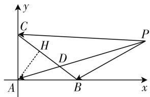

# 多思维切入,妙方法破解

——2020年江苏卷第13题

# ● 江苏省宿迁中学 李志中

涉及平面向量与解三角形的综合问题,背景创新多变,难度中等可控,方式新颖多样,一直备受高考命题者的高度关注.此类问题以平面几何图形为载体,结合平面向量的“数”与“形”的阐述,以及解三角形的过渡,展示出一幅美妙的画卷,往往是历年高考中的一大亮点题.

# 一、真题呈现

高考真题: (2020 年江苏卷第 13 题) 如图 1, 在 $\triangle ABC$ 中, $AB = 4$ , $AC = 3$ , $\angle BAC = 90^\circ$ , $D$ 在边 $BC$ 上, 延长 $AD$ 到 $P$ , 使得 $AP = 9$ , 若 $\overrightarrow{PA} = m\overrightarrow{PB} + \left(\frac{3}{2} - m\right)\overrightarrow{PC}$ ( $m$ 为常数), 则 $CD$ 的长度是 \_\_\_\_.

text_image

Geometric diagram with labeled points A, B, C, D, P and intersecting lines forming triangles

图1

此题是在平面向量基本定理背景下的一道平面向量与解三角形的综合问题,借助平面向量基本定理这一载体,结合系数的巧妙设置,进而得以确定线段的长度问题.破解此类问题的常见处理策略方法有:构造三点共线模型、等和线模型、坐标系模型等,结合平面向量的基底运算以及坐标的代数运算等来处理与应用.

# 二、真题破解

思维视角一:平面向量思维

解法 1: 由于 A, D, P 三点共线，可设 $\overrightarrow{PA} = \lambda \overrightarrow{PD} (\lambda > 0)$ ，结合 $\overrightarrow{PA} = m \overrightarrow{PB} + \left( \frac{3}{2} - m \right) \overrightarrow{PC}$ ，可得 $\lambda \overrightarrow{PD} = m \overrightarrow{PB} + \left( \frac{3}{2} - m \right) \overrightarrow{PC}$ ，即 $\overrightarrow{PD} = \frac{m}{\lambda} \overrightarrow{PB} + \frac{\frac{3}{2} - m}{\lambda} \cdot \overrightarrow{PC}$ 。若 $m \neq 0$ 且 $m \neq \frac{3}{2}$ ，则 B, D, C 三点共线，可得

$\frac{m}{\lambda}+\frac{\frac{3}{2}-m}{\lambda}=1$ , 即 $\lambda=\frac{3}{2}$ . 由 AP=9 可得 AD=3，
而在 $\triangle ABC$ 中，AB=4, AC=3, $\angle BAC=90^{\circ}$ ，可得 BC=5，设 CD=x, $\angle CDA=\theta$ ，则 BD=5-x, $\angle BDA=\pi-\theta$ .

根据余弦定理, 可得 $\cos\theta=\frac{AD^{2}+CD^{2}-AC^{2}}{2AD\cdot CD}=\frac{x}{6},\cos(\pi-\theta)=\frac{AD^{2}+BD^{2}-AB^{2}}{2AD\cdot BD}=\frac{(5-x)^{2}-7}{6(5-x)}$ 结合 $\cos\theta + \cos(\pi - \theta) = 0$ ，有 $\frac{x}{6} + \frac{(5 - x)^{2} - 7}{6(5 - x)} = 0$ ，解得 $x = \frac{18}{5}$ ，即 $CD = \frac{18}{5}$ .

当 m=0 时, 此时有 $\overrightarrow{PA}=\frac{3}{2}\overrightarrow{PC}$ , 点 D 与点 C 重合, 可得 CD=0.

当 $m=\frac{3}{2}$ 时,此时有 $\overrightarrow{PA}=\frac{3}{2}\overrightarrow{PB}$ ,点D与点B重合,可得AP=12,这与条件矛盾,舍去.

综上分析,可得 CD 的长度是 0 或 $\frac{18}{5}$ .

故填答案:0 或 $\frac{18}{5}$ .

点评:根据条件,结合平面向量的线性关系引入参数,结合三点共线模型的构造来确定对应的参数值,进而确定相应的线段长度,设出 CD 的长度,利用余弦定理的应用,结合关系式的求解来确定对应的长度问题.过程完整,步骤烦琐.

解法 2: 由于 A, D, P 三点共线，可设 $\overrightarrow{PA} = \lambda \overrightarrow{PD} (\lambda > 0)$ ，结合 $\overrightarrow{PA} = m \overrightarrow{PB} + \left( \frac{3}{2} - m \right) \overrightarrow{PC}$ ，可得 $\lambda \overrightarrow{PD} = m \overrightarrow{PB} + \left( \frac{3}{2} - m \right) \overrightarrow{PC}$ ，即 $\overrightarrow{PD} = \frac{m}{\lambda} \overrightarrow{PB} + \frac{\frac{3}{2} - m}{\lambda} \cdot \overrightarrow{PC}$ ，结合 B, D, C 三点共线，可得 $\frac{m}{\lambda} + \frac{\frac{3}{2} - m}{\lambda} = 1$ ，

即 $\lambda=\frac{3}{2}$ . 由于 AP=9，可得 AD=3，而在 $\triangle ABC$ 中，AB=4, AC=3, $\angle BAC=90^{\circ}$ ，可得 BC=5. 如图 2，过点 A 作 $AH\perp CD$ ，垂足为 H. 利用三角函数的定义可得 $\cos\angle ACB=\frac{3}{5}$ ，由于 AD=AC=3，若点 D 与点 C 重合，可得 CD=0.

若点 D 与点 C 不重合，可得 CD = 2CH = 2ACcos∠ACB = $\frac{18}{5}$ .

text_image

Geometric diagram with labeled points A, B, C, D, H, P and connecting lines, likely from a math problem or proof.

图2

综上分析,可得 CD 的长度是 0 或 $\frac{18}{5}$ .

故填答案:0 或 $\frac{18}{5}$ .

点评:根据条件,结合平面向量的线性关系引入参数,结合三点共线模型的构造来确定对应的参数值,进而确定相应的线段长度,结合辅助线的构造,利用三角函数的定义加以转化,进而通过解直角三角形来确定对应的长度问题.直观简捷,操作方便.

思维视角二:坐标思维   

text_image

y
C
H
D
A
B
x
P

图3

解法3:如图3所示,以点A为坐标原点,分别以AB,AC所在直线为x,y轴建立平面直角坐标系,则 $B(4,0),C(0,3)$ .由 $\overrightarrow{PA}=m\overrightarrow{PB}+\left(\frac{3}{2}-m\right)\overrightarrow{PC}$ ,可得 $\overrightarrow{PA}=m(\overrightarrow{PA}+\overrightarrow{AB})+\left(\frac{3}{2}-m\right)(\overrightarrow{PA}+\overrightarrow{AC})$ ,整理可得 $\overrightarrow{PA}=-2m\overrightarrow{AB}+(2m-3)\overrightarrow{AC}=-2m(4,0)+(2m-3)(0,3)=(-8m,6m-9)$ .由AP=9,可得 $64m^{2}+(6m-9)^{2}=81$ ,解得m=0或 $m=\frac{27}{25}$ .

当 m=0 时， $\overrightarrow{PA}=(0,-9)$ ，此时点 D 与点 C 重合，可得 CD=0；

当 $m = \frac{27}{25}$ 时，直线 $PA$ 的方程为 $y = \frac{9 - 6m}{8m} x$ ，直线 $BC$ 的方程为 $\frac{x}{4} +\frac{y}{3} = 1$ ，联立两直线方程可得 $x =$

$\frac{8}{3}m=\frac{72}{25},y=3-2m=\frac{21}{25}$ ，即 $D\left(\frac{72}{25},\frac{21}{25}\right)$ ，那么CD= $\sqrt{\left(\frac{72}{25}\right)^{2}+\left(\frac{21}{25}-3\right)^{2}}=\frac{18}{5}.$

综上分析,可得 CD 的长度是 0 或 $\frac{18}{5}$ .

故填答案:0 或 $\frac{18}{5}$ .

点评:根据条件,建立相应的平面直角坐标系,结合平面向量的线性关系式的变形与转化,把 $\overrightarrow{PA}$ 的坐标用参数m加以表示,借助条件中AP=9列式求得m值,然后通过分类求得D的坐标,进而确定线段CD的长度问题.合理建系,坐标转化.

# 三、变式拓展

探究 1: 保留题目条件, 改变求解对象, 变求解 “CD 的长度” 为 “常数 m 的值”, 问题得以简化, 进而得到以下对应的变式问题. 难度在原有基础上有很大的降低.

变式 1: 在 $\triangle ABC$ 中, $AB = 4$ , $AC = 3$ , $\angle BAC = 90^{\circ}$ , $D$ 在边 $BC$ 上, 延长 $AD$ 到 $P$ , 使得 $AP = 9$ , 若 $\overrightarrow{PA} = m\overrightarrow{PB} + \left(\frac{3}{2} - m\right)\overrightarrow{PC}$ ( $m$ 为常数), 则常数 $m$ 的值是 \_\_\_\_.

解析：由于 $\overrightarrow{PA} = m\overrightarrow{PB} +\left(\frac{3}{2} -m\right)\overrightarrow{PC}$ ，可得 $-\overrightarrow{AP} = m(\overrightarrow{AB} -\overrightarrow{AP}) + \left(\frac{3}{2} -m\right)(\overrightarrow{AC} -\overrightarrow{AP})$ ，整理可得 $\overrightarrow{AP} = 2m\overrightarrow{AB} +(3 - 2m)\overrightarrow{AC}$ ，两边平方可得 $\overrightarrow{AP^2} = [2m\overrightarrow{AB} +(3 - 2m)\overrightarrow{AC}]^2 = 4m^2\overrightarrow{AB^2} +(3-$ $2m)^{2}\overrightarrow{AC^{2}}$ （这里由于 $\angle BAC = 90^{\circ},\overrightarrow {AB}\cdot \overrightarrow {AC} = 0)$ ，则有 $81 = 64m^2 +9(3 - 2m)^2$ ，解得 $m = 0$ 或 $m = \frac{27}{25}$

故填答案:0 或 $\frac{27}{25}$ .

点评:利用基底转化法比较简单快捷就可以确定常数 m 的值.当然参照以上高考真题的其他破解方法,也可以顺利得以求解.

# 四、解后反思

涉及此类平面向量与解三角形的综合问题,关键是借助平面几何图形特征,数形结合,借助平面向量与解三角形中的相关公式、定理等进行合理的推理论证、运算求解,有效考查逻辑推理、直观想象、数学运算等核心素养. F