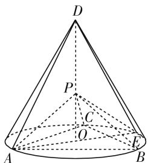
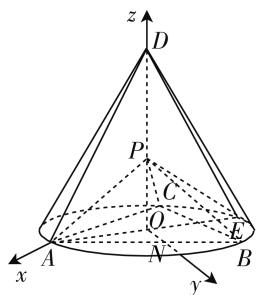

# 多角度变式拓展,多层次提升备考

—— 对 2020 年全国卷 I（理）第 18 题的探究

# 广东省惠州市东江高级中学 王立嘉

立体几何中的空间角(主要涉及异面直线所成的角、直线与平面所成的角、二面角的平面角等)问题,可以有效考查考生众多方面的数学知识与数学能力,一直受高考数学命题者所垂青,几乎年年高考必考.年年岁岁花相似,岁岁年年人不同,每年高考数学中涉及立体几何的空间角问题,往往就是改变立体几何问题的空间载体,以不同的立体几何模型结合不同的设问方式与角度来设置问题而已.

# 一、真题在线

高考真题 （2020 年全国卷Ⅰ理科第18题）如图1，D 为圆锥的顶点，O 是圆锥底面的圆心，AE 为底面直径，AE = AD. △ABC 是底面的内接正三角形，P 为 DO 上一点， $PO = \frac{\sqrt{6}}{6}DO$ .

text_image

D
P
C
O
E
A
B

图 1

(1) 证明: PA ⊥ 平面 PBC;  
(2) 求二面角 B—PC—E 的余弦值.

此题以圆锥为载体,跳出以往常见的柱体模型,给人以耳目一新之感.设置的问题还是常见的线面垂直的判定以及二面角的平面角的求解,考生比较熟悉,属于常规题型,“新瓶装陈酒”,正确推理,注意运算,防止出现不必要的错误.

# 二、真题破解

解析:(1)证明:由题设知 $\triangle DAE$ 为等边三角形, 设 AE=1, 则 $DO=\frac{\sqrt{3}}{2}$ , $CO=BO=\frac{1}{2}AE=\frac{1}{2}$ , 所以

$$
P O = \frac {\sqrt {6}}{6} D O = \frac {\sqrt {2}}{4}, P C = \sqrt {P O ^ {2} + O C ^ {2}} = \frac {\sqrt {6}}{4}, P B =
$$

$\sqrt{PO^2 + OB^2} = \frac{\sqrt{6}}{4}$ . 又 $\triangle ABC$ 为等边三角形, 则 $\frac{AB}{\sin 60^\circ} = 2OA = 1$ , 所以 $AB = \frac{\sqrt{3}}{2}$ , 而 $PA^2 + PB^2 = \frac{3}{4} = AB^2$ , 则 $\angle APB = 90^\circ$ , 所以 $PA \perp PB$ . 同理 $PA \perp$ PC. 又 $PB \cap PC = P$ ，所以
PA ⊥ 平面 PBC.

(2) 过 O 作 ON // BC 交 AB 于点 N，因为 PO ⊥ 平面 ABC，以 O 为坐标原点，OA 为 x 轴，ON 为 y 轴建立如图 2 所示的空间直角坐标系，则 $E\left(-\frac{1}{2},0,0\right), P\left(0,0,\frac{\sqrt{2}}{4}\right)$ ,

text_image

z
D
P
C
O
E
A
N
B
x
y

图2

$$
\begin{array}{l} B \left(- \frac {1}{4}, \frac {\sqrt {3}}{4}, 0\right), C \left(- \frac {1}{4}, - \frac {\sqrt {3}}{4}, 0\right), \overrightarrow {P C} = \left(- \frac {1}{4}, - \frac {\sqrt {3}}{4}, \right. \\ \left. - \frac {\sqrt {2}}{4}\right), \overrightarrow {P B} = \left(- \frac {1}{4}, \frac {\sqrt {3}}{4}, - \frac {\sqrt {2}}{4}\right), \overrightarrow {P E} = \left(- \frac {1}{2}, 0, \right. \\ \left. - \frac {\sqrt {2}}{4}\right). \\ \end{array}
$$

设平面 PCB 的法向量为 $\boldsymbol{n}=(x_{1},y_{1},z_{1})$ .

由 $\left\{\begin{aligned}\boldsymbol{n}\cdot\overrightarrow{PC}&=0,\\ \boldsymbol{n}\cdot\overrightarrow{PB}&=0,\end{aligned}\right.$ 得 $\left\{\begin{aligned}-x_{1}-\sqrt{3}y_{1}-\sqrt{2}z_{1}&=0,\\ -x_{1}+\sqrt{3}y_{1}-\sqrt{2}z_{1}&=0.\end{aligned}\right.$

令 $x_{1} = \sqrt{2}$ ，得 $y_{1} = 0,z_{1} = -1$ ，所以 $\pmb {n} = (\sqrt{2},0, - 1)$

设平面 PCE 的法向量为 $\boldsymbol{m}=(x_{2},y_{2},z_{2})$ .

由 $\left\{\begin{aligned}&m\cdot\overrightarrow{PC}=0,\\ &m\cdot\overrightarrow{PE}=0,\end{aligned}\right.$ 得 $\left\{\begin{aligned}&-x_{2}-\sqrt{3}y_{2}-\sqrt{2}z_{2}=0,\\ &-2x_{2}-\sqrt{2}z_{2}=0.\end{aligned}\right.$

令 $x_{2} = 1$ ，得 $y_{2} = \frac{\sqrt{3}}{3},z_{2} = -\sqrt{2}$

所以 $\boldsymbol{m}=\left(1,\frac{\sqrt{3}}{3},-\sqrt{2}\right)$ .

故 $\cos \langle n, m \rangle = \frac{n \cdot m}{|n| |m|} = \frac{2\sqrt{2}}{\sqrt{3} \times \frac{\sqrt{10}}{\sqrt{3}}} = \frac{2\sqrt{5}}{5}$ .

设二面角 B—PC—E 的大小为 $\theta$ ，则 $\cos\theta=\frac{2\sqrt{5}}{5}$ .

# 三、变式拓展

# 探究 1:逆向联想

对以上高考真题中的第(1)问进行逆向思考,调换题设条件与问题结论的位置,得到以下探究性的变式问题.

变式 1: 如图 1, D 为圆锥的顶点, O 是圆锥底面的圆心, AE 为底面直径, AE = AD. $\triangle ABC$ 是底面的内接正三角形. 在 DO 上是否存在一点 P, 使得 PA $\perp$ 平面 PBC? 若存在, 请确定点 P 的位置; 若不存在, 请说明理由.

解析: 在 DO 上存在一点 P, 使得 $PA \perp$ 平面 PBC, 且 $PO = \frac{\sqrt{6}}{6}DO$ . 由题设知 $\triangle DAE$ 为等边三角形, 设 AE = 1, 则 $DO = \frac{\sqrt{3}}{2}$ , $CO = BO = \frac{1}{2}AE = \frac{1}{2}$ . 又 $\triangle ABC$ 为等边三角形, 则 $\frac{AB}{\sin60^{\circ}} = 2OA = 1$ , 所以 $AB = \frac{\sqrt{3}}{2}$ . 假设在 DO 上存在满足条件的点 P, 令 $PO = \lambda DO = \frac{\sqrt{3}}{2}\lambda$ , 而 $\triangle PAB \cong \triangle PAC$ , 由于 $PA \perp$ 平面 PBC, 所以只需 $PA \perp PB$ 即可. 在直角 $\triangle PAB$ 中, 由于 $PA^{2} = PB^{2} = \frac{3}{4}\lambda^{2} + \frac{1}{4}$ , 所以 $PA^{2} + PB^{2} = 2\left(\frac{3}{4}\lambda^{2} + \frac{1}{4}\right) = AB^{2} = \frac{3}{4}$ , 解得 $\lambda = \frac{\sqrt{6}}{6}$ . 故在 DO 上存在一点 P, 且 $PO = \frac{\sqrt{6}}{6}DO$ , 使得 $PA \perp$ 平面 PBC.

对以上高考真题中的第(2)问进行逆向思考,调换题设条件与问题结论的位置,得到以下探究性的变式问题.

变式2:如图1,D为圆锥的顶点,O是圆锥底面的圆心,AE为底面直径, $AE=AD$ . $\triangle ABC$ 是底面的内接正三角形. 若在DO上存在一点P,使得二面角B—PC—E的余弦值为 $\frac{2\sqrt{5}}{5}$ ,试求 $\frac{PO}{DO}$ 的值.

解析:由题设知 $\triangle DAE$ 为等边三角形, 设 AE = 1, 则 $DO = \frac{\sqrt{3}}{2}$ , $CO = BO = \frac{1}{2} AE = \frac{1}{2}$ .

又 $\triangle ABC$ 为等边三角形，则 $\frac{AB}{\sin 60^\circ} = 2OA = 1$ ，所以 $AB = \frac{\sqrt{3}}{2}$ ，令 $PO = \lambda DO = \frac{\sqrt{3}}{2}\lambda$ ，过 $O$ 作 $ON \parallel BC$ 交 $AB$ 于点 $N$ ，因为 $PO \perp$ 平面 $ABC$ ，以 $O$ 为坐标原点， $OA$ 为 $x$ 轴， $ON$ 为 $y$ 轴建立如图2所示的空间直角坐标系，则 $E\left(-\frac{1}{2}, 0, 0\right), P\left(0, 0, \frac{\sqrt{3}}{2}\lambda\right), B\left(-\frac{1}{4}, \frac{\sqrt{3}}{4}, 0\right), C\left(-\frac{1}{4}, -\frac{\sqrt{3}}{4}, 0\right), \overrightarrow{PC} = \left(-\frac{1}{4}, -\frac{\sqrt{3}}{4}, -\frac{\sqrt{3}}{2}\lambda\right)$ ，

$$
\overrightarrow {P B} = \left(- \frac {1}{4}, \frac {\sqrt {3}}{4}, - \frac {\sqrt {3}}{2} \lambda\right), \overrightarrow {P E} = \left(- \frac {1}{2}, 0, - \frac {\sqrt {3}}{2} \lambda\right).
$$

设平面 PCB 的法向量为 $\boldsymbol{n}=(x_{1},y_{1},z_{1})$ ,

$$
\text {由} \left\{ \begin{array}{l} {\pmb {n} \cdot \overrightarrow {P C} = 0,} \\ {\pmb {n} \cdot \overrightarrow {P B} = 0,} \end{array} \right. \text {得} \left\{ \begin{array}{l} - x _ {1} - \sqrt {3} y _ {1} - 2 \sqrt {3} \lambda z _ {1} = 0, \\ - x _ {1} + \sqrt {3} y _ {1} - 2 \sqrt {3} \lambda z _ {1} = 0. \end{array} \right.
$$

令 $z_{1} = 1$ ，得 $x_{1} = -2\sqrt{3}\lambda ,y_{1} = 0,$

所以 $\boldsymbol{n}=(-2\sqrt{3}\lambda,0,1)$ .

设平面 PCE 的法向量为 $\boldsymbol{m}=(x_{2},y_{2},z_{2})$ ,

$$
\text {由} \left\{ \begin{array}{l l} \boldsymbol {m} \cdot \overrightarrow {P C} = 0, \\ \boldsymbol {m} \cdot \overrightarrow {P E} = 0, \end{array} \right. \text {得} \left\{ \begin{array}{l l} - x _ {2} - \sqrt {3} y _ {2} - 2 \sqrt {3} \lambda z _ {2} = 0, \\ - 2 x _ {2} - 2 \sqrt {3} \lambda z _ {2} = 0. \end{array} \right.
$$

$$
\begin{array}{r l} & {\text {令} z _ {2} = 1, \text {得} x _ {2} = - \sqrt {3} \lambda , y _ {2} = - \lambda , \text {所以} m = (- \sqrt {3} \lambda ,} \\ & {- \lambda , 1), \text {故} \cos \langle n, m \rangle = \frac {|   n \cdot m   |}{|   n   |   |   m   |} = \frac {6 \lambda^ {2} + 1}{\sqrt {1 2 \lambda^ {2} + 1} \times \sqrt {4 \lambda^ {2} + 1}}} \\ & {= \frac {2 \sqrt {5}}{5}, \text {解得} \lambda = \frac {\sqrt {6}}{6}, \text {故} \frac {P O}{D O} \text {的值为} \frac {\sqrt {6}}{6}.} \end{array}
$$

# 探究 2: 引申推广

对以上高考真题中的过程结论 $\angle APB = 90^{\circ}$ 进行一般化处理, 合理引申推广, 得到以下总结性的变式问题.

变式 3: 如图 1, D 为圆锥的顶点, O 是圆锥底面的圆心, AE 为底面直径, AE = AD. $\triangle ABC$ 是底面的内接正三角形, P 为 DO 上一点, 且 PO = $\lambda DO$ . 若 $\angle APB = \theta$ , 试确定实数 $\lambda$ 和角 $\theta$ 之间满足的关系式.

解析:由题设知 $\triangle DAE$ 为等边三角形, 设 AE = 1, 则 $DO = \frac{\sqrt{3}}{2}$ , $CO = BO = \frac{1}{2} AE = \frac{1}{2}$ . 又 $\triangle ABC$ 为等边三角形, 则 $\frac{AB}{\sin60^{\circ}} = 2OA = 1$ , 所以 $AB = \frac{\sqrt{3}}{2}$ , 而 PO = $\lambda DO = \frac{\sqrt{3}}{2} \lambda$ , $PA^{2} = PB^{2} = \frac{3}{4} \lambda^{2} + \frac{1}{4}$ . 在 $\triangle PAB$ 中, 由余弦定理可得 $PA^{2} + PB^{2} - 2PA \cdot PB \cdot \cos\theta = AB^{2} = \frac{3}{4}$ , 即 $2\left(\frac{3}{4}\lambda^{2} + \frac{1}{4}\right)(1 - \cos\theta) = \frac{3}{4}$ , 整理有 $(6\lambda^{2} + 2)(1 - \cos\theta) = 3$ .

# 四、解后反思

以上从一道高考真题出发,通过分析与解析,剖析破解问题的一般解题思想与方法,进而通过变式探究,深化认识,加深理解,感悟方法,拓展思维,提升能力.整个过程,融观察分析、提炼概括、探究拓展于一体,进一步锤炼数学思维,丰富数学命题的设计空间和命题的解法空间,很好对高考真题进行多方向、多侧面、多途径分析与研究,从中获得学习的乐趣,提升备考层次、深度与广度.