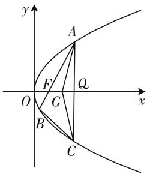
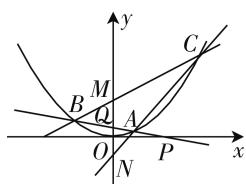

# 对 2019 年浙江高考数学解析几何压轴题的寻幽探微

陕西省西安市交大附中 林逸凡

# 一、考场遇故知，相逢亦不识

例 1 （2019 年浙江 21）如图 1，已知点 $F(1,0)$ 为抛物线 $y^{2}=2px(p>0)$ ，点 F 为焦点，过点 F 的直线交抛物线于 A, B 两点，点 C 在抛物线上使得 $\triangle ABC$ 的重心G在x轴上，直线AC交x轴于点Q，且Q在点F右侧.记 $\triangle AFG,\triangle CQG$ 的面积为 $S_{1},S_{2}$ .

（Ⅰ）求 p 的值及抛物线的标准方程；  
（Ⅱ）求 $\frac{S_{1}}{S_{2}}$ 的最小值及此时点G的坐标.

官方发布的标准答案, 计算非常复杂, 令人望而生畏. 而我看到这道题时, 却有似曾相识的惊喜感, 因为它可以利用各版本教材中关于抛物线的一个经典、简单的结论来巧妙解答, 大大简化计算. 这是一个未被深度挖掘的宝藏! 如果教师平时授课时, 仅仅将目光停留在表面, 简单处理一带而过, 会让学生在考场纵使相逢亦不识, 做题没有努力的方向, 是非常可惜的.

text_image

y
A
F
O
G
Q
x
B
C

图 1

# 二、寻他千百度，却在书本处

各版本教材、教辅书都用多种方式证明了抛物线焦点弦的如下性质：

已知直线 l 过抛物线 $y^{2}=2px(p>0)$ 的焦点且与抛物线交于 $A(x_{1},y_{1}), B(x_{2},y_{2})$ 两点，则 $y_{1}y_{2}=-p^{2}$ 为定值.

那么对于不过焦点的情形呢?

定理 1: 已知直线 l 与抛物线 $y^{2}=2px(p>0)$ 交于 $A(x_{1},y_{1}), B(x_{2},y_{2})$ 两点，则 l 过定点 $D(a,b)$ 当且仅当 $-2pa=(y_{1}+y_{2})b+y_{1}y_{2}$ .

注:特别地,当 $y_{1}y_{2}=-2pa$ 为常数时,直线l过x轴上的定点 $(a,0)$ .

证明:由题意,可设直线 AB:x=ty+m,联立 $\left\{\begin{aligned}y^{2}&=2px,\\ x&=ty+m,\end{aligned}\right.$ 得 $y^{2}-2pty-2pm=0,$

则 $\left\{\begin{aligned}y_{1}+y_{2}&=2pt,\\ y_{1}y_{2}&=-2pm,\end{aligned}\right.$ 所以 $\left\{\begin{aligned}t&=\frac{y_{1}+y_{2}}{2p},\\ m&=\frac{y_{1}y_{2}}{-2p}.\end{aligned}\right.$

所以 $x=\frac{y_{1}+y_{2}}{2p}y+\frac{y_{1}y_{2}}{-2p}$ ，则直线 l 过定点 $D(a, b)$ ，当且仅当 $-2pa=-(y_{1}+y_{2})b+y_{1}y_{2}$ 恒成立.

用与定理 1 完全类似的方法, 可得:

定理 2: 已知直线 l 与抛物线 $x^{2}=2py(p>0)$ 交于 $A(x_{1},y_{1}), B(x_{2},y_{2})$ 两点，则 l 过定点 $D(a,b)$ ，当且仅当 $-2pb=-(x_{1}+x_{2})a+x_{1}x_{2}$ .

# 三、心中有经纬，下笔如有神

以抛物线的焦点在 x 轴上为例, 我们可以总结出如下两条非常有用的信息:

总结 1: 在直线与抛物线的位置关系的问题中, 若直线恒过定点, 则必可以找到一个关于 $y_{1} + y_{2}, y_{1}y_{2}$ 的线性组合的式子, 反之, 若题目中给的条件能化简为一个关于 $y_{1} + y_{2}, y_{1}y_{2}$ 的线性组合的式子, 则对比系数即可证明直线恒过定点, 且定点不一定在 x 轴上. 下述例题就是一个直接应用.

例 2 已知 $E: y^{2} = 4x$ ，若 $A(1, 2)$ ，B, C 为曲线 E 上与点 A 相异的两动点，且 $\overrightarrow{AB} \cdot \overrightarrow{AC} = 0$ ，证明：直线 BC 必过一定点.

证明: 设 $B\left(\frac{y_{1}^{2}}{4}, y_{1}\right)$ , $C\left(\frac{y_{2}^{2}}{4}, y_{2}\right)$ ，易知点 A(1, 2) 在抛物线 E 上，由题意得 $y_{1} \neq 2$ , $y_{2} \neq 2$ ，则 $\overrightarrow{AB} = \left(\frac{y_{1}^{2}}{4} - 1, y_{1} - 2\right)$ , $\overrightarrow{AC} = \left(\frac{y_{2}^{2}}{4} - 1, y_{2} - 2\right)$ . 因为 $\overrightarrow{AB} \cdot \overrightarrow{AC} = 0$ , 即 $\left(\frac{y_{1}^{2}}{4} - 1\right)\left(\frac{y_{2}^{2}}{4} - 1\right) + (y_{1} - 2)(y_{2} - 2) = 0 (y_{1} \neq 2, y_{2} \neq 2)$ , 即 $2(y_{1} + y_{2}) + y_{1}y_{2} + 20 = 0. (*)$

设 BC: $x = ty + m$ ，由定理 1 易知 BC: $x = \frac{y_{1} + y_{2}}{4}y + \frac{y_{1}y_{2}}{-4}$ ，即 $-4x = -(y_{1} + y_{2})y + y_{1}y_{2}$ ，（\*\*）由（\*）式知，当 x = 5, y = -2 时，（\*\*）式恒成立，故直线 BC 必过定点 $(5, -2)$ .

总结2: 因为 $x_{1}x_{2}=\frac{y_{1}^{2}y_{2}^{2}}{2p\cdot2p}$ ，所以 $y_{1}y_{2}$ 为定值，能推出 $x_{1}x_{2}$ 为定值，进而得到直线 l 过 x 轴上的一个定点 $D(a,0)$ ; 当 $D(a,0)$ 不是定点时，至少可以推出 $x_{1}x_{2}$ 与 $y_{1}y_{2}$ 只跟参数 a 有关.

形成以上解题思路后,很容易想到例1的妙解:

例 1 的思路分析: (I) p = 2, $y^{2} = 4x$ .

（Ⅱ）设点 $Q(m,0)(m>1)$ ，由定理1得到 $y_{A}y_{B}=-4$ ，故 $y_{A}y_{C}=-4m$ ，从而 $\left\{\begin{aligned}y_{A}y_{B}&=-4,\\ y_{A}y_{C}&=-4m,y_{A}(y_{A}+\\ y_{A}y_{A}&=4x_{A},\end{aligned}\right.$ $y_{B} + y_{C}) = 3y_{A}y_{G} = 0 = 4(x_{A} - m - 1)$ ，解得 $x_{A} = m + 1$ .

同理可得 $\left\{\begin{aligned}x_{A}x_{B}&=1,\\ x_{A}x_{C}&=m^{2},\\ x_{A}x_{A}&=(m+1)^{2},\end{aligned}\right.$

$$
x _ {A} (x _ {A} + x _ {B} + x _ {C}) = 3 x _ {A} x _ {G} = 3 (1 + m) x _ {G} = 1 +
$$

$m^2 +(1 + m)^2$ ，解得 $3x_{G} = \frac{1 + m^{2} + (1 + m)^{2}}{1 + m}$

$$
\frac {S _ {1}}{S _ {2}} = \frac {\frac {1}{2} | G F | \cdot | y _ {A} |}{\frac {1}{2} | G Q | \cdot | y _ {C} |} = \frac {x _ {G} - 1}{m - x _ {G}} \cdot \frac {y _ {A} y _ {A}}{- y _ {A} y _ {C}}
$$

$$
= \frac {3 x _ {G} - 3}{3 m - 3 x _ {G}} \cdot \frac {4 x _ {A}}{- y _ {A} y _ {C}}
$$

$$
= \frac {\frac {1 + m ^ {2} + (1 + m) ^ {2}}{1 + m} - 3}{3 m - \frac {1 + m ^ {2} + (1 + m) ^ {2}}{1 + m}} \cdot \frac {m + 1}{m}
$$

$$
= \frac {2 m ^ {2} - m - 1}{m ^ {2} + m - 2} \cdot \frac {m + 1}{m}
$$

$$
= \frac {(2 m + 1) (m - 1)}{(m + 2) (m - 1)} \cdot \frac {m + 1}{m}
$$

$$
= \frac {2 m + 1}{m + 2} \cdot \frac {m + 1}{m}
$$

$$
= \frac {2 m ^ {2} + 3 m + 1}{m ^ {2} + 2 m}
$$

$$
= 2 - \frac {m - 1}{m ^ {2} + 2 m}. (m > 1)
$$

令 $t = m - 1 > 0, \frac{S_1}{S_2} = 2 - \frac{t}{(t + 1)(t + 3)}$

$$
\begin{array}{l} = 2 - \frac {1}{t + \frac {3}{t} + 4} \geqslant 2 - \frac {1}{2 \sqrt {3} + 4} \\ = 2 - \frac {1}{2} \left(\frac {1}{\sqrt {3} + 2}\right) = 2 - \frac {1}{2} (2 - \sqrt {3}) = 1 + \frac {\sqrt {3}}{2}, \\ \end{array}
$$

等号成立当且仅当 $t = \sqrt{3}, m = \sqrt{3} + 1$ .

此时 $x_{G}=\frac{1}{3}\cdot\frac{1+m^{2}+(1+m)^{2}}{1+m}$

=2, 点 G 的坐标为 $(2,0)$ .

$$
\begin{array}{l} = \frac {1}{3} \cdot \frac {2 m ^ {2} + 2 m + 2}{1 + m} = \frac {2}{3} \cdot \left(m + \frac {1}{m + 1}\right) \\ = \frac {2}{3} \cdot \left(\sqrt {3} + 1 + \frac {1}{\sqrt {3} + 2}\right) \\ = \frac {2}{3} \cdot (\sqrt {3} + 1 + 2 - \sqrt {3}) \\ \end{array}
$$

# 四、读遍三万轴，小卷试牛刀

# 变式训练：

1. 在平面直角坐标系 xOy 中, 直线 l 与抛物线 $y^{2}=2x$ 相交于 A, B 两点.

（Ⅰ）求证：如果直线 l 过点 $T(3,0)$ ，那么 $\overrightarrow{OA} \cdot \overrightarrow{OB} = 3$ ;  
(Ⅱ) 写出 (Ⅰ) 中命题的逆命题, 判断它是真命题还是假命题, 并说明原因.  
2. 已知 F 为抛物线 $y^{2}=2x$ 的焦点，点 A, B 在该抛物线上且位于 x 轴的两侧， $\overrightarrow{OA} \cdot \overrightarrow{OB}=3$ （其中 O 为坐标原点），则 $\triangle ABO$ 与 $\triangle BFO$ 的面积之差的最小值是（）.

A. 2

B. 3

C. $3\sqrt{5}$

D. $\sqrt{10}$

3. 如图 2, $\triangle ABC$ 的三个顶点 A, B, C 在抛物线 E: $x^{2} = 4y$ 上，且 A, B, C 都不与原点重合，直线 AB 的斜率为 $k (k \neq 0, k \neq \pm \frac{1}{2})$ ，且与 x 轴相交于点 P，与 y 轴相交于点 Q.

text_image

y
C
M
B
Q
A
O
N
P
x

图 2

（Ⅰ）若直线 BC 与 y 轴相交于点 $M(0,2)$ ，直线 AC 与 y 轴相交于点 $N(0,-1)$ ，求 $\frac{|AQ|}{|BQ|}$ 的值.  
（Ⅱ）若点 Q 为抛物线 E 的焦点，是否存在直线 AB，使得 $\frac{1}{|PA|} + \frac{1}{|PB|} = \frac{6}{|PQ|}$ ？若存在，求出直线 AB 的方程；若不存在，请说明理由。（答案略）F