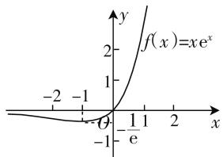

# 幂对函数 $f(x)=x^{n}\ln x(n\in\mathbf{Z})$ 及其应用浅析

# 湖北省武汉市吴家山中学 刘族刚

形如 $f(x)=x^{a}\ln x$ 的函数叫做幂对函数，它由幂函数 $y=x^{a}$ 与对数函数 $y=\ln x$ 相乘得到，虽然教材中没有对它做专门的介绍或研究，但其形式简洁、性质独特、应用广泛，在高考、各地模拟考试中屡见不鲜，成为新的兴趣点、热点与亮点。因而，对其做适当的研究，不仅是巩固基础知识，提高解题能力、培养创新意识的需要，更是开阔视野及科学备考的需要。本文以幂对函数 $f(x)=x^{n}\ln x(n\in\mathbf{Z}$ 且 $n\neq0)$ 为载体，由点及面，对其性质、图像及应用等方面加以研习，以供大家参考借鉴。

# 一、幂对函数 $f(x)=x^{n}\ln x$ ( $n\in Z$ 且 $n\neq0$ ) 的性质与图像

为方便解决问题,先研究 $f(x)=\frac{\ln x}{x^{n}}(n\in\mathbf{N}^{*})$ 的性质与图像:

(1) 定义域: $(0, +\infty)$ .   
(2) 单调性与极值: 由 $f(x) = \frac{\ln x}{x^n} (n \in \mathbf{N}^*)$ , 得 $f'(x) = \frac{\frac{1}{x} x^n - nx^{n-1} \ln x}{x^{2n}} = \frac{1 - n \ln x}{x^{n+1}}$ , 当 $x \in (\sqrt[n]{\mathrm{e}}, +\infty)$ 时, $f'(x) < 0$ , 当 $x \in (0, \sqrt[n]{\mathrm{e}})$ 时, $f'(x) > 0$ , 所以 $f(x)$ 在区间 $(\sqrt[n]{\mathrm{e}}, +\infty)$ 上单调递减, 在 $(0, \sqrt[n]{\mathrm{e}})$ 上单调递增, 故 $f(x) = \frac{\ln x}{x^n} (n \in \mathbf{N}^*)$ 极大值点为 $x = \sqrt[n]{\mathrm{e}}$ , 极大值为 $f(\sqrt[n]{\mathrm{e}}) = \frac{1}{ne}$ , 无极小值.  
(3) 值域: $\left(-\infty, \frac{1}{ne}\right]$ .   
(4) 零点: 有唯一零点 x=1, 即 $f(x)=\frac{\ln x}{x^{n}}$ ( $n \in N^{*}$ ) 图像过 $(1,0)$ .  
(5) 渐近线: 当 x > 1 时, $f(x) > 0$ , 且 $x \to +\infty$ 时, $f(x) \to 0$ ; 当 x > 0 且 $x \to 0$ 时, $f(x) \to -\infty$ , 故 x 轴正半轴和 y 轴负半轴均为 $f(x)$ 图像的渐近线.

对于幂对函数 $f(x)=x^{n}\ln x(n\in\mathbf{N}^{*})$ ，利用导数工具及理性分析，同样可以得到其性质与图像，在此略.

# 二、幂对函数的应用

# 应用一: 利用图像研究函数的零点

例 1 （2020·四川棠湖中学月考）函数 $f(x)=x\mathrm{e}^{-ax}-\frac{1}{x}$ 在 $(0,+\infty)$ 上有两个零点，则实数 a 的取值范围是（）.

A. $\left(-\infty,\frac{2}{e}\right)$

B. $\left(0,\frac{2}{e}\right)$

C. $(1,e)$

D. $\left(\frac{1}{e},\frac{2}{e}\right)$

分析:“零点存在定理”是解决函数零点问题的基本依据,“提参法”“数形结合法”是解决含参函数的零点个数、零点分布问题的有效的、值得优先考虑的方法.

解析: 令 $f(x)=x\mathrm{e}^{-ax}-\frac{1}{x}=0$ ，则 $e^{-ax}=\frac{1}{x^{2}}$ ，取对数得 -ax=-2lnx，即 $\frac{a}{2}=\frac{\ln x}{x}(x>0)$ .

设 $g(x)=\frac{\ln x}{x}$ (显然 $g(x)$ 为幂对函数)，因为函数 $f(x)=x\mathrm{e}^{-ax}-\frac{1}{x}$ 在 $(0,+\infty)$ 上有两个零点，所以 $y=g(x)$ 与 $y=\frac{a}{2}$ 有两个交点，作出它们的图像易知， $0<\frac{a}{2}<\frac{1}{e}$ ，则 $a\in\left(0,\frac{2}{e}\right)$ .

故选 B.

# 应用二: 利用单调性比较大小

例 2 （2014 · 湖北卷 22） $\pi$ 为圆周率，e = 2.71828… 为自然对数的底数.

(1) 求函数 $f(x)=\frac{\ln x}{x}$ 的单调区间；  
(2) 求 $e^{3}, 3^{e}, e^{\pi}, \pi^{e}, 3^{\pi}, \pi^{3}$ 这 6 个数中的最大数与

最小数；

(3) 将 $e^{3}, 3^{e}, e^{\pi}, \pi^{e}, 3^{\pi}, \pi^{3}$ 这 6 个数按从小到大的顺序排列，并证明你的结论.

解:(1) $f(x)$ 为幂对函数,单调递增区间为(0,e),单调递减区间为 $(e,+\infty)$ ,过程略.

(2) 因为 $e < 3 < \pi$ ，所以 $\ln 3 < \ln \pi, \pi \ln e < \pi \ln 3$ ，即 $\ln 3^{e} < \ln \pi^{e}, \ln e^{\pi} < \ln 3^{\pi}$ ，于是根据函数 $y = \ln x, y = e^{x}, y = \pi^{x}$ 在定义域上单调递增，所以 $3^{e} < \pi^{e} < \pi^{3}, e^{3} < e^{\pi} < 3^{\pi}$ ，故这6个数的最大数在 $\pi^{3}$ 与 $3^{\pi}$ 之中，最小数在 $3^{e}$ 与 $e^{3}$ 之中，由 $e < 3 < \pi$ ，根据幂对函数单调性得 $f(\pi) < f(3) < f(e)$ ，即 $\frac{\ln \pi}{\pi} < \frac{\ln 3}{3} < \frac{\ln e}{e}$ ，由 $\frac{\ln \pi}{\pi} < \frac{\ln 3}{3}$ 得 $\ln \pi^{3} < \ln 3^{\pi}$ ，所以 $3^{\pi} > \pi^{3}$ ，由 $\frac{\ln 3}{3} < \frac{\ln e}{e}$ 得 $\ln 3^{e} < lne^{3}$ ，所以 $3^{e} < e^{3}$ 。

综上,6个数中的最大数为 $3^{\pi}$ ,最小数为 $3^{e}$ .

(3) 由(2)知, $3^{\mathrm{e}} < \pi^{\mathrm{e}} < \pi^{3}, 3^{\mathrm{e}} < \mathrm{e}^{3}$ , 又由(2)知 $\frac{\ln \pi}{\pi} < \frac{\ln \mathrm{e}}{\mathrm{e}}$ , 故只需比较 $\mathrm{e}^{3}$ 与 $\pi^{\mathrm{e}}$ 和 $\mathrm{e}^{\pi}$ 与 $\pi^{3}$ 的大小, 由幂对函数单调性知, 当 $0 < x < \mathrm{e}$ 时, $f(x) < f(\mathrm{e}) = \frac{1}{\mathrm{e}}$ , 即 $\frac{\ln x}{x} < \frac{1}{\mathrm{e}}$ , 在上式中, 令 $x = \frac{\mathrm{e}^{2}}{\pi}$ , 又 $\frac{\mathrm{e}^{2}}{\pi} < \mathrm{e}$ , 则 $\ln \frac{\mathrm{e}^{2}}{\pi} < \frac{\mathrm{e}}{\pi}$ , 即得 $\ln \pi > 2 - \frac{\mathrm{e}}{\pi}$ . ①

由 ① 得 $\mathrm{e}\ln \pi > \mathrm{e}\left(2 - \frac{\mathrm{e}}{\pi}\right) > 2.7 \times \left(2 - \frac{2.71}{3.1}\right) > 2.7 \times (2 - 0.88) = 3.024 > 3$ ，即 $\mathrm{e}\ln \pi > 3$ ，亦即 $\ln \pi^{\mathrm{e}} > \ln \mathrm{e}^{3}$ ，所以 $\mathrm{e}^{3} < \pi^{\mathrm{e}}$ ，又由 ① 得 $3\ln \pi > 6 - \frac{3\mathrm{e}}{\pi} > 6 - \mathrm{e} > \pi$ ，即 $3\ln \pi > \pi$ ，所以 $\mathrm{e}^{\pi} < \pi^{3}$ .

综上所述， $3^{e}<e^{3}<\pi^{e}<e^{\pi}<\pi^{3}<3^{\pi}$ ，即6个数从小到大的顺序为 $3^{e},e^{3},\pi^{e},e^{\pi},\pi^{3},3^{\pi}$ .

评注:“单调性”法是比较实数大小最常见的方法,使用此法的关键点与难点是构造函数模型,聪明的读者,如果没有第一问幂对函数模型的铺垫,你能顺利地解答此题吗?

# 三、幂对函数的友情客串

同幂对函数定义一样，将幂函数 $y=x^{a}$ 与指数函数 $y=e^{x}$ 相乘得到的函数，即形如 $f(x)=x^{a}e^{x}$ 的函数叫做“幂指函数”。幂指函数与幂对函数紧密相联，一般地，可以将幂指函数视为幂对函数与其他函数的复合. 例如: 设 $f(t) = t \ln t, t(x) = \mathrm{e}^{x}$ , 则 $y = x \mathrm{e}^{x} = f[t(x)]$ . 所以幂指函数 $y = x \mathrm{e}^{x}$ 的图像与性质, 不仅可以通过对导函数的研究得到, 而且还可以通过对复合函数的研究而得到. 例如 $f(x) = x \mathrm{e}^{x}$ 的图像如图1所示(性质从略).

例 3 （2020 届陕西榆林三模 21）. 已知 $x = \frac{1}{\sqrt[3]{e}}$ 是函数 $f(x) = x^{n} \ln x$ 的极值点.

line

| x    | f(x) = x e^x |
| ---- | ------------ |
| 0    | 0            |
| 1    | 1            |
| 2    | 2            |

图1

(1) 求 $f(x)$ 的最小值;

(2) 设函数 $g(x) = \frac{mx}{\mathrm{e}^x}$ ，若对任意 $x_1 \in (0, +\infty)$ ，存在 $x_2 \in \mathbf{R}$ ，使得 $f(x_1) > g(x_2)$ ，求实数 $m$ 的取值范围.

解析:(1) 因为幂对函数 $y = x^{n} \ln x$ 的极点为 $\frac{1}{\sqrt[n]{e}}$ ，依题意可得 $\frac{1}{\sqrt[n]{e}} = \frac{1}{\sqrt[3]{e}}$ ，则 n = 3，故 $f(x)_{\min} = f\left(\frac{1}{\sqrt[3]{e}}\right) = -\frac{1}{3e}$ .

(2) 由 $g(x) = \frac{mx}{\mathrm{e}^x} = m \times \frac{x}{\mathrm{e}^x}$ (即幂指函数的 $m$ 倍).

① 若 m=0，则 $g(x)=0$ ，因为 $f\left(\frac{1}{\sqrt[3]{e}}\right)=-\frac{1}{3e}<0$ ，不合题意；

② 若 $m > 0, g\left(-\frac{1}{m}\right) = -\mathrm{e}^{\frac{1}{m}} < -1, f(x)_{\min} = f\left(\frac{1}{\sqrt[3]{\mathrm{e}}}\right) = -\frac{1}{3\mathrm{e}} > -1$ ，满足题意；

③ 若 $m < 0, g(x)_{\text{极小}} = g(x)_{\min} = g(1) = \frac{m}{\mathrm{e}}$ ，所以 $-\frac{1}{3\mathrm{e}} > \frac{m}{\mathrm{e}}$ ，所以 $m < -\frac{1}{3}$ .

综上所述, $m\in\left(-\infty,-\frac{1}{3}\right)\cup(0,+\infty)$ .

由此可见，幂对函数内容丰富，思维灵活，体现了转化与化归、数形结合及分类讨论的数学思想，是培养逻辑推理、数学抽象及数学建模等核心素养的良好载体，同时也是数学命题的重要价值取向，解题中如能“站在幂对函数的肩膀上”，往往会有“一览众题小”的感觉。W