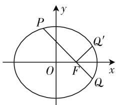
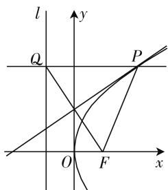

# 平几手段巧切入,解几问题妙破解

# 山东省博兴县第三中学 宋俊峰

解析几何是高中数学中的重要知识点之一,也是历年高考中的重点与难点之一,通过平面直角坐标系,运用代数法来研究相应的几何问题,偏重于代数运算,对数学运算能力的要求比较高.而实际上,解析几何问题的本质还是平面几何问题,少不了平面几何中的直观形象与逻辑推理.在破解具体问题时,有效把握解析几何的图形特征,挖掘图形相关的几何性质,利用平面几何知识来处理,多一点思考,少一点运算,优化解题过程,达到事半功倍的效果.

下面结合2020年高考数学中的圆锥曲线真题,实例展示平面几何的手段切入,巧妙借助平面几何中的角、直线、三角形以及圆的相关知识,合理破解一些相应的解析几何问题,抛砖引玉,以期为高三复习与备考提供些许帮助.

# 一、借助角的几何性质切入

解析几何问题中常用的角的几何性质包括:角的关系与大小,角的几何性质,角的对称性与变化等.巧妙借助平面几何中的角的几何性质,可以合理确定角的大小、直线的倾斜角等相关问题.

例 1 （2020 年上海卷第 10 题）已知椭圆 $C: \frac{x^{2}}{4} + \frac{y^{2}}{3} = 1$ ，直线 l 经过椭圆的右焦点 F，交椭圆 C 于 P, Q 两点（点 P 在第二象限），若点 Q 关于 x 轴对称的点为 $Q'$ ，且满足 $PQ \perp FQ'$ ，则直线 l 的方程为 \_\_\_\_.

分析: 数形结合, 利用平面几何中点的对称性以及直线的垂直关系, 得以确定相应的角的大小, 进而直观确定直线 l 的倾斜角, 结合斜率的求解以及直线的点斜式方程来确定直线的方程.

解析: 如图 1 所示, 结合对称性可知 $\angle QFx = \angle Q'Fx$ , 由于 $PQ \perp FQ'$ , 可得 $\angle QFx = \angle Q'Fx = 45^{\circ}$ , 则知直线 l 的倾斜角为 $135^{\circ}$ , 可得直线 l 的斜率 k = $\tan135^{\circ} = -1$ . 又 $F(1,0)$ , 可得直线 l 的方程为 $y = -(x-1)$ , 即 $x + y - 1 = 0$ .

故填答案: $x+y-1=0.$

text_image

P
O
F
Q'
x
y
Q

图 1

点评:通过数形结合,结合平面几何中角的几何性质,利用圆锥曲线中的点的对称性以及两直线的垂直关系来确定相应的角的大小,直观形象,合理转化,从而大大减少解题过程中的运算量,操作更加简单快捷.

# 二、借助直线的几何性质切入

解析几何问题中常用的直线的几何性质包括: 平行线或垂线的性质, 与三角形、梯形等有关的中位线定理, 平行线分线段成比例定理以及平行线与垂线的关系等. 巧妙借助直线的几何性质, 转化对应的角(倾斜角)、位置关系或直线的斜率等相关问题.

例 2 （2020 年天津卷第 7 题）设双曲线 C 的方程为 $\frac{x^{2}}{a^{2}} - \frac{y^{2}}{b^{2}} = 1 (a > 0, b > 0)$ ，过抛物线 $y^{2} = 4x$ 的焦点和点 $(0, b)$ 的直线为 l。若 C 的一条渐近线与 l 平行，另一条渐近线与 l 垂直，则双曲线 C 的方程为（）。

A. $\frac{x^{2}}{4}-\frac{y^{2}}{4}=1$

B. $x^{2} - \frac{y^{2}}{4} = 1$

C. $\frac{x^{2}}{4}-y^{2}=1$

D. $x^{2} - y^{2} = 1$

分析:结合平面几何的性质,在平面内两条直线分别与同一条直线平行、垂直,那么这两条直线垂直,借助垂直关系的转化以及直线的斜率公式来确定相应的参数值,进而得以确定双曲线的方程.

解析:由题可得抛物线 $y^{2}=4x$ 的焦点 $F(1,0)$ ，而直线 l 与双曲线 C 的一条渐近线平行，另一条渐近线垂直，则知双曲线 C 的两条渐近线垂直，所以 $\frac{b}{a}$ .

$\left(-\frac{b}{a}\right) = -1$ ，可得 $a = b$ ，从而直线 $l$ 的斜率 $k = \frac{b - 0}{0 - 1} = -\frac{b}{a} = -1$ ，解得 $b = 1$ ，则知 $a = b = 1$ ，所以双曲线 $C$ 的方程为 $x^{2} - y^{2} = 1$

故选 D.

点评:通过数形结合与转化,利用平面几何中直线的几何性质构建同一平面内两直线间的位置关系,从而合理结合解析几何中的相关知识来分析与处理.注意同一平面的几何背景,合理转化,巧妙应用.

# 三、借助三角形的几何性质切入

解析几何问题中常用的三角形的几何性质包括：特殊三角形的性质等. 巧妙借助三角形的几何性质，合理确定对应的角相等，对应的边相等(或成比例)，对应的边满足勾股定理等相关问题.

例 3 （2020 年北京卷第 7 题）设抛物线的顶点为 O，焦点为 F，准线为 l. P 是抛物线上异于 O 的一点，过 P 作 $PQ \perp l$ 于 Q，则线段 FQ 的垂直平分线（）.

A. 经过点 O

B. 经过点 $P$

C. 平行于直线 $OP$

D. 垂直于直线 $OP$

text_image

l
y
Q
P
O
F
x

图2

分析:通过抛物线的定义的转化得到两线段的长度相等,进而确定 $\triangle PQF$ 为等腰三角形,结合平面几何中等腰三角形的几何性质,进而得以确定线段 FQ 的垂直平分线必经过对应三角形的顶点 P.

解析: 根据抛物线的定义可知 PQ = PF，则知 $\triangle PQF$ 为等腰三角形，那么结合平面几何的性质可知，线段 FQ 的垂直平分线必经过点 P.

故选 B.

点评:通过数形结合,利用抛物线的定义的转化来确定三角形的特征,并结合平面几何中三角形的几何性质来转化与应用.整个解答过程直观简捷,处理起来更具特色,效果更为明显.

# 四、借助圆的几何性质切入

解析几何问题中常用的圆的几何性质包括: 圆的定义或性质, 直径所对的圆周角为直角, 圆幂定理, 垂径定理, 相交弦定理, 切线长定理或切割线定理等. 巧妙借助圆的几何性质, 确定圆的图形或方程, 相关线段之间的乘积关系或比例关系等相关问题.

例 4 （2020 年全国卷 I 文科第 11 题）设 $F_{1}, F_{2}$ 是双曲线 $C: x^{2} - \frac{y^{2}}{3} = 1$ 的两个焦点，O 为坐标原点，点 P 在 C 上且 $|OP| = 2$ ，则 $\triangle PF_{1}F_{2}$ 的面积为（）.

A. $\frac{7}{2}$

B. 3

C. $\frac{5}{2}$

D. 2

分析:根据条件确定焦点的坐标并设出点 P 的坐标,结合线段的长度以及平面几何中的圆的定义确定点 P 的坐标所满足的圆的方程,与双曲线 C 的方程联立,并结合三角形的面积公式来分析与求解.

解析: 由题可得 $F_{1}(-2,0)$ , $F_{2}(2,0)$ ，设 $P(x,y)$ . 由题可得 $\left|OF_{1}\right|=\left|OF_{2}\right|=\left|OP\right|=2$ ，结合圆的定义可得 $x^{2}+y^{2}=4$ ，与 $x^{2}-\frac{y^{2}}{3}=1$ 联立，解得 $\left|y\right|=\frac{3}{2}$ ，所以 $\triangle PF_{1}F_{2}$ 的面积为 $\frac{1}{2}\left|F_{1}F_{2}\right|\left|y\right|=\frac{1}{2}\times4\times\frac{3}{2}=3$ .

故选 B.

点评:结合题目条件的合理转化与应用,借助圆的几何性质与定义,从平面几何角度来切入,确定动点所满足的圆的方程,进而结合解析几何的相关条件来分析与求解.借助平面几何中的圆的几何性质或定义等来处理解析几何问题,思路巧妙,解法简单,简化运算,提升效益.

其实,借助平面几何切入破解解析几何问题,多一些几何直观,少一些代数运算,“形”与“数”有机结合,善于从直观图形的几何关系中挖掘几何本质,抓住几何内涵,借助角的大小、直线的平行或垂直、三角形、圆等平面几何的相关知识来处理解析几何问题,直观形象,有效拓展解题思路,缩小思维步骤,减少运算量,优化解题过程,提升数学能力,培养核心素养.