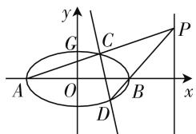
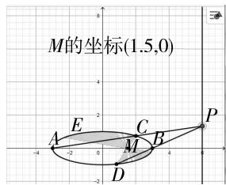
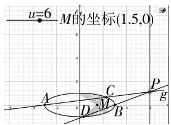
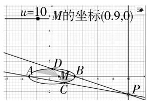
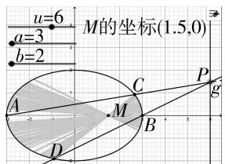
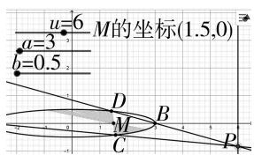
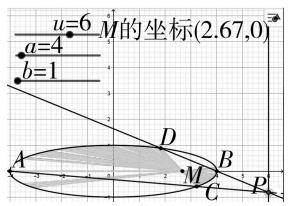
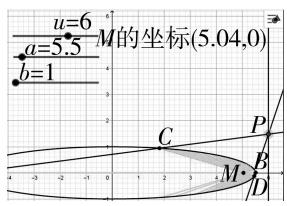
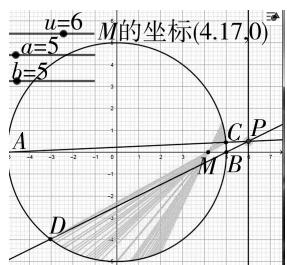

# 应用 GGB 探究解析几何定点问题\*

# ● 安徽省阜阳市太和中学 岳峻

章建跃先生在2010年提出中学数学教学的“三个理解”，又在2017年将“三个理解”发展为“四个理解”，增添了“理解技术”，并放在“理解教学”的前面。这足以说明数学实验的“可视化”、“动态化”对发展学生的数学核心素养的重要性。本文以2020年一道解析几何的试题作为载体，借助GeoGebra软件进行“可视化”实验探究，让静态数学“活”起来，进行深度教学的探讨，阐释对“理解技术，理解教学”的理解与尝试。

# 一、试题呈现

题目 （2020 年新高考卷 I 第 20 题）如图 1, 已知 A, B 分别为椭圆 $E: \frac{x^{2}}{a^{2}} + y^{2} = 1 (a >$ 1) 的左、右顶点, G 为 E 的上顶点, $\overrightarrow{AG} \cdot \overrightarrow{GB} = 8$ , P 为直线 x = 6 上的动点, PA 与 E 的另一交点为 C, PB 与 E 的另一交点为 D.

text_image

y
G
C
P
A
O
B
x
D

图1

(1) 求 E 的方程;  
(2) 证明: 直线 CD 过定点.

# 二、初探

# 1. 素养剖析

本题第1小题易求得椭圆E的方程为 $\frac{x^{2}}{9}+y^{2}=1$ ；第2小题的已知信息：①P为直线x=6上的动点；②PA与E的另一交点为C；③PB与E的另一交点为D.待证信息：④直线CD过定点.信息①源动点是点P，但“动”中有“定”，是在直线x=6上运动；信息②③产生两个次动点C,D，随着点P的运动而动；信息④是定点问题，而定点问题的求解思路是“特殊情形求定点，一般情形证定值”.由于A,B是定点，试想，若点P运动到特殊位置x轴上时，直线PA,PB都与x轴重合，直线CD自然也与x轴重合，由此可以预测：探求的动点必定在 x 轴上, 解决问题的首选方案自然是设直线 CD 的方程为 $x = my + n$ , 求出 n 值即可, 这正是官方参考答案给出的方法.

# 2. 实验探位

直线 CD 所过的动点在在 x 轴上什么位置呢？为此，通过 GeoGebra 软件作出试题的相应图形，我们拖动点 P 时，借助动态的几何直观，你会有何发现？直线CD 过定点 $\left(\frac{3}{2},0\right)$ ，截图如图 2 所示.

text_image

M的坐标(1.5,0)
-4 -2 0 4 0
A E C P
-2 -2 0 4 0
D
M

图2

# 3. 推理验证

既然基于 GeoGebra 软件的可视化实验已经探求出直线 CD 过定点 $\left(\frac{3}{2},0\right)$ ，那么我们没有必要再去严谨的推理“论证”，只需把定点坐标作为已知进行“验证”即可.

结论: 直线 CD 过定点 $\left(\frac{3}{2}, 0\right)$ .

证明: 设 $C(x_{1}, y_{1}), D(x_{2}, y_{2}), P(6, t)$ ，若 $t \neq 0$ ，直线 CD 的方程为 $x = my + \frac{3}{2}$ ，则 $\left\{\begin{aligned}\frac{x^{2}}{9} + y^{2} &= 1, \\ x &= my + \frac{3}{2},\end{aligned}\right.$ 消去 x，得 $(m^{2} + 9)y^{2} + 3my - \frac{27}{4} = 0$ 。由韦达定理知 $y_{1} + y_{2} = -\frac{3m}{9 + m^{2}}, y_{1}y_{2} = -\frac{27}{4(9 + m^{2})}$ 。而直线 PA 的方程为 $y = \frac{y_{1}}{x_{1} + 3}(x + 3)$ ，直线 PB 的方程为 $y = \frac{y_{2}}{x_{2} - 3}(x - 3)$ ，因为点 P 是直线 PA 与直线 PB 的交点，所以 $\frac{y_{1}}{x_{1} + 3}(x + 3) = \frac{y_{2}}{x_{2} - 3}(x - 3)$ 。由于 $\frac{x_{2}^{2}}{9} + y_{2}^{2}$

$= 1$ ，即 $y_{2}^{2} = -\frac{(x_{2} + 3)(x_{2} - 3)}{9}$ 所以 $\frac{y_1y_2}{x_1 + 3}(x + 3)$   
$= -\frac{x_2 + 3}{9} (x - 3)$ 即 $9y_{1}y_{2}(x + 3) + (x_{1} + 3)(x_{2} + 3)\cdot$

$(x-3)=0$ , 解之, 得 x=6, 即点 P 总在直线 x=6 上.

若 t=0，设直线 CD 的方程为 y=0，过点 $\left(\frac{3}{2},0\right)$ .综上, 直线 CD 过定点 $\left(\frac{3}{2}, 0\right)$ .

# 三、深度拓展

数学家波利亚指出：“当你找到第一个蘑菇后，要环顾四周，因为它们总是成堆生长的。”学习需要反思，思广则能活，思活则能深，思深则能透，思透则能明。试题解答完毕，我们不应满足于给出解答，止步不前，反思一下，如何解一题会一类呢？动点所在直线影响定点吗？椭圆的特征量是如何影响定点的？

# 1. 动点所在直线是否影响定点

打开 GeoGebra 软件, 创建动点所在直线的滑动条, 并拖动滑动条进行动态演示, 如图 3, 图 4, 观察动点所在直线是否影响直线 CD 所过的定点? 结合几何直观, 思考直线方程的位置与定点的位置的关系, 提出猜想, 并加以验证可知:

text_image

u=6 M的坐标(1.5,0)
A C
D M B P g

图3

text_image

u=10
M的坐标(0.9,0)

图 4

结论 1: 已知 A, B 分别为椭圆 $E: \frac{x^{2}}{9} + y^{2} = 1$ 的左、右顶点，P 为直线 x = u 上的动点，PA 与 E 的另一交点为 C, PB 与 E 的另一交点为 D，则直线 CD 过定点 $\left(\frac{9}{u}, 0\right)$ .

# 2. 椭圆的特征量 a, b 影响定点

分别创建椭圆的特征量 a, b 的滑动条, 不改变椭圆的长轴, 只改变短轴的长度, 进行动态演示, 如图 5, 图 6, 你会有何发现?

text_image

u=6
a=3
b=2
M的坐标(1.5,0)
A
C
P
g
D
M
B

图5

text_image

u=6
a=3
b=0.5
M的坐标(1.5,0)
D
B
C
P

图6

椭圆的特征量 b 不影响直线 CD 所过的定点.

在直线 x=u 不动的情况下, 针对于椭圆 $E:\frac{x^{2}}{9}+y^{2}=1$ 而言, 特征量 b 不影响直线 CD 所过的定点, 而结论 1 中定点的横坐标中的分子 9 恰好是椭圆中 $a^{2}$ 的值, 巧合, 抑或必然?

那么,只改变椭圆的长轴呢?椭圆的特征量 a 会影响直线 CD 所过的定点,如图 7,图 8.如何影响定点的坐标呢?

text_image

u=6
M的坐标(2.67.0)
a=4
b=1
A
D
B
C
P

图 7

text_image

u=6
a=5.5
b=1
M的坐标(5.04,0)
C
P
B
M
D

图8

结论2:已知A,B分别为椭圆 $E:\frac{x^{2}}{a^{2}}+\frac{y^{2}}{b^{2}}=1(a>b>0)$ 的左、右顶点,P为直线 $x=u(u>a)$ 上的动点,PA与E的另一交点为C,PB与E的另一交点为D,则直线CD过定点 $\left(\frac{a^{2}}{u},0\right)$ .

# 3. 类比到圆

既然椭圆的特征量 a, b 之中只有 a 会影响直线 CD 所过的定点, 试想, 椭圆是圆的仿射变换而得, 圆可以视为特殊的椭圆, 如图 9, 那么, 圆中又会有何结论呢?

text_image

u=6
a=5
b=5
M的坐标(4.17,0)
A
C
P
D
M
B

图9

结论 3: 已知 A, B 分别

为圆 $E: x^{2} + y^{2} = r^{2}$ 的左、右顶点，P 为直线 x = u 上的动点，PA 与 E 的另一交点为 C，PB 与 E 的另一交点为 D，则直线 CD 过定点 $\left(\frac{r^{2}}{u}, 0\right)$ .

# 四、本质的提炼

基于 GeoGebra 的可视化实验,我们得到以上几个结论,它们有何共性的本质特征呢?与圆锥曲线的极点、极线有联系吗?

圆锥曲线的极点、极线统一定义: 已知圆锥曲线 $\Gamma: Ax^{2} + Cy^{2} + 2Dx + 2Ey + F = 0$ ，则称点 $M(x_{0}, y_{0})$ 和 $l: Ax_{0}x + Cy_{0}y + D(x_{0} + x) + E(y_{0} + y) + F = 0$ 是圆锥曲线 $\Gamma$ 的一对极点和极线，亦即在圆锥曲线方程中，以 $x_{0}x$ 替换 $x^{2}$ ，以 $\frac{x_{0} + x}{2}$ 替换 x，另一变量也是如此，即可得到点 $M(x_{0}, y_{0})$ 的极线方程.

(下转第78页)

写作教师可以准确把握问题的症结,然后对症下药.

# 四、“数学写作”的评价标准

对于语文作文的评价通常以题意、内容、结构、语言、文体为重点，全面衡量，综合考虑。虽然，数学写作也是“作文”的一种特殊形式，但其功能指向与语文作文完全是两回事，因此，一定要立足数学写作的特点与目的，关注以下三个方面：

# 1. 是否表达“真实”的想法

数学到底是什么？是一串抽象的符号和公式，是枯燥拗口的文字描述，还是永无止境的解题？是一首诗歌、一则故事，还是一段人生？……“一千个读者就有一千个哈姆雷特”，不同的学生对于数学的想法肯定有所不同。数学写作是学生亲身经历的一种学习行为，其目的就是让学生把自己真实的想法自由地表达出来。只有反映学生真实情感的作品才有现实意义，教师才能从中获得有价值的信息。因此，数学写作中，没必要要求学生去参考或模仿他人，只要写出“真实”想法的作品就应该被认定为“合格”作品。

# 2. 是否散发“数学”的味道

数学写作应该围绕着数学学习的过程展开,无论最终作品的体裁形式是什么,唯有“数学”的味道不能缺位,这也是区别于一般文章的重要标志.数学的味道具体表现在:写作内容是否跟数学与数学学习有关、表述问题是否理性、推理论证是否严密、文章的观点是否体现了数学精神等,数学味道浓的作品可以被认定为“成功”的作品.

# 3. 是否展现“创新”的风采

数学写作能否吸引人、能否凸显学术与文学价值，则取决于数学写作的“创新”程度。比如，在数学写作中展现题目解法上的创新：一题多解、多题一解、一题多变等；在数学写作中展现数学发现：对新的数学定理、公式、结论进行证明与推广等；在数学写作中展现文学素养：用寓言故事、诗歌、谜语、顺口溜等新的文学形式来表达数学观点。“创新”是数学写作的高级目标，富有创新的作品应该为认定为“优秀”作品。

“文献阅读与数学写作”是新教材编写上的一大创举，尽管它在考试中不作要求，但广大一线教师完全可以把“文献阅读与数学写作”进行推广与应用，使它成为撬动教学方式与学生学习方式转型的一个支点。

# 参考文献：

[1] 汪晓勤, 柳笛. 数学写作在美国 [J]. 数学教育学报, 2007(8).  
[2] 吴宏, 张珂, 刘广军. 数学写作融入初中数学教学的实验研究 [J]. 数学教育学报, 2019(10).  
[3] 中华人民共和国教育部. 普通高中数学课程标准 (2017 年版) [S]. 北京: 人民教育出版社, 2018. W

# (上接第73页)

对于曲线 $E: \frac{x^{2}}{a^{2}} + \frac{y^{2}}{b^{2}} = 1 (a > b > 0)$ 而言，若 $M\left(\frac{a^{2}}{u}, 0\right)$ 作为极点，其对应的极线方程为 $\frac{\frac{a^{2}}{u} \cdot x}{a^{2}} + \frac{0 \cdot y}{b^{2}} = 1$ ，即直线 x = u，恰为动点 P 的轨迹，反之亦然.

若点 P 为极线 l 上的动点, PA 与 E 的另一交点为 C, PB 与 E 的另一交点为 D, 则直线 CD 过极点 $M\left(\frac{a^{2}}{u}, 0\right)$ . 反之, 过极点 M 的直线与椭圆交于 C, D, 则直线 AC, BD 的交点 P 的轨迹就是其对应极线.

对于抛物线 $E: y^{2} = 2px (p > 0)$ 、双曲线 $E: \frac{x^{2}}{a^{2}} - \frac{y^{2}}{b^{2}} = 1 (a > 0, b > 0)$ 而言，你能应用极点、极线的知识，命制一个定点问题或定直线的试题吗？

# 五、GeoGebra 让数学教学如虎添翼

GeoGebra 软件正是数学教学中的“诗意催化剂”，是数学深度教学的“隐形的翅膀”。GeoGebra 软件是一套高效处理数学学科所需所有功能的开放源码“可视化”软件，其超越几何画板的表现及其全面的功能势必带来一场“数学可视化”教学的变革。GeoGebra 软件可以深入数学学科内部，直观地揭示“庐山真面目”，“诱导”学生领悟其数学本质，使得学生“探”中“叹”，“演”中“研”，洞察数学本质，锤炼思维品质，实现从“向书本学数学”、“向教师学数学”走向“向技术学数学”，做到“脑中有形（亦即数学抽象、直观想象），心中有数（亦即逻辑推理、数学运算），手中有术（亦即数学建模、数据分析）”。

# 参考文献：

[1] 岳峻. 基于 geogebra 的“数学可视化”助力探究教学 [J]. 中学数学 (上), 2020(3). W