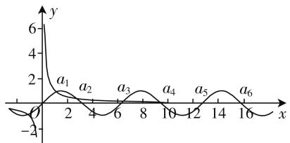
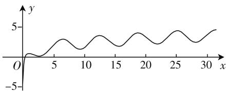
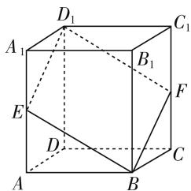

# 柳暗花明,别有洞天

—— 创新选择题问题

● 安徽省灵璧中学 赵言喜

组合型选择题、多选型选择题有别于单选型选择题，是近年高考以及新高考中出现的两类创新性、开放性选择题。组合型选择题通过“组合”，结合单选型选择题的特点，巧妙把多选题与开放题的特征加以融合，相互联系又相互制约；多选型选择题通过“发散”，结合题设与结论之间的联系，整合多层面的知识，系统性更高，知识点更全面。这两类选择题，可以有效考查各水平层次考生的数学综合知识与综合能力，有利于提高高考的区分性与选拔性。下面结合高考真题与模拟题，就组合型选择题、多选型选择题的类型与应用加以实例剖析。

# 一、组合型选择题

组合型选择题是根据题目条件中给出的多个结论,准确判断其中正确结论的编号、正确结论的个数、真假结论的区分对比等,结合题目给出所对应的选项,得以正确选择.

例 1 （2019 年全国卷 I 理科第 11 题）关于函数 $f(x)=\sin|x|+|\sin x|$ 有下述四个结论：

① $f(x)$ 是偶函数；  
② $f(x)$ 在区间 $\left(\frac{\pi}{2},\pi\right)$ 上单调递增；  
③ $f(x)$ 在 $[-π,π]$ 上有4个零点；  
④ $f(x)$ 的最大值为2.

其中所有正确结论的编号是( ).

A. ①②④

B.②④

C.①④

D. ①③

分析:结合三角函数解析式,通过函数奇偶性的定义入手,得以判断结论①的正确性,并利用各选项之间的关系加以合情推理,利用结论④的真假分析来达到准确判断的目的.

解析: 因为 $f(-x) = \sin |-x| + |\sin (-x)| = \sin |x| + |\sin x| = f(x)$ ，所以 $f(x)$ 是偶函数，①正确，观察各选项，选项 B 中没有结论①，故排除选项 B；而选项 B 中含有结论②④，又该选项被排除，说明结论②④不可能都正确，而选项 A 中含有结论②④，故应排除选项 A; 那么只要判断结论 ③④ 的真假, 进而来确定选项 C、D 即可, 下面对结论 ④ 进行判断: 结合正弦函数的性质可知 $\sin|x| \leqslant 1, |\sin x| \leqslant 1$ , 则有 $f(x) = \sin|x| + |\sin x| \leqslant 2$ , 可知 $f(x)$ 的最大值为 2, 则结论 ④ 正确.

故选 C.

点评:解决此类判断正确结论编号的组合型选择题问题,经常不必对所有结论的正确性进行逐个判断.破解时,要结合单选题的“组合”特征,若其中任意一个结论正确,则不包含该结论的选项被排除;反之,若其中任意一个结论错误,则包含该结论的选项被排除.合理分析选项中的特征,简化逐项分析过程,提高效率.

例 2 （2020 届浙江省嘉兴市高三下学期 5 月教学测试数学试题 • 10）设函数 $f(x)=\ln x+\cos x$ 的极值点从小到大依次为 $a_{1}, a_{2}, a_{3}, \cdots, a_{n}, \cdots$ ，若 $c_{n}=a_{n+1}-a_{n}, d_{n}=f(a_{n+1})-f(a_{n})$ ，则下列命题中正确的个数是（）.

① 数列 $\{c_{n}\}$ 为单调递增数列；  
② 数列 $\{d_{n}\}$ 为单调递减数列；  
③ 存在常数 $\lambda \in R$ ，使得对任意正实数 t，总存在 $n_{0} \in N^{*}$ ，当 $n > n_{0}$ 时，恒有 $\left| c_{n} - \lambda \right| < t$ ;  
④ 存在常数 $\mu \in R$ ，使得对任意正实数 t，总存在 $n_{0} \in N^{*}$ ，当 $n > n_{0}$ 时，恒有 $|d_{n} - \mu| < t$ .

A. 4

B. 3

C. 2

D. 1

分析:通过函数 $f(x)$ 的求导,分解出两个函数,利用函数图像来分析命题①和③的真假问题;又结合函数 $f(x)$ 的图像,结合极限的求解与分析来分析命题②和④的真假问题.

解析:由 $f(x)=\ln x+\cos x$ ，得 $f'(x)=\frac{1}{x}-\sin x$ .

分别作出函数 $y=\frac{1}{x}$ 和 $y=\sin x$ 的图像, 如图 1 所示, 因为 $c_{1}<c_{2}, c_{2}>c_{3}$ , 所以命题①错误;

而 $\lim_{n\to\infty}(c_n-\pi)=0$ ，所以命题③正确；

line

| x  | y    |
|----|------|
| 0  | 0    |
| 2  | 2    |
| 4  | 0    |
| 6  | 2    |
| 8  | 0    |
| 10 | 2    |
| 12 | 0    |
| 14 | 2    |
| 16 | 0    |

图1  

line

| x  | y  |
|----|----|
| 0  | 0  |
| 5  | ~1 |
| 10 | ~0 |
| 15 | ~1 |
| 20 | ~0 |
| 25 | ~1 |
| 30 | ~0 |

图 2

而函数 $f(x)=\ln x+\cos x$ 的图像如图 2 所示, 因为 $d_{1}<0, d_{2}>0, d_{3}<0$ , 所以命题②错误;

又 $d_{n} = f(a_{n + 1}) - f(a_{n}) = \ln a_{n + 1} - \ln a_{n} + \cos a_{n + 1}$ $-\cos a_{n} = \ln \frac{a_{n + 1}}{a_{n}} +\cos a_{n + 1} - \cos a_{n}$ ，因为 $\lim_{n\to \infty}\frac{a_{n + 1}}{a_n} = 0$ $\cos a_{n + 1} - \cos a_n\rightarrow 2$ （或者-2），所以命题 $④$ 错误.

综上所述,仅命题 ③ 正确,即正确的命题只有 1 个.

故选 D.

点评: 解决此类判断正确结论个数的组合型选择题问题, 根据题目条件逐个判断题目中所给结论的真假情况, 进而确定正确命题个数, 做出正确的选择. 此类问题的本质就是从涉及的多个命题中进行逐项分析, 把所有正确的结论都判断出来. 合理分析相关命题的真假, 逐个击破, 难度较大.

# 二、多选型选择题

多选型选择题是根据题目条件中给出的多个结论(一般四个),抓住一个基本知识点加以展开或通过创新定义加以综合应用,进而把所有满足条件的结论都选择出来,不能遗漏也不能增加.

例 3 （2020 届山东省新高考质量测评联盟高三 5 月联考数学试题 · 11）已知棱长为 1 的正方体 ABCD— $A_{1}B_{1}C_{1}D_{1}$ ，过对角线 $BD_{1}$ 作平面 $\alpha$ 交棱 $AA_{1}$ 于点 E，交棱 $CC_{1}$ 于点 F，以下结论正确的是（）.

A. 四边形 $BFD_{1}E$ 不一定是平行四边形  
B. 平面 $\alpha$ 分正方体所得两部分的体积相等  
C. 平面 $\alpha$ 与平面 $DBB_{1}$ 不可能垂直  
D. 四边形 $BFD_{1}E$ 面积的最大值为 $\sqrt{2}$

分析:由平行平面的性质可判断选项 A 错误;利用正方体的对称性可判断选项 B 正确;当 E,F 为棱中点时,通过线面垂直可得面面垂直,可判断选项 C 错误;当 E 与 A 重合,F 与 $C_{1}$ 重合时,四边形 $BFD_{1}E$ 的面积最大,且最大值为 $\sqrt{2}$ ,可判断结论 D 正确.

解析:如图3所示,对于选项A,因为平面 $ABB_{1}A_{1}$ // 平面 $CC_{1}D_{1}D$ ,平面 $BFD_{1}E \cap$ 平面 $ABB_{1}A_{1} = BE$ , 平面 $BFD_{1}E \cap$ 平面 $CC_{1}D_{1}D = D_{1}F$ ,所以 $BE \parallel D_{1}F$ .同理可证 $D_{1}E \parallel BF$ ,所以四边形$BFD_{1}E$ 是平行四边形,故选项 A 错误.

text_image

D₁
A₁
B₁
C₁
E
D
F
C
A
B

图3

对于选项 B, 由正方体的对称性可知, 平面 $\alpha$ 分正方体所得两部分的体积相等, 故选项 B 正确.

对于选项 C, 在正方体 $ABCD-A_{1}B_{1}C_{1}D_{1}$ 中, 有 $AC \perp BD, AC \perp BB_{1}$ , 又 $BD \cap BB_{1}=B$ , 所以 $AC \perp$ 平面 $DBB_{1}$ . 当 E, F 分别为棱 $AA_{1}, CC_{1}$ 的中点时, 有 $AC \parallel EF$ , 则 $EF \perp$ 平面 $DBB_{1}$ . 又因为 $EF \subset$ 平面 $BFD_{1}E$ , 所以平面 $BFD_{1}E \perp$ 平面 $DBB_{1}$ , 故选项 C 错误.

对于选项 D, 四边形 $BFD_{1}E$ 在平面 ABCD 内的投影是正方形 ABCD, 当 E 与 A 重合, F 与 $C_{1}$ 重合时, 四边形 $BFD_{1}E$ 的面积有最大值, 此时 $S = D_{1}E \cdot BE = \sqrt{2} \times 1 = \sqrt{2}$ , 故选项 D 正确.

故选 BD.

点评: 解决此类以一个基本知识点展开的多选型选择题问题, 根据题目所对应的知识点, 从多个角度、多个层面来分析与判断, 结合判断正确的情况把正确的选项都选出来. 此类问题的本质就是从每个基本知识点入手, 结合各相应的结论加以逐项分析, 确定所在正确的结论. 每一选项都要加以准确判定, 逐个分析, 难度较大.

解决组合型选择题或多选型选项题,实质还是多重选择题问题.破解此类选择题时,可以逐项分析,可以选项推理,也可以特殊验证,抓住不同问题的实质加以合理转化,巧妙应用.此类选择题进一步拓展思维,为考生提供了更广的发挥空间,深入考查考生的数学思维与逻辑推理,对考生的考试区分度更为精确,对于数学知识、数学能力与数学素养的考查要求都非常高.

# 参考文献：

[1] 任子朝, 赵轩. 高考试题创新设计的研究与实践 [J]. 中学数学教学参考(上), 2019(7). F