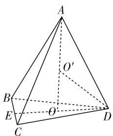
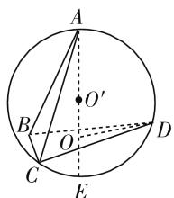
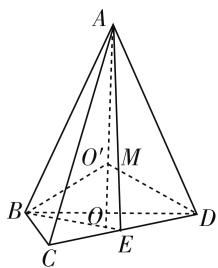
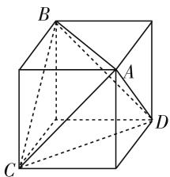
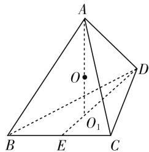
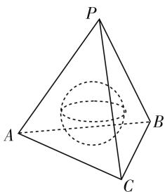

# 棱锥内切球问题的解法与命题探究

# ● 安徽省六安第一中学 熊海平

球与简单几何体的切接问题, 是立体几何中最常见的一类问题, 也是高考命题的热点问题. 相对而言, 球与柱体的切接问题比较简单, 如正方体的外接球的直径是该正方体对角线, 而正方体的内切球的直径是该正方体的棱长. 而椎体内切球问题的解法较为复杂, 本文就棱锥的内切球问题加以探究.

引例 如果一个球的内接正四面体的棱长为 $\sqrt{2}$ , 那么这个球的表面积是( ).

A. $3\pi$

B. $\frac{4\pi}{3}$

C. $2\pi$

D. $\frac{9\pi}{2}$

分析:欲求球的表面积,只需求球的半径.因而,如何通过已知条件求出半径R是关键.

思路 1: 如图 1 所示, 可否寻求等量关系式求出 R 呢?

解法 1: 设 $O'A = R$ ，则 $O'D = R, OO' = x$ ，由于 $DE = \frac{\sqrt{3}}{2} \times$ $\sqrt{2} = \frac{\sqrt{6}}{2}$ ，因此 $OD = \frac{2}{3} \times \frac{\sqrt{6}}{2} = \frac{\sqrt{6}}{3}$ ，从而可得

text_image

A
O'
B
E
O
C
D

图1

$\left\{ \begin{array}{l} AD^{2} = OD^{2} + AO^{2}, \\ O'D^{2} = OD^{2} + O'O^{2}, \end{array} \right.$ 即 $\left\{ \begin{array}{l} 2 = \left( \frac{\sqrt{6}}{3} \right)^{2} + (R + x)^{2}, \\ R^{2} = \left( \frac{\sqrt{6}}{3} \right)^{2} + x^{2}, \end{array} \right.$ 解

得 $R = \frac{\sqrt{3}}{2}$ , 故 $S_{\text{球}} = 4\pi R^2 = 3\pi$ , 选 A.

评析:有明确的目标意识来引导,准确地寻找等量关系,便可顺利求解.

思路 2: 若能求出直径 2R 也行!

解法 2: 如图 2 所示, 延长 AO 与球面交于 E, 则 AE 为球的直径,连接 DE，则 $\angle ADE = 90^{\circ}$ . 因为 $OD = \frac{\sqrt{6}}{3}$ , $AD = \sqrt{2}$ , 所

text_image

A
O'
B
O
C
E
D

图2

$$
\text {以} O A = \sqrt {A D ^ {2} - O D ^ {2}} = \sqrt {2 - \left(\frac {\sqrt {6}}{3}\right) ^ {2}} = \frac {2}{3} \sqrt {3}.
$$

又由 $\triangle AOD$ 相似于 $\triangle ADE$ 知， $\frac{AE}{AD} = \frac{AD}{AO}$ ，因为 $2R=AE=\frac{2}{\frac{2\sqrt{3}}{3}}$ , 所以 $R=\frac{\sqrt{3}}{2}$ , $S_{球}=3\pi$ , 故选 A.

评析:充分地运用平几知识,解法流畅自然,从而可以看出应注重平面几何知识在立体几何中的运用,以便提高解题速度和质量.

思路 3: 仔细观察知球心 $O'$ 恰好是正四面体各面上高的交点.

解法 3: 如图 3 所示, A、B 在对面的射影分别为 O、M, AO 与 BM 的交点为 $O'$ , 因为 O、M 是所在三角形的中心, 所以 BO 与 AM的交点是 $CD$ 的中点，因为 $AE = \frac{\sqrt{3}}{2} \times \sqrt{2} = \frac{\sqrt{6}}{2}, OE =$ $ME=\frac{\sqrt{3}}{6}\times\sqrt{2}=\frac{\sqrt{6}}{6},AM=\frac{\sqrt{3}}{3}\times\sqrt{2}=\frac{\sqrt{6}}{3},所以AO=$ $\sqrt{AE^{2}-OE^{2}}=\frac{2}{3}\sqrt{3}$ ，由于 $O^{\prime},O,E,M$ 四点共圆，

text_image

A
O
M
B
O
C
E
D

图3

因此 $AO'\cdot AO=AM\cdot AE$ ，所以 $AO'=\frac{\frac{\sqrt{6}}{3}\cdot\frac{\sqrt{6}}{2}}{\frac{2\sqrt{3}}{3}}=\frac{\sqrt{3}}{2}$

$S_{球}=3\pi$ , 故选 A.

评析:此解法再一次体现了平面几何知识在立体几何中的巨大作用,充分地显示了平面几何的威力.这要求我们必须深挖隐含条件才能实现.

思路 4: 通过补形法把正四面体还原成正方体.

解法 4: 如图 4 所示, 正四面体 ABCD 恰好是由棱长为 1 的正方体切割得到, 因此, 这正四面体的外接球与正方体的外接球是同一个球, 此球的直径为正方体

对角线的 $\sqrt{3}$ 倍,故 $R=\frac{\sqrt{3}}{2},S_{球}=4\pi R^{2}=3\pi$ ,选A.

评析: 如此运用整体构造联系的观点, 解法气势磅礴, 令人回肠荡气, 堪称一绝, 解法简练之极, 深刻地揭示出其本质特征.

natural_image

3D geometric diagram of a cube with labeled vertices A, B, C, D and internal diagonals (no text or symbols)

图4

以上几种解法,虽然各有千秋,但都有一个共同特点,紧紧抓住球心与切点的连线垂直于锥体的一个面的几何特征,从而把问题解决.

然而,在考试中,对这个问题是如何命题的呢?下面我们再来看几个相类似的变式题.

变式 1: 设正四面体中, 第一个球是它的内切球, 第二个球是它的外接球, 求这两个球的表面积之比及体积之比.

解析: 此题求解的第一个关键是搞清两个球的半径与正四面体的关系, 第二个关键是两个球的半径之间的关系, 依靠体积分割的方法来解决的.

如图 5, 正四面体 ABCD 的中心为 O, $\triangle BCD$ 的中心为$O_{1}$ ，则第一个球半径为正四面体的中心到各面的距离，第二个球的半径为正四面体中心到顶点的距离.

text_image

A
O
D
B
E
C
O₁

图5

设 $OO_{1}=r, OA=R$ ，正四面体的一个面的面积为 S。依题意得 $V_{A-BCD}=\frac{1}{3}S(R+r)$ ，又 $V_{A-BCD}=4V_{O-BCD}=4\times\frac{1}{3}r\cdot S$ ，所以 $R+r=4r$ ，即 R=3r。

所以 $\frac{内切球的表面积}{外接球的表面积}=\frac{4\pi r^{2}}{4\pi R^{2}}=\frac{1}{9}$ ,

$\frac{\text{内切球的体积}}{\text{外接球的体积}} = \frac{\frac{4}{3}\pi r^3}{\frac{4}{3}\pi R^3} = \frac{1}{27}.$

点评: 正四面体与球的接切问题, 可通过线面关系证出, 内切球和外接球的两个球心是重合的, 为正四面体高的四等分点, 即定有内切球的半径 $r=\frac{1}{4}h$ (h 为正四面体的高), 且外接球的半径 R=3r.

变式 2: 如图 6 所示, 半径为 1 的球内切于正三棱锥 P-ABC 中, 则此正三棱锥体积的最小值为 \_\_\_\_.

解析:设正三棱锥 P-ABC 的底面积为 $S_{0}$ ，侧面积为 3S，高为 h，斜高为 $h'$ ，底面边长为 a，内切球的半径为 r. 由等积转换得 $V=\frac{1}{3}\cdot$

$$
S _ {0} \cdot h = \frac {1}{3} \cdot S _ {0} \cdot r + 3 \cdot \frac {1}{3} \cdot
$$

$S \cdot r$ ，即 $h = 1 + \frac{3S}{S_0}$ ，所以

$h-1=\frac{3h'}{\frac{\sqrt{3}}{2}a}$ ，所以 h-1=

text_image

P
A
B
C

图6

$\frac{2\sqrt{3}\cdot\sqrt{h^{2}+\frac{a^{2}}{12}}}{a}$ ，所以 $(h-1)^{2}=\frac{12h^{2}+a^{2}}{a^{2}}$ ，解得 $a^{2}=\frac{12h^{2}}{h^{2}-2h}$ ，于是 $V=\frac{1}{3}\cdot\frac{\sqrt{3}}{4}a^{2}\cdot h=\frac{\sqrt{3}h^{2}}{h-2}(h>2)$ ， $V'=\frac{\sqrt{3}(h^{2}-4h)}{(h-2)^{2}}$ 。令 $V'=0$ ，得h=4，故由函数的单调性知，当h=4时， $V_{\min}=8\sqrt{3}$ 。

点评:本题将锥体的体积公式、内切球和函数的最值综合在一起考查,具有一定难度.解答本题先利用等体积方法得到等式 $h=1+\frac{3S}{S_{0}}$ ,再变形得到 $a^{2}=\frac{12h^{2}}{h^{2}-2h}$ ,建立三次函数 $V=\frac{1}{3}\cdot\frac{\sqrt{3}}{4}a^{2}\cdot h=\frac{\sqrt{3}h^{2}}{h-2}(h>2)$ ,再求导得 $V'=\frac{\sqrt{3}(h^{2}-4h)}{(h>2)^{2}}$ ,令 $V'=0$ ,得h=4,故当h=4时, $V_{\min}=8\sqrt{3}$ .

变式 3: 若底边长为 2 的正四棱锥恰内切一半径为 $\frac{1}{2}$ 的球, 则此正四棱锥的体积是 \_\_\_\_.

解析:设 $\theta$ 是正四棱锥的底面与侧面所成二面角的平面角,则 $\tan\frac{\theta}{2}=\frac{1}{2}$ .

于是， $\tan \theta = \frac{2\tan\frac{\theta}{2}}{1 - \tan^2\frac{\theta}{2}} = \frac{4}{3}.$

故正四棱锥高为 $1 \times \tan\theta = \frac{4}{3}$ .

所以,此四棱锥的体积是 $\frac{1}{3}\times2^{2}\times\frac{4}{3}=\frac{16}{9}$ .

点评:本题棱锥的内切球问题利用三角变换来求解,体现了这类问题命题空间的广阔性.

由此可见，对棱锥的内切球问题的命题不仅仅局限于立体几何本身，还可以向函数与导数，三角函数等内容延伸，这类问题同样也要引起大家的关注. W