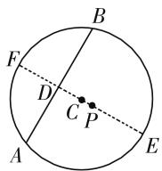

# 细心挖掘,前世今生

——谈 2020 年江苏卷第 14 题

● 江苏省南京市宁海中学 汤池武

苏联数学教育家奥加涅相说过：“必须重视很多习题潜在着进一步扩展其数学功能、发展功能和教育功能的可行性。”在提倡新课程高考改革与创新的时代，越来越多的高考真题、竞赛试题以及模拟题等都呈现出回归历年高考真题的趋势，命题来源于以往高考中的相关真题，通过改编、变形、转化、深入、创新、拓展应用等手段与方式，引导历年高考真题的典型应用，有效承载教学与示范，拓展思维，探究深入，成为高考命题的一种新导向。

# 一、真题呈现

高考在线:(2020年江苏卷第14题)在平面直角坐标系xOy中,已知 $P\left(\frac{\sqrt{3}}{2},0\right)$ ,A,B是圆 $C:x^{2}+\left(y-\frac{1}{2}\right)^{2}=36$ 上的两个动点,满足PA=PB,则 $\triangle PAB$ 面积的最大值是\_\_\_\_.

此题以平面解析几何为问题背景,通过定圆上的两个动点以及一个定点的给出,来确定相应的三角形面积的最值问题.“动”与“静”相结合,“定值”与“最值”相融合,很好地考查函数与方程思想、化归与转化思想、抽象概括能力、应用意识,以及逻辑推理、数学运算、直观想象等核心素养.破解该问题,关键是合理借助平面几何与解析几何的图形直观,通过合理转化为函数问题或三角函数问题,通过导数、不等式等方式切入来分析与求解对应的最值问题.

# 二、真题破解

# 思维视角一:导数思维

解法 1: (函数法) 如图 1 所示, 作 PC 所在的直径 EF, 交 AB 于点 D, 结合对称性可得 PA = PB, 此时$CA = CB = r = 6$ ，且 $PC\perp AB$ ，要使得 $\triangle PAB$ 面积最

  
图1

大，数形结合可知 $P, D$ 位于圆心 $C$ 的两侧，设 $CD = t \in (0,6)$ ，结合条件可得 $PC = \sqrt{\left(\frac{\sqrt{3}}{2} - 0\right)^2 + \left(0 - \frac{1}{2}\right)^2} = 1$ ，则有 $PD = 1 + t$ ，而 $AB = 2AD = 2\sqrt{36 - t^2}$ ，所以 $S_{\triangle PAB} = \frac{1}{2} \cdot AB \cdot PD = (1 + t)\sqrt{36 - t^2}$ . 构造函数 $f(t) = (1 + t) \cdot \sqrt{36 - t^2}, t \in (0,6)$ ，求导可得 $f'(t) = \sqrt{36 - t^2} - \frac{(1 + t)t}{\sqrt{36 - t^2}}$ . 令 $f'(t) = 0$ ，解得 $t = 4$ 或 $t = -\frac{9}{2}$ （舍去），而函数 $f(t)$ 在区间 $(0,4)$ 上单调递增，在区间 $(4,6)$ 上单调递减，所以 $f(t)_{\max} = f(4) = 10\sqrt{5}$ ，即 $\triangle PAB$ 面积的最大值是 $10\sqrt{5}$ .

故填答案: $10\sqrt{5}$ .

点评: 解决此类线圆问题, 关键是引入弦心距这一参数 t, 利用弦心距这一参数 t 来表示对应的三角形面积, 从而建立起相应的函数关系式, 借助导数法, 利用函数求导处理, 结合函数的单调性与极值来确定相应的三角形面积的最值问题.

解法2:(三角函数法)如图1所示,作PC所在的直径EF,交AB于点D,结合对称性可得PA=PB,此时CA=CB=r=6,且 $PC\perp AB$ ,要使得 $\triangle PAB$ 面积最大,数形结合可知P,D位于圆心C的两侧,设 $\angle BCD=\theta\in\left(0,\frac{\pi}{2}\right)$ ,则有 $CD=6\cos\theta,BD=6\sin\theta$ ,结合条件可得 $PC=\sqrt{\left(\frac{\sqrt{3}}{2}-0\right)^{2}+\left(0-\frac{1}{2}\right)^{2}}=1$ ,则有 $PD=1+6\cos\theta$ ,而 $AB=2BD=12\sin\theta$ ,所以 $S_{\triangle PAB}=\frac{1}{2}\cdot AB\cdot PD=6\sin\theta(1+6\cos\theta)=6\sin\theta+18\sin2\theta.$ 构造函数 $f(\theta)=6\sin\theta+18\sin2\theta,\theta\in\left(0,\frac{\pi}{2}\right)$ ，求导可得 $f'(\theta)=6\cos\theta+36\cos2\theta=6(12\cos^{2}\theta+\cos\theta-6)$ . 令

$f'(\theta)=0$ , 解得 $\cos\theta=\frac{2}{3}$ 或 $\cos\theta=-\frac{3}{4}$ (舍去), 此时 $\sin\theta=\sqrt{1-\cos^{2}\theta}=\frac{\sqrt{5}}{3}$ ，而函数 $f(\theta)$ 在区间 $\left(0,\arccos\frac{2}{3}\right)$ 上单调递增，在区间 $\left(\arccos\frac{2}{3},\frac{\pi}{2}\right)$ 上单调递减，所以 $f(\theta)_{\max}=f\left(\arccos\frac{2}{3}\right)=10\sqrt{5}$ ，即 $\triangle PAB$ 面积的最大值是 $10\sqrt{5}$ .

故填答案: $10\sqrt{5}$ .

点评: 解决此类线圆问题, 关键是引入圆心角这一参数, 利用三角函数的定义来确定对应的线段长度, 进而借助三角函数来表示对应的三角形的面积, 结合三角函数关系式的建立, 借助导数法, 利用函数求导, 结合函数的单调性来确定相应三角形面积的最值问题.

# 思维视角二:不等式思维

解法3:(函数法)以上部分同解法1,可得 $S_{\triangle PAB}=(1+t)\sqrt{36-t^{2}},t\in(0,6)$ ,结合均值不等式,可得

$$
\begin{array}{l} S _ {\triangle P A B} = \sqrt {(1 + t) (1 + t) (6 + t) (6 - t)} \\ = \frac {1}{\sqrt {2 0}} \cdot \sqrt {(2 + 2 t) (2 + 2 t) (6 + t) (3 0 - 5 t)} \\ \leqslant \frac {1}{\sqrt {2 0}} \cdot \sqrt {\left[ \frac {(2 + 2 t) + (2 + 2 t) + (6 + t) + (3 0 - 5 t)}{4} \right] ^ {4}} \\ = \frac {1}{\sqrt {2 0}} \cdot 1 0 ^ {2} = 1 0 \sqrt {5}, \\ \end{array}
$$

当且仅当 $2+2t=6+t=30-5t$ ，即 t=4 时等号成立。所以 $\triangle PAB$ 面积的最大值是 $10\sqrt{5}$ 。

故填答案: $10\sqrt{5}$ .

点评: 解决此类线圆问题, 关键是引入弦心距这一参数 t, 利用弦心距这一参数 t 来表示对应的三角形面积, 结合三角形面积公式所对应的参数关系式进行合理配凑, 使之符合利用均值不等式的条件, 结合均值不等式的应用来确定相应的最值问题.

解法 4: (三角函数法) 以上部分同解法 2, 可得 $S_{\triangle PAB} = 6 \sin \theta (1 + 6 \cos \theta), \theta \in \left(0, \frac{\pi}{2}\right)$ , 结合均值不等式, 可得

$$
\begin{array}{l} S _ {\triangle P A B} = 6 \sqrt {\sin^ {2} \theta \cdot (1 + 6 \cos \theta) ^ {2}} \\ = 6 \sqrt {(1 - \cos^ {2} \theta) \cdot (1 + 6 \cos \theta) ^ {2}} \\ = 6 \sqrt {(1 + \cos \theta) (1 - \cos \theta) (1 + 6 \cos \theta) (1 + 6 \cos \theta)} \\ \end{array}
$$

$$
\begin{array}{l} = 6 \cdot \frac {1}{\sqrt {4 5}} \cdot \sqrt {(3 + 3 \cos \theta) (1 5 - 5 \cos \theta) (1 + 6 \cos \theta) (1 + 6 \cos \theta)} \\ \leqslant 6 \cdot \frac {1}{\sqrt {4 5}} \cdot \\ \end{array}
$$

$$
\sqrt {\left[ \frac {(3 + 3 \cos \theta) + (1 5 - 5 \cos \theta) + (1 + 6 \cos \theta) + (1 + 6 \cos \theta)}{4} \right] ^ {4}}
$$

$$
= 1 0 \sqrt {5},
$$

当且仅当 $3 + 3\cos \theta = 15 - 15\cos \theta = 1 + 6\cos \theta$ ，即 $\cos \theta = \frac{2}{3}$ 时等号成立.

所以 $\triangle PAB$ 面积的最大值是 $10\sqrt{5}$ .

故填答案: $10\sqrt{5}$ .

点评: 解决此类线圆问题, 关键是引入圆心角这一参数, 利用三角函数的定义来确定对应的线段长度, 进而借助三角函数来表示对应的三角形的面积, 结合三角形面积公式所对应的三角关系式进行合理配凑, 使之符合利用均值不等式的条件, 结合均值不等式的应用来确定相应的最值问题.

# 三、高考链接

在破解以上问题时,特别是转化为三角函数来解决,得到有关三角形面积的对应三角关系式,此时依稀有往年高考的影子.确实,2020年高考数学江苏卷第14题是在原来高考真题的基础上,加以进一步的巧妙设置与拓展.

高考真题:(2018年全国卷Ⅰ理科第16题)已知函数 $f(x)=2\sin x+\sin 2x$ ，则 $f(x)$ 的最小值是 \_\_\_\_.

该真题的答案为 $-\frac{3\sqrt{3}}{2}$ . 破解方法除了以上真题中三角函数所对应的方法外, 由于系数的特殊性, 还有其他一些相关的方法, 这里不再加以说明与罗列.

# 四、解后反思

众里寻根千百度,题源却在历年高考真题处.

历年高考真题已经形成一个最好的“母题库”“题源库”，备受关注。在实际教学与学习过程中，要不断挖掘、拓展历年高考真题，不要轻易放过历年高考真题中的每一个题目，充分把握其中所渗透的数学知识、数学方法和数学能力等，合理应用，融会贯通，真正从数学的知识、方法与能力等各个层面达到领悟历年高考真题的价值，分享历年高考真题的智慧，提升数学能力，形成数学品质，培养核心素养。F