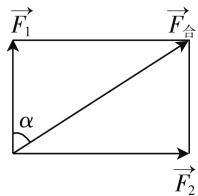

# 高中数学平面向量解题技巧

# ● 江苏省启东市汇龙中学 王春萍

平面向量是高中数学中一个重要的知识点,不仅其本身考查百变,也可以与各种知识相结合,同时是解析几何的重要基础.因此学生需要掌握好这一章节知识点.对于一线授课教师而言,要积极主动地对常见题型进行归纳总结,找到共性,采取案例教学法等多种科学的教学方法,帮助学生理解该知识点.本文旨在给广大一线教师提供案例授课经验,帮助教师提高教学效率和质量.

# 一、向量的概念及表示

向量是沟通代数和几何的工具,在学习向量概念时,需要从大小和方向两方面进行学习.大小反映了向量“数”的特征,方向反映了向量“形”的特征.高中数学中平面向量最基础的考查方式是对概念和表示方式的考查,对于这种类型的题目,难度较低,但是学生容易出现简单错误.教师需要在平时授课过程中对基础概念讲授清楚,辅助以案例帮助学生理解.

例 1 已知向量 $\boldsymbol{a}=(1,2)$ , $\boldsymbol{b}=(-3,3)$ ，若 $ma+nb$ 与 a-3b 共线，则 $\frac{m}{n}=(\quad)$ .

A. $\frac{1}{3}$

B. 3

C. $-\frac{1}{3}$

D.-3

分析:根据平面向量的坐标运算与共线定理,列式求出 $\frac{m}{n}$ 的值.

解答: 向量 $\boldsymbol{a}=(1,2)$ , $\boldsymbol{b}=(-3,3)$ ，则 $ma+nb=(m-3n,2m+3n)$ , $\boldsymbol{a}-3\boldsymbol{b}=(10,-7)$ . 又 $ma+nb$ 与 $a-3b$ 共线，所以 $-7(m-3n)-10(2m+3n)=0$ ，化简得 $\frac{m}{n}=-\frac{1}{3}$ .

点评:本题在向量概念基础之上考查了学生对向量共线的理解,属于基础题,但是对学生的运算能力也有一定考查,需要学生能够看出式子特点,进行整体化简,而不是分别求出m和n的值.

# 二、向量的线性运算

向量线性运算的考查往往和平面几何知识相结合,需要学生能够通过向量表示平面几何中的线段.向量是数学中数形结合思想的典型体现.学生在平时练习时,可以辅助以画图等形式,这样数形结合的方式,学生更容易掌握.当熟练以后,学生方可直接进行计算.

例 2 在 $\triangle ABC$ 中, AD 为 BC 边长的中线, 且 $\overrightarrow{AE} = \frac{2}{3}\overrightarrow{AD}$ , 则 $\overrightarrow{BE} = (\quad)$ .

A. $-\frac{2}{3}\overrightarrow{AB}+\frac{1}{3}\overrightarrow{AC}$

B. $\frac{2}{3}\overrightarrow{AB}-\frac{1}{3}\overrightarrow{AC}$

C. $\frac{2}{3}\overrightarrow{AB}+\frac{1}{3}\overrightarrow{AC}$

D. $\frac{4}{3}\overrightarrow{AB}+\frac{1}{3}\overrightarrow{AC}$

分析:由已知结合向量共性定理及线性表示即可求解.

解答:由题意可知, $\overrightarrow{BE}=\overrightarrow{BA}+\overrightarrow{AE}=\overrightarrow{BA}+\frac{2}{3}\overrightarrow{AD}=\overrightarrow{BA}+\frac{2}{3}\times\frac{1}{2}(\overrightarrow{AB}+\overrightarrow{AC})=\frac{1}{3}\overrightarrow{AC}-\frac{2}{3}\overrightarrow{AB}.$

点评:本题考查了平面向量的线性运算以及平面向量基本定理的应用.

# 三、向量的坐标表示

想要学生正确理解向量的坐标表示,在新课讲授阶段,首先教师需要对正交分解进行详细讲解,保证学生能够掌握基本单位向量等基础;其次,在向量正交分解的基础上讲解向量的坐标表示.向量的坐标表示形式考查也较多,坐标形式对于学生后续几何综合题作答也是非常重要的基础,因此教师需要重视这一块.学生不仅需要能够理解坐标表示,同时也需要能够进行正确的计算.

例 3 已知向量 $\boldsymbol{a}=(1,x)$ , $\boldsymbol{b}=(4,2)$ ，且 $a \parallel b$ ，则 $x=(\quad)$ .

A.-2

B. $-\frac{1}{2}$

C. $\frac{1}{2}$

D. 2

分析:根据 $a \parallel b$ 即可得出 $1 \cdot 2 - 4x = 0$ ，然后解出 x 即可.

解答: 因为 $a \parallel b$ ，所以 2-4x=0，解得 $x=\frac{1}{2}$ .

点评: 本题考查了向量与平行的等价坐标关系式, 此题与平行关系相结合, 学生只要能正确列出方程式即可作答.

# 四、向量的数量积

平面向量数量积包含了数量积的概念、表示方法、几何意义、性质等知识点。对于平面向量数量积的题型，需要把握向量数量积的计算有其定义式和坐标式，若告诉坐标或容易建立坐标系利用坐标计算，否则运用定义式，此时需要尽可能将向量转化成共线或垂直。向量的数量积由于其形式特殊性往往会和不等式结合考查。

例 4 已知 $\left|a\right|=1,\left|b\right|=2$ ，则 $\left|a+b\right|+\left|a-b\right|$ 的最大值等于（）.

A. 4

B. $\sqrt{3}+\sqrt{7}$

C. $2\sqrt{5}$

D. 5

分析:根据题目所给的形式,可以考虑使用不等式性质 $|a+b|+|a-b|\leqslant2\times\sqrt{\frac{|a+b|^{2}+|a-b|^{2}}{2}}$ ，进而变形得到答案.

解答：根据题意， $|a+b|+|a-b|\leqslant2\times\sqrt{\frac{|a+b|^{2}+|a-b|^{2}}{2}}=2\times\sqrt{|a|^{2}+|b|^{2}}=2\sqrt{5}$ ，当且仅当 $|a+b|=|a-b|$ ，即 $a\perp b$ 时等号成立，即 $|a+b|+|a-b|$ 的最大值等于 $2\sqrt{5}$ .

点评:本题考查向量数量积的计算,涉及基本不等式的性质以及应用,属于基础题.

# 五、向量的应用

向量的应用非常广泛,除了本文中上述例举的和方程的解结合,还有和平面几何、实际应用、物理知识相结合,但是本质上都是向量的计算和转换,认清公式的形式,找准每一个变量代表的数值,准确代入,精准计算.

若使用向量方法解决平面几何问题,可分为以下几步:首先,建立平面几何和向量之间联系,使用平面向量将题目中涉及的几何元素表示出来,将平面几何问题转化为向量问题;然后通过向量运算,研究几何元素之间的关系,例如距离、夹角等问题;最后把计算结果用几何元素表示出来.若使用向量解决物理问题,首先将物理中的矢量用向量表示;然后,找出向量和向量的夹角;最后利用向量的数量积计算功.若使用向量解决航空、航海问题,首先,按照题目意思画出图形,包括方向和方位;然后分析图形边角关系;最后利用平面几何知识求出答案.

例 5 已知关于 x 的方程 $ax^{2} + bx + c = 0$ ，其中 a, b, c 都是非零向量，且 a, b 不共线，则该方程的解的情况是（）.

A. 至少有一个解

B. 至多有一个解

C. 至多有两个解

D. 可能有无数个解

分析:先将向量 c 移动到另一侧得到关于向量 c = -ax $^{2}$ - bx，再由平面向量基本定理判断即可.

解答: $c=(-x^{2})a-xb.$

已知 a, b 不共线, 因此存在唯一一对实数 $\lambda, \mu$ 使得 $c = \lambda a + \mu b$ .

若 $\lambda$ 满足 $\lambda = -\mu^{2}$ ，则该方程有一个解；

$\lambda$ 不满足 $\lambda = -\mu^{2}$ ，则方程无解.

所以至多一个解.

点评:本题考查平面向量基本定理的应用.此题将向量和方程相结合,需要学生具有一定的解决问题的综合能力.

例 6 已知两个力的夹角为 $90^{\circ}$ ，它们合力大小为 10N，合力与其中一个力的夹角为 $60^{\circ}$ ，那么另一个力的大小为（）.

A. $5 \sqrt{3} \mathrm{~N}$

B. 5N

C. 10N

D. $5\sqrt{2}$ N

分析: 此题考查的是平面向量在物理中的应用. 在解答时, 根据信息画出平行四边形, 结合已知向量的大小和向量间的夹角, 通过运算或直接解直角三角形进行问题解答即可.

解答:由题意可以画出对应的向量图如图1所示.

  
图 1

根据图 1 以及题意可知, $\alpha=60^{\circ}$ ,所以 $\overrightarrow{F_{2}}$ 的大小为 $10\times\sin60^{\circ}=5\sqrt{3}N$ .

点评:此题考查向量在物理中的应用. 在解答过程中, 充分体现了数形结合思想、向量运算法则以及问题转化的思想. W