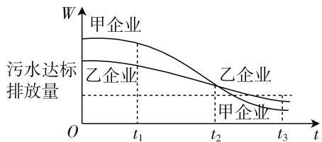
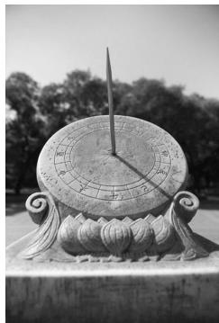
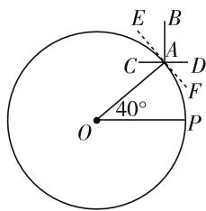

# 高考“新”定义,创新“新”问题

# ● 江苏省启东市汇龙中学 施伟琛

历年高考数学试卷都坚持对“五种能力”和“两种意识”（应用意识与创新意识）的考查，经常借助新定义问题来突出呈现。此类新定义问题，类型众多，借助新定义一个数学问题（新公式、新图像、新概念、新模型、新方法、新性质与新运算等），实现考生所学的数学知识和方法的有效迁移，从而得以解决新问题，是应用意识与创新意识的一个突出表现，也是每年高考数学中的最“亮”点，备受命题者青睐。本文结合2020年高考数学中的新定义问题，结合典型高考真题阐述创新意识的应用，抛砖引玉，以期为高考复习与备考提供些许帮助。

# 一、新公式

通过创新公式,合理融合生活实际、学科交汇等问题,结合条件中的创新公式,合理转化与化归,结合数学的相关知识利用创新思维来分析问题与解决问题.

例 1 （2020 年全国卷Ⅲ文、理科第 4 题）Logistic 模型是常用数学模型之一，可应用于流行病学领域。有学者根据公布数据建立了某地区新冠肺炎累计确诊病例数 $I(t)$ (t 的单位：天) 的 Logistic 模型: $I(t) = \frac{K}{1 + e^{-0.23(t-53)}}$ ，其中 K 为最大确诊病例数。当 $I(t *) = 0.95K$ 时，标志着已初步遏制疫情，则 $t *$ 约为（）。(参考数据 $\ln 19 \approx 3$ )

A. 60

B. 63

C. 66

D. 69

分析:结合创新公式,通过 Logistic 模型的函数关系式的给出,结合相关数据代入处理,利用公式的恒等变形与转化来确定相应的参数值.

解析:由题意可知, $\frac{K}{1+\mathrm{e}^{-0.23(t-53)}}=0.95K$ ,整理可得 $\mathrm{e}^{-0.23(t-53)}=\frac{1}{19}$ ，两边取自然对数，有 $-0.23(t-53)=-\ln19\approx-3$ ，解得 $t\approx66$ .

故选 C.

# 二、新图像

通过创新图像,合理利用创新图像来确定相应的元素、图形的几何意义以及相关知识的内涵,沟通图像与知识的链接,实现知识点间的交汇与综合、性质间的化归与转化等.

例 2 （2020 年北京卷第 15 题）为满足人民对美好生活的向往，环保部门要求相关企业加强污水治理，排放未达标的企业要限期整改。设企业的污水排放量 W 与时间 t 的关系为 $W = f(t)$ ，用 $-\frac{f(b) - f(a)}{b - a}$ 的大小评价在 $[a, b]$ 这段时间内企业污水治理能力的强弱。已知整改期内，甲、乙两企业的污水排放量与时间的关系如图 1 所示。

line

| t    | 甲企业 | 乙企业 | 污水达标排放量 |
| ---- | ------ | ------ | -------------- |
| t₁   | -      | -      | -              |
| t₂   | -      | -      | -              |
| t₃   | -      | -      | -              |

图 1

给出下列四个结论:① 在 $\left[t_{1},t_{2}\right]$ 这段时间内,甲企业的污水治理能力优于乙企业;

② 在 $t_{2}$ 时刻, 甲企业的污水治理能力比乙企业强;  
③ 在 $t_{3}$ 时刻, 甲和乙两企业的污水治理能力相当, 都已达标;  
④ 甲企业在 $\left[0,t_{1}\right],\left[t_{1},t_{2}\right],\left[t_{2},t_{3}\right]$ 这三段时间中，在 $\left[0,t_{1}\right]$ 的污水治理能力最强.

其中所有正确结论的序号是\_\_\_\_。

分析:结合创新图像,抓住企业污水治理能力的强弱的表达式的几何意义,从而借助函数图像的直观分析,利用函数图像上各点处的切线的斜率的大小变化情况,直观确定相应的企业污水治理能力的强弱问题.

解析:由于企业污水治理能力的强弱 $-\frac{f(b)-f(a)}{b-a}$

表示的污水排放量 $W = f(t)$ 的图像的切线的斜率的相反数，结合图形可知，在 $[t_{1}, t_{2}]$ 这段时间内，甲企业的污水排放量函数图像的切线的斜率小，则其相反数大，则其比乙企业强，① 正确；

在 $t_{2}$ 时刻,甲企业的污水排放量函数图像的切线的斜率小,则其相反数大,则其比乙企业强,②正确;

在 $t_{3}$ 时刻, 甲、乙企业的污水排放量都在达标排放量下面, 都已达标, ③ 正确;

对于甲企业,在这三个时间段内,在 $\left[t_{1},t_{2}\right]$ 这段时间内,甲企业的污水排放量函数图像的切线的斜率最小,则其相反数最大,此时污水治理能力最强,④错误.

故填答案:①②③.

# 三、新概念

通过创新概念,以创新知识为问题背景,通过概念的形式联通常规数学知识,构造起相应的数学模型,进而借助相关知识的定义、性质、公式等来分析与解决相关问题.

例 3 （2020 年全国卷Ⅱ文科第 3 题）将钢琴上的 12 个键依次记为 $a_{1}, a_{2}, \cdots, a_{12}$ . 设 $1 \leqslant i < j < k \leqslant 12$ , 若 k - j = 3 且 j - i = 4, 则称 $a_{i}, a_{j}, a_{k}$ 为原位大三和弦; 若 k - j = 4 且 j - i = 3, 则称 $a_{i}, a_{j}, a_{k}$ 为原位小三和弦. 用这 12 个键可以构成的原位大三和弦与原位小三和弦的个数之和为( ).

A. 5

B. 8

C. 10

D. 15

分析:结合创新概念,通过钢琴中专用名词的定义——原位大三和弦与原位小三和弦,利用数学中的不等式条件与函数关系式来合理化归与应用,结合罗列法的应用,得以分析与确定对应的二者的个数之和问题.

解析:由于 k-j=3 且 j-i=4, 则原位大三和弦分别有: i=1, j=5, k=8; i=2, j=6, k=9; i=3, j=7, k=10; i=4, j=8, k=11; i=5, j=9, k=12; 共5个.

由于 k-j=4 且 j-i=3，则原位小三和弦分别有：i=1,j=4,k=8；i=2,j=5,k=9；i=3,j=6,k=10；i=4,j=7,k=11；i=5,j=8,k=12；共 5 个.

所以用这 12 个键可以构成的原位大三和弦与原位小三和弦的个数之和为 $5 + 5 = 10$ .

故选 C.

# 四、新模型

通过创新模型,有效沟通现实生活与数学知识之间的联系,借助数学模型的建立与分析,应用相关的数学模型与知识来解决一些与现实生活相关的应用问题.

例 4 （2020 年新高考山东卷第 4 题）如图 2，日晷是中国古代用来测定时间的仪器，利用与晷面垂直的晷针投射到晷面的影子来测定时间。把地球看成一个球（球心记为 O），地球上一点 A 的纬度是指 OA 与地球赤道所在平面所成角，点 A 处的水平面是指过点 A 且

natural_image

Black-and-white photo of an ornate sandar with a central needle and surrounding decorative base (no visible text or symbols)

图 2

与OA垂直的平面,在点A处放置一个日晷,若晷面与赤道所在平面平行,点A处的纬度为北纬 $40^{\circ}$ ,则晷针与点A处的水平面所成角为().

A. $20^{\circ}$

B. $40^{\circ}$

C. $50^{\circ}$

D. $90^{\circ}$

分析:结合创新模型,结合日晷仪器这一创新几何模型,巧妙把球体、平面几何等相关知识融合在一起,实现创新应用模型的原理分析与解读,达到数学建模与创新应用的目的.

解析: 如图 3 所示, 把空间问题平面审视, 可以判断出假如一个日晷放在点 A 处, 赤道便与晷面 CD 平行, 暑针为 AB, 点 A 处的水平面为 EF, 由于 CD // OP, 可得 $\angle CAO = \angle AOP = 40^{\circ}$ , 结合平面几何中的垂直关系, 可得 $\angle BAE = \angle CAO = 40^{\circ}$ , 即为晷针与点 A 处的水平面所成角.

text_image

E
B
A
C
D
F
O
40°
P

图 3

故选 B.

涉及高考数学中的新定义问题,创新性强,信息量大,融合度高,经常借助阅读材料的分析与理解,从繁杂的阅读信息中提炼有用的内容,结合原形迁移、类比推理、化归转化等方法,进而得以合理分析与求解.破解此类新定义问题,要求考生在有限的时间内合理对相关阅读信息进行分析、提取、加工和处理,很好考查考生的临场应变能力、灵活应用能力,以及分析问题与解决问题的能力等,全面提升创新精神,培养数学核心素养.

# 参考文献：

[1] 中华人民共和国教育部. 普通高中数学课程标准 (2017年版)[S]. 北京: 人民教育出版社, 2018. W