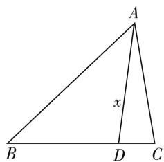

# 不畏浮云遮望眼

—— 一道江苏联赛解三角形题的剖析

● 江苏省海安高级中学 景君

解三角形问题一直是每年高考、竞赛考查的热点问题之一，也是高考、竞赛中方法多样、思维各异的载体。由于解三角形有效串联起平面几何、三角函数等相关知识，知识交汇较多，又有一定的难度，同时问题设置也比较创新新颖，备受关注。下面结合2019年全国高中数学联赛江苏赛区市级选拔赛第9题的解三角形的面积问题，通过多种思维方法来进行破解。

# 一、赛题重现

问题 （2019年全国高中数学联赛江苏赛区市级选拔赛·9）在 $\triangle ABC$ 中，已知 AC = 8, BC = 10, $32\cos(A - B) = 31$ ，则 $\triangle ABC$ 的面积是 \_\_\_\_.

本题以三角形为问题背景,给出三角形的两边长以及相应两角差的余弦值,进而求解对应三角形的面积.问题背景设置新颖,特别是通过三角形两角差的余弦值的给出,有效提高问题难度,同时也为问题的破解提供更为广泛的切入点,进而必然会有众多的破解方法.只有理解与读懂题目条件,从更高的角度来渗透,才能做到“不畏浮云遮望眼”,使得问题得以正确破解.

# 二、多法破解

# 破解角度 1: 解三角形

解三角形问题最常见的破解角度就是利用正弦定理、余弦定理等来切入,结合三角形的边与角的关系来进行有效解三角形,达到破解的目的.

解法 1:（正弦定理法）利用正弦定理，设出 $\triangle ABC$ 的外接圆半径为 R，进而结合正弦定理以及同角三角函数基本关系式得到角 A, B 的正弦与余弦关于半径 R 的表达式，进而利用条件确定 R 的值，利用诱导公式以及三角恒等变换公式得以确定 $\sin C$ 的值，利用三角形的面积公式来求解即可.

设 $\triangle ABC$ 的外接圆半径为 R，由正弦定理可得 $\frac{10}{\sin A} = \frac{8}{\sin B} = 2R$ ，则有 $\sin A = \frac{5}{R}$ ， $\sin B = \frac{4}{R}$ ，利用同角

三角函数基本关系式可得 $\cos A = \sqrt{1 - \sin^{2} A} = \sqrt{1 - \frac{25}{R^{2}}}$ , $\cos B = \sqrt{1 - \sin^{2} B} = \sqrt{1 - \frac{16}{R^{2}}}$ . 又由 $32\cos(A - B) = 31$ , 可得 $\cos(A - B) = \cos A \cos B + \sin A \sin B = \sqrt{1 - \frac{25}{R^{2}}} \cdot \sqrt{1 - \frac{16}{R^{2}}} + \frac{5}{R} \cdot \frac{4}{R} = \frac{31}{32}$ , 解得 $R^{2} = \frac{256}{7}$ , 即 $R = \frac{16}{\sqrt{7}}$ , 结合诱导公式有 $\sin C = \sin(A +$

$$
B) = \sin A \cos B + \cos A \sin B = \frac {5}{R} \cdot \sqrt {1 - \frac {1 6}{R ^ {2}}} +
$$

$\sqrt{1-\frac{25}{R^{2}}}\cdot\frac{4}{R}=\frac{3\sqrt{7}}{8}$ ，所以 $\triangle ABC$ 的面积S= $\frac{1}{2}ab\sin C=\frac{1}{2}\times10\times8\times\frac{3\sqrt{7}}{8}=15\sqrt{7}$ .

故填答案: $15\sqrt{7}$ .

# 破解角度 2: 三角函数

解三角形问题有时也借助三角形中角的关系,通过三角恒等变换等来处理,通过三角函数的相关知识来合理转化,进而达到破解三角形的目的.

解法 2: (三角恒等变换法 1) 根据条件, 通过正弦定理以及比例性质的转化得到角 A, B 的正弦关系式 $\sin A + \sin B = 9 (\sin A - \sin B)$ , 结合和差化积公式的应用得到 $\tan \frac{A + B}{2} = 9 \tan \frac{A - B}{2}$ , 通过二倍角公式以及万能公式得以确定 $\sin C$ 的值, 利用三角形的面积公式来求解即可.

由正弦定理可得 $\frac{10}{\sin A} = \frac{8}{\sin B}$ , 结合比例性质有 $\frac{10}{\sin A} = \frac{8}{\sin B} = \frac{2}{\sin A - \sin B} = \frac{18}{\sin A + \sin B}$ , 整理有 $\sin A + \sin B = 9 (\sin A - \sin B)$ , 结合和差化积公式有 $2 \sin \frac{A + B}{2} \cos \frac{A - B}{2} = 9 \times 2 \cos \frac{A + B}{2} \sin \frac{A - B}{2}$ , 即 $\tan \frac{A + B}{2} = 9 \tan \frac{A - B}{2}$ . 又由 $32 \cos (A - B) = 31$ , 即

$\cos(A-B)=\frac{31}{32}$ ，结合二倍角公式，可得 $\tan\frac{A+B}{2}=$

$$
9 \tan \frac {A - B}{2} = 9 \sqrt {\frac {1 - \cos (A - B)}{1 + \cos (A - B)}} = 9 \times \sqrt {\frac {1 - \frac {3 1}{3 2}}{1 + \frac {3 1}{3 2}}} =
$$

$\frac{3}{\sqrt{7}}$ ，结合万能公式，并借助诱导公式可得 $\sin C = \sin (A$

$$
+ B) = \frac {2 \tan \frac {A + B}{2}}{1 + \tan^ {2} \frac {A + B}{2}} = \frac {2 \times \frac {3}{\sqrt {7}}}{1 + \left(\frac {3}{\sqrt {7}}\right) ^ {2}} = \frac {3 \sqrt {7}}{8}, \text {所以}
$$

$\triangle ABC$ 的面积 $S = \frac{1}{2} ab\sin C = \frac{1}{2}\times 10\times 8\times \frac{3\sqrt{7}}{8}$ $= 15\sqrt{7}.$

故填答案: $15\sqrt{7}$ .

解法 3: (三角恒等变换法 2) 根据条件, 利用同角三角函数基本关系式求得 $\sin(A-B)$ 的值, 通过正弦定理的转化以及三角恒等变换公式的应用, 建立相应的关系式得到 $\tan B$ 的值, 进而求解角 A, B 的正弦值与余弦值, 通过诱导公式以及三角恒等变换公式得以确定 $\sin C$ 的值, 利用三角形的面积公式来求解即可.

由 $32\cos (A - B) = 31$ ，即 $\cos (A - B) = \frac{31}{32}$ 利用同角三角函数基本关系式可得 $\sin (A - B) = \sqrt{1 - \cos^2(A - B)} = \sqrt{1 - \frac{31^2}{32^2}} = \frac{3\sqrt{7}}{32}$ . 由正弦定理可得 $\frac{10}{\sin A} = \frac{8}{\sin B}$ ，则有 $\sin A = \frac{5}{4}\sin B$ ，而 $\sin A = \sin [B + (A - B)] = \sin B\cos (A - B) + \cos B\sin (A - B) = \frac{31}{32}\sin B + \frac{3\sqrt{7}}{32}\cos B$ ，则有 $\frac{5}{4}\sin B = \frac{31}{32}\sin B + \frac{3\sqrt{7}}{32}\cos B$ ，解得 $\tan B = \frac{\sqrt{7}}{3}$ . 结合同角三角函数基本关系式可得 $\sin B = \frac{\sqrt{7}}{4}, \cos B = \frac{3}{4}$ ，则有 $\sin A = \frac{5}{4}\sin B = \frac{5\sqrt{7}}{16}, \cos A = \sqrt{1 - \sin^2A} = \frac{9}{16}$ ，结合诱导公式有 $\sin C = \sin (A + B) = \sin A\cos B + \cos A\sin B = \frac{5\sqrt{7}}{16} \cdot \frac{3}{4} + \frac{9}{16} \cdot \frac{\sqrt{7}}{4} = \frac{3\sqrt{7}}{8}$ ，所以 $\triangle ABC$ 的面积 $S = \frac{1}{2} ab\sin C = \frac{1}{2} \times 10 \times 8 \times \frac{3\sqrt{7}}{8} = 15\sqrt{7}$ .

故填答案: $15\sqrt{7}$ .

# 破解角度 3: 平面几何

解三角形问题的实质就是平面几何问题,有效利用平面几何的相关知识,通过合理地引入辅助线,再结合条件中相应的三角形的边与角的关系来进行求解相应的三角形的问题,进而达到破解的目的.

解法 4:(辅助线法) 结合条件引入相应的辅助线, 使得 $\angle BAD = B$ , 进而确定 $\angle CAD = A - B$ , 设出 AD = x, 结合余弦定理的应用求得参数 x 的值, 结合等腰三角形的性质以及同角三角函数基本关系式得以确定 $\sin C$ 的值, 利用三角形的面积公式来求解即可.

由于 AC=8, BC=10，即 a>b，结合三角形性质可得 A>B，作 $\angle BAD=B$ ，其中点 D 在线段 BC 上，则有 $\angle CAD=A-B$ ，设 AD=x，则有 BD=AD=x, DC=10-x。又由 $32\cos(A-B)=31$ ，即 $\cos\angle CAD=\cos(A-B)$ 。

text_image

A
x
B D C

图1

$-B) = \frac{31}{32}$ , 结合余弦定理, 可得 $(10 - x)^2 = x^2 + 64 - 2 \times x \times 8 \times \frac{31}{32}$ , 解得 $x = 8$ , 则有 $DC = 10 - x = 2$ , 结合等腰三角形的性质可得 $\cos C = \frac{1}{8}$ , 利用同角三角函数基本关系式可得 $\sin C = \sqrt{1 - \cos^2 C} = \frac{3\sqrt{7}}{8}$ , 所以 $\triangle ABC$ 的面积 $S = \frac{1}{2} ab \sin C = \frac{1}{2} \times 10 \times 8 \times \frac{3\sqrt{7}}{8} = 15\sqrt{7}$ .

故填答案: $15\sqrt{7}$ .

# 三、规律总结

充分运用一题多解进行教学,在竞赛方面的效果显得更为突出.一题多解可以从多角度、多途径寻求解决问题的不同方法,开拓解题思维,特别在解答有一定难度的竞赛问题时,往往可以提供更为广泛的破解角度,条条道路通罗马.而一题多解的教学,同时融合众多相关的知识与能力,坚持不懈下去,学生的数学思维的水平与思维方式必将在潜移默化中突飞猛进,不断得以提升.同时,从多种解法的对比中选取最佳解法、通技通法、特殊解法等,总结解题规律,提高分析问题、解决问题的能力,真正达到思维的发散性和创新性,培养数学素养.F