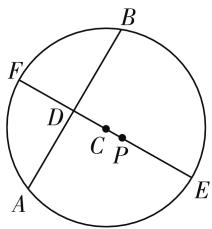

# 全面发展数学运算,有效培养核心素养

# ● 江苏省江阴市山观高级中学 唐丽艳

数学运算作为新课标中创新性指出的六大核心素养之一,作为计算机解决问题的基础,是在明晰运算对象的基础上的一种演绎推理,依据运算法则来分析与解决数学问题,是解决数学问题的基本手段和基本工具之一.本文结合2020年高考数学真题,有效提高数学运算,形成良好的程序化、系统化、数学化地思考、分析、解决问题的习惯,通过高考的“指挥棒”,结合实例来剖析数学运算的培养与渗透方法,引领与指导数学教学与学习,抛砖引玉.

# 一、确定运算目标,理解运算对象

例 1 （2020 年全国卷Ⅲ文、理科第 4 题）Logistic 模型是常用数学模型之一，可应用于流行病学领域。有学者根据公布数据建立了某地区新冠肺炎累计确诊病例数 $I(t)$ (t 的单位：天) 的 Logistic 模型: $I(t) = \frac{K}{1 + e^{-0.23(t-53)}}$ ，其中 K 为最大确诊病例数。当 $I(t *) = 0.95K$ 时，标志着已初步遏制疫情，则 $t *$ 约为 $(\ln 19 \approx 3)$ ( )。

A. 60

B. 63

C. 66

D. 69

分析:结合某地区新冠肺炎累计确诊病例数 $I(t)$ 的 Logistic 模型的函数关系式,确定运算目标,并利用已初步遏制疫情时函数值来建立关系式,有效理解运算法则,通过代数恒等变形以及对数运算等来确定相应的参数的值.

解:由题可知, $\frac{K}{1+\mathrm{e}^{-0.23(t-53)}}=0.95K$ ,整理可得 $e^{-0.23(t-53)}=\frac{1}{19}$ ，两边取自然对数，有 $-0.23(t-53)=-\ln19\approx-3$ ，解得 $t\approx66$ .

故选 C.

点评:根据题目条件中 Logistic 模型及其应用,从而明确运算目标,根据医疗卫生学科中流行病学领域的相关知识以及对应的函数关系式,结合已初步遏制疫情这一确定的函数值,综合起来建立满足条件的方程,理解运算对象,利用方程的转化、对数的运算与方程的求解来解决数学应用问题.

# 二、确定运算规律,掌握运算法则

例 2 （2020 年全国卷Ⅱ理科第 17 题）在 $\triangle ABC$ 中， $\sin^{2}A - \sin^{2}B - \sin^{2}C = \sin B \sin C.$

(1) 求 A;   
(2) 若 BC=3，求 $\triangle ABC$ 周长的最大值.

分析:(1) 利用三角关系式以及正弦定理、余弦定理的应用与转化确定 $\cos A$ 的值, 从而得以确定角 A 的值;(2) 结合正弦定理的转化与基本不等式的应用, 根据三角函数的性质来确定 $\triangle ABC$ 周长的最大值问题.

解: 在 $\triangle ABC$ 中, 设内角 A, B, C 的对边分别为 a, b, c.

(1) 结合 $\sin^{2}A - \sin^{2}B - \sin^{2}C = \sin B \sin C$ ，由正弦定理，可得 $a^{2} - b^{2} - c^{2} = bc$ ，即 $b^{2} + c^{2} - a^{2} = -bc$ 。由余弦定理，可得 $\cos A = \frac{b^{2} + c^{2} - a^{2}}{2bc} = -\frac{1}{2}$ ，而 $A \in (0, \pi)$ ，所以 $A = \frac{2\pi}{3}$ 。  
(2) 由于 $a = BC = 3$ ，由(1)知， $a^2 - b^2 - c^2 = bc$ ，即 $a^2 = b^2 + c^2 + bc = 9$ ，整理有 $(b + c)^2 - bc = 9$ . 由基本不等式，可得 $bc \leqslant \frac{(b + c)^2}{4}$ ，结合上式，可得 $9 = (b + c)^2 - bc \geqslant (b + c)^2 - \frac{(b + c)^2}{4}$ ，即 $(b + c)^2 \leqslant 12$ ，解得 $b + c \leqslant 2\sqrt{3}$ ，当且仅当 $b = c = \sqrt{3}$ 时，等号成立.

所以 $\triangle ABC$ 周长的最大值为 $3 + 2\sqrt{3}$ .

点评: 在解三角形背景中, 确定运算规律, 结合三角关系式的应用, 结合正弦定理与余弦定理的应用来转化, 巧妙掌握运算法则, 通过配方处理, 并结合基本不等式构造不等关系, 通过不等式的求解与应用, 利用整体思维法来处理与转化三角形中的周长问题.

# 三、确定运算方向,探究运算思路

例 3 （2020 年浙江卷第 12 题）二项展开式(1 +

$$
\begin{array}{r l} & {2 x) ^ {5} = a _ {0} + a _ {1} x + a _ {2} x ^ {2} + a _ {3} x ^ {3} + a _ {4} x ^ {4} + a _ {5} x ^ {5}, \text {则} a _ {4}} \\ & {= \underline {{\quad}}, a _ {1} + a _ {3} + a _ {5} = \underline {{\quad}}.} \end{array}
$$

分析:由二项展开式 $(1+2x)^{5}$ 的通项公式确定系数,结合展开式的特征性质确定所求的系数来分析与运算,从而得以求解.

解析:由于二项展开式 $(1+2x)^{5}$ 的通项公式为 $T_{r+1}=C_{5}^{r}\cdot2^{r}\cdot x^{r}$ ，所以 $a_{4}=C_{5}^{4}\cdot2^{4}=80,a_{1}+a_{3}+a_{5}=C_{5}^{1}\cdot2^{1}+C_{5}^{3}\cdot2^{3}+C_{5}^{5}\cdot2^{5}=122.$

故填答案:80;122.

点评:借助二项展开式的通项公式,有针对性地确定所要进行运算的方向,结合展开式的特征性质来确定对应的系数,为有效破解问题的运算思路的探究与取得指明方向.在具体破解问题过程中,运算思路的探究与确定往往是根据题目条件加以合理分析而决定的.

# 四、确定运算技巧,选择运算方法

例 4 （2020 年江苏卷第 8 题）已知 $\sin^{2}\left(\frac{\pi}{4}+\alpha\right)=\frac{2}{3}$ ，则 $\sin2\alpha$ 的值是 \_\_\_\_.

分析:结合条件中的平方形式,确定与之相应的运算技巧,直接利用二倍角公式的变形公式(降幂公式),合理有效选择对应的运算方法,结合诱导公式加以转化,从而得以求解三角函数.

解:由于 $\sin^{2}\left(\frac{\pi}{4}+\alpha\right)=\frac{2}{3}$ ，结合二倍角公式的变形，可得 $\sin^{2}\left(\frac{\pi}{4}+\alpha\right)=\frac{1}{2}\left[1-\cos\left(\frac{\pi}{2}+2\alpha\right)\right]=\frac{1}{2}(1+\sin2\alpha)=\frac{2}{3}$ ，解得 $\sin2\alpha=\frac{1}{3}$ .

故填答案: $\frac{1}{3}$ .

点评:破解本题的运算方法众多,对公式的变形与转化形式也多样.有效借助二倍角公式的变形形式加以转化,合理确定运算技巧,选择配套的运算方法,从而合理降幂,巧妙转化,简化过程,正确应用,提高效益.

# 五、确定运算步骤,设计运算程序

例 5 （2020 年江苏卷第 14 题）在平面直角坐标系 xOy 中，已知 $P\left(\frac{\sqrt{3}}{2},0\right)$ ，A, B 是圆 $C: x^{2} + \left(y - \frac{1}{2}\right)^{2} = 36$ 上的两个动点，满足 PA = PB，则

△PAB 面积的最大值是\_\_\_\_.

分析:根据条件,确定运算步骤——“两步走”分析,合理引入参数 $CD=t\in(0,6)$ , 先确定 $\triangle PAB$ 面积的关系式 $S_{\triangle PAB}=(1+t)\sqrt{36-t^{2}}$ , 进而合理构造函数 $f(t)$ , 结合函数的求导并利用函数的单调性来确定最值问题.

解:如图1所示,作PC所在的直径EF,交AB于点D,结合对称性可得PA=PB,此时CA=CB=r=6,且 $PC\perp AB$ ,要使得 $\triangle PAB$ 面积最大,数形结合可知,点P,D位于圆心C的两侧.

text_image

B
F
D
C P
A
E

图 1

设 $CD = t \in (0,6)$ ，结合条件可得 $PC = \sqrt{\left(\frac{\sqrt{3}}{2} - 0\right)^2 + \left(0 - \frac{1}{2}\right)^2} = 1$ ，则有 $PD = 1 + t$ ，而 $AB = 2AD = 2\sqrt{36 - t^2}$ ，所以 $S_{\triangle PAB} = \frac{1}{2} \cdot AB \cdot PD = (1 + t)\sqrt{36 - t^2}$ 。构造函数 $f(t) = (1 + t)\sqrt{36 - t^2}, t \in (0,6)$ ，求导可得 $f'(t) = \sqrt{36 - t^2} - \frac{(1 + t)t}{\sqrt{36 - t^2}}$ 。令 $f'(t) = 0$ ，解得 $t = 4$ 或 $t = -\frac{9}{2}$ （舍去）。而函数 $f(t)$ 在区间 $(0,4)$ 上单调递增，在区间 $(4,6)$ 上单调递减，所以 $f(t)_{\max} = f(4) = 10\sqrt{5}$ ，即 $\triangle PAB$ 面积的最大值是 $10\sqrt{5}$ 。

故填答案: $10\sqrt{5}$ .

点评:破解此类线圆问题,合理分步,确定运算步骤,先引入弦心距这一参数t,利用弦心距这一参数t来表示对应的三角形面积,从而建立起相应的函数关系式,再借助导数法,利用函数求导处理,结合函数的单调性与极值来确定相应的三角形面积的最值问题.分步骤处理,合理设计运算程序,巧妙破解数学问题.

数学运算能力的发展与培养是一个循序渐进、螺旋式上升的漫长过程. 在这个过程中, 借助不同数学运算方式的学习、比较、感悟, 加深对数学概念与数学知识的理解, 有效借助运算方法解决实际问题, 并通过运算促进数学思维发展, 形成程序化思考问题的品质, 优化了数学思维品质, 提升数学能力, 养成一丝不苟、严谨求实的科学精神, 培养数学核心素养.

# 参考文献：

[1] 中华人民共和国教育部. 普通高中数学课程标准 (2017年版)[S]. 北京: 人民教育出版社, 2018. W