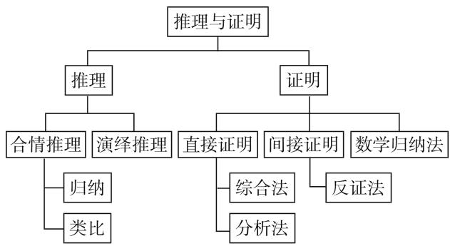
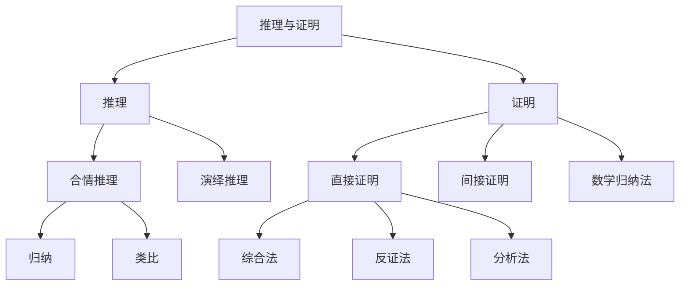
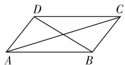

# 回归课本,立足基础

——高三数学后期复习做法

# ● 江苏省南京市梅山高级中学 董秀娥

近年高考数学试题似曾相识, 又不完全相同, 充分渗透了考试说明的命题理念, 以重点知识构建试题的主体, 选材“源于课本教材又高于课本教材”, 立意新颖又朴实无华. 这也给我们数学复习备考指明了方向, 回归课本成了高三数学后期复习的一个必然过程, 也为高考备考找到了一个有力的支撑, 在高考数学复习过程中能够更有效地利用课本.

# 一、回归课本的必要性

# 1. 从高考试题的特点来看

高考试题的特点就是紧扣数学教材和《考试说明》，原则上不出怪题、偏题，不回避“热点”问题，在命题角度、方法、题型等方面下功夫。近年高考数学试题的总体特点是：（1）风格朴素平实，题型不偏不怪，充分体现“立足基础、切合教材、贴近生活、背景公平、适度创新”的命题特色；（2）难度适中平稳，充分遵循“高考应具有较高的信度、效度、必要的区分度和适当的难度”的命题原则。

在难题上,高考试题往往通过“攻击”学生群体性的“软肋”来突出区分性与选拔性,让大多数学生感到为难的试题恰恰就是多数学生在某一数学知识点上的思维短板,设置的考查目的就是让学生正常分层,让优秀的学生脱颖而出.

# 2. 从高考命题的手法来看

高考命题的手法就是高考试题以原创为主，在试题背景上往往选择不偏离数学本质的背景，不搞花里胡哨的务虚题，不搞奇招怪术的技术题。高考试题往往别具一格，简约而不简单，在题干上、选材上、数据上等更加大气，坚决脱离“偏难怪”等非主流模式。

高考试题中真正的“难”体现在数学知识的综合性上和数学思维的灵活性上，坚决摒弃所谓的“绝招”+“秒杀”的试题，更加重视数学基础知识和基本技能的考查，重视数学中的通性通法，考查学生对数学学科的基本概念、基础知识、基本原理、基本逻辑等的理解、掌握和应用，更加倾向于通过灵活变通的高考试题或偏向实际应用的命题方向. 2019 年高考数学全国卷中的“浮云”、“维纳斯”、“数学卷中的物理题”等就是这个高考试题的手法与趋势的具体体现.

# 3. 从高考考试的功能来看

高考考试的功能就是为高校选拔优秀人才. 而选拔就要正确区分层次, 目的就是把考生按成绩进行合理分层, 便于高校分层次选拔. 大学老师一定是以突出能力、突出应用、突出思维、突出方法为基本功能的创新命题原则来进行高效率的高考命题.

从这个角度上说,只有学生对数学学科的基本概念、基础知识、基本原理、基本逻辑等的理解、掌握和应用复习到位,而且能够灵活应用,甚至能更深层次地领悟到“学科思想”,才能在碰到全新的试题时洞穿这些题目背后考查的知识点或本质,进而找到解题的切入点与破解思路.如果学生的基础知识掌握不够扎实,没有深入理解透彻,没有弄懂一系列推导背后的数学逻辑和原理,只能望题兴叹.

# 二、回归课本的具体做法

# 1. 回归课本,查漏补缺

结合高考数学《考试说明》，回归课本，或直接利用课本教材，或改变教材的呈现方式，通过教、学案一体化等方式，从而查漏补缺，夯实基础。回归课本有助于学生从一个新的高度把握基本知识点，围绕主干知识，实现知识的再认识和重组。

# 2. 回归课本,建构网络

在知识网络交汇点处设计创新型试题是高考数学命题的指导方针与必然趋势，回归课本，努力建构知识网络体系，同时合理引导学生进行扩充与完善，实现知识系统化，知识的合理交汇与融合，特别是不同章节之间的知识交汇，培养学生的交汇意识与创新意识，充分体现新课标与考纲中在“知识点交汇处”命题的指导思想.

例如,人教 A 版选修 2-2 教材中《推理与证明》章节中,通过该章节结束的小结中出给的对应的知识网络结构图(如图 1)，合理引导学生结合自己的理解对这个简洁明了的知识框图进行合理的扩充与完善，从而对推理内容与证明内容加以整体认识，形成知识网络.

flowchart

图 1

推理是数学中最基本的思维过程,也是人们学习和生活经常使用的思维方式.在解决问题的过程中,推理具有猜测和发现结论,探索和提供思路的重要作用,有利于创新意识的培养.在考试中,一般不单独命题,而是与证明相结合,先猜测出结果,再证明结论的正确性.证明题是数学考试中考查学生推理能力和逻辑思维能力的主要形式,综合法和分析法各有所长,在解决问题时,综合运用这两种方法,效果会更好,比如立体几何证明问题.反证法虽然不是考试的热点,但作为一种思想方法在解决问题时常常有意想不到的妙处.数学归纳法一般用来解决与正整数有关的数学问题.

结合以上知识网络结构图,关键要求学生能利用合情推理中的归纳、类比等方法和演绎推理的基本模式进行简单的推理;会用分析法、综合法、反证法、数学归纳法证明一些简单的问题.同时,将不同章节知识的推理与证明问题与此产生交汇,培养学生的应用意识与交汇意识.从而在系统掌握推理与证明的基础上,把推理方法与证明方法反馈应用于其他数学知识中,包括函数、数列、三角函数、不等式、导数等相关知识中,加强知识联系,从学科整体的高度思考问题.

# 3. 回归课本, 追根溯源

回归课本，以课本教材中的例题、习题为依托，挖掘数学课本教材的例题、习题的结论，进行有针对性的变式探究、改选拓展，或作为一些重要结论，或拓展推广加以应用，或延伸获得一般性的规律，注重知识的形成过程，并加以合理的再加工，将教材相关知识、思想、方法等条理化、系统化，进行“组合”“联姻”“嫁接”“演变”“交叉渗透”等方式处理，推陈出新，优化知识，开阔视野，活跃思维。

例如,普通高中课程标准实验教科书《数学·必修4·A版》(人民教育出版社,2007年2月第2版)第109页例 1:

平行四边形是表示向量加法与减法的几何模型. 如图 2, $\overrightarrow{AC} = \overrightarrow{AB} + \overrightarrow{AD}, \overrightarrow{DB} = \overrightarrow{AB} - \overrightarrow{AD}$ , 你能发现平行四边形对

  
图 2

角线的长度与两邻边长度之间的关系吗?

结合例题的分析与转化,著名的平面向量的“极化恒等式”: $a \cdot b = \frac{1}{4} \left[ (a + b)^2 - (a - b)^2 \right]$ . 用语言表述为:平面向量的数量积表示为以这组平面向量为邻边的平行四边形的“和对角线”与“差对角线”的平方差的 $\frac{1}{4}$ .

历年高考题中的很多问题都来源于以上极化恒等式,只不过改头换面,充分把握问题的本质,以不变应万变.利用极化恒等式,合理建立起了平面向量与几何长度(数量)之间的联系,化动(动点)为定(定点),化动(动态)为静(静态),化曲(曲线)为直(直线),实现代数与几何之间沟通的桥梁,具有化普通为特殊之功效,应用十分灵活,是在近年全国各地高考命题中非常优美的平面向量的相关应用问题,是历年高考的创新问题的热点与亮点之一.

# 4. 回归课本,倡导规范

回归课本,通过课本例题的示范,让学生主动意识到解题的规范性,务必将解题过程写得层次分明,结构完整,避免不必要的失分.特别在复习过程中,进一步引导学生以课本的例题为参照,静心思考,认真分析,确定解题流程,合理设置一些衔接性语言加以联系,提升语言表达能力,让具体的解题思路更加条理性、逻辑性,同时养成解题后检验的习惯,有意识地模仿与学习课本例题的规范解答,进一步完善解题的细节.

回归课本,发挥课本中例题、习题的示范性、代表性、典型性等作用,顺理成章地被学生所接受,从而问题的本质得以揭示,解决问题的能力才能有效得以提高,才能真正促进学生乐此不疲、全身心自觉地回归到课本中去,复习才能达到事半功倍的效果.

在高三后期复习阶段, 回归课本, 从而从认知的角度进一步熟悉教材, 从理解的角度进一步再熟悉教材, 从掌握的角度进一步拓展教材, 从综合的角度进一步用活教材, 不停留在表面, 对教材的知识和方法加以合理拔高, 知识成“串”, 构建知识的有机整体, 从而达到数学知识的由“薄”变“厚”, 又由“厚”变“薄”, 由“零乱”到整合“有序”, 从而达到知识理解与掌握的螺旋式上升, 不断提升知识的系统性、关联性、网络性、融合性等, 进而达到知识的融会贯通. F