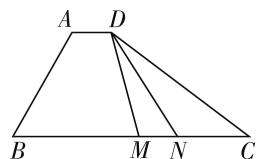
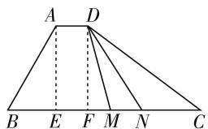

# 基本不等式,高考离不开

# ● 江苏省海安市曲塘中学 崔益斌

基本不等式及其应用是高考中的一个重要考点之一, 是高考数学命题的一个热点与亮点, 备受高考命题者的青睐. 基本不等式及其应用有时直接单独命制, 有时与其他数学知识进行融合与交汇, 涉及代数式的最值、大小比较、平面向量、三角函数、圆锥曲线、证明以及实际应用等问题. 下面结合2020年高考数学中的基本不等式的应用真题, 实例展示基本不等式的应用与技巧, 抛砖引玉, 以期为高考复习与备考提供些许帮助.

# 一、代数式的最值问题

例 1 （2020 年江苏卷第 12 题）已知 $5x^{2}y^{2} + y^{4} = 1(x, y \in \mathbb{R})$ ，则 $x^{2} + y^{2}$ 的最小值是 \_\_\_\_.

分析:根据条件中的代数式进行合理配凑,结合基本不等式的应用加以转化,并通过不等式的性质加以确定相应的代数式的最值问题.

解:由于 $5x^{2}y^{2}+y^{4}=1$ ，结合基本不等式，可得 $4=(5x^{2}+y^{2})\cdot4y^{2}\leqslant\left[\frac{(5x^{2}+y^{2})+4y^{2}}{2}\right]^{2}=\frac{25}{4}(x^{2}+y^{2})^{2}$ ，当且仅当 $5x^{2}+y^{2}=4y^{2}=2$ ，即 $x^{2}=\frac{3}{10}, y^{2}=\frac{1}{2}$ 时，等号成立，所以有 $x^{2}+y^{2}\geqslant\frac{4}{5}$ ，即 $x^{2}+y^{2}$ 的最小值是 $\frac{4}{5}$ .

故填答案: $\frac{4}{5}$ .

# 二、大小比较问题

例 2 （2020 年新高考卷 I（山东卷）第 11 题，新高考卷 II（海南卷）第 12 题）已知 a > 0, b > 0，且 $a + b = 1$ ，则（）.

A. $a^2 + b^2 \geqslant \frac{1}{2}$

B. $2^{a - b} > \frac{1}{2}$

C. $\log_2a + \log_2b\geqslant -2$

D. $\sqrt{a} +\sqrt{b}\leqslant \sqrt{2}$

分析:根据题目条件,结合不等式的性质、基本不等式及其变形公式、指数函数的图像与性质、对数运算等相关知识来解决有关不等式的性质与判定问题,知识点交汇众多,分类讨论,综合能力要求高.

解: 因为 a > 0, b > 0, 且 $a + b = 1$ ,

对于选项 A, $a^{2} + b^{2} \geqslant \frac{(a + b)^{2}}{2} = \frac{1}{2}$ ，当且仅当 a = b = $\frac{1}{2}$ 时，等号成立，故 A 正确；

对于选项 B, 由于 a-b=2a-1>-1, 所以 $2^{a-b} > 2^{-1} = \frac{1}{2}$ , 故 B 正确;

对于选项 C, $\log_{2}a + \log_{2}b = \log_{2}ab \leqslant \log_{2}\left(\frac{a+b}{2}\right)^{2}=\log_{2}\frac{1}{4}=-2$ ，当且仅当 $a=b=\frac{1}{2}$ 时，等号成立，故 C 不正确；

对于选项 D, 因为 $(\sqrt{a} + \sqrt{b})^{2} = 1 + 2\sqrt{ab} \leqslant 1 + a + b = 2$ , 所以 $\sqrt{a} + \sqrt{b} \leqslant \sqrt{2}$ , 当且仅当 $a = b = \frac{1}{2}$ 时, 等号成立, 故 D 正确.

故选 ABD.

# 三、平面向量问题

例 3 （2020 年天津卷第 15 题）如图 1, 在四边形

ABCD 中, $\angle B=60^{\circ},AB=3,$ $BC = 6$ ，且 $\overrightarrow{AD} = \lambda \overrightarrow{BC},\overrightarrow{AD}$ - $\overrightarrow{AB} = -\frac{3}{2}$ , 则实数 $\lambda$ 的值为 \_\_\_\_, 若 $M, N$ 是线段 $BC$ 上的动点, 且 $|\overrightarrow{MN}| = 1$ , 则 $\overrightarrow{DM} \cdot \overrightarrow{DN}$ 的最小值为 \_\_\_\_.

text_image

A D
B M N C

图 1

分析:根据平面几何的相关性质以及平面向量的数量积公式,代入即可确定参数 $\lambda$ 的值;结合辅助线的构造,利用平面向量的线性运算与数量积公式加以转化,分别利用两向量的夹角的余弦值大于等于-1,以及基本不等式的应用,通过不等式的性质转化来确定相应的最值问题.

解:由于 $\overrightarrow{AD}=\lambda\overrightarrow{BC}$ ，可得 $AD\parallel BC$ ，又 $\angle B=60^{\circ}$ ，所以 $\angle A=120^{\circ}$ ，结合AB=3，BC=6，可得 $\overrightarrow{AD}\cdot\overrightarrow{AB}=\lambda\overrightarrow{BC}\cdot\overrightarrow{AB}=\lambda\times6\times3\times\cos120^{\circ}=-9\lambda=-\frac{3}{2}$ ，解得 $\lambda=\frac{1}{6}$ .

text_image

A D
B E F M N C

图2

如图2，过点 $A, D$ 分别作 $BC$ 的垂线，垂足分别为 $E, F$ ，则有 $AE = DF = 3\sin 60^{\circ} = \frac{3\sqrt{3}}{2}$ 所以 $\overrightarrow{DM} \cdot \overrightarrow{DN} = (\overrightarrow{DF} + \overrightarrow{FM}) \cdot (\overrightarrow{DF} + \overrightarrow{FN}) = \overrightarrow{DF}^{2} + \overrightarrow{FM} \cdot \overrightarrow{FN} \geqslant |\overrightarrow{DF}|^{2} - |\overrightarrow{FM}| |\overrightarrow{FN}| \geqslant |\overrightarrow{DF}|^{2} - \left(\frac{|\overrightarrow{FM}| + |\overrightarrow{FN}|}{2}\right)^{2} = |\overrightarrow{DF}|^{2} - \left(\frac{|\overrightarrow{MN}|}{2}\right)^{2} = \left(\frac{3\sqrt{3}}{2}\right)^{2} - \left(\frac{1}{2}\right)^{2} = \frac{13}{2}$ 当且仅当点 $F$ 为线段 $MN$ 的中点时，等号成立.

故填答案: $\frac{1}{6},\frac{13}{2}.$

# 四、圆锥曲线问题

例 4 （2020 年全国卷Ⅱ文科第 9 题，理科第 8 题）设 O 为坐标原点，直线 x=a 与双曲线 $C: \frac{x^{2}}{a^{2}} - \frac{y^{2}}{b^{2}} = 1 (a > 0, b > 0)$ 的两条渐近线分别交于 D, E 两点，若 $\triangle ODE$ 的面积为 8，则 C 的焦距的最小值为（）.

A. 4

B. 8

C. 16

D. 32

分析:先确定双曲线的两条渐近线的方程,与直线x=a联立确定线段DE的长度,结合三角形的面积加以确定参数的关系式,通过双曲线的几何性质并结合基本不等式的应用,来确定相应的最值问题.

解:由题可得双曲线 $C:\frac{x^{2}}{a^{2}}-\frac{y^{2}}{b^{2}}=1(a>0,b>0)$ 的两条渐近线的方程为 $y=\pm\frac{b}{a}x$ ，将 x=a 代入，分别可得 $y=\pm b$ ，则有 $|DE|=2b$ ，那么 $S_{\triangle ODE}=\frac{1}{2}|DE|\cdot a=ab=8$ ，结合基本不等式，可得 C 的焦距

$2c=2\sqrt{a^{2}+b^{2}}\geqslant2\sqrt{2ab}=8$ , 当且仅当 $a=b=2\sqrt{2}$ 时, 等号成立, 所以 C 的焦距的最小值为 8.

故选 B.

# 五、证明问题

例 5 （2020 年全国卷Ⅲ第 23 题）设 $a, b, c \in R$ , $a + b + c = 0$ , abc = 1.

(1) 证明: $ab + bc + ca < 0$ ;   
(2) 用 $\max\{a, b, c\}$ 表示 $a, b, c$ 中的最大值，证明： $\max\{a, b, c\} \geqslant \sqrt[3]{4}$ .

分析:(1) 结合代数式的平方转化, 结合代数式的变形与性质来证明;(2) 不失一般性, 假设给出三个数 a, b, c 的最大值为 a, 结合条件分别确定 a 关于 b, c 的关系式, 通过关系式 $a^{3}=a^{2}\cdot a$ 的转化与代换, 并利用基本不等式和不等式的求解来证明相应的不等式成立.

证明:(1)由于 $a+b+c=0$ ,则有 $(a+b+c)^{2}=a^{2}+b^{2}+c^{2}+2ab+2bc+2ca=0$ ,可得 $ab+bc+ca=-\frac{1}{2}(a^{2}+b^{2}+c^{2})$ ,由于abc=1,则a,b,c均不为0,则有 $a^{2}+b^{2}+c^{2}>0$ ,所以 $ab+bc+ca=-\frac{1}{2}(a^{2}+b^{2}+c^{2})<0$ .

(2) 不失一般性, 不妨设 $\max\{a,b,c\}=a$ , 由 $a+b+c=0, abc=1$ , 可知 a>0, b<0, c<0, 且 a=-b-c, $a=\frac{1}{bc}$ , 所以 $a^{3}=a^{2}\cdot a=(-b-c)^{2}\cdot\frac{1}{bc}=\frac{(b+c)^{2}}{bc}=\frac{b^{2}+c^{2}+2bc}{bc}\geqslant\frac{2bc+2bc}{bc}=4$ , 当且仅当 b=c 时, 等号成立, 解得 $a\geqslant\sqrt[3]{4}$ , 即 $\max\{a,b,c\}\geqslant\sqrt[3]{4}$ .

基本不等式及其应用一直是高中数学的重要内容之一,也是各类考试命题者青睐的一个基本知识点.基本不等式及其应用在各类考题中出现比较频繁,有时难度还比较大.正确掌握基本不等式及其变形公式是解决基本不等式及其应用问题的关键,而掌握相关的应用类型及其应用技巧,也为进一步提升基本不等式的应用开拓视野,提升能力,培养品质.F