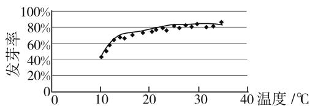

# 多管数据分析,培养核心素养

# ● 甘肃省高台县第一中学 王学成

数据分析作为大数据时代数学应用的主要方面，是数学新课标中创新性指出的六大核心素养之一，“互联网+”等领域的主要数学方法，已经深入到科学、技术、工程、信息和现代社会生活领域的方方面面。数据分析的关键是获取数据，利用统计方法来对数据进行有效整理、分析、处理和推断，进而得以分析问题、研究对象、解决问题。本文结合2020年高考数学真题，通过高考的“指挥棒”，结合实例来剖析数据分析的培养与渗透方法，指导数学教学与学习，以期抛砖引玉。

# 一、借助图表分析提取数据信息

根据题目条件中给出的图形或表格,从中分析并提取相应的数据信息,通过收集数据、整理数据、描述数据、分析数据、应用数据等一系列的数据分析,合理转化,巧妙应用,进而达到解决实际问题的目的.

例 1 （2020 年全国卷 I 文科、理科第 5 题）某校一个课外学习小组为研究某作物种子的发芽率 y 和温度 x（单位：℃）的关系，在 20 个不同的温度条件下进行种子发芽实验，由实验数据 $(x_{i}, y_{i}) (i = 1, 2, \cdots, 20)$ 得到下面的散点图。由此散点图，在 $10^{\circ}C$ 与 $40^{\circ}C$ 之间，下面四个回归方程类型中最适宜作为发芽率 y 和温度 x 的回归方程类型的是（）。

A. $y = a + bx$

B. $y = a + bx^{2}$

C. $y = a + be^{x}$

D. $y = a + b \ln x$

line

| 温度 /℃ | 发芽率 |
| -------- | ------ |
| 0        | 0%     |
| 10       | 40%    |
| 20       | 70%    |
| 30       | 80%    |
| 40       | 85%    |

图 1

分析:根据题目条件中图表——散点图的分布规律,从而提取数据信息,结合散点图分布的图像规律加以选择合适的函数模型,作出正确的判断.

解:由散点图分布可知,散点图分布在一个对数函数的图像附近,因此,最适合作为发芽率 y 和温度 x 的回归方程类型的是 $y = a + b \ln x$ .

故选 D.

点评:借助图表中的数据信息加以合理分析,综合散点图分布的图像规律以及基本初等函数模型的应用,加以合理分析与规律总结,从而作出合理的数据分析与判断.解决涉及统计中的图表信息问题,关键是从统计的图表中正确提取对应的数据信息,并加以合理转化与正确应用,从而合理地进行数据分析与数据处理.

# 二、借助规律归纳提取数据信息

借助一些相应的关系式、不等式、图表信息等加以合理规律归纳，从中提取函数、不等式、数列以及其他相关知识中规律的数据信息，增强基于数学的表达，形成数学问题中对应数据来正确认识事物的思维品质，进而依托数据探索数学问题的本质、关联和规律的问题.

例 2 （2020 年全国卷 Ⅲ 文科第 3 题）设一组样本数据 $x_{1}, x_{2}, \cdots, x_{n}$ 的方差为 0.01，则数据 $10x_{1}, 10x_{2}, \cdots, 10x_{n}$ 的方差为（）.

A. 0.01

B. 0.1

C. 1

D. 10

分析:根据样本数据的平均数、方差的公式与性质加以规律归纳,进而提取相应的数据信息,从而得以确定数据的相关问题.

解法 1: 设数据 $x_{1}, x_{2}, \cdots, x_{n}$ 的平均数为 $\bar{x}$ ，则有 $x_{1} + x_{2} + \cdots + x_{n} = n\bar{x}$ ，且 $\frac{1}{n}\left[(x_{1} - \bar{x})^{2} + (x_{2} - \bar{x})^{2} + \cdots + (x_{n} - \bar{x})^{2}\right] = 0.01$ ，而数据 $10x_{1}, 10x_{2}, \cdots, 10x_{n}$ 的平均数为 $10\bar{x}$ ，则其方差为 $\frac{1}{n}\left[(10x_{1} - 10\bar{x})^{2} + (10x_{2} - 10\bar{x})^{2} + \cdots + (10x_{n} - 10\bar{x})^{2}\right] = 100 \cdot \frac{1}{n}\left[(x_{1} - \bar{x})^{2} + (x_{2} - \bar{x})^{2} + \cdots + (x_{n} - \bar{x})^{2}\right] = 100 \times 0.01 = 1.$

故选 C.

解法 2: 由于数据 $x_{1}, x_{2}, \cdots, x_{n}$ 的方差为 $s^{2} = 0.01$ ，那么数据 $10x_{1}, 10x_{2}, \cdots, 10x_{n}$ 的方差为 $10^{2}s^{2} = 100 \times 0.01 = 1$ .

故选 C.

点评:通过统计数据的平均数与方差的规律来提取数据信息,根据数据的平均数、方差的性质加以规律归纳:若数据 $x_{1}, x_{2}, \cdots, x_{n}$ 的平均数为 $\overline{x}$ , 方差为 $s^{2}$ , 那么数据 $ax_{1} + b, ax_{2} + b, \cdots, ax_{n} + b$ 的平均数为 $a\overline{x} + b$ , 方差为 $a^{2}s^{2}$ .

# 三、借助逻辑推理提取数据信息

从题目条件入手,通过合理的逻辑推理,从相关数学问题中提取有效的数据信息,合理建立相应的数学模型,并对数据加以合理分析、整理,进一步加以应用,达到破解问题的目的,从而真正合理利用数据分析来解决相应的数学问题.

例 3 （2020 年新高考卷 I（山东卷）第 14 题）将数列 $\{2n-1\}$ 与 $\{3n-2\}$ 的公共项从小到大排列得到数列 $\{a_{n}\}$ ，则 $\{a_{n}\}$ 的前 n 项和为 \_\_\_\_.

分析:通过两个数列的通项公式依次对数列中对应项的罗列,结合条件信息观察确定两个数列的公共项,并加以逻辑推理,从而归纳确定新数列的类型与特征,结合数列求和公式来转化与应用.

解: 数列 $\{2n-1\}$ 为: 1,3,5,7,9,11,13,15,17,19,21,23,25,27,…;

数列 $\{3n-2\}$ 为:1,4,7,10,13,16,19,22,25,28,31,34,….

观察可知,这两个数列的公共项依次为:1,7,13,19,25,…,由此归纳可知新数列 $\{a_{n}\}$ 是以1为首项,以6为公差的等差数列,所以 $\{a_{n}\}$ 的前n项和为 $S_{n}=n\cdot1+\frac{n(n-1)}{2}\cdot6=3n^{2}-2n.$

故填答案: $3n^{2}-2n.$

点评: 此题为客观题, 解答过程无需展示, 因而可以通过列举, 通过逻辑推理加以归纳来达到目的. 具体操作时, 找公共项应该在公差较大的数列里找间隔小, 且项与项之间的间隔相等的项. 由于数据信息隐藏于题目条件中, 借助合理的逻辑推理加以正确分析数据信息, 通过分析提取数据信息并加以有效利用, 合理转化, 巧妙破解.

# 四、借助创新定义提取数据信息

根据题目条件中给出的创新定义,结合创新的公式、运算、图表、数表等应用背景中提取出有效的数据信息,通过对相应数据的收集、整理,进而结合相关的数学知识加以分析与应用,达到合理创新与有效应用,进而达到解决问题的目的.

例 4 （2020 年全国卷Ⅱ文科第 3 题）将钢琴上的 12 个键依次记为 $a_{1}, a_{2}, \cdots, a_{12}$ . 设 $1 \leqslant i < j < k \leqslant 12$ , 若 k - j = 3 且 j - i = 4, 则称 $a_{i}, a_{j}, a_{k}$ 为原位大三和弦; 若 k - j = 4 且 j - i = 3, 则称 $a_{i}, a_{j}, a_{k}$ 为原位小三和弦. 用这 12 个键可以构成的原位大三和弦与原位小三和弦的个数之和为().

A. 5

B. 8

C. 10

D. 15

分析:结合创新定义,通过钢琴中专用名词的定义——原位大三和弦与原位小三和弦,利用数学中的不等式条件和函数关系式与创新定义加以对应,结合罗列法的应用,得以分析与确定对应的二者的个数之和问题.

解:由于 k-j=3 且 j-i=4, 则原位大三和弦分别有: i=1, j=5, k=8; i=2, j=6, k=9; i=3, j=7, k=10; i=4, j=8, k=11; i=5, j=9, k=12. 共 5 个.

由于 k-j=4 且 j-i=3，则原位小三和弦分别有：i=1,j=4,k=8；i=2,j=5,k=9；i=3,j=6,k=10；i=4,j=7,k=11；i=5,j=8,k=12。共 5 个。

所以用这 12 个键可以构成的原位大三和弦与原位小三和弦的个数之和为 $5 + 5 = 10$ .

故选 C.

点评:抓住创新定义,结合钢琴中的相关名词,实现数学与艺术之间的融合与转化,利用艺术学科中的一些专业性的名词的定义来合理设置,创新性强,应用性高.破解此类问题的关键是正确理解创新定义,为数据分析与处理提供理论条件,并为正确的数据分析指明方向,活用概念,综合应用.

数据分析是对相关数据的一种分析和理解,从而达到利用数据解决具体问题的目的.数据分析这一数学核心素养,在处理数学问题过程中,要把握“数据分析观念”这一核心点,抓住“收集数据、整理数据、描述数据、分析数据、应用数据”这一主轴线,把一个个具体数学知识与数学问题中的数据充分分析并理解到位,能加以合理转化与正确利用,通过数据分析来解决具体的问题.在数学核心素养视域下倡导数据分析素养,培养我们对数据的敏感性,掌握对数据的辨析能力,养成利用数据去推测问题的良好习惯,进而达到利用数据分析思维去认知与应用的目的,改进破解问题的思维方式和解决问题的基本模式,为未来的学习与终身发展打下良好的基础.

# 参考文献：

[1] 中华人民共和国教育部. 普通高中数学课程标准 (2017 年版) [S]. 北京: 人民教育出版社, 2018. F