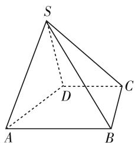
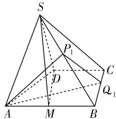
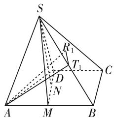

# 寸有所长,尺有所短

——由一道题看“综合法”和“向量法”

● 江苏省扬州市公道中学 王丽

# 一、问题提出

解决立体几何的方法通常称为“综合法”和“向量法”. 以前江苏对于综合法是比较弱化的, 但是如今改革明确了将综合法求空间角与距离列入江苏省 2021 年高考的内容. 在选择性必修主题二“空间向量与立体几何”中, 这样阐述: 运用向量的方法研究空间基本图形的位置关系和度量关系, 体会向量方法和综合几何方法的共性和差异, 运用向量方法解决简单的数学问题和实际问题, 感悟向量是研究几何问题的有效工具. 鉴于综合法和坐标法在考查学生能力上侧重点不同, 命题人在出题时肯定会考虑: 是偏向综合法, 还是偏向坐标法, 或两者兼顾. 江苏新高考到底会采用哪种风格, 从现在 (2021 年 4 月) 收到的信息看, 还未可知. 因此, 需要熟练掌握这两种解法. 但是对于一种题型, 提供了多种解法, 无疑使学生在做题的过程中有了更多的选择, 按理说成功率也应该大大提高. 但在通过实践教学与调查研究中发现, 学生对立体几何的学习并没有因为解法的多样性而变得轻松.

下面,本人就最近的一道测试题,分别运用综合法和向量法进行求解.

# 二、试题呈现

问题 如图 1, 在四棱锥 S-ABCD 中, $AB \parallel CD$ , $BC \perp CD$ , 侧面 SAB 为等边三角形, AB=BC=2, CD=SD=1.

(1) 证明: SD ⊥ 平面 SAB;  
(2) 求二面角 A - SB - C 的平面角的正弦值.

# 三、试题评析

(1) 略.   
(2) 我们知道二面角的平面角的范围是 $0^{\circ} < \theta \leqslant 180^{\circ}(0^{\circ}, 180^{\circ}]$ .

二面角的的定义:从一条直线出发的两个半平面所组成的图形.

text_image

S
D
C
A
B

图 1

二面角一般的求解步骤:① 找:找出图形中二面角,若没有,要作出其平面角;② 证:证明所找(作)出的二面角就是该二面角的平面角;③ 算:计算出该平面角.其中第一步(“找”)是关键.

# 1. 定义法

在棱上取一点,在两个半平面内作垂直于棱的两条射线,这两条射线的夹角.

方法 1: 如图 2, 作 $AP_{1} \perp SB$ 于 $P_{1}$ , 过 $P_{1}$ 作 $P_{1}Q_{1} \perp SB$ 交 BC 于 $Q_{1}$ , 所以 $\angle AP_{1}Q_{1}$ 为二面角 A - SB - C 的平面角.

因为等边 $\triangle SAB, AB = 2,$ $BP_{1}=1$ , 所以 $AP_{1}=\sqrt{3}$ .

又 M 是 AB 的中点, 由(1)得 $AB \perp$ 平面 SDM, $AB \parallel CD$ , 所以 $CD \perp$ 平面 SDM.

text_image

S
P₁
D
C
Q₁
A
M
B

图 2

因为 $SD \subseteq$ 平面 SDM, CD = SD = 1, 所以 $CD \perp SD$ , $SC = \sqrt{2}$ , 所以 $\cos \angle SBC = \frac{SB^{2} + BC^{2} - SC^{2}}{2 \cdot SB \cdot BC} = \frac{4 + 4 - 2}{2 \times 2 \times 2} = \frac{3}{4}$ .

在 $\mathrm{Rt}\triangle P_1BQ_1$ 中 $\cos \angle SBC = \frac{BP_1}{BQ_1} = \frac{3}{4}$ ，所以 $BQ_{1} = \frac{4}{3}, P_{1}Q_{1} = \sqrt{BQ_{1}^{2} - BP_{1}^{2}} = \frac{\sqrt{7}}{3}$ ，而 $AQ_{1} = \sqrt{AB^{2} + BQ_{1}^{2}} = \frac{2\sqrt{13}}{3}$ ，所以 $\cos \angle AP_1Q_1 = \frac{AP_1^2 + P_1Q_1^2 - AQ_1^2}{2\cdot AP_1\cdot P_1Q_1} = -\frac{\sqrt{21}}{7}$ ，所以 $\sin \angle AP_1Q_1 = \frac{2\sqrt{7}}{7}$ .

分析: 方法1是从二面角的定义出发. 由于题中有等边三角形, 所以自然想到取棱 SB 的中点存在垂直, 作出平面角, 然后运用余弦定理求出角的大小, 知道这是一个钝角.

# 2. 三垂线法

过一个半平面内一点作另一个半平面的一条垂线, 过这个垂足再作棱的垂线.

方法2:如图3,作 $AR_{1}\perp$ 平面SBC于 $R_{1}$ ,过 $R_{1}$ 作 $R_{1}T_{1}\perp SB$ 于 $T_{1}$ ,连接 $AT_{1}$ .因为 $AR_{1}\perp$ 平面SBC, $R_{1}T_{1},SB\subseteq$ 平面SBC,所以 $AR_{1}\perp SB,AR_{1}\perp R_{1}T_{1}$ .

text_image

S
R₁
T₁
D
N
A
M
B
C

图3

又因为 $R_{1}T_{1}\perp SB,AR_{1}\cap$ $R_{1}T_{1} = R_{1}$ ，所以 $SB\perp$ 平面 $AR_{1}T_{1}$ ，所以 $SB\perp AT_1$ 所以 $\angle R_1T_1A$ 为二面角 $A - SB - C$ 的平面角.

由方法1得 $\cos \angle SBC = \frac{3}{4},\sin \angle SBC = \frac{\sqrt{7}}{4}$ 所以 $S_{\triangle SBC} = \frac{1}{2}\times SB\times BC\times \sin \angle SBC = \frac{\sqrt{7}}{2}.$

由方法1得 $AB \perp$ 平面SDM. 因为 $AB \subseteq$ 平面ABCD, 所以平面 $ABCD \perp$ 平面SDM, 且平面 $ABCD \cap$ 平面 $SDM = DM$ , 作 $SN \perp DM$ 于 $N$ , 即 $SN \perp$ 平面ABCD.

因为 $SD = 1, SM = \sqrt{3}, DM = 2$ ，在 Rt△SDM 中，有 $SN = \frac{\sqrt{3}}{2}, V_{A - SBC} = V_{S - ABC}, \frac{1}{3} \times AR_1 \times S_{\triangle SBC} = \frac{1}{3} \times SN \times S_{\triangle ABC}, AR_1 = \frac{2\sqrt{21}}{7}$ .

又因为 $AT_{1}=\sqrt{3}$ ，所以 $\sin\angle R_{1}T_{1}A=\frac{2\sqrt{7}}{7}$ .

分析: 方法2是运用三垂线的方法, 先找平面的垂线, 作出一个直角三角形. 运用了等积法, 难度在于如何求四棱锥里三棱锥的高. 对空间想象能力、逻辑推理能力的要求比定义法要高, 难度也更大.

# 3. 空间直角坐标系

设平面 $\alpha, \beta$ 所构成的二面角的平面角的大小为 $\theta$ ，平面 $\alpha, \beta$ 的法向量为 $n_{1}, n_{2}$ ，则 $\cos\theta = \cos\langle n_{1}, n_{2} \rangle$ 或 $-\cos\langle n_{1}, n_{2} \rangle$ .

方法 3: 令 $SO \perp$ 平面 ABCD, $SO = \frac{\sqrt{3}}{2}$ , O 为坐标原点, 建立空间直角坐标系, 则 $S\left(0, 0, \frac{\sqrt{3}}{2}\right)$ .

又因为 $OM = \frac{3}{2}, OD = \frac{1}{2}$ , 所以 $B\left(\frac{3}{2}, 1, 0\right)$ , $A\left(\frac{3}{2}, -1, 0\right), C\left(-\frac{1}{2}, 1, 0\right)$ , 所以 $\overrightarrow{SB} = \left(\frac{3}{2}, 1, -\frac{\sqrt{3}}{2}\right), \overrightarrow{SA} = \left(\frac{3}{2}, -1, -\frac{\sqrt{3}}{2}\right), \overrightarrow{SC} = \left(-\frac{1}{2}, 1, -\frac{\sqrt{3}}{2}\right)$ .

设 m 是平面 SAB 的法向量，

则 $\left\{\begin{aligned}\frac{3}{2}x+y-\frac{\sqrt{3}}{2}z=0,\\ \frac{3}{2}x-y-\frac{\sqrt{3}}{2}z=0,\end{aligned}\right.$ $m=(1,0,\sqrt{3}).$

设 n 是平面 SBC 的法向量，

则 $\left\{\begin{aligned}\frac{3}{2}x+y-\frac{\sqrt{3}}{2}z=0,\\ -\frac{1}{2}x+y-\frac{\sqrt{3}}{2}z=0,\end{aligned}\right.$ $n=\left(0,\frac{3}{2},\sqrt{3}\right).$

$\cos\langle m,n\rangle=\frac{m\cdot n}{|m||n|}=\frac{\sqrt{21}}{7}$ ，二面角A-SB-C的平面角的正弦值为 $\frac{2\sqrt{7}}{7}$ .

分析: 方法3主要是运用空间向量的知识, 不需要考虑几何体里点、线、面之间的关系, 从而将复杂的问题化繁为简, 相比较于综合法难度有下降, 主要难度在于空间直角坐标系的建立和坐标的求解.

# 四、总结反思

在教学过程中,我发现我所教的学生解几何问题时,首先会考虑建立空间直角坐标系,如果建系比较困难,这时一部分学生便会在畏难情绪的作用下放弃.还有一部分学生会在此基础上回忆相关知识点,凭借解题经验,借助直觉选择大概的思路和解题方向,在不断尝试与调整思考方向中获得成功.所以在教学过程中我采取了以下措施.

鼓励学生勇于探索,不要一味依赖向量法.每位学生个性存在差异,在解几何问题遇到困难时,便会产生非智力型的思维障碍,从而心情沮丧,消极思考甚至是拒绝思考.因此作为教师,我们平时应当多搜集教学资源,由简到繁,循序渐进,使学生产生成功的体验并建立自信心.还可以在班级中开展合适的教学活动或者私下找同学交流心得,使学生积极、主动地投入到几何学习中来.

重视基础概念,应用转化和化归策略,提高几何思维.现在高中生学习压力大,任务繁重.导致几何认知结构不良,在解题过程中思维凌乱,新旧知识间联系不起来,认知结构混乱,分析综合能力薄弱.

提高几何论证能力. 几何论证教学过程中采用启发式教学, 采用目标分解法展示思维发展过程. 引导学生确认几何论证的当前状态(已知条件)与目标状态(论证)之间的差别, 确认子目标后, 我们再及时启示或指引, 让学生独立思考. 通过观察, 分析, 比较, 猜想, 验证等步骤, 解决论证问题. W