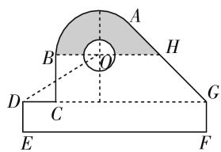
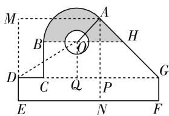
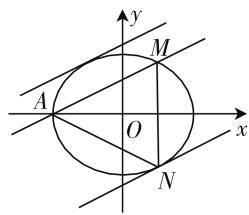

# 推进数学试题变革,引领高考试点改革

# ● 江苏省苏州市田家炳高级中学 何小寅

2020 年,新高考数学不分文理科,是山东、海南两个省份为试点实行综合改革后的首次高考,后继将不断全面铺开、完善、推进.新高考数学坚决落实立德树人的根本任务,全面贯彻高考评价体系的要求,更新评价理念,坚持高考改革,推进探索创新,在命题基本内容改革、试题结构改革以及整体难度调控改革等方面都进行了合理化的过渡,创新性的探索,为全面推进奠定了坚实的基础.

# 一、命题基本内容改革

2020 年全国高考新高考数学卷Ⅰ和卷Ⅱ的命题,内容上紧紧围绕新高考数学的考试大纲,合理关注《普通高中数学课程标准(实验版)》和《普通高中数学课程标准(2017年版)》这两个标准中的公共内容与要求,依据《新高考过渡期数学学科考试范围说明》的精神,多方考虑,合理过渡,科学设计,展示特色,体现了引导与创新,改革与应用.

新高考数学考试基本内容与老高考数学考试基本内容的比较,主要通过新旧课程标准的考试基本内容来比较:

<table><tr><td></td><td>与原文科相比</td><td>与原理科相比</td></tr><tr><td>减少的内容</td><td>映射三视图算法系统抽样几何概型一元二次函数与简单线性规划推理与证明框图统计案例</td><td>映射三视图算法系统抽样几何概型一元二次函数与简单线性规划推理与证明定积分与微积分基本定理统计案例</td></tr><tr><td>增加的内容</td><td>有限样本空间百分位数空间向量与立体几何计数原理数学建模活动与数学探究活动</td><td>有限样本空间百分位数数学建模活动与数学探究活动</td></tr><tr><td>弱化的内容</td><td>常用逻辑用语</td><td>计数原理圆锥曲线与方程常用逻辑用语</td></tr></table>

例 1 （2020 年新高考卷 I（山东卷）第 15 题，新

高考卷Ⅱ(海南卷)第16题)某中学开展劳动实习,学生加工制作零件,零件的截面如图1所示. O为圆孔及轮廓圆弧AB所在圆的圆心,A是圆弧AB与直线AG的切点,B是圆弧AB与直线BC的切点,四边形DEFG为矩形, $BC\perp DG$ ,垂足为C, $\tan\angle ODC=\frac{3}{5}$ , $BH\parallel DG$ ,EF=12cm,DE=2cm,A到直线DE和EF的距离均为7cm,圆孔半径为1cm,则图中阴影部分的面积为\_\_\_\_cm².

text_image

Geometric diagram with labeled points and shaded region, likely from a math problem or proof

图 1

text_image

M
A
B
H
D
C
Q
P
E
N
F
G

图 2

分析:根据题目条件,结合平面几何特征,适当引进辅助线,进而利用三角形的相关知识以及三角函数在实际中的应用,把阴影部分合理分割,从而得以求解.

解析:设圆弧 AB 所对应的圆的半径 OB = OA = r，如图 2 所示，过点 A 作 $AM \perp DE, AN \perp EF$ ，垂足分别为 M, N, AN 与 DG 交于点 P，结合题目条件 AM = AN = 7。又 EF = 12，可得 NF = 5, AP = 5，则知 $\angle AGP = 45^{\circ}$ ，而 $BH \parallel DG$ ，结合“两直线平行，同位角相等”的性质有 $\angle AHO = 45^{\circ}$ 。又由题目条件 AG 与圆弧 AB 相切于 A 点，可得 $OA \perp AG$ ，则知 $\triangle OAH$ 为等腰直角三角形，那么在 Rt△OQD 中，可知 $OQ = 5 - \frac{\sqrt{2}}{2}r, DQ = 7 - \frac{\sqrt{2}}{2}r$ ，结合 $\tan \angle ODC = \frac{OQ}{DQ} = \frac{3}{5}$ ，则有 $21 - \frac{3\sqrt{2}}{2}r = 25 - \frac{5\sqrt{2}}{2}r$ ，解得 $r = 2\sqrt{2}$ ，则可得等腰 Rt△OAH 的面积为 $S_{1} = \frac{1}{2} \times (2\sqrt{2})^{2} = 4$ ，扇形 AOB 的面积为 $S_{2} = \frac{1}{2} \times \frac{3\pi}{4} \times (2\sqrt{2})^{2} = 3\pi$ ，那么所求的图中阴影部分的面积为 $S = S_{1} + S_{2} - \frac{\pi}{2} = 4 + \frac{5\pi}{2}$ 。

故填答案: $4+\frac{5\pi}{2}$ .

# 二、试题结构改革

2020年全国高考新高考数学卷Ⅰ和卷Ⅱ在试卷结构上进行了创新性改革，科学安排，合理调配，试题结构涉及单项选择题(8题40分)与多项选择题(4题20分)、填空题(4题20分)、解答题(6题70分)这4个部分，而老高考的试题结构涉及选择题(这里只有单项选择题,12题60分)、填空题(4题20分)、解答题(7题70分,其中包括5个必考题和2个选考题,实际上也是6题)这3个部分,两者比较下来总题量还是22题(老高考是23题,实做也是22题).试题结构很好地把握了稳定与创新、稳定与改革的关系.

# 三、整体难度调控改革

2020 年全国高考新高考数学试题根据数学学科特点,合理科学调控试卷的整体难度,贯彻“低起点,多层次,高落差”的科学调控策略,坚持高考数学的基础性、综合性、应用性和创新性的要求,命制出适合不同层次的学生水平的试题,充分体现试卷的选拔性与区分度.

其中，“低起点”体现为试题重视基础性，“多层次”体现为试题重视难度和思维的层次性，“高落差”体现为重视高考数学的综合性、应用性与创新性.

比如 2020 年全国高考新高考卷Ⅰ、卷Ⅱ第 21 题、第 22 题的问题设置就是基于“低起点，多层次，高落差”的科学调控策略来合理设计的，第(1)问以以往老高考文科试题的难度层次呈现，从数学中的基本概念、基本知识以及基本方法等入手，起点比较低，破解入口宽，面向全体考生；第(2)问题，设置有一定的层次性与综合性，从数学中思维方法与能力、综合素养与能力、综合应用等入手，题目要求比较高，有一定的难度，同时解题方法多种，思维方式多样，能给不同层次水平的学生提供多种选择，充分体现试题的选拔性.

例 2 （2020 年新高考卷 II（海南卷）第 21 题）已知椭圆 $C: \frac{x^{2}}{a^{2}} + \frac{y^{2}}{b^{2}} = 1 (a > b > 0)$ 过点 $M(2,3)$ ，点 A 为其左顶点，且 AM 的斜率为 $\frac{1}{2}$ .

(1) 求 C 的方程;  
(2) 点 N 为椭圆上任意一点, 求 $\triangle AMN$ 的面积的最大值.

分析:(1) 结合条件, 通过点斜式直线方程的确定, 进而确定对应的参数 a 的值, 并结合点在椭圆上确定参数 b 的值, 得以求解椭圆的方程; (2) 根据条件设出与直线 AM 平行的直线方程, 与椭圆方程联立, 利用函数与方程的转化, 利用判别式法来确定参数值, 结合两平行线之间的距离来确定点到直线的最大距离, 结合两点间的距离公式求解弦长, 进而利用三

角形的面积公式即可确定三角形的面积的最大值.

解析:(1)由题意可知,直线AM的点斜式方程为 $y-3=\frac{1}{2}(x-2)$ ,整理有x-2y=-4,当y=0时,可得x=-4,故a=4.又椭圆 $C:\frac{x^{2}}{16}+\frac{y^{2}}{b^{2}}=1(a>b>0)$ 过点 $M(2,3)$ ,将对应的坐标代入有 $\frac{4}{16}+\frac{9}{b^{2}}=1$ ,可得 $b^{2}=12$ ,所以椭圆C的方程为 $\frac{x^{2}}{16}+\frac{y^{2}}{12}=1$ .

(2) 由(1)，设与直线 AM: x-2y=-4 平行的直线 l 的方程为 x-2y=m，当直线 l 与椭圆 C 相切时，设与直线 AM 距离较远的直线 l 与椭圆 C 的切点为 N，如图 3 所示，此时 $\triangle AMN$ 的面积取得最大值，

text_image

y
M
A
O
x
N

图 3

将 $x=2y+m$ 代入椭圆 $C:\frac{x^{2}}{16}+\frac{y^{2}}{12}=1$ ，消元并整理可得 $16y^{2}+12my+3m^{2}-48=0$ 。由题知 $\Delta=144m^{2}-4\times16\times(3m^{2}-48)=0$ ，整理有 $m^{2}=64$ ，得 $m=\pm8$ ，而与 AM 距离较远的直线 l 的方程为 x-2y=8。又点 N 到直线 AM 的距离即为此两条平行线之间的距离，则有 $d=\frac{8+4}{\sqrt{1+4}}=\frac{12\sqrt{5}}{5}$ ，由两点之间距离公式可得 $|AM|=\sqrt{(2+4)^{2}+3^{2}}=3\sqrt{5}$ ，所以 $\triangle AMN$ 的面积的最大值为 $\frac{1}{2}\times3\sqrt{5}\times\frac{12\sqrt{5}}{5}=18$ 。

其实,整体试卷的设置也是符合“低起点,多层次,高落差”的科学调控策略.从新高考卷Ⅰ、卷Ⅱ第1～5题、第13～14题、第17～18题等基本题,上升到新高考卷Ⅰ、卷Ⅱ第6～7题、第9～10题、第15题、第19～20题等中等题,再拓展到新高考卷Ⅰ、卷Ⅱ第8题、第11～12题、第16题、第21～22题等难度题,渐进式螺旋上升,给不同的学生提供不同的发展空间,更适合于不同认知水平的学生自我发现和探索的平台,有利于学生思维的灵活性和深刻性的发展,方法的综合性与探究性的拓展,能力的创造性与应用性的把握,合理区分,全面体现试卷的选拔性与区分性.

2020年全国高考新高考数学试题紧紧把握高考改革精神，引领时代风向，从而合理创新试题设计，优化数学试卷结构，倡导数学核心素养，充分把握新高考数学过渡与改革过程中稳定与创新、过渡与改革、继承与创新等之间的关系，从而全面推进高考综合改革，有效引导中学数学教学.