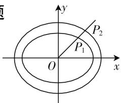
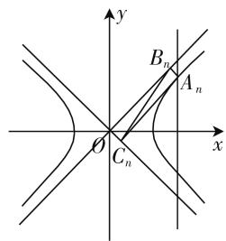

# 数列与解几碰撞,融合携创新共鸣

# 浙江省台州中学 阮洋洋

在知识网络交汇点处设计创新型试题是高考数学命题的指导方针与必然趋势,此类试题设计新颖,内涵丰富,创新新颖,富有美感,是数学知识、数学应用与创新能力的更深层次的有机融合与重要载体.而把数列与解析几何有机地结合在一起,巧妙将两大重要知识体系加以有机融合,能充分体现其强大的考查能力,综合性强,立意新颖,难度较大,具有较好的选拔性与区分度,其地位在高考中将越来越重要,备受各方关注.

# 一、数列与直线融合问题

例 1 已知 O 为坐标原点，点 A(1,0)，B(0,1) 和互不相同的点 $P_{1}, P_{2}, P_{3}, \cdots, P_{n}, \cdots$ ，满足 $\overrightarrow{OP_{n}} = a_{n}\overrightarrow{OA} + b_{n}\overrightarrow{OB}(n \in \mathbb{N}^{*})$ ，其中 $\{a_{n}\}, \{b_{n}\}$ 分别为等差数列和等比数列，若 $P_{1}$ 是线段 AB 的中点.

(1) 试确定 $a_{1}, b_{1}$ 的值;  
(2) 试判断点 $P_{1}, P_{2}, P_{3}, \cdots, P_{n}, \cdots$ 能否在同一条直线上，请证明你的结论.

分析:(1) 直接利用平面向量的中点公式,并结合条件直接来确定 $a_{1},b_{1}$ 的值;(2) 结合等差数列的公差与等比数列的公比的设置,通过两参数的取值情况加以分类讨论,从而判断对应的点是否共线问题.

解:(1)由于点 $P_{1}$ 是线段AB的中点,所以 $\overrightarrow{OP_{1}}=\frac{1}{2}\overrightarrow{OA}+\frac{1}{2}\overrightarrow{OB}$ ,又 $\overrightarrow{OP_{1}}=a_{1}\overrightarrow{OA}+b_{1}\overrightarrow{OB}$ ,且 $\overrightarrow{OA},\overrightarrow{OB}$ 不共线,结合平面向量的基本定理,可知 $a_{1}=b_{1}=\frac{1}{2}$ .

(2) 由 $\overrightarrow{OP_n} = a_n\overrightarrow{OA} + b_n\overrightarrow{OB} (n\in \mathbf{N}^*)\Rightarrow \overrightarrow{OP_n} = (a_n,b_n)$ , 设等差数列 $\{a_n\}$ 的公差为 $d$ , 等比数列 $\{b_n\}$ 的公比为 $q$ . 由于点 $P_{1}, P_{2}, P_{3}, \dots, P_{n}, \dots$ 是互不相同的点, 则 $d = 0, q = 1$ 不会同时成立.

① 若 $d=0, q \neq 1$ ，则 $a_{n}=a_{1}=\frac{1}{2}(n \in \mathbf{N}^{*}) \Rightarrow$ 点 $P_{1}, P_{2}, P_{3}, \cdots, P_{n}, \cdots$ 都在直线 $x=\frac{1}{2}$ 上；  
② 若 $q=1, d \neq 0$ ，则 $b_{n}=\frac{1}{2}$ 为常数列 $\Rightarrow$ 点 $P_{1}$ ， $P_{2}, P_{3}, \cdots, P_{n}, \cdots$ 都在直线 $y = \frac{1}{2}$ 上；

③若 $d\neq0$ 且 $q\neq1$ ，点 $P_{1},P_{2},P_{3},\cdots,P_{n},\cdots$ 在同一条直线上 $\Leftrightarrow\overrightarrow{P_{n-1}P_{n}}=(a_{n}-a_{n-1},b_{n}-b_{n-1})$ 与 $\overrightarrow{P_{n}P_{n+1}}=(a_{n+1}-a_{n},b_{n+1}-b_{n})$ 始终共线 $(n\geqslant2,n\in\mathbf{N}^{*})\Leftrightarrow(a_{n}-a_{n-1})(b_{n+1}-b_{n})-(a_{n+1}-a_{n})(b_{n}-b_{n-1})=0\Leftrightarrow d(b_{n+1}-b_{n})-d(b_{n}-b_{n-1})=0\Leftrightarrow b_{n+1}-b_{n}=b_{n}-b_{n-1}\Leftrightarrow q=1$ ，这与 $q\neq1$ 矛盾，所以当 $d\neq0$ 且 $q\neq1$ 时， $P_{1},P_{2},P_{3},\cdots,P_{n},\cdots$ 不可能在同一条直线上.

# 二、数列与圆融合问题

例 2 （2020 届江西省九江市高考数学一模数学试卷(理科)·12）在平面直角坐标系 xOy 中，已知 $A_{n}, B_{n}$ 是圆 $x^{2} + y^{2} = n^{2}$ 上两个动点，且满足 $\overrightarrow{OA_{n}} \cdot \overrightarrow{OB_{n}} = -\frac{n^{2}}{2} (n \in \mathbf{N}^{*})$ ，设 $A_{n}, B_{n}$ 到直线 $x + \sqrt{3}y + n(n + 1) = 0$ 的距离之和的最大值为 $a_{n}$ ，若数列 $\left\{\frac{1}{a_{n}}\right\}$ 的前 n 项和 $S_{n} < m$ 恒成立，则实数 m 的取值范围是（）.

A. $\left(\frac{3}{4},+\infty\right)$   
B. $\left[\frac{3}{4},+\infty\right)$   
C. $\left(\frac{3}{2},+\infty\right)$   
D. $\left[\frac{3}{2},+\infty\right)$

分析: 结合平面向量的数量积的转化, 引入线段 $A_{n}B_{n}$ 的中点 $C_{n}$ , 通过逻辑推理与转化, 利用直线与圆的位置关系以及点到直线的距离公式, 得以确定 $a_{n}$ 的通项公式, 再利用裂项法求解数列的和, 结合不等式恒成立推出结果即可.

解:由 $\overrightarrow{OA_{n}}\cdot\overrightarrow{OB_{n}}=-\frac{n^{2}}{2}$ ，可得 $\angle A_{n}OB_{n}=120^{\circ}$ ，设线段 $A_{n}B_{n}$ 的中点为 $C_{n}$ ，则 $C_{n}$ 在圆 $x^{2}+y^{2}=\frac{n^{2}}{4}$ 上，则有 $A_{n}, B_{n}$ 到直线 $x+\sqrt{3}y+n(n+1)=0$ 的距离之和等于点 $C_{n}$ 到该直线的距离的两倍。又点 $C_{n}$ 到直线距离的最大值为圆心到直线的距离与圆的半径之和，则有 $a_{n}=2\left[\frac{n(n+1)}{2}+\frac{n}{2}\right]=n^{2}+2n$ ，可得 $\frac{1}{a_{n}}=\frac{1}{n^{2}+2n}=\frac{1}{2}\left(\frac{1}{n}-\frac{1}{n+2}\right)$ ，所以 $S_{n}=\frac{1}{a_{1}}+\frac{1}{a_{2}}+\frac{1}{a_{3}}+$

$$
\begin{array}{l} \dots + \frac {1}{a _ {n}} = \frac {1}{2} \left(1 - \frac {1}{3}\right) + \frac {1}{2} \left(\frac {1}{2} - \frac {1}{4}\right) + \frac {1}{2} \left(\frac {1}{3} - \frac {1}{5}\right) + \\ \dots + \frac {1}{2} \left(\frac {1}{n} - \frac {1}{n + 2}\right) = \frac {1}{2} \left(1 + \frac {1}{2} - \frac {1}{n + 1} - \frac {1}{n + 2}\right) <  \\ \frac {1}{2} \Big (1 + \frac {1}{2} \Big) = \frac {3}{4}. \text {由于} S _ {n} <   m \text {恒成立,则有} m \geqslant \frac {3}{4}. \\ \end{array}
$$

故选 B.

# 三、数列与椭圆融合问题

例 3 （2020 届浙江省绍兴市高三下学期 4 月第一次高考模拟考试数学试题·9）如图 1，一系列椭圆 $C_{n}:\frac{x^{2}}{n+1}+\frac{y^{2}}{n}=$ $1(n \in \mathbf{N}^{*})$ ，射线 $y = x (x \geqslant 0)$ 与椭圆 $C_n$ 交于点 $P_n$ 设 $a_n = |P_n P_{n+1}|$ ，则数列 $\{a_n\}$ 是（ ）.

text_image

P₂
P₁
O
x
y

图 1

A. 递增数列

B. 递减数列

C. 先递减后递增数列

D. 先递增后递减数列

分析:根据题目条件,引入射线的参数方程,结合参数的几何意义得以确定 $a_{n}=t_{n+1}-t_{n}$ , 结合关系式的单调性,通过研究两代数式的平方的差的值的变化情况,来确定随着 n 的增大 $a_{n}$ 的变化规律,得以判定数列 $\{a_{n}\}$ 的单调性问题.

解：设射线 $y = x (x \geqslant 0)$ 的参数方程为 $\left\{\begin{aligned}x&=\frac{\sqrt{2}}{2}t,\\ y&=\frac{\sqrt{2}}{2}t\end{aligned}\right.$ $(t \geqslant 0)$ ，代入椭圆 $C_{n}:\frac{x^{2}}{n+1}+\frac{y^{2}}{n}=1(n\in$

$\mathbf{N}^{*})$ ，整理可得 $t = \sqrt{\frac{2n(n + 1)}{2n + 1}}$ ，可得 $t_n = \sqrt{\frac{2n(n + 1)}{2n + 1}}$ ，则 $t_{n + 1} = \sqrt{\frac{2(n + 1)(n + 2)}{2n + 3}}$ ，所以 $a_{n} =$

$$
\left| P _ {n} P _ {n + 1} \right| = t _ {n + 1} - t _ {n} = \sqrt {\frac {2 (n + 1) (n + 2)}{2 n + 3}} - \sqrt {\frac {2 n (n + 1)}{2 n + 1}},
$$

要判断上式随着 n 的增大, 相应的值是增大还是减小, 只需研究 $\frac{2(n+1)(n+2)}{2n+3}-\frac{2n(n+1)}{2n+1}$ 的值增大或减小即可，而 $\frac{2(n + 1)(n + 2)}{2n + 3} -\frac{2n(n + 1)}{2n + 1} =$

$$
\frac {4 (n + 1) ^ {2}}{(2 n + 3) (2 n + 1)} = \frac {4 n ^ {2} + 8 n + 4}{4 n ^ {2} + 8 n + 3} = 1 + \frac {1}{4 n ^ {2} + 8 n + 3},
$$

该关系式显然随着 n 的增大相应的值逐渐减小, 即 $a_{n}$ 逐渐减小, 所以该数列 $\{a_{n}\}$ 是递减数列.

故选 B.

# 四、数列与双曲线融合问题

例 4 （2019—2020 学年山东省济宁市高二（上）期末数学试卷·16)已知一组双曲线 $E_{n}:x^{2} - y^{2} = \frac{4}{n(n + 1)} (n\in \mathbf{N}^{*})$ ，设直线 $x = m(m > 2)$ 与 $E_{n}$ 在第一象限的交点为 $A_{n}$ ，点 $A_{n}$ 在 $E_{n}$ 的两条渐近线上的射影分别为点 $B_{n},C_{n}$ .记 $\triangle A_{n}B_{n}C_{n}$ 的面积为 $a_{n}$ ，则数列 $\{a_n\}$ 的前2020项和为

分析:通过双曲线的方程确定其两条渐近线方程,结合其垂直关系,利用点到直线的距离公式的应用,进而确定相应的三角形面积得以求解数列的通项公式,再利用裂项法求解数列的和即可.

解: 如图 2 所示, 双曲线 $E_{n}: x^{2} - y^{2} = \frac{4}{n(n+1)} (n \in \mathbf{N}^{*})$ 的两条渐近线分别为 $x + y = 0, x - y = 0$ , 两者互相垂直, 设点 $A_{n}(x_{0}, y_{0})$ , 则 $\left|A_{n}B_{n}\right| = \frac{\left|x_{0} - y_{0}\right|}{\sqrt{2}}$ ,

text_image

y
B_n
A_n
O
C_n
x

图2

$|A_{n}C_{n}|=\frac{|x_{0}+y_{0}|}{\sqrt{2}}$ ，易知 $\triangle A_{n}B_{n}C_{n}$ 为直角三角形，
所以 $a_{n}=\frac{1}{2}\times|A_{n}B_{n}|\times|A_{n}C_{n}|=\frac{x_{0}^{2}-y_{0}^{2}}{4}=$ $\frac{1}{n(n+1)}=\frac{1}{n}-\frac{1}{n+1}$ ，则数列 $\{a_{n}\}$ 前2020项和为 $S_{2020}=a_{1}+a_{2}+a_{3}+\cdots+a_{2020}=\left(1-\frac{1}{2}\right)+\left(\frac{1}{2}-\frac{1}{3}\right)+\left(\frac{1}{3}-\frac{1}{4}\right)+\cdots+\left(\frac{1}{2020}-\frac{1}{2021}\right)=1-\frac{1}{2021}=\frac{2020}{2021}.$

故填答案: $\frac{2020}{2021}$ .

通过数列与解析几何之间的交汇与融合,建立两大知识体系之间的渗透与碰撞,产生“火花”,进一步有效深入理解与掌握数列、解析几何等相关的数学知识,高效快速转化与处理,充分提高数学解题能力与应用能力,真正养成良好的数学品质,拓展数学思维,培养数学核心素养.

# 参考文献：

[1] 陈晓明. 对一道解几与数列交汇试题的探究 [J]. 中学数学研究, 2016(6).  
[2] 宁赛飞. 数列与解几综合问题的求解策略 [J]. 高中生之友, 2004(12). F