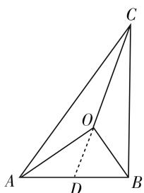
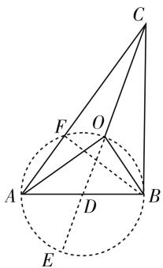
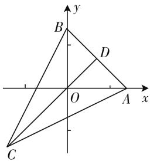
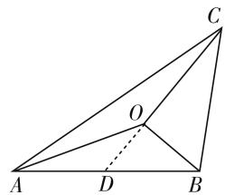

# 方法巧归纳,策略妙呈现

—— 一道数量积问题的探究

● 安徽省宣城中学 张绪根

求平面向量数量积的值、最值、范围问题是平面向量问题中的重点与难点之一，是充分体现在“知识点交汇处”命题的良好载体，也是近年高考试卷中常见常新的基本考点之一。此类问题往往以平面几何图形为背景，设置巧妙，形式活泼，交汇众多，难度较大，同时思维方式多变，破解方法多种多样。解决平面向量数量积问题的关键在于向实数转化的过程，其转化过程是解决问题的重中之重，也有一定的基本策略与规律可循。

# 一、问题呈现

问题 （2020届安徽省马鞍山市高中毕业班第三次教学质量监测理科数学·15）已知 $\triangle ABC$ 的重心为 $O, \angle AOB = \frac{\pi}{2}, AB = 2\sqrt{2}$ ，则 $\overrightarrow{CA} \cdot \overrightarrow{CB} =$ \_\_\_\_ .

此题以三角形为背景,通过三角形的重心、相关角的度数以及线段的长度来设置问题,进而确定两边所对应向量的数量积问题.问题简洁易懂,难度中等.解决问题时可以利用条件,通过平面向量思维、平面几何思维、解三角形思维、坐标思维以及极化恒等式思维等角度切入,结合条件来分析与求解,得以破解相关的问题.该题的解决方法与技巧是解决平面向量的数量积问题中最常见的一些破解策略.

# 二、问题破解

解法1:(基底法)如图1,延长CO交AB于点D,结合条件可知,D是线段AB的中点,且CO=2OD,而在 $\triangle ABO$ 中, $\angle AOB=\frac{\pi}{2},AB=2\sqrt{2}$ ,可得 $OD=\frac{1}{2}AB=\sqrt{2}$ ,所以 $\overrightarrow{CA}\cdot\overrightarrow{CB}=(\overrightarrow{CO}+\overrightarrow{OA})\cdot$ $(\overrightarrow{CO} + \overrightarrow{OB}) = \overrightarrow{CO}^2 + \overrightarrow{CO} \cdot (\overrightarrow{OA} + \overrightarrow{OB}) + \overrightarrow{OA} \cdot \overrightarrow{OB}$

text_image

Geometric diagram of triangle ABC with internal point O and auxiliary lines, labeled with vertices A, B, C, D, and O.

图 1

$$
= \overrightarrow {C O} ^ {2} + \overrightarrow {C O} \cdot 2 \overrightarrow {O D} = (2 \sqrt {2}) ^ {2} + 2 \sqrt {2} \cdot 2 \sqrt {2} = 1 6.
$$

故填答案:16.

点评:根据条件作出对应的辅助线,并利用三角形的重心性质确定线段之间的关系:CO=2OD,借助直角三角形的性质得以确定OD的长度,结合平面向量的线性运算把 $\overrightarrow{CA}\cdot\overrightarrow{CB}$ 加以合理转化,通过基底法来确定对应的数量积的值.

解法2:(平面几何法)如图2,延长CO交AB于点D,交 $\triangle ABO$ 的外接圆于点E,CA交 $\triangle ABO$ 的外接圆于点F,结合条件可知,D是线段AB的中点,且CO=2OD, $OE=AB=2\sqrt{2}$ ,而在 $\triangle ABO$ 中, $\angle AOB=\frac{\pi}{2},AB=2\sqrt{2}$ ,可得OD= $\frac{1}{2}AB=\sqrt{2}$ ,而点F在 $\triangle ABO$ 的

text_image

Geometric diagram with labeled points and lines, showing triangle ABC inscribed in a circle with auxiliary points D, E, F, O and dashed construction lines.

图 2

外接圆上, 可得 $\angle AFB = \frac{\pi}{2}$ , 则知 $\overrightarrow{CB}$ 在 $\overrightarrow{CA}$ 上的投影为 CF, 所以 $\overrightarrow{CA} \cdot \overrightarrow{CB} = CA \cdot CF$ . 利用圆的割线定理, 可得 $\overrightarrow{CA} \cdot \overrightarrow{CB} = CA \cdot CF = CO \cdot CE = 2\sqrt{2} \cdot 4\sqrt{2} = 16$ .

故填答案:16.

点评:根据条件作出对应的辅助线,并利用三角形的重心性质确定线段之间的关系 CO=2OD,借助直角三角形的性质得以确定 OD 的长度,结合圆的性质确定 OE 的长度以及投影关系,通过圆的割线定理的转化来求解对应的数量积的值.

解法3:(解三角形法)如图1,延长CO交AB于点D,结合条件可知,D是线段AB的中点,且CD=3OD,而在 $\triangle ABO$ 中, $\angle AOB=\frac{\pi}{2},AB=2\sqrt{2}$ ,可得 $OD=\frac{1}{2}AB=\sqrt{2}$ ,结合余弦定理,可得 $\overrightarrow{CA}\cdot\overrightarrow{CB}=$

$$
\begin{array}{l} | \overrightarrow {C A} | | \overrightarrow {C B} | \cdot \cos \angle A C B = | \overrightarrow {C A} | | \overrightarrow {C B} | \cdot \\ \frac {\left| \overrightarrow {C A} \right| ^ {2} + \left| \overrightarrow {C B} \right| ^ {2} - \left| \overrightarrow {A B} \right| ^ {2}}{2 \left| \overrightarrow {C A} \right| \left| \overrightarrow {C B} \right|} = \frac {1}{2} (\left| \overrightarrow {C A} \right| ^ {2} + \left| \overrightarrow {C B} \right| ^ {2} \\ - \mid \overrightarrow {A B} \mid^ {2}), \text {而结合三角形的中线定理,可得} \mid \overrightarrow {C A} \mid^ {2} \\ + \left| \overrightarrow {C B} \right| ^ {2} = 2 \left(\left| \overrightarrow {C D} \right| ^ {2} + \left| \overrightarrow {D B} \right| ^ {2}\right) = 2 \left[ (3 \sqrt {2}) ^ {2} + \right. \\ (\sqrt {2}) ^ {2} ] = 4 0 \text {, 所以} \overrightarrow {C A} \cdot \overrightarrow {C B} = \frac {1}{2} (\mid \overrightarrow {C A} \mid^ {2} + \mid \overrightarrow {C B} \mid^ {2} - \\ \mid \overrightarrow {A B} \mid^ {2}) = \frac {1}{2} [ 4 0 - (2 \sqrt {2}) ^ {2} ] = 1 6. \\ \end{array}
$$

故填答案:16.

点评:根据条件作出对应的辅助线,并利用三角形的重心性质确定线段之间的关系:CD=3OD,借助直角三角形的性质得以确定OD的长度,通过解三角形的余弦定理的应用与转化,结合三角形的中线定理,进而得以求解对应的数量积的值.

解法 4:(坐标法) 如图 3, 以 O 为坐标原点, 以 OA 所在直线为 x 轴, OB 所在直线为 y 轴建立平面直角坐标系, 延长 CO 交 AB 于点 D, 结合条件可知, D 是线段 AB 的中点, 设 $A(m,0)$ , $B(0,n)$ , 则 $D\left(\frac{m}{2}, \frac{n}{2}\right)$ , $m^{2} + n^{2} = 8$ , 结合三角形的重心性质,可得 $\overrightarrow{OC}=-2\overrightarrow{OD}=(-m,-n)$ ,即 $C(-m,-n)$ ,可得 $\overrightarrow{CA}=(2m,n),\overrightarrow{CB}=(m,2n)$ ,所以 $\overrightarrow{CA}\cdot\overrightarrow{CB}=(2m,n)\cdot(m,2n)=2m^{2}+2n^{2}=16.$

text_image

y
B
D
O
A x
C

图3

故填答案:16.

点评:根据条件以 O 为坐标原点建立相应的平面直角坐标系,设出对应点 A、B 的坐标,利用条件确定点 D 的坐标以及参数之间的关系 $m^{2} + n^{2} = 8$ , 利用三角形的重心性质并结合平面向量的线性运算与坐标运算来确定点 C 的坐标, 利用平面向量的数量积的坐标公式加以求解与转化, 得以求解对应的数量积的值.

解法5:(极化恒等式法)如图1,延长CO交AB于点D,结合条件可知D是线段AB的中点,且CD=3OD,而在 $\triangle ABO$ 中, $\angle AOB=\frac{\pi}{2}$ , $AB=2\sqrt{2}$ ,可得 $OD=\frac{1}{2}AB=\sqrt{2}$ ,结合极化恒等式,可得 $\overrightarrow{CA}\cdot\overrightarrow{CB}=\frac{1}{4}\left[(\overrightarrow{CA}+\overrightarrow{CB})^{2}-(\overrightarrow{CA}-\overrightarrow{CB})^{2}\right]=\frac{1}{4}\left[(2\overrightarrow{CD})^{2}-\overrightarrow{BA}^{2}\right]=\frac{1}{4}\left[(6\sqrt{2})^{2}-(2\sqrt{2})^{2}\right]=16.$

故填答案:16.

点评:根据条件作出对应的辅助线,并利用三角形重心的性质确定线段之间的关系 CD=3OD,借助直角三角形的性质得以确定 OD 的长度,结合平面向量的极化恒等式把 $\overrightarrow{CA} \cdot \overrightarrow{CB}$ 加以合理转化,通过相关的条件来确定对应的数量积的值.

# 三、变式拓展

探究 1: 保留题目当中三角形的背景以及对应的部分条件(三角形的重心), 改变 $\angle AOB$ 的大小, 进而来确定 $\overrightarrow{CA} \cdot \overrightarrow{CB}$ 的最小值问题, 得到拓展与提升. 变式后的题目难度在原来问题的基础上有所上升, 交汇知识点更多.

变式:已知 $\triangle ABC$ 的重心为 O, $\angle AOB = \frac{2\pi}{3}$ , AB = $2\sqrt{2}$ , 则 $\overrightarrow{CA} \cdot \overrightarrow{CB}$ 的最小值是 \_\_\_\_.

解析:如图4,延长CO交AB于点D,结合条件可知,D是线段AB的中点,且 $CO=2OD$ ,所以 $\overrightarrow{CA}\cdot\overrightarrow{CB}=(\overrightarrow{CO}+\overrightarrow{OA})\cdot(\overrightarrow{CO}+\overrightarrow{OB})=\overrightarrow{CO^{2}}+\overrightarrow{CO}\cdot(\overrightarrow{OA}+\overrightarrow{OB})+\overrightarrow{OA}\cdot\overrightarrow{OB}=\overrightarrow{CO^{2}}+\overrightarrow{CO}\cdot2\overrightarrow{OD}+\overrightarrow{OA}\cdot\overrightarrow{OB}$ $= 2\overrightarrow{CO}^2 +\overrightarrow{OA}\cdot \overrightarrow{OB} = 8\overrightarrow{OD}^2 +\overrightarrow{OA}\cdot \overrightarrow{OB}.$ 设 $|\overrightarrow{OA}| = m,|\overrightarrow{OB}| = n$ ，结合三角形的中线定理，可得 $m^2 +n^2 = 2(|\overrightarrow{OD}|^2 +|\overrightarrow{DB}|^2) = 2\overrightarrow{OD}^2 +6,$ 所以 $\overrightarrow{CA}\cdot \overrightarrow{CB} =$ $8\overrightarrow{OD}^2 +\overrightarrow{OA}\cdot \overrightarrow{OB} = 4(m^2 +n^2 -6) - \frac{1}{2} mn\geqslant 4(2mn$ $-6) - \frac{1}{2} mn = \frac{15}{2} mn - 24$ ，当且仅当 $m = n$ 时等号成立.又由余弦定理，可得 $AB^{2} = OA^{2} + OB^{2} - 2OA\cdot OB$ $\cdot \cos \angle AOB$ ，即 $12 = m^2 +n^2 +mn\geqslant 2mn + mn =$ $3mn$ ，当且仅当 $m = n$ 时等号成立，即 $mn\leqslant 4$ ，所以 $\overrightarrow{CA}$ $\cdot \overrightarrow{CB}\geqslant \frac{15}{2} mn - 24\geqslant \frac{15}{2}\times 4 - 24 = 6$ ，当且仅当 $m =$ $n = 2$ 时等号成立.

text_image

Geometric diagram of triangle ABC with internal points D and O, showing solid and dashed lines for segments AD and BC.

图4

故填答案:6.

点评:此变式题以三角形与平面向量为问题背景加以变式,实现知识的有效融合,综合考查了平面向量的线性运算、数量积,三角形的重心性质与中线定理,解三角形的余弦定理,基本不等式等相关知识,有较好的知识交汇性与综合性,有效考查数学运算、逻辑推理等数学核心素养.