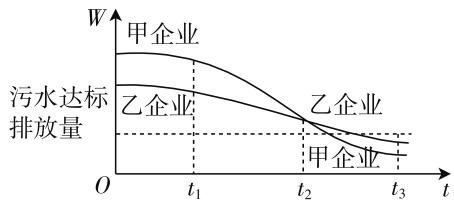

# 有效逻辑推理,培养核心素养

# ● 甘肃省景泰县第二中学 王锦民

逻辑推理是数学新课标中创新性指出的六大核心素养之一,借助题目条件以及相关的定义、定理来出发,通过条件之间的关联从而得出新的结论或者新的命题.它包括从特殊到一般、以及从一般到特殊的两类推理方式,是数学学习中离不开的一种素养.本文结合2020年高考数学真题,通过高考的“指挥棒”,结合实例来剖析逻辑推理的培养与渗透方法,引领与指导数学教学与学习,抛砖引玉.

# 一、借助数字进行逻辑推理

借助数字之间的变化规律、排列方式等进行逻辑推理，在破解集合、函数、数列等相关问题中经常有所涉及，关键是分析数字之间的特征，通过规律总结、抽象归纳等方法加以逻辑推理，合理转化，巧妙破解.

例 1 （2020 年新高考卷 I（山东卷）第 14 题）将数列 $\{2n-1\}$ 与 $\{3n-2\}$ 的公共项从小到大排列得到数列 $\{a_{n}\}$ ，则 $\{a_{n}\}$ 的前 n 项和为 \_\_\_\_.

分析:借助两个数列的通项公式,依次对数列中前面部分的对应项加以罗列,结合条件信息观察并确定这两个数列的公共项,加以逻辑推理,归纳总结确定新数列的类型与特征,结合数列求和公式来转化与应用.

解:由于数列 $\{2n-1\}$ 如下:1,3,5,7,9,11,13,15,17,19,21,23,25,27,…;

数列 $\{3n-2\}$ 如下:1,4,7,10,13,16,19,22,25,28,31,34,…;

观察可知,这两个数列的公共项依次为:1,7,13,19,25,…,通过观察可以发现,数列以1为首项,以6为公差的等差数列,所以 $\{a_{n}\}$ 的前n项和为 $S_{n}=n\cdot1+\frac{n(n-1)}{2}\cdot6=3n^{2}-2n.$

故填答案: $3n^{2}-2n.$

点评: 此题为客观题, 解答过程无需展示, 因而可以通过列举, 通过逻辑推理确定数字之间的变化规律、排列方式等加以归纳来达到目的. 具体操作时, 找公共项应该在公差大的数列里找, 间隔小, 且项与项之间的间隔相等. 由于数据信息隐藏于题目条件中,借助合理的逻辑推理加以正确分析数据信息,通过分析提取数据信息并加以有效利用,合理转化,巧妙破解.

# 二、借助图表进行逻辑推理

借助图像中曲线的变化规律、表格中数据信息变化情况等进行逻辑推理，在破解函数、平面向量、解析几何、导数及其应用等相关问题中经常有所涉及，关键是分析图像的变化趋势以及数据信息的波动情况，通过几何意义、数据特征等方法加以逻辑推理，数形直观，合理推理.

例 2 （2020 年北京卷第 15 题）环保部门要求相关企业加强污水治理，设企业的污水排放量 W 与时间 t 的关系为 $W = f(t)$ ，用 $-\frac{f(b) - f(a)}{b - a}$ 的大小评价在 $[a, b]$ 这段时间内企业污水治理能力的强弱。甲、乙两企业的污水排放量与时间的关系如下图所示。

line

| t    | 甲企业 | 乙企业 | 污水达标排放量 |
| ---- | ------ | ------ | -------------- |
| t₁   | -      | -      | -              |
| t₂   | -      | -      | -              |
| t₃   | -      | -      | -              |

图 1

给出下列四个结论:① 在 $\left[t_{1},t_{2}\right]$ 这段时间内,甲企业的污水治理能力比乙企业强;

② 在 $t_{2}$ 时刻, 甲企业的污水治理能力比乙企业强;  
③ 在 $t_{3}$ 时刻，甲、乙两企业的污水排放都已达标；  
④ 甲企业在 $\left[0,t_{1}\right],\left[t_{1},t_{2}\right],\left[t_{2},t_{3}\right]$ 这三个间段时间中，在 $\left[0,t_{1}\right]$ 时间内的污水治理能力最强.

其中所有正确结论的序号是\_\_\_\_。

分析:结合题目中相关函数图像的变化趋势加以直观分析,抓住企业污水治理能力的强弱的表达式的几何意义,通过函数图像的切线的斜率大小关系加以合理逻辑推理,进而来确定相应的企业污水治理能力的强弱问题.

解:由于企业污水治理能力的强弱 $-\frac{f(b)-f(a)}{b-a}$ 表示的是污水排放量 $W=f(t)$ 的图像的切线的斜率的相反数,结合图形可知,在 $\left[t_{1},t_{2}\right]$ 这段时间内,甲企业的污水排放量函数图像的切线的斜率小,则其相反数大,则其比乙企业强,①正确;

在 $t_{2}$ 时刻,甲企业的污水排放量函数图像的切线的斜率小,则其相反数大,则其比乙企业强,②正确;

在 $t_{3}$ 时刻, 甲、乙企业的污水排放量都在达标排放量下面, 都已达标, ③ 正确;

对于甲企业,在这三个时间段内,在 $\left[t_{1},t_{2}\right]$ 这段时间内,甲企业的污水排放量函数图像的的切线的斜率最小,则其相反数最大,此时污水治理能力最强,④错误.

故填答案:①②③.

点评:巧妙借助函数图像的变化规律与曲线的趋势来解决相关的实际应用问题.通过合理的数学建模,渗透相应的数学知识,直观想象等加以合理转化与应用,进而加以分析与处理.

# 三、借助公式进行逻辑推理

借助公式的特征、转化、变形与应用等进行逻辑推理，在破解集合、函数、数列、三角函数、导数及其应用等相关问题中经常有所涉及，关键是分析公式的变化，通过公式的变形、应用等方法加以逻辑推理，巧妙转化，数学运算.

例 3 （2020 年浙江卷第 10 题）设集合 S, T, $S \subseteq N^{*}$ , $T \subseteq N^{*}$ , S, T 中至少有两个元素，且 S, T 满足：

① 对于任意 $x, y \in S$ ，若 $x \neq y$ ，则 $xy \in T$ ;  
② 对于任意 $x, y \in T$ ，若 x < y，则 $\frac{y}{x} \in S$ .

下列命题正确的是( ).

A. 若 S 有 4 个元素, 则 $S \cup T$ 有 7 个元素  
B. 若 S 有 4 个元素, 则 $S \cup T$ 有 6 个元素  
C. 若 S 有 3 个元素, 则 $S \cup T$ 有 5 个元素  
D. 若 $S$ 有3个元素, 则 $S \cup T$ 有4个元素

分析:根据题目条件,讨论集合 S 有 3 个元素和 4 个元素的方法与技巧是一致的,结合在讨论分析集合 S 有 4 个元素的情况时就可以直接类比利用集合 S 有 3 个元素时的讨论结果,借助逻辑推理中的类比方法与推理,可以更为简单快捷地处理问题,提升效益.

解:(1) 若 S 有 3 个元素, 设集合 $S=\{a_{1},a_{2},a_{3}\}(a_{1},a_{2},a_{3}\in\mathbf{N}^{*}$ , 不妨设 $a_{1}<a_{2}<a_{3}$ ), 根据条件①可得集合 $T=\{a_{1}a_{2},a_{1}a_{3},a_{2}a_{3}\}$ , 再根据条件②可得 $\frac{a_{3}}{a_{2}},\frac{a_{2}}{a_{1}},\frac{a_{3}}{a_{1}}\in S$ , 显然 $\frac{a_{3}}{a_{1}}$ 为三者中的最大值.

若 $\frac{a_3}{a_1} = a_3$ ，可得 $a_1 = 1$ ，则 $\frac{a_2}{a_1} = a_2, \frac{a_3}{a_2} = a_2$ ，由此可得 $a_3 = a_2^2$ ，所以 $S = \{1, a_2, a_2^2\}, T = \{a_2, a_2^2, a_2^3\}$ ，可得 $S \cup T = \{1, a_2, a_2^2, a_2^3\}$ 有4个元素.

若 $\frac{a_{3}}{a_{1}}=a_{2}$ ，可得 $a_{3}=a_{1}a_{2}$ ，则 $\frac{a_{2}}{a_{1}}=\frac{a_{3}}{a_{2}}=a_{1}$ ，由此可得 $a_{2}=a_{1}^{2},a_{3}=a_{1}a_{2}=a_{1}^{3}$ （这里应该满足 $a_{1}>1$ ），

所以 $S=\{a_{1},a_{1}^{2},a_{1}^{3}\},T=\{a_{1}^{3},a_{1}^{4},a_{1}^{5}\}$ ，可得 $S\cup T=\{a_{1},a_{1}^{2},a_{1}^{3},a_{1}^{4},a_{1}^{5}\}$ 有 5 个元素.

由此可以排除选项 C, D.

(2) 若 S 有 4 个元素, 设集合 $S=\{a_{1},a_{2},a_{3},a_{4}\}$ $(a_{1},a_{2},a_{3},a_{4}\in\mathbf{N}^{*})$ , 不妨设 $a_{1}<a_{2}<a_{3}<a_{4}$ ), 类比(1)中的讨论可知, 若 $S=\{1,a_{2},a_{2}^{2},a_{2}^{3}\}$ , 可得 $T=\{a_{2},a_{2}^{2},a_{2}^{3},a_{2}^{4},a_{2}^{5}\}$ , 此时 $a_{2},a_{2}^{5}\in T$ , 但 $\frac{a_{2}^{5}}{a_{2}}=a_{2}^{4}\notin S$ , 与题设矛盾, 舍去.

若 $S=\{a_{1},a_{1}^{2},a_{1}^{3},a_{1}^{4}\}$ ，可得 $T=\{a_{1}^{3},a_{1}^{4},a_{1}^{5},a_{1}^{6},a_{1}^{7}\}$ ，可得 $S\cup T=\{a_{1},a_{1}^{2},a_{1}^{3},a_{1}^{4},a_{1}^{5},a_{1}^{6},a_{1}^{7}\}$ 有 7 个元素.

由此可以排除选项 B.

故选 A.

点评:此为一道涉及集合的关系与集合运算的“新定义”逻辑推理问题,结合两个集合间的元素的属性加以创新定义,合理交汇集合等相关知识,同时对知识点进行分类与整合.

其实,逻辑推理是包括数学学习在内的现实生活实际中的一种重要思维方式,对我们的终生学习与发展具有特殊的功能.逻辑推理贵在提出和论证相关的数学命题,从科学辩证角度理解事物之间的关联,在此基础上加深对数学概念与数学知识的理解.

在学生逻辑推理能力的培养过程中教师需要成为其中的参与者和引导者,而不是学生的指挥者和领导者,教师需要学生在解决数学问题的时候进行恰当引导,让学生独立进行逻辑推理,使学生切实感受到使用逻辑思维解决数学问题的魅力与可操作性,而不是被迫接受这种新的方法,这才是有效逻辑推理,培养核心素养的目的与价值.从观察来看,学生的核心素养的培养跟任课教师有很大关系.逻辑推理不但应用于眼前更是为学生将来终身学习发展打下基础.

# 参考文献：

[1] 中华人民共和国教育部. 普通高中数学课程标准 (2017年版)[S]. 北京: 人民教育出版社, 2018. W