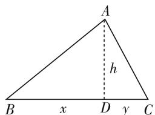

# 来路,思路,套路

—— 一道江苏调研题的剖析

● 江苏省苏州实验中学 王正军

# 一、问题的“来路”

问题 （江苏省苏州市四市五区 2020 届高三期初调研·14）在 $\triangle ABC$ 中，若 $\frac{\tan A}{\tan B} + \frac{\tan A}{\tan C} = 3$ ，则 $\sin A$ 的最大值为 \_\_\_\_.

本题以三角形为问题背景,通过三角形三内角对应的正切值构造相应的关系式,进而来确定对应角 A 的正弦值的最大值问题,巧妙把解三角形问题与三角函数的最值问题加以交汇与综合,利用巧妙设置来考查相关的知识点与能力.如何根据题目条件展开对应的“思路”,谋求破解的出路,从而得以正确解决相应的问题,并在此基础上归纳“套路”,拓展提升.

# 二、问题的“思路”

# 思路(一): 解三角形思维

分析 1: 根据条件中的关系式, 切化弦处理, 并利用三角恒等变换公式加以转化, 借助正弦定理与余弦定理的转化, 来确定 $\cos A$ 的最小值, 借助同角三角函数基本关系式即可确定 $\sin A$ 的最大值.

解:由 $\frac{\tan A}{\tan B}+\frac{\tan A}{\tan C}=3$ ，可得 $\frac{3}{\tan A}=\frac{1}{\tan B}+\frac{1}{\tan C}$ ，
则有 $\frac{3\cos A}{\sin A}=\frac{\cos B}{\sin B}+\frac{\cos C}{\sin C}=\frac{\cos B\sin C+\cos C\sin B}{\sin B\sin C}=$ $\frac{\sin(B+C)}{\sin B\sin C}=\frac{\sin A}{\sin B\sin C}$ ，即 $\sin^{2}A=3\sin B\sin C\cos A.$

结合正弦定理, 可得 $a^{2}=3bc\cos A$ , 而由余弦定理, 可得 $a^{2}=b^{2}+c^{2}-2bc\cos A=3bc\cos A$ , 则有 $\cos A=\frac{b^{2}+c^{2}}{5bc}\geqslant\frac{2bc}{5bc}=\frac{2}{5}$ , 当且仅当 b=c 时, 等号成立, 可得 $\sin A=\sqrt{1-\cos^{2}A}\leqslant\sqrt{1-\left(\frac{2}{5}\right)^{2}}=\frac{\sqrt{21}}{5}$ , 所以 $\sin A$ 的最大值为 $\frac{\sqrt{21}}{5}$ .

故填答案: $\frac{\sqrt{21}}{5}$ .

# 思路(二): 函数与方程思维

分析 2: 根据条件中的关系式, 并利用三角形内角和公式与两角和的正切公式, 把原关系式转化为涉及 $\tan B$ 的二次方程, 利用方程有根的条件通过判别式来转化得以求解 $\tan^{2}A$ 的取值范围, 结合同角三角函数基本关系式来处理 $\cos^{2}A$ 的最小值, 进而进一步来确定 $\sin A$ 的最大值.

解:由 $\frac{\tan A}{\tan B}+\frac{\tan A}{\tan C}=3$ ,可得 $\frac{3}{\tan A}=\frac{1}{\tan B}+\frac{1}{\tan C}$ ,
而 $\tan C = -\tan(A + B) = -\frac{\tan A + \tan B}{1 - \tan A \tan B}$ ，代入 $\frac{3}{\tan A} = \frac{1}{\tan B} + \frac{1}{\tan C}$ ，整理可得 $(\tan^{2}A - 3)\tan^{2}B - 3\tan A\tan B + \tan^{2}A = 0.$

结合判别式 $\Delta=9\tan^{2}A-4\tan^{2}A(\tan^{2}A-3)\geqslant0$ ，可得 $\tan^{2}A\leqslant\frac{21}{4}$ .

又 $\cos^2 A = \frac{\cos^2 A}{\sin^2 A + \cos^2 A} = \frac{1}{\tan^2 A + 1} \geqslant \frac{4}{25}$ , 可得 $\sin A = \sqrt{1 - \cos^2 A} \leqslant \sqrt{1 - \frac{4}{25}} = \frac{\sqrt{21}}{5}$ , 所以 $\sin A$ 的最大值为 $\frac{\sqrt{21}}{5}$ .

故填答案: $\frac{\sqrt{21}}{5}$ .

# 思路(三):换元思维

分析 3: 根据条件中的关系式, 结合等差中项引入均值换元 $\frac{1}{\tan B} = \frac{3}{2\tan A} + d$ , $\frac{1}{\tan C} = \frac{3}{2\tan A} - d$ , 利用三角形内角和公式与两角和的正切公式的应用加以转化, 通过求解 $\tan^{2}A$ 的取值范围, 结合同角三角函数基本关系式来处理 $\cos^{2}A$ 的最小值, 进而进一步来确定

$\sin A$ 的最大值.

解:由 $\frac{\tan A}{\tan B}+\frac{\tan A}{\tan C}=3$ ,可得 $\frac{3}{\tan A}=\frac{1}{\tan B}+\frac{1}{\tan C}$ ,
可设 $\frac{1}{\tan B}=\frac{3}{2\tan A}+d,\frac{1}{\tan C}=\frac{3}{2\tan A}-d$ ，则有 $\tan B=\frac{2\tan A}{3+2d\tan A},\tan C=\frac{2\tan A}{3-2d\tan A}.$

而 $\tan A = -\tan(B + C) = -\frac{\tan B + \tan C}{1 - \tan B \tan C} =$ $-\frac{\frac{2\tan A}{3+2d\tan A}+\frac{2\tan A}{3-2d\tan A}}{1-\frac{2\tan A}{3+2d\tan A}\cdot\frac{2\tan A}{3-2d\tan A}}=\frac{12\tan A}{4(d^{2}+1)\tan^{2}A-9},$

可知 $\tan^{2}A=\frac{21}{4(d^{2}+1)}\leqslant\frac{21}{4}.$

又 $\cos^2 A = \frac{\cos^2 A}{\sin^2 A + \cos^2 A} = \frac{1}{\tan^2 A + 1} \geqslant \frac{4}{25}$ , 可得 $\sin A = \sqrt{1 - \cos^2 A} \leqslant \sqrt{1 - \frac{4}{25}} = \frac{\sqrt{21}}{5}$ , 所以 $\sin A$ 的最大值为 $\frac{\sqrt{21}}{5}$ .

故填答案: $\frac{\sqrt{21}}{5}$ .

# 思路(四): 平面几何思维

分析 4: 通过平面几何中的三角形直观模型, 结合高的辅助线的作法, 得到 $\tan B = \frac{h}{x}$ , $\tan C = \frac{h}{y}$ , 进而确定 $\tan A$ 的关系式, 利用条件中的关系式加以变形, 结合基本不等式的应用来确定 $\tan A$ 的取值范围, 结合同角三角函数基本关系式来处理 $\cos^{2}A$ 的最小值, 进而进一步来确定 $\sin A$ 的最大值.

text_image

A
h
B x D y C

图1

解:如图1,过点A作 $AD \perp BC$ ,垂足为D.设AD=h,BD=x,CD=y,可得 $\tan B=\frac{h}{x},\tan C=\frac{h}{y}$ ,而 $\tan A=-\tan(B+C)=-\frac{\tan B+\tan C}{1-\tan B\tan C}=$ $-\frac{\frac{h}{x}+\frac{h}{y}}{1-\frac{h}{x}\cdot\frac{h}{y}}=\frac{h(x+y)}{h^{2}-xy}.$

由 $\frac{\tan A}{\tan B}+\frac{\tan A}{\tan C}=3$ ，可得 $\frac{3}{\tan A}=\frac{1}{\tan B}+\frac{1}{\tan C}$ ，则有 $\frac{3h^{2}-3xy}{h(x+y)}=\frac{x}{h}+\frac{y}{h}$ ，整理可得 $3h^{2}=x^{2}+5xy+y^{2}$ .

由于 $\tan A = \frac{h(x + y)}{h^2 - xy} = \frac{3h(x + y)}{(x^2 + 5xy + y^2) - 3xy}$ $= \frac{3h(x + y)}{x^2 + 2xy + y^2} = \frac{3h}{x + y} = \sqrt{3}\cdot \sqrt{\frac{3h^2}{(x + y)^2}} = \sqrt{3}\cdot$

$\sqrt{\frac{(x + y)^2 + 3xy}{(x + y)^2}} = \sqrt{3} \cdot \sqrt{1 + \frac{3xy}{(x + y)^2}} \leqslant \sqrt{3} \cdot \sqrt{1 + \frac{3xy}{4xy}} = \frac{\sqrt{21}}{2}$ , 当且仅当 $x = y$ 时, 等号成立.

又 $\cos^2 A = \frac{\cos^2 A}{\sin^2 A + \cos^2 A} = \frac{1}{\tan^2 A + 1} \geqslant \frac{4}{25}$ , 可得 $\sin A = \sqrt{1 - \cos^2 A} \leqslant \sqrt{1 - \frac{4}{25}} = \frac{\sqrt{21}}{5}$ , 所以 $\sin A$ 的最大值为 $\frac{\sqrt{21}}{5}$ .

故填答案: $\frac{\sqrt{21}}{5}$ .

# 三、问题的“套路”

(1) 解三角形思维破解此类问题,关键是借助正弦定理与余弦定理,以及三角恒等变换公式等加以合理转化,进而得以有效转化与应用.  
(2) 函数与方程思维破解此类问题, 经常借助函数、方程、不等式等转化来处理, 通过函数的图像与性质(特别是二次函数的图像与性质)、方程有根的判别式法以及基本不等式等手段来转化与应用.  
(3) 换元思维破解此类问题,关键是抓住已知条件中的关系式的特征,进行合理换元处理,可以变量代换,也可以变角代换,还可以采取其他一些行之有效的代换法来处理,进而达到转化与应用的目的.  
(4) 平面几何思维破解此类问题,关键是通过三角形的几何性质加以展开,结合平面几何的直观性,以及平面几何的相关性质、定理等,结合余弦定理、几何定理以及几何直观等方式来解决与处理.

无论借助哪种思路来进行破解,都充分综合基本不等式求最值、三角函数求最值、数形结合求最值等方法与技巧来处理,体现知识与方法的多样性与全面化. F