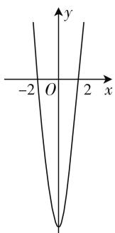
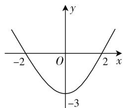

# 浅谈在数学思想指导下解偶函数不等式

# ● 甘肃省临泽县第一中学 王海霞

我们知道,函数问题一直是高考考查的重点和热点,函数的奇偶性、周期性及单调性是函数的三大性质,在高考中常常将它们综合在一起命题,其考查形式灵活多变,对考生的综合能力要求较高.解题时,常常借助函数的三大特征确定某一区间上的单调性,即实现区间的转换,再利用单调性、奇偶性解决相关的问题.下面用数形结合思想、代数思想、转化与化归思想举例说明偶函数中如何灵活变通解不等式,希望对同学们有所帮助.

# 一、在分类讨论思想指导下解不等式

例 1 若偶函数 $f(x)$ 满足 $f(x)=3^{x}-9(x\geqslant0)$ ，则不等式 $f(x-2)>0$ 的解集为 \_\_\_\_.

解: 设 x < 0, 则 -x > 0, 由于 $x \geqslant 0$ 时, $f(x) = 3^{x} - 9$ 可推出 $f(-x) = 3^{-x} - 9$ .

又因 $f(x)$ 为偶函数，

则 $f(-x)=f(x)=3^{-x}-9(x<0)$ ,

所以 $f(x)=\left\{\begin{aligned}&3^{x}-9(x\geqslant0),\\ &3^{-x}-9(x<0).\end{aligned}\right.$

因为 $f(x-2)>0$ ,

所以 $\left\{\begin{aligned}x-2&\geqslant0,\\ 3^{x-2}-9&>0\end{aligned}\right.$ 或 $\left\{\begin{aligned}x-2&<0,\\ 3^{-(x-2)}&-9>0,\end{aligned}\right.$

所以 x > 4 或 x < 0，

所以不等式 $f(x - 2) > 0$ 的解集为 $(- \infty, 0) \cup (4, +\infty)$ .

点评:利用偶函数 $f(-x)=f(x)$ 的公式求出 $f(x)$ 的解析式,然后用分类讨论的思想解不等式组,同学们只需细心解不等式组即可得到标准答案.

变式训练 1: 已知 $f(x)$ 为偶函数, $f(x)=3\cdot2^{x}-6(x\geqslant0)$ , 则不等式 $f(x-4)<0$ 的解集为 \_\_\_\_.

# 二、在数形结合思想指导下解不等式

例2 已知 $f(x)$ 为偶函数 $f(x) = 2\left(\frac{1}{3}\right)^x -$

$18(x \leqslant 0)$ , 则不等式 $f(2x - 1) > 0$ 的解集为 \_\_\_\_.

解: 令 $f(x)=0 \Rightarrow 2\left(\frac{1}{3}\right)^{x}-18=0 \Rightarrow x=-2.$

因为 $f(x)$ 在 $(-∞,0]$ 上单调递减，且 $f(x)$ 为偶函数，图像关于 y 轴对称（如图 1 所示）.

由 $f(2x-1)>0$ 可得 2x-1<-2 或 2x-1>2，

所以 $x < -\frac{1}{2}$ 或 $x > \frac{3}{2}$ .

text_image

-2 O 2 x
y

图1

所以不等式 $f(2x - 1) > 0$ 的解集为 $\left(-\infty, -\frac{1}{2}\right) \cup \left(\frac{3}{2}, +\infty\right)$ .

点评: 因为 $f(x)$ 为偶函数, 所以可以根据 $x \leqslant 0$ 时的解析式判断出 $f(x)$ 在 $(-∞, 0]$ 上单调递减, 那么 $f(x)$ 在 $(0, +∞)$ 上单调递增, 同学们可以画出如图 1 所示的函数 $f(x)$ 的图像, 由 $f(x) > 0$ 的图像可得满足题意的式子, 最后计算出结果.

变式训练2:设偶函数 $f(x)$ 满足 $f(x)=\left(\frac{1}{2}\right)^{x}-4(x\leqslant0)$ ，那么满足 $f(a-2)>0$ 的实数a的取值范围为\_\_\_\_.

# 三、在转化与化归思想指导下解不等式

例 3 已知定义在 R 上的偶函数 $f(x)$ 在 $[0, +\infty)$ 上单调递增，若 $f(\ln x) < f(3)$ ，则 x 的取值取范围是 \_\_\_\_.

解: 因为 $f(x)$ 为偶函数 $f(x)=f(|x|)$ 且在 $[0, +\infty)$ 上单调递增，

所以 $f(\ln x) < f(3) \Leftrightarrow f(|\ln x|) < f(3) \Leftrightarrow |\ln x| < 3,$

所以 $-3 < \ln x < 3$ ,

所以 $\mathrm{e}^{-3} < x < \mathrm{e}^{3}$

所以 x 的取值范围是 $(\mathrm{e}^{-3}, \mathrm{e}^{3})$ .

点评: 在已经知道定义在 R 上的函数的奇偶性和单调性时, 可以将函数转化到区间 $[0, +\infty)$ 上利用函数单调性解不等式.

变式训练3:设函数 $f(x)=\lg(2+|x|)-\frac{1}{x^{2}}$ ，则使得 $f(x)<f(2x-1)$ 成立的x的取值范围为\_\_\_\_.

# 【达标训练】

1. 若偶函数 $f(x)$ 满足 $f(x)=\left(\frac{1}{3}\right)^{x}-3(x\leqslant0)$ ，则使 $f(a-1)<0$ 的实数 a 的取值范围为 \_\_\_\_.  
2. 设偶函数 $f(x)=\log3^{x}-1(x>0)$ ，则满足 $f(m+1)>0$ 的实数 m 的取值范围为 \_\_\_\_.  
3. 已知定义在 $\mathbf{R}$ 上的偶函数 $f(x)$ 在 $(- \infty, 0]$ 上单调递减，若 $f(\log 2^x) > f(4)$ ，则 $x$ 的取值范围是 \_\_\_\_.  
4. 函数 $f(x)=\ln x^{2}-\frac{1}{2+|x|}$ ，则使得 $f(x+1)<f(x-1)$ 成立的 x 的取值范围是 \_\_\_\_.  
5. 若函数 $f(x)$ 是定义在 R 上的偶函数，且在区间 $[0, +\infty)$ 上是单调递增的，如果实数 x 满足 $f(\lg x) + f\left(\lg \frac{1}{x}\right) \leqslant 2f(2)$ ，则 x 的取值范围是 \_\_\_\_.

# 【参考答案】

[变式训练1]

设 x < 0，则 -x > 0，

由于 $x \geqslant 0$ 时， $f(x) = 3 \cdot 2^x - 6$ 可推出 $f(-x) = 3 \cdot 2^{-x} - 6$ .

又因 $f(x)$ 为偶函数，

则 $f(-x)=f(x)=3\cdot2^{-x}-6(x<0)$ .

所以 $f(x)=\left\{\begin{aligned}&3\cdot2^{x}-6(x\geqslant0),\\ &3\cdot2^{-x}-6(x<0).\end{aligned}\right.$

因为 $f(x-4<0)$ ,

所以 $\left\{\begin{aligned}x-4&\geqslant0,\\ 3&\cdot2^{x-4}-6<0\end{aligned}\right.$ 或 $\left\{\begin{aligned}x&-4<0,\\ 3&\cdot2^{-(x-4)}-6<0,\end{aligned}\right.$

所以 $4 \leqslant x < 5$ 或 3 < x < 4，

所以不等式 $f(x-4)<0$ 的解集为(3,5).

[变式训练 2]

因为 $f(x) = \left(\frac{1}{2}\right)^x - 4 (x \leqslant 0)$ ，所以 $f(x)$ 在 $(- \infty, 0]$ 上单调递减.

令 $f(x) = 0 \Rightarrow \left(\frac{1}{2}\right)^x - 4 = 0 \Rightarrow x = -2.$

又 $f(x)$ 为偶函数，

所以可以画出如图 2 所示的图像，

由 $f(a-2)>0$ 可得 a-2<-2 或 a-2>2，
所以 a<0 或 a>4.

所以 a 的取值范围为 $(-∞,0)∪(4,+∞)$ .

text_image

-2
O
-3
x
y
2

图 2

[变式训练 3]

因为 $f(x) = \lg (2 + |x|) - \frac{1}{x^2}$ ，所以其定义域为 $(- \infty, 0) \cup (0, +\infty)$ ，

因为 $f(-x)=f(x)$ ，所以 $f(x)$ 为偶函数， $f(x)=f(|x|)$ .

由 $f(x) < f(2x - 1)$ ，可得 $f(|x|) < f(|2x - 1|)$ .

因为当x>0时, $f(x)=\lg(2+x)-\frac{1}{x^{2}}$ ,它在 $(0,+\infty)$ 上为增函数,

所以 $|x| < |2x - 1|$ ,

所以 $x^{2} < (2x - 1)^{2}$

所以 $x < \frac{1}{3}$ 或 x > 1.

又因为 $x \neq 0$

所以 $x$ 的取值范围为 $(- \infty, 0) \cup \left(0, \frac{1}{3}\right) \cup (1, +\infty)$ .

# 【达标训练】

1. $a \in (0,2)$ .   
2. $m \in (-\infty, -4) \cup (2, +\infty)$ .   
3. $x \in \left(-\infty, \frac{1}{16}\right) \cup (16, +\infty)$ .   
4. $x \in (-\infty, 0)$ .   
5. $x \in [10^{-2}, 10^{2}]$ . W