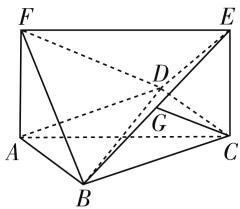
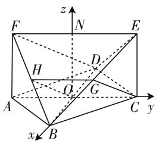

# 浅谈平面向量在高中数学中的应用

# ● 安徽省临泉第二中学 安敏

向量教学是高中数学教学的重要内容之一,掌握平面向量在高中数学解题中的应用类型与方法,有利于培养学生的发散性思维,同时还可以提高学生的应变能力与创新性.由于向量运算包含大小与方向,在运算中带有一定的复合性,相比于单一的运算方法,其实用性更高,且解题效率要优于传统运算方法.在高中数学中,可以借助平面向量解题的题型很多,下文借助案例分析详述平面向量在三角函数、解析几何以及空间立体几何当中的应用,学生要加以借鉴,善于积累经验,掌握向量在高中数学中的应用,从而快速精准地答题.

# 一、向量在三角函数中的应用

在三角函数的学习中,学生不仅要掌握三角函数的概念、图像以及性质,还要对三角函数的公式和衍生公式熟记于心,在面对三角函数的众多题型时,更是难以下笔.在解决三角函数问题时,将向量的方法应用其中,通过向量积的运算来分析三角函数的性质,可以为学生解答三角函数题型提供新的思路.学生要善于利用向量这一数学工具,提升自身对三角函数的学习能力.

例 1 将函数 $y=f(x)=\frac{1}{2}(\sin x+\cos x)^{2}-\frac{3}{2}$ 的图像按向量 $a=\left(\frac{\pi}{4},1\right)$ 平移得到函数 $y=g(x)$ 的图像.

(1) 求函数 $y = g(x)$ 的解析式.

(2) 已知 $A(-1,2)$ , $B(1,2)$ . 问在函数 $y = g(x)$ 的图像上是否存在一点 P, 使得 $\overrightarrow{AP} \cdot \overrightarrow{BP} = \frac{5}{4}$ . 如果存在, 请求出点 P 的坐标; 如果不存在, 请说明理由.

分析:(1)化简得, $f(x)=\frac{1}{2}\sin2x-1$ ,利用向量的平移可求函数 $y=g(x)$ 的解析式.

(2) 利用向量数量积的坐标运算, 可求得 $\overrightarrow{AP} \cdot \overrightarrow{BP} = x^{2} + \left(\frac{1}{2}\cos2x + 2\right)^{2} - 1$ , 分别对 $x^{2} \geqslant 0$ ,

$\left(\frac{1}{2}\cos2x+2\right)^{2}\geqslant\frac{9}{4}$ 的等号成立的讨论,即可判断 y=g(x) 的图像上,使得 $\overrightarrow{AP}\cdot\overrightarrow{BP}=\frac{5}{4}$ 的点 P 是否存在.

解答:(1) $f(x)=\frac{1}{2}(1+\sin2x)-\frac{3}{2}=\frac{1}{2}\sin2x-$ 1. 因为 $a = \left(\frac{\pi}{4}, 1\right)$ ，所以 $g(x) = \frac{1}{2} \sin 2 \left( x - \frac{\pi}{4} \right) = -\frac{1}{2} \cos 2x$ .

(2) 设 $P\left(x, -\frac{1}{2}\cos 2x\right)$ ,

则 $\overrightarrow{AP} = (x + 1, -\frac{1}{2}\cos 2x - 2)$

$$
\overrightarrow {B P} = \left(x - 1, - \frac {1}{2} \cos 2 x - 2\right),
$$

所以 $\overrightarrow{AP} \cdot \overrightarrow{BP} = (x^2 - 1) + \left(\frac{1}{2}\cos 2x + 2\right)^2 = x^2 + \left(\frac{1}{2}\cos 2x + 2\right)^2 - 1.$

因为 $x^{2} \geqslant 0$ ，当且仅当 x = 0 时等号取得， $\left(\frac{1}{2}\cos 2x + 2\right)^{2} \geqslant \frac{9}{4}$ 等号当且仅当 $\cos 2x = -1$ ，即 $x = k\pi - \frac{\pi}{2} (k \in \mathbf{Z})$ 时取得，所以 $x^{2} + \left(\frac{1}{2}\cos 2x + 2\right)^{2} > \frac{9}{4}$ .

所以 $\overrightarrow{AP} \cdot \overrightarrow{BP} > \frac{5}{4}$ .

故在函数 $y=g(x)$ 的图像上, 使得 $\overrightarrow{AP} \cdot \overrightarrow{BP} = \frac{5}{4}$ 的点 P 不存在.

# 二、向量在解析几何中的应用

解析几何题型是高中常见的解答题型,由于解析几何题型一般伴随着坐标轴的出现,同时具有方向和数量两个特征,因此也会涉及平面向量的应用.在解析几何中,我们可以用向量的语言来对解析几何的特征进行说明,同时也可以利用向量的运算来计算解析几何的性质.明确向量在解析几何中的应用,更加有利于学生开拓解题思维,优化学生的认知结构,对于学生的向量学习有很大意义.

例 2 已知点 $M(-2,0)$ , $N(2,0)$ ，点 P 满足：直线 PM 的斜率为 $k_{1}$ ，直线 PN 的斜率为 $k_{2}$ ，且 $k_{1} \cdot k_{2} = -\frac{3}{4}$ .

(1) 求点 $P(x, y)$ 的轨迹 C 的方程.

(2) 过点 $F(1,0)$ 的直线 l 交曲线 C 于 A, B 两点，问在 x 轴上是否存在点 Q，使得 $\overrightarrow{QA} \cdot \overrightarrow{QB}$ 为定值。若存在，求出点 Q 的坐标；若不存在，请说明理由。

分析:(1)由两点的直线的斜率公式,化简整理可得所求轨迹方程.

(2) 假设在 x 轴上存在点 $Q(m,0)$ ，使得 $\overrightarrow{QA} \cdot \overrightarrow{QB}$ 为定值。讨论直线 l 的斜率存在，设直线 l 的方程为 $y = k(x - 1)(k \neq 0)$ ，联立轨迹 C 的方程构造函数，运用韦达定理和向量的数量积可得 m；当直线 l 的斜率不存在时，分别求得 A, B, Q 的坐标，即可得到定值。

解答:(1)由题意可得 $k_{1}=\frac{y}{x+2}, k_{2}=\frac{y}{x-2}.$

由 $k_{1} \cdot k_{2} = -\frac{3}{4}$ , 可得 $\frac{y}{x + 2} \cdot \frac{y}{x - 2} = -\frac{3}{4}$ ,

轨迹方程为 $\frac{x^{2}}{4}+\frac{y^{2}}{3}=1(x\neq\pm2)$ .

(2) 假设在 x 轴上存在点 $Q(m,0)$ ，使得 $\overrightarrow{QA} \cdot \overrightarrow{QB}$ 为定值.

当直线 l 的斜率存在时，设其方程为 $y = k(x - 1)(k \neq 0)$ ，联立 $\left\{\begin{aligned}3x^{2} + 4y^{2} &= 12, \\ y &= k(x - 1),\end{aligned}\right.$ 可得函数 $(3 + 4k^{2})x^{2} - 8k^{2}x + 4k^{2} - 12 = 0$ ，令 $A(x_{1}, y_{1}), B(x_{2}, y_{2})$ ，则 $x_{1} + x_{2} = \frac{8k^{2}}{3 + 4k^{2}}, x_{1}x_{2} = \frac{4k^{2} - 12}{3 + 4k^{2}}$ ，

由 $\overrightarrow{QA}=(x_{1}-m,y_{1}),\overrightarrow{QB}=(x_{2}-m,y_{2})$ ,

所以 $\overrightarrow{QA} \cdot \overrightarrow{QB} = (x_{1} - m)(x_{2} - m) + y_{1}y_{2}$

$$
\begin{array}{l} = \left(x _ {1} - m\right) \left(x _ {2} - m\right) + k ^ {2} \left(x _ {1} - 1\right) \left(x _ {2} - 1\right) \\ = (1 + k ^ {2}) x _ {1} x _ {2} - (m + k ^ {2}) \left(x _ {1} + x _ {2}\right) + m ^ {2} + k ^ {2} \\ = \frac {- (5 + 8 m) k ^ {2} - 1 2}{3 + 4 k ^ {2}} + m ^ {2}, \\ \end{array}
$$

视 m 为常数, 要使得上式为定值, 需满足 $5 + 8m = 16$ , 即 $m = \frac{11}{8}$ , 此时 $\overrightarrow{QA} \cdot \overrightarrow{QB} = -\frac{135}{64}$ .

当直线 l 的斜率不存在时，可得 $A\left(1,\frac{3}{2}\right)$ ， $B\left(1,-\frac{3}{2}\right)$ ， $Q\left(\frac{11}{8},0\right)$ ，所以 $\overrightarrow{QA}=\left(-\frac{3}{8},\frac{3}{2}\right)$ ， $\overrightarrow{QB}=$

$$
\left(- \frac {3}{8}, - \frac {3}{2}\right), \overrightarrow {Q A} \cdot \overrightarrow {Q B} = - \frac {1 3 5}{6 4}.
$$

综上所述, 存在 $Q\left(\frac{11}{8},0\right)$ , 使得 $\overrightarrow{QA} \cdot \overrightarrow{QB}$ 为定值.

# 三、向量在空间几何中的应用

向量作为一个矢量,既含有数量又含有方向,将数与形巧妙地融合在一起,在一定程度上同时具有几何形式与代数形式,是连接代数与几何的天然桥梁.在高中数学立体几何中,为了考查学生对于直观性和抽象性问题的理解,通常会将数与形结合起来一起考,对于这类综合性质较强的问题,学生可以利用向量的数学性质,将空间中的几何量用向量的形式表现出来,通过向量的矢量运算,来求解几何问题,这样有利于学生对知识的融合理解,帮助学生同时增加向量与立体几何的解题经验.

例 3 四边形 ABCD 是菱形, ACEF 是矩形, 平面 ACEF ⊥ 平面 ABCD, AB = 2AF = 2, $\angle BAD = 60^{\circ}$ , G 是 BE 的中点.

text_image

Geometric diagram of a rectangular prism with labeled vertices and internal points, showing solid and dashed edges.

图 1

(1) 用两种方法证明: CG // 平面 BDF.

(2) 求二面角 E - BF - D 的余弦值.

分析:(1) 其一, 可借助辅助线构造平行四边形, 通过平行四边形的性质来证明线面平行; 其二, 可借助向量法, 由于向量带有方向, 若找出两个相等的向量, 可知向量相等则其方向一定相同且平行, 由此证明: CG // 平面 BDF.  
(2) 建立空间坐标系, 求出平面的法向量(此略), 利用向量法即可求二面角 E-BF-D 的余弦值.

证明:设 $AC \cap BD = O, BF$ 的中点为 H. 因为 G

是 BE 的中点, GH // EF //

$AC, GH = \frac{1}{2} AC = OC$ ，所以

$OCGH$ 是平行四边形, 所以 $CG \parallel OH, CG \not\subset$ 平面 $BDF, OH \subset$ 平面 $BDF$ , 所以 $CG \parallel$ 平面 $BDF$ .

text_image

z
F	N	E
H	D
O	G
A	C
x	B
y

图2

向量作为有力的数学工

具,可以通过具体的应用把高中阶段的知识点相互联系,帮助构成完整又严密的知识体系.学生要善于分析向量的应用并加以掌握,才能从整体上完成对向量知识的认知,同时加强数学方法的学习.W