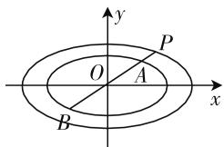
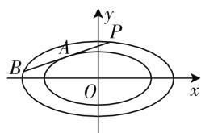
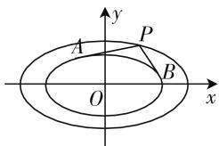
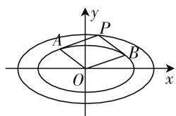

# 玩转圆锥曲线,同心相似椭圆

# 甘肃省金塔县职教中心 李惠姗

根据相似图形的定义,我们可以得到定义如下:若两个椭圆的中心与长轴一致,且长轴和短轴对应成比例,则称这样的两个椭圆为同心相似椭圆.在实际生活的一些建筑模型、景观设置等结构视图中,我们经常会碰到此类同心相似椭圆的图案.当然,在一些相关的圆锥曲线创新问题中,同心相似椭圆也是一种不可多得的创新面孔.

# 一、交线问题

例 1 （2019 届高三浙江省新昌中学、浦江中学、富阳中学三校联考(4 月)·17）如图1所示,已知椭圆 $C_{1}:\frac{x^{2}}{4}+y^{2}=1$ ,点P为椭圆 $C_{2}:\frac{x^{2}}{8}+\frac{y^{2}}{2}=1$ 上的一动点,直线PO与椭圆 $C_{1}$ 依次交于点 A, B，则 $\frac{|PA|}{|PB|}=$ \_\_\_\_.

text_image

y
P
O
A
x
B

图 1

分析:通过分类讨论,借助直线 OP 的斜率是否存在来分别求解,在斜率存在的情况下设出直线 OP 的方程,分别与椭圆 $C_{1}$ 和椭圆 $C_{2}$ 的方程联立,确定点 A 与 P 的横坐标的表达式,借助对称性,利用两点间的距离公式加以转化与求解.

解:(1)当直线OP的斜率不存在时,根据对称性,不失一般性,不妨设点P与椭圆 $C_{2}$ 的上顶点重合,则有 $P(0,\sqrt{2})$ ,此时有 $A(0,1)$ , $B(0,-1)$ ,则有 $|PA|=\sqrt{2}-1$ , $|PB|=\sqrt{2}+1$ ,可得 $\frac{|PA|}{|PB|}=\frac{\sqrt{2}-1}{\sqrt{2}+1}=3-2\sqrt{2}$ .

(2) 当直线 OP 的斜率存在时, 设直线 OP 的方程为 y=kx, 联立 $\left\{\begin{aligned}\frac{x^{2}}{4}+y^{2}=1,\\ y=kx,\end{aligned}\right.$ 消去参数 y, 整理可得 (1 + 4k²) $x^{2}=4$ , 则 $x^{2}=\frac{4}{1+4k^{2}}$ , 可得 $x_{A}^{2}=\frac{4}{1+4k^{2}}$ .

同理可得 $x_{P}^{2} = \frac{8}{1 + 4k^{2}}.$

可得 $x_{P}^{2}=2x_{A}^{2}$ ，而由题意知， $x_{P}$ 与 $x_{A}$ 同号，所以 $x_{P}=\sqrt{2}x_{A}$ ，结合点 A, B 的对称性，可得 $x_{A}=-x_{B}$ ，可得 $\frac{|PA|}{|PB|}=\frac{|x_{P}-x_{A}|}{|x_{P}-x_{B}|}=\frac{|x_{P}-x_{A}|}{|x_{P}+x_{A}|}=\frac{|\sqrt{2}-1|}{|\sqrt{2}+1|}=3-2\sqrt{2}$ .

综上(1)和(2)分析, 可知 $\frac{|PA|}{|PB|}=3-2\sqrt{2}$ .

故填答案: $3-2\sqrt{2}$ .

# 二、切线问题

例 2 （原创题）如图 2 所示，点 P 为椭圆 $E_{1}:\frac{x^{2}}{a^{2}}+$

$\frac{y^{2}}{b^{2}}=1(a>b>0)$ 上的一动
点, 过点 P 作椭圆 $E_{2}:\frac{x^{2}}{a^{2}}+\frac{y^{2}}{b^{2}}=\lambda(0<\lambda<1)$ 的一条切线 PA (切点为 A), 其交椭圆 $E_{2}$ 于另一点 B，则 $\frac{|PA|}{|AB|} = (\quad)$ .

text_image

y
P
A
B
O
x

图2

A. $\lambda$

B. $\sqrt{\lambda}$

C. 1

D. $\frac{1}{\lambda}$

分析:设出相关点的坐标,利用过椭圆上点的切线方程来确定切线PA的方程,并与椭圆 $E_{1}$ 的方程联立,加以合理转化,根据根与系数的关系的应用,进而确定点A为线段PB的中点,最后得以确定相应的线段比值.

解: 设 $P(x_{1}, y_{1})$ , $B(x_{2}, y_{2})$ ，切点 $A(x_{0}, y_{0})$ ，则切线 PA 的方程为 $\frac{x_{0}x}{a^{2}} + \frac{y_{0}y}{b^{2}} = \lambda$ ，联立 $\left\{\begin{aligned}\frac{x_{0}x}{a^{2}} + \frac{y_{0}y}{b^{2}} &= \lambda, \\ \frac{x^{2}}{a^{2}} + \frac{y^{2}}{b^{2}} &= 1,\end{aligned}\right.$

消去参数 $y$ ，整理可得 $(a^{2}y_{0}^{2} + b^{2}x_{0}^{2})x^{2} - 2\lambda a^{2}b^{2}x_{0}x+$

$\lambda^{2}a^{4}b^{2}-a^{2}=0$ , 点 $A(x_{0},y_{0})$ 在椭圆 $E_{2}:\frac{x^{2}}{a^{2}}+\frac{y^{2}}{b^{2}}=\lambda$ 上, 代入整理可得 $a^{2}y_{0}^{2}+b^{2}x_{0}^{2}=\lambda a^{2}b^{2}$ , 则有 $\lambda b^{2}x^{2}-2\lambda b^{2}x_{0}x+\lambda^{2}a^{2}b^{2}-1=0$ , 根据根与系数的关系可得 $x_{1}+x_{2}=2x_{0}$ .

同理可得 $y_{1} + y_{2} = 2y_{0}$ .

因而可得点 A 为线段 PB 的中点，则有 $\frac{|PA|}{|AB|}=$ 1.

故选 C.

# 三、斜率问题

例 3 （2019 年 11 月浙江省温州一模高三数学试题·9) 如图 3 所示, 点 P 为椭

圆 $E_{1}:\frac{x^{2}}{a^{2}}+\frac{y^{2}}{b^{2}}=1(a>b>0)$

上的一动点, 过点 P 作椭圆 $E_{2}:\frac{x^{2}}{a^{2}}+\frac{y^{2}}{b^{2}}=\lambda(0<\lambda<1)$ 的

text_image

y
A
P
B
O
x

图3

两条切线 PA, PB, 对应切点分别为 A, B, 两切线的斜率分别为 $k_{1}, k_{2}$ . 若 $k_{1} \cdot k_{2}$ 为定值, 则 $\lambda = (\quad)$ .

A. $\frac{1}{4}$

B. $\frac{\sqrt{2}}{4}$

C. $\frac{1}{2}$

D. $\frac{\sqrt{2}}{2}$

分析:根据题目条件可知, $k_{1}\cdot k_{2}$ 为定值,与参数a、b的值无关,与动点P的位置无关,不妨分别取点P位于y轴、x轴上的顶点位置,利用切线方程的建立以及直线的斜率的求解,进而两种不同情况下的关系式相等来求解对应的参数值.

解: 当点 P 位于椭圆 $E_{1}$ 的上顶点时, 根据对称性可知, $k_{1} = -k_{2}$ , 则有 $k_{1} \cdot k_{2} = -k_{2}^{2}$ , 设切点 $B(x_{1}, y_{1})$ , 此时切线 PB 的方程为 $\frac{x_{1}x}{a^{2}} + \frac{y_{1}y}{b^{2}} = \lambda$ , 将 $P(0, b)$ 代入切线 PB 的方程, 可得 $\frac{y_{1}}{b} = \lambda$ , 则 $y_{1} = b\lambda$ , 此时可得 $x_{1} = a\sqrt{\lambda(1-\lambda)}$ , 所以 $k_{2} = \frac{b\lambda - b}{a\sqrt{\lambda(1-\lambda)}} = -\frac{b\sqrt{1-\lambda}}{a\sqrt{\lambda}}$ , 可得 $k_{1} \cdot k_{2} = -k_{2}^{2} = -\frac{b^{2}(1-\lambda)}{a^{2}\lambda}$ .

当点 P 位于椭圆 $E_{1}$ 的右顶点时，根据对称性可知， $k_{1} = -k_{2}$ ，则有 $k_{1} \cdot k_{2} = -k_{1}^{2}$ ，设切点 $A(x_{2}, y_{2})$ ，此时切线 PA 的方程为 $\frac{x_{2}x}{a^{2}} + \frac{y_{2}y}{b^{2}} = \lambda$ ，将 $P(a, 0)$ 代入

切线 $PA$ 的方程，可得 $\frac{x_2}{a} = \lambda$ ，则 $x_{2} = a\lambda$ ，此时可得 $y_{2}$ $= b\sqrt{\lambda(1 - \lambda)}$ ，所以 $k_{1} = \frac{b\sqrt{\lambda(1 - \lambda)}}{a\lambda - a} = -\frac{b\sqrt{\lambda}}{a\sqrt{1 - \lambda}}$ 可得 $k_{1}\cdot k_{2} = -k_{1}^{2} = -\frac{b^{2}\lambda}{a^{2}(1 - \lambda)}.$

根据题目条件知 $k_{1} \cdot k_{2}$ 为定值，则有 $-\frac{b^{2}(1 - \lambda)}{a^{2}\lambda} = -\frac{b^{2}\lambda}{a^{2}(1 - \lambda)}$ ，即 $\frac{1 - \lambda}{\lambda} = \frac{\lambda}{1 - \lambda}$ ，解得 $\lambda = \frac{1}{2}$ .

故选 C.

# 四、面积问题

例 4 （原创题）如图 4 所示，已知椭圆 $C_{1}:\frac{x^{2}}{4}+$

$y^{2}=1$ , 点 P 为椭圆 $C_{2}:\frac{x^{2}}{8}+\frac{y^{2}}{2}=1$ 上的一动点, 过点 P 作椭圆 $C_{1}$ 的两条切线 PA, PB, 对应切点分别为 A, B, 则四边形 PAOB 的面积为 \_\_\_\_.

text_image

y
A
P
B
O
x

图 4

分析:根据题目中填空题的特点,结论具有确定性,因为可以判断四边形 PAOB 的面积与动点 P 的位置无关,通过取点 P 位于 y 轴上的顶点位置,利用切线方程的建立以及对应切点 B 的坐标的求解,结合对称性来确定四边形的面积问题.

解: 当点 P 位于椭圆 $C_{2}$ 的上顶点时, 此时 $P(0, \sqrt{2})$ , 根据对称性可知, 点 A, B 关于 y 轴对称, 设切点 $B(x_{1}, y_{1})$ , 此时切线 PB 的方程为 $\frac{x_{1}x}{4} + y_{1}y = 1$ , 将 $P(0, \sqrt{2})$ 代入切线 PB 的方程, 可得 $\sqrt{2}y_{1} = 1$ , 则 $y_{1} = \frac{\sqrt{2}}{2}$ , 可得 $x_{1} = \sqrt{2}$ , 根据对称性可知, $S_{四边形PAOB} = 2S_{\triangle POB} = 2 \times \frac{1}{2} \times \sqrt{2} \times \sqrt{2} = 2$ .

故填答案:2.

涉及两个同心相似椭圆的圆锥曲线问题,创新面孔,结构优美,形式雷同,方程相似,性质多样,细心研究,认真揣摩,奥妙无穷.在数学解题过程中,要养成借助创新的视角与独到的眼光,利用独特的思维去探索数学,去欣赏数学的美,让数学真正展现出优美的身姿,迷人的色彩.F