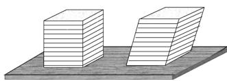
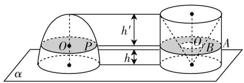
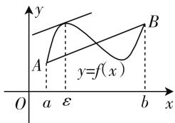
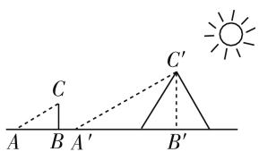
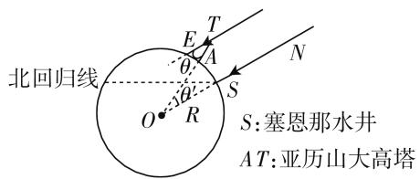

# 由祖暅原理引发的思考

江西科技师范大学 陶 醉  
- 江西科技师范大学 舒斯会

祖暅又名祖暅之，于公元5世纪末提出体积计算原理，即祖暅原理。这是一个有关几何求积的著名命题：幂势既同，则积不容异。“势”即高，“幂”是面积。指的是如果两个几何体的高度和每个截面的面积都相等，那么这两个几何体的体积相等。如图1所示，试着把这两摞书想成无穷个截面，或者想象成一摞纸，因为它们的总高度和每个截面的面积相同，所以它们的体积是相等的,正如斜棱柱和棱柱的体积公式都等于底面积乘高.这个原理就是祖暅原理.

  
图 1

在很早的时候,人们已经会求三角形、四边形、多边形等图形的面积,但由曲线围成图形的面积和体积一直困扰着数学家.而利用这个原理,中国古代数学家已经可以计算出球的体积了.这个方法非常巧妙,即把球的体积转化为已知体积大小的立体图形.如图2,构造一个底面圆半径为a,高为b的圆柱,把所得的几何体和半椭球体放在同一平面 $\alpha$ 上,那么这两个几何体也就夹在两个平行平面之间了.

text_image

O P
h'
h
θ B A
α

图 2

选取截面 $\beta$ 与平面 $\alpha$ 的距离为 h，在椭球中可构造一对相似三角形，利用对应边成比例，计算出圆面半径 $OP = \frac{a}{b} \sqrt{b^{2} - h^{2}}$ ，图 2 右侧圆环的大圆半径为 OA = a，同理，小圆半径 $OB = \frac{ah}{b}$ .

则 $S_{圆}=\pi\cdot OP^{2}=\frac{\pi a^{2}}{b^{2}}(b^{2}-h^{2})$ ,

$$
S _ {\text {圆环}} = \pi (O A ^ {2} - O B ^ {2}) = \pi \Big [ a ^ {2} - \Big (\frac {a h}{b} \Big) ^ {2} \Big ].
$$

故 $S_{圆}=S_{圆环}$ .

根据祖暅原理可知,左边椭球的体积和右边从圆柱中挖去一个以圆柱上底面为底面、下底面圆心为顶点的圆锥,得到的立体的体积相等.

所以， $\frac{1}{2}V_{椭球}=\pi a^{2}b-\frac{\pi}{3}a^{2}b=\frac{2\pi a^{2}b}{3}$

则 $V_{椭球}=\frac{4\pi a^{2}b}{3}.$

把所求几何体,用圆锥、圆柱、圆台等几何图形进行重组,就能构造出一个这样的图形来解决椭球的体积问题.同理,球的体积问题也就迎刃而解了.这一问题的解决,在人类文明的早期,极大推动了几何学的进步.

现在有了微积分,人们不但可以证明祖暅原理,而且可以更容易地计算球体的体积.根据积分公式,立体的体积 $V=\int_{a}^{b}A(x)\mathrm{d}x$ ,公式中V表示立体的体积, $A(x)$ 是截面的面积,b-a是该立体图形的高度.也就是说,立体的体积是截面面积总和,如果两个立体图形每个截面面积相同,高度相等,计算出体积也是一样的.这里的思想与祖暅原理不谋而合,也可用来证明祖暅原理.

一个原理或者一个定律，只有应用到实际中去，解决大问题，才能真正发挥作用，人们也会不停探寻挖掘它更深的内涵。历史上简单且有用的定理远不止此,拉格朗日中值定理,也是如此.如图3所示,一条曲线,连接两个端点得到一条直线,那么在这个曲线上至少可以找到一点,使得这个点的切线平行于这条直线.详述如下:

text_image

y
A
y=f(x)
B
O
a
ε
b
x

图3

设函数 $f(x)$ 满足如下条件:

(1) 在 $[a,b]$ 上连续；  
(2) 在 $(a,b)$ 内可导.

则至少存在一点 $\xi \in (a, b)$ ，使得 $f(b) - f(a) = f'(\xi)(b - a)$ ，也常常写成如下形式：

$$
f ^ {\prime} (\xi) = \frac {f (b) - f (a)}{b - a}.
$$

此定理的重要性和广泛性备受重视,它可应用到不等式中,其主要思想就是对此定理公式中 $\xi$ 在 $(a,b)$ 开区间取值,对区间内任意 $\xi$ ,都能在 $(a,b)$ 开区间中的某个值对 $f'(x)$ 的范围进行估计,再根据 $f'(x)$ 取值最大最小值代替定理中的 $f'(\xi)$ ,从而能够得出不等式.这个简单的原理,解决了数学中很多问题:函数的单调性、凹凸性和连续性,级数收敛性的问题,等等.因此,这也成为微积分学的理论基础.

19 世纪的数学家们，当柯西 (L. A. Cauchy, 1789—1857)、魏尔斯特拉斯 (K. T. W. Weierstrass, 1815—1897)，一直为微积分的严格化费尽心思时。康托尔 (Cantor, Georg Ferdinand Ludwig Philipp, 1845—1918) 却抛弃了以往的经验与直观，用理论的武器，打破了数学中的有限性观念，创立了集合论和超穷数理论。有了康托尔的集合论，人们才第一次正视无穷这个问题，现在这些问题都得到了解决，也为现代数学奠定了基础。自此，微积分体系愈发完善。康托尔将元素个数的概念从有穷推广到无穷，以一一对应为原则，提出了集合与集合的等价概念。他认为无穷集合的一个本质就是一个无穷集合与它的部分构成一一对应的关系。至此，人们看到了无穷集合元素个数的差异，证明了无理数的个数远远多于有理数。

解决复杂问题用的是最基本的原理,深度挖掘每一个数学知识并把它们与实践相联系.同样,人们利用简单的几何知识,不仅推动了数学的发展,也解决了生活中的实际问题.从公元前6世纪起,由于经济和政治的进步,欧洲文化的第一个顶峰在希腊出现了,其中的重要成就包括希腊数学,由于希腊数学家强调逻辑和数学计算,所以那时人们就产生了想测量金字塔高度的想法,可当时的测量工具有限,巍峨的金字塔立在那里,人们纷纷束手无策.此时,古希腊数学家泰勒斯(Thales,约公元前625年—公元前547年),利用构造相似三角形,根据对应边成比例的性质,求得其高度.具体方法如图4所示,泰勒斯在金字塔旁立了一根长杆(CB),当地上的长杆和它的影长相等时(CA=AB),那金字塔的高度也应和影子长相等( $CB' = A'B'$ ),泰勒斯将不可测的高度,转化为在地面上的长度,由此测出了金字塔的高度.

text_image

A B A' C
C'
B' B

图4

古希腊人还利用简单的几何知识证明了人类居住的是一个球体，而且测量了大地球体的周长。广阔无垠的大海上，人们总先看到驶来航船的桅杆，再看到其船身，这个现象早就引起了人们的好奇。古希腊数学家埃拉托色尼(Eratosthenes，公元前275年—公元前193年）相信，这种现象预示着人类居住的广袤大地是个球体。他注意到在6月22日夏至的那天，不同的城市，阳光照射的效果是不一样的，在阿斯旺的塞恩那村庄，太阳悬在头顶，物体没有影子，阳光可以直射到井底。而在阿斯旺正北的亚历山大城，太阳光线与塞恩那村庄不同，略有倾斜，照不到井底，这再一次证实了他的想法，于是他通过一个简单的数理结合的方法，巧妙地测出了地球的周长。如图5所示，根据两地之间的地心角差距和两地时间的实际距离，根据地心角在 $360^{\circ}$ 中的所占比例计算出地球的周长。通过这一方法，他比较精确地测量出了亚历山大穿过塔顶的光线TE与竖直塔身AT偏离的角度 $\theta$ 大约为 $7^{\circ}12'$ ，相当于圆周角 $360^{\circ}$ 的 $\frac{1}{50}$ ，由此推测阿斯旺和亚历山大港的距离是整个地球圆周长度的五十分之一，继而他计算出地球的圆周长度是39690公里。近千年后，人们现在利用科技手段精确测量出地球的周长为40075.13km，埃拉托色尼的测算结果与地球实际的周长竟如此令人惊叹的接近。

text_image

北回归线
S:塞恩那水井
A T:亚历山大高塔
θ
E
A
N
O
R
S

图5

以上几个典型的知识运用的例子,揭示了知识存在的意义之一是解决实际问题.知识的积累,从最简单最直观的原理开始,不断深入.在数学原理和数学应用之间有一道鸿沟,能够跨越这道鸿沟解决大问题,才是关键.知识的应用才是人类不断地探索未知世界的主要目的之一.这是祖暅原理给我们的启示.

# 参考文献：

[1] 刘哲. 借助信息技术有效学习教材中的阅读内容——以“祖暅原理与几何体的体积”内容为例 [J]. 中小学信息技术教育, 2020(1).  
[2] 储炳南. 传承数学经典 培养核心素养——祖暅原理的再应用 [J]. 中学数学月刊, 2019(9).  
[3] 张佳淳, 汪晓勤. 古希腊数学中的平面轨迹问题 [J]. 数学教学, 2020(1). W