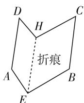
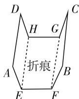
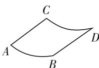
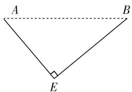
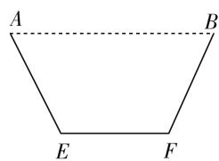

# 高中数学原创题命制的应用探析

# - 江苏省连云港市城头高级中学 穆加超

命题作为一项系统性较强的技术型工作,具有一定的难度和挑战性.新时期教育背景下,为有效提升教育领域命题的质量,命题者有必要更新方法和技术,积累命题经验,并能够通过改编和原创两种方式,实现对试题的科学命制.

现阶段,高质量的原创题在教育领域大受欢迎,应试教育制度下,高中数学教师为有效提高学生的应试能力和数学学科核心素养,不仅开始主动贯彻新课程改革的要求,还开始投入到数学题的命制工作中.在此过程中,教师要基于课堂实际,以适用性为原则,尊重学生间的差异性,在具体的教学实践中,对数学题进行命制和原创,以期实现对学生课堂所学知识的巩固作用,开发学生创新能力和思维意识,推动学生的全面发展,使其在应试教育背景下实现“素质”和“应试”的协调发展.

高中数学教师基于课程标准相关要求、运用一定的命题原理和命题技术、在数学教学实践中进行原创题的命制，能够有效测试和提升学生的创新能力和实践意识。纵观应试教育背景下长期以来数学题的状况和形式，可以发现数学题型较为单一、与生活实际相背离，而新时期教师命制的原创题，则具有一定的新颖度、深度和广度，能够满足学生多样性和探索性的需求特点，进而实现对学生数学知识迁移、融合和运用能力的考查。此外，进行高中数学原创题的命制，还有助于更好地实现高考的人才选拔功能。作为高中阶段重要的选拔性考试，高考能够为高等院校选拔人才，在教育体系中占据着关键的位置，发挥着重要的作用。基于高中数学原创题命制背景新颖、形式多样的特点，能够实现对学生数学知识和技能掌握情况的判定，实现对学生思想方法和学习潜能的考查，减小高考中学生之间的分数差距，实现优秀人才的选拔。在本篇文章中，笔者基于自身为某高中高三学生一次模拟考试的命题经历，对命题方式展开详细的阐述。

# 一、命题过程中要重视知识的内在联系

作为一门复杂性和逻辑性极强的学科,数学科目十分重视知识的内在联系和衔接,因此,在进行原创题命制时,命题者要利用知识间的联系,将知识有机统一.

下题为一道与高中数学必修 5 中数列知识相关的原创试题,在进行本题命制时,主要应用了抽象概括方法和逆向思维方式,同时,命题者还将考试实际和学生的接受情况纳入到考量范围中,基于学生接受能力的特点,构建了一道集等差、等比数列相关公式为一体的数列综合题,体现了一定的基础性和典型性特点.

在初步设计阶段,命题者做出如下设计: $a_{n}=2n-1$ 为等差数列,基于前n项和公式 $S_{n}=n^{2}$ ,得出 $S_{n}=\left(\frac{a_{n}+1}{2}\right)^{2}$ ,还可以将该式进行展开,使其满足 $S_{n}=Aa_{n}^{2}+Ba_{n}+C$ 的形式.在公比不为1的等比数列 $S_{n}=-\frac{q}{1-q}a_{n}+\frac{a_{1}}{1-q}$ 中,其也符合 $S_{n}=Aa_{n}^{2}+Ba_{n}+C$ 的形式,只是A=0,也就是 $S_{n-1}=Aa_{n}^{2}+(B-1)a_{n}+C(n\geqslant2)$ ,在A和C分别等于 $\frac{1}{4}$ 、B等于 $\frac{1}{2}$ 的情况下,得到 $a_{n}=2n-1$ ,在 $\{a_{n}\}$ 是等比数列的情况下,能够证明出A=0.

基于以上设计,命题者进一步构建出初步命题内容为:数列 $\{a_{n}\}$ 的各项均为正数,n为整数且 $n\geqslant2$ , $S_{n-1}=Aa_{n}^{2}+(B-1)a_{n}+C.$ 求:(1) $A=C=\frac{1}{4},B=\frac{1}{2}$ 时,该数列的通项公式;(2)该数列为等比数列情况下,证明A=0.在完成初步命题后,教师还要科学地对构建的原创题内容进行调整,以完善命题的不足之处,在本题的命制中,第(1)问要求求出通项公式,过于直白简单,为了提升难度和区分度,命题者将C的值改为“-1”,同时,在初步命题的第(2)问中,命题者给出的证明A=0条件,在一定程度上会起到一定的提示和暗示作用,因此,要将此部分更换为求值题.最终,命题者构建了内容如下的原创试题:数列 $\{a_{n}\}$ 为各项均为正数的无穷数列, $S_{n}$ 为前n项和,在 $n\geqslant2$ 的情况下， $S_{n-1}=ta_{n}^{2}-ka_{n}-1,(k,t$ 均为R). 求：(1)已知 $k=\frac{1}{2},t=\frac{1}{4}$ ，请猜想该数列能否为等差数列，并说明原因；(2)该数列为等比数列时，求k值.

# 二、命题过程中要重视原创空间的寻找和创设

为保证命制的高中数学原创题具有一定的创新性元素和新颖性特点,命题者在进行原创题命制工作时,要重视寻找和创设原创空间.

下题为笔者依据高中阶段数学必修1基本初等函数教学知识所设计的一道函数题，旨在考查学生的函数与方程的分类思想和整合能力。命题者通过细致梳理可以发现关于 $y = x^{a}$ 和 $y = \log_{a}x$ 二者之间关系的考查相对来说较少，因此，命题者在对其中一个函数做特殊化处理、降低难度的基础上，构建了相应的原创题，以期实现对学生知识体系的良好考查。

在初步设计阶段,命题者做出如下设计:研究 $y = x^{a}$ 与 $y = \ln x$ 的交点个数. 在 $0 < a < \frac{1}{e}$ 的情况下, 存在两个交点, 代数证明难度较高. 构建题目如下: $f(x) = x^{a}, g(x) = e^{x}, h(x) = \ln x$ . 求: (1) a = 1 时, $h(x) < f(x) < g(x)$ ; (2) a = e 时, 求 $f(x) = g(x)$ 正实根; (3) $a \in R$ 时, 求 $f(x) = h(x)$ 的实根个数. 第 (3) 问过难且方法重复, 因而删去, 第 (2) 问已有研究, 也删去, 在对第 (1) 问进行调整的基础上, 构建出最终的原创题: $f(x) = x^{a}, g(x) = \ln x$ . 求: (1) a = 1 时, 证明 x > 0 时, $f(x) >= g(x) + 1$ ; (2) $a \in R$ 的情况下, 求 $f(x) = g(x)$ 的实根个数.

# 三、命题过程中要重视实验操作

在高中阶段的数学教学中,通过实验操作,能够使学生对数学知识进行直观感知,发现有趣的数学现象和规律,提出有价值的新问题.

命题者以 A4 纸为媒介,通过构建实验操作,提取有价值元素,命制了下方的高中数学原创题,旨在考查高中生函数的应用和数学阅读建模能力.在进行本题设计时,命题者首先将 A4 纸(制造过水装置的材料)分别折叠成截面三角形、等腰梯形、弓形的立体图形,并要求折痕与 A4 纸两边平行,尝试怎样折叠能实现过水量的最大化.

基于图1可知,不同图形过水量证明方式存在明显的难度差异,并不适合将其作为考题.因而,命题者为

  
(1)

  
(2)

  
(3)   
图 1

了将本部分的命题贴近实际,帮助考生获取分数,最终构建了生活性较强的、简洁明了的考试试题,具体如下:某校园想要构建多边形花坛,要求花坛一边需靠着长度为30米以上的围墙,现有两种方案可供选择.

如图 2, 花坛形状为直角三角形 AEB, $AE + EB = 30m$ .

如图 3, 花坛为形状为等腰梯形 AEFB, AE = EF = BF = 10m.

text_image

A
B
E

图 2

text_image

A
B
E
F

图 3

请分别对两种形状花坛的面积进行求解,并选择最优方案.

当然,除以上三种方法外,高中数学原创题的命制方法还有很多,本文不一一进行赘述.总之,在进行高中阶段数学原创题的命制工作时,教师发挥着极其关键和重要的作用.教师不仅要具备精湛的命题技术,还要具备雄厚的教学经验,要密切关注学生的学习情况,与学生密切配合,善于抓住教学实践中的灵感,发现新问题,最终实现高中数学原创题命制质量的有效提升.

# 参考文献：

[1] 杨元韡, 耿晓华. 对一道试题的命制预设与测试反馈差异的思考 [J]. 数学通报, 2018(10).  
[2] 庄志红. 命制一道初中数学试题的艰难取舍 [J]. 数学通报, 2016(7).   
[3] 马明. 巧借数学史知识精心命制数列原创题 [J]. 数学通讯, 2018(12).  
[4] 庄佩玉. 课本题, 巧设计, 出新意——一道期中原创题的命制过程及感悟 [J]. 中学数学 (上), 2018(6). W