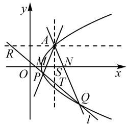

# 2022 年新高考Ⅰ卷圆锥曲线试题的多角度探究与推广

江西省九江市第三中学 彭奇斌

摘要: 多角度、全方位、深层次解读 2022 年新高考Ⅰ卷圆锥曲线试题, 并将结论进行拓展推广; 通过对面积进行齐次化处理, 得出三角形 PAQ 的面积关于 $\tan\angle PAQ$ 与 m 的关系式, 揭示它们之间的内在联系, 反映了各个量之间的本质关系.

关键词: 圆锥曲线; 齐次化; 结论推广

高考真题是教学的绝佳素材,也是提升解题能力、优化解题思路和积累解题经验的宝贵源泉.因此,对优秀的高考真题进行多角度思考,多途径求解,对发展思维、开拓视野、提升能力、提高素养、认识问题本质具有重要意义.

# 1 真题呈现

(2022年新高考Ⅰ卷)已知点A(2,1)在双曲线 $C:\frac{x^{2}}{a^{2}}-\frac{y^{2}}{a^{2}-1}=1(a>1)$ 上，直线l交C于P,Q两点，直线AP,AQ的斜率之和为0.

(1) 求 $l$ 的斜率；

(2) 若 $\tan\angle PAQ=2\sqrt{2}$ ，求 $\triangle PAQ$ 的面积.

本题第(1)问一改以往送分模式,繁重的计算使得大多考生半途而废,无功而返.第(2)问中点P,Q的坐标均为无理数,若直接求其坐标,运算繁琐.因此,应探索合适的方法简化运算,优化解题过程.

# 2 真题破解

# 2.1 角度一: 常规曲直联立

解法 1:(1)由点 A 在曲线 C 上, 易得双曲线 C 的方程为 $\frac{x^{2}}{2}-y^{2}=1$ .

易知直线 l 存在斜率，设 $l: y = kx + m, P(x_{1}, y_{1})$ ， $Q(x_{2}, y_{2})$ 。联立 l 与 C 的方程，得 $(1 - 2k^{2})x^{2} - 4mkx - 2m^{2} - 2 = 0$ ，所以 $x_{1} + x_{2} = -\frac{4mk}{2k^{2} - 1}, x_{1}x_{2} = \frac{2m^{2} + 2}{2k^{2} - 1}$ 。

由 $k_{AP} + k_{BP} = 0$ ，可得 $\frac{y_2 - 1}{x_2 - 2} +\frac{y_1 - 1}{x_1 - 2} = 0$ ，即 $2kx_{1}x_{2} + (m - 1 - 2k)(x_{1} + x_{2}) - 4(m - 1) = 0.$ 化简得 $(k + 1)(2k - 1 + m) = 0.$ 所以 $k = -1$ ，或 $m = 1 - 2k$

当 m=1-2k 时，直线 l 过点 A，舍去。故 k=-1。

(2)设直线 $AP$ 的倾斜角为 $\alpha \left(0 < \alpha < \frac{\pi}{2}\right)$ , 则 $\tan 2\alpha = -2\sqrt{2}$ , 解得 $\tan \alpha = \sqrt{2}$ (负值舍), 于是 $PA: y = \sqrt{2}(x - 2) + 1$ , 直线 $PB: y = -\sqrt{2}(x - 2) + 1$ . 联立直线 $PA$ 与双曲线的方程, 得 $\frac{3}{2} x^2 + 2(\sqrt{2} - 4)x + 10 - 4\sqrt{2} = 0$ , 则 $x_P = \frac{10 - 4\sqrt{2}}{3}, y_P = \frac{4\sqrt{2} - 5}{3}$ .

同理， $x_{Q} = \frac{10 + 4\sqrt{2}}{3},y_{Q} = \frac{-4\sqrt{2} - 5}{3}.$

所以 $PQ: x + y - \frac{5}{3} = 0, |PQ| = \frac{16}{3}$ . 易得点 A 到直线 PQ 的距离 $d = \frac{2\sqrt{2}}{3}$ .

故 $\triangle PAQ$ 的面积为 $\frac{1}{2}\times\frac{16}{3}\times\frac{2\sqrt{2}}{3}=\frac{16\sqrt{2}}{9}$ .

点评:设直线 PQ 的斜截式,联立方程,将条件中直线 AP,AQ 的斜率之和为 0 结合韦达定理表示出来,从而得出结论,是破解此类问题的通技通法,虽容易想到但计算量较大.

# 2.2 角度二: 利用直线的对称性巧设直线方程

解法 2:(1) 显然直线 AP 斜率存在, 设为 k, 则直线 AQ 斜率为 -k. 将直线 AP 的方程 $y = k(x - 2) + 1$ 代入双曲线, 得 $x^{2} - 4 - 2k^{2}(x - 2)^{2} - 4k(x - 2) = 0$ , 即 $(x - 2)[x + 2 - 2k^{2}(x - 2) - 4k] = 0$ , 于是有 $x_{P} = \frac{4k^{2} - 4k + 2}{2k^{2} - 1}$ . 故 $P\left(\frac{4k^{2} - 4k + 2}{2k^{2} - 1}, \frac{-2k^{2} + 4k - 1}{2k^{2} - 1}\right)$ .

将 k 换为 -k，得 $Q\left(\frac{4k^{2}+4k+2}{2k^{2}-1},\frac{-2k^{2}-4k-1}{2k^{2}-1}\right)$ .

所以 $k_{PQ} = \frac{-8k}{8k} = -1.$

(2) 设 $\angle PAQ = \theta$ ，则 $\tan \theta = 2\sqrt{2}$ ，所以可得 $k =$

$\tan \left(\frac{\pi}{2} -\frac{\theta}{2}\right) = \cot \frac{\theta}{2} = \frac{\cos\theta + 1}{\sin\theta} = \sqrt{2}.$ 由(1)得 $|PQ| =$ $\sqrt{2}\left(\frac{8k}{2k^2 - 1}\right) = \frac{16}{3}.$ 设 $PQ$ 中点为 $H$ ，易得 $H\left(\frac{10}{3}, - \frac{5}{3}\right).$

故 $PQ:3x+3y-5=0.$ 后同解法 1.

点评:根据直线的对称性设方程,设而不求,避免了解法1繁琐的计算;观察到点P,Q的坐标均为无理数,直接求其坐标,运算复杂,转为求PQ的中点坐标(有理数),化繁为简,达到事半功倍之效.

# 2.3 角度三: 利用直线的参数方程

解法 3:(1) 设 $P(x_{1}, y_{1})$ , $Q(x_{2}, y_{2})$ ，直线 AP 的倾斜角为 $\alpha$ ，则直线 BP 的倾斜角为 $\pi - \alpha$ .

设直线 $AP$ 的参数方程为 $\left\{ \begin{array}{l} x = 2 + t_1 \cos \alpha, \\ y = 1 + t_1 \sin \alpha \end{array} \right.$ ( $t_1$ 为参数), 则直线 $BP$ 的参数方程为 $\left\{ \begin{array}{l} x = 2 - t_2 \cos \alpha, \\ y = 1 + t_2 \sin \alpha \end{array} \right.$ ( $t_2$ 为参数). 将直线 $AP$ 的参数方程代入 $x^2 - 2y^2 = 2$ , 得 $(\cos^2 \alpha - 2\sin^2 \alpha)t_1^2 + 4(\cos \alpha - \sin \alpha)t_1 = 0$ .

所以 $t_{1}=\frac{4(\cos\alpha-\sin\alpha)}{\cos^{2}\alpha-2\sin^{2}\alpha}$ . 同理，可得 $t_{2}=\frac{-4(\cos\alpha+\sin\alpha)}{\cos^{2}\alpha-2\sin^{2}\alpha}$ . 因此 $t_{1}+t_{2}=\frac{-8\sin\alpha}{\cos^{2}\alpha-2\sin^{2}\alpha}$ ,

$$
t _ {1} - t _ {2} = \frac {8 \cos \alpha}{\cos^ {2} \alpha - 2 \sin^ {2} \alpha}.
$$

故直线 $PQ$ 斜率 $k = \frac{y_1 - y_2}{x_1 - x_2} = \frac{t_1 - t_2}{t_1 + t_2} \cdot \frac{\sin \alpha}{\cos \alpha} = -1.$

(2) 不妨设 $\alpha$ 为锐角，则 $\angle PAQ = \pi - 2\alpha$ ，那么 $\tan 2\alpha = -2\sqrt{2} = \frac{2\tan\alpha}{1 - \tan^2\alpha}$ ，解得 $\tan \alpha = \sqrt{2}$ .

所以 $\sin \alpha = \frac{\sqrt{6}}{3},\cos \alpha = \frac{\sqrt{3}}{3}$ 则 $\cos^2\alpha -2\sin^2\alpha = -1$ 于是 $|t_1t_2| = \frac{16}{3}$ 故 $\sin \angle PAQ = \sin 2\alpha = \frac{2\sqrt{2}}{3}$

所以 $S_{\triangle PAQ} = \frac{1}{2}|t_1t_2|\sin \angle PAQ = \frac{16\sqrt{2}}{9}.$

点评: 涉及弦长的问题, 可考虑利用直线的参数方程简化运算, 提高解题效率.

# 2.4 角度四: 根据斜率之和为定值进行齐次化

解法 4:(1) 将点 A(2,1) 平移至原点 $A'(0,0)$ ，双曲线 C 平移至 $C':\frac{(x+2)^{2}}{2}-(y+1)^{2}=1$ .

设直线 $P'Q': mx + ny = 1$ ，联立曲线 $C'$ 与 $P'Q'$ 的方程，得 $\frac{x^{2}}{2} - y^{2} + (2x - 2y)(mx + ny) = 0$ 。整理可得 $(2 + 4n)y^{2} + 4(m - n)xy - (4m + 1)x^{2} = 0$ ，将两边同

除以 $x^{2}$ ，由 $k = \frac{y}{x}$ ，可得 $(2 + 4n)k^2 +4(m - n)k-$ $(4m + 1) = 0.$ 设 $k_{A^{\prime}P^{\prime}} = k_{1},k_{A^{\prime}Q^{\prime}} = k_{2}$ ，则有 $k_{1} + k_{2} =$ $-\frac{4(m - n)}{2 + 4n},k_1k_2 = \frac{-2m - \frac{1}{2}}{2n + 1}.$ 由于平移不改变直线的斜率与直线之间的相对位置关系，故 $k_{1} + k_{2} =$ $-\frac{2m - 2n}{2n + 1} = 0$ ，即 $m = n.$ 故 $k_{PQ} = k_{P'Q'} = -\frac{m}{n} = -1.$

(2)由(1)得， $|k_{1} - k_{2}| = \sqrt{(k_{1} + k_{2})^{2} - 4k_{1}k_{2}} =$ $\frac{\sqrt{16m^2 + 12m + 2}}{|2m + 1|}.$

由 $\tan \angle PAQ = \left|\frac{k_1 - k_2}{1 + k_1k_2}\right| = \frac{\sqrt{16m^2 + 12m + 2}}{\left|2m + 1 - 2m - \frac{1}{2}\right|} =$ $2\sqrt{2}$ ，得 $m = -\frac{3}{4}$

设 $P'(x_{1},y_{1}), Q'(x_{2},y_{2})$ ，则可以得到 $S_{\triangle PAQ} = \frac{1}{2}|x_{1}y_{2} - x_{2}y_{1}| = \frac{1}{2}\frac{|x_{1}y_{2} - x_{2}y_{1}|}{|(mx_{1} + ny_{1})(mx_{2} + ny_{2})|}$ ，变形整理可得到 $S_{\triangle PAQ} = \frac{1}{2}\frac{|k_{1} - k_{2}|}{|(m + nk_{1})(m + nk_{2})|} = \frac{1}{2}\frac{|k_{1} - k_{2}|}{|m^{2}(k_{1}k_{2} + 1)|} = \frac{1}{2m^{2}}\left|\frac{k_{1} - k_{2}}{1 + k_{1}k_{2}}\right| = \frac{\tan\angle PAQ}{2m^{2}} = \frac{16\sqrt{2}}{9}.$

点评: 当圆锥曲线上有三个点 A, P, B, 涉及到直线 PA, PB 的斜率之和或斜率之积为定值的问题都可使用齐次化方法. 第(2)问中将面积齐次化后, 得到 $\triangle PAQ$ 的面积关于 $\tan\angle PAQ$ 与 m 的关系式, 揭示了它们之间的内在联系, 可谓无心插柳柳成荫.

# 2.5 角度五: 非平移齐次化

在角度四的基础上进行改进,避免平移.

解法 5: 设直线 $PQ: m(x-2) + n(y-1) = 1$ . 将曲线 C 的方程 $\frac{x^{2}}{2} - y^{2} = 1$ 配凑变形为 $\frac{[(x-2)+2]^{2}}{2} - [(y-1)+1]^{2} = 1$ , 即

$$
(x - 2) ^ {2} - 2 (y - 1) ^ {2} + 4 (x - 2) - 4 (y - 1) = 0.
$$

联立直线 PQ 与曲线 C 的方程，可得 $(x-2)^{2}-2(y-1)^{2}+[4(x-2)-4(y-1)][m(x-2)+n(y-1)]=0$ ，即 $(2+4n)(y-1)^{2}+4(m-n)(x-2)(y-1)-(4m+1)(x-2)^{2}=0$ .

两边同除以 $(x - 2)^{2}$ ，由 $k = \frac{y - 1}{x - 2}$ 得

$$
(2 + 4 n) k ^ {2} + 4 (m - n) k - (4 m + 1) = 0.
$$

设 $k_{AP}=k_{1}, k_{AQ}=k_{2}$ ，则 $k_{1}+k_{2}=\frac{4(n-m)}{2+4n}=0$ ，

于是可得 m=n.

故 $k_{PQ} = -\frac{m}{n} = -1.$

# 2.6 角度六: 利用调和点列与极点、极线的性质

解法 6: 如图 1, 设直线 AP, AQ 交 x 轴于点 M, N, 过点 A 分别作平行于 x 轴、y 轴的直线, 交直线 l 于点 R, T, 线束 AR, AT, AP, AQ 交 x 轴于 $E_{\infty}$ , S, M, N. 由 $k_{AP} = -k_{AQ}$ , 可以得到 S 为 MN 的中点,$(E_{\infty}, S; M, N) = -1$ ，即 $E_{\infty}, S, M, N$ 为一组调和点列，则直线 $AR, AT, AP, AQ$ 为调和线束，它们与直线 $l$ 交于点 $R, T, P, Q$ . 根据调和点列的交比不变性可知 $R, T, P, Q$ 也为一组调和点列，所以 $R, T$ 关于曲线 $C$ 互为共轭点，即点 $R$ 在点 $T$ 的极线上.

text_image

y
R
A
M
N
O
P
S
T
x
Q
l

图1

设 $R(x_{0},1)$ , $T(2,y_{0})$ ，根据极点、极线的代数定义，得点 T 的极线方程为 $x-y_{0}y=1$ 。将 $R(x_{0},1)$ 代入，得 $x_{0}-y_{0}=1$ 。所以 $k_{PQ}=k_{RT}=\frac{y_{0}-1}{2-x_{0}}=\frac{(x_{0}-1)-1}{2-x_{0}}=-1$ 。

点评：“极点、极线”与“调和点列”是高等几何中射影几何范畴内的概念，它关于二次曲线的相关结论经常被作为高考解析几何试题的命题背景。纵观2022年高考试卷，全国新高考Ⅰ卷、全国甲卷、全国乙卷、北京卷、天津卷的解析几何大题均以“极点、极线”与“调和点列”作为命题背景，可谓壮观。在历年高考中，以此背景命制的试题也屡见不鲜，例如，2020年全国卷Ⅰ、北京卷，2018年北京卷，2015年四川卷，2013年江西卷，等等。

# 3 结论推广

将题中条件一般化,可推出结论1.

结论 1 过双曲线 $C: \frac{x^{2}}{a^{2}} - \frac{y^{2}}{b^{2}} = 1$ 上一点 $A(x_{0}, y_{0})$ 作两条直线交 C 于 P, Q 两点. 若直线 AP, AQ 的斜率之和为 0, 则直线 PQ 的斜率为定值 $-\frac{b^{2}x_{0}}{a^{2}y_{0}}$ .

结论 1 的证明留给读者. 对于椭圆及抛物线, 也可推出类似结论.

结论 2 过椭圆 $C: \frac{x^{2}}{a^{2}} + \frac{y^{2}}{b^{2}} = 1$ 上一点 $A(x_{0}, y_{0})$ 作两条直线交 C 于 P, Q 两点. 若直线 AP, AQ 的斜率之和为 0, 则直线 PQ 的斜率为定值 $\frac{b^{2}x_{0}}{a^{2}y_{0}}$ .

结论 3 过抛物线 $C: y^{2} = 2px$ 上一点 $A(x_{0}, y_{0})$ 作两条直线交 C 于 P, Q 两点. 若直线 AP, AQ 的斜率

之和为 0, 则直线 PQ 的斜率为定值 $-\frac{p}{y_{0}}$ .

进一步,如果将直线 AP,AQ 的斜率之和为 0,即 $k_{AP}+k_{AQ}=0$ 改为 $k_{AP}+k_{AQ}=k(k\neq0)$ ,也有类似结论.

结论 4 过双曲线 $C: \frac{x^{2}}{a^{2}} - \frac{y^{2}}{b^{2}} = 1$ 上的一点 $A(x_{0}, y_{0})$ 作两条直线分别交 C 于点 P, Q. 如果直线 AP, AQ 的斜率之和为 $k (k \neq 0)$ , 那么直线 PQ 过定点 $\left(x_{0} - \frac{2y_{0}}{k}, \frac{b^{2}}{a^{2}} \cdot \frac{2x_{0}}{k} - y_{0}\right)$ .

证明略.对于椭圆及抛物线,也可推出类似结论.

结论 5 过椭圆 $C: \frac{x^{2}}{a^{2}} + \frac{y^{2}}{b^{2}} = 1$ 上一点 $A(x_{0}, y_{0})$ 作两条直线分别交 C 于点 P, Q. 如果直线 AP, AQ 的斜率之和为 $k (k \neq 0)$ , 那么直线 PQ 一定过定点 $\left(x_{0} - \frac{2y_{0}}{k}, -\frac{b^{2}}{a^{2}} \cdot \frac{2x_{0}}{k} - y_{0}\right)$ .

结论 6 过抛物线 $C: y^{2} = 2px$ 上一点 $A(x_{0}, y_{0})$ 作两条直线交 C 于 P, Q 两点. 若直线 AP, AQ 的斜率之和为 $k (k \neq 0)$ ，则直线 PQ 过定点 $\left( x_{0} - \frac{2y_{0}}{k}, \frac{2p}{k} - y_{0} \right)$ .

再进一步,如果将 $k_{AP} + k_{AQ} = k (k \neq 0)$ 改为 $k_{AP} \cdot k_{AQ} = s (s \neq 0)$ ,也有类似结论成立.

# 4 教学启示

# (1)通过一题多解,优化算理、算法

对于解析几何问题,不同的解法对应的运算量相差很大.只有熟悉各种“算理”,才能在对比中优化“算法”,从而积累有效的解题经验.比如,对于抛物线问题,通过对比“斜参”与“点参”两种常用方法,学生可体会到“点参”法在处理抛物线问题时的巨大优越性.在日常的教学活动中,教师要积极引导学生多角度思考问题,多途径解决问题,提升逻辑推理、数据处理、数学运算等核心素养.

# (2)熟悉常用结论,熟记数学模型

一些综合性很强的解析几何问题往往蕴含着多个常见的数学小结论,比如焦半径公式、中点弦结论、抛物线焦点弦结论等.这些小结论经常会作为复杂问题的一个环节,若学生熟悉一些常用结论与数学模型,则更容易打通“关节”,找到突破口,打开解题思路.

# (3)挖掘试题背景,把握命题规律

以高等几何中极点、极线理论为背景的解析几何问题一直是高考的热点和难点.教师若能掌握有关概念,熟悉相关性质,就能从高观点分析这些试题,高屋建瓴,看透问题本质,把握命题规律,命制相关试题,这对中学数学教学具有重要的指导意义.Z