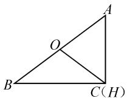
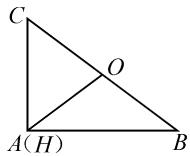

# “本手”筑基，“妙手”生花

# 湖北省十堰市东风高级中学 夏巨星

摘要:从高考语文作文中的围棋术语“本手、妙手、俗手”切入,合理类比到数学解题教学与学习过程中,基于一道模拟题的实例解析,结合数学解题与数学教学,阐述立足“本手”与“妙手”的基本策略,从数学本质、数学思维以及教与学等不同层面加以拓展与深化,有效指导数学教学与复习备考.

关键词: 本手; 妙手; 余弦定理; 平面向量; 特殊思维

2022年全国语文新高考Ⅰ卷的作文题中出现了“本手、妙手、俗手”这三个围棋术语，本手是指合乎棋理的正规下法；妙手是指出人意料的精妙下法；俗手是指貌似合理，而从全局看通常会受损的下法[1].

在数学解题教学与学习过程中,也可以很好借助围棋术语中的“本手”与“妙手”来类比与拓展.“本手”筑基,合理构建并应用数学基础知识与基本思想方法等,筑牢基础知识,构建知识网络;“妙手”生花,巧妙创设场景并利用相关的精妙解法等,优化解题过程,提升解题效益.

# 1 问题呈现

众所周知,解三角形是高中数学的一个重点内容.合理构建于初中平面几何的基础上,融入解三角形、三角函数以及平面向量等相关高中知识,是高考数学试卷填空压轴题中经常设置的一类综合应用问题,特别是涉及多个知识点的交汇与融合的创新应用问题.

下面通过一道有关解三角形背景下平面向量数量积的求解问题,从多个角度进行分析,剖析数学解题与数学教学中的“本手”与“妙手”,以培养学生的推理论证能力和创新意识,促进学生思维能力和思维品质的提升.

问题〔2023届湖北省襄阳四中高三上学期周考(8)数学试卷〕在△ABC中，点O、点H分别为△ABC的外心和垂心，AB=5，AC=3，则 $\overrightarrow{OH}\cdot\overrightarrow{BC}=$ \_\_\_\_。

此题最早出现在 2022 年浙江省宁波“十校”高考数学联考试卷(3 月份)中,以一个相邻两边为定值的三角形为问题背景,结合三角形外心和垂心的给出,进而确定以这两个“心”所对应的向量与第三边所对应的向量的数量积,借助“不确定”的三角形的创设来“确定”对应向量的数量积,“数”与“形”结合,“动”与“静”转化,构建一幅完美、和谐的“画卷”.

特别,我们也尝试从“本手”与“妙手”这两个不同的层面来分析与处理该问题,阐述问题的内涵与解题的本质,剖析解题技巧与应试策略.

# 2 “本手”筑基

数学解题中，“本手”是基础，只有筑牢基础，落实“本手”，掌握相关问题的“通技通法”，才是数学教学与数学学习的根本所在.

此类以平面几何为场景,交汇并融合解三角形与平面向量的相关知识,破解的基本思维策略就是正确剖析平面图形中边与角的关系,通过解三角形中的正弦定理、余弦定理以及平面向量的线性运算、数量积等加以综合与应用,也是解决此类问题的“本手”所在,基础所在.

# 2.1 余弦定理法

解法 1: 由于 $\overrightarrow{OH} = \overrightarrow{AH} - \overrightarrow{AO}$ ，因此 $\overrightarrow{OH} \cdot \overrightarrow{BC} = (\overrightarrow{AH} - \overrightarrow{AO}) \cdot \overrightarrow{BC} = \overrightarrow{AH} \cdot \overrightarrow{BC} - \overrightarrow{AO} \cdot \overrightarrow{BC}$ .

而 H 为 $\triangle ABC$ 的垂心，所以有 $\overrightarrow{AH} \cdot \overrightarrow{BC} = 0$ ，则 $\overrightarrow{OH} \cdot \overrightarrow{BC} = -\overrightarrow{AO} \cdot \overrightarrow{BC}$ .

设 $\angle AOB = \alpha, \angle AOC = \beta, \triangle ABC$ 的外接圆的半径为 $r$ .

由余弦定理，可得 $AB^{2}=AO^{2}+OB^{2}-2AO\cdot OB\cdot\cos\alpha=r^{2}+r^{2}-2r^{2}\cos\alpha=2r^{2}-2r^{2}\cos\alpha=25.$

同理 $AC^{2}=AO^{2}+OC^{2}-2AO\cdot OC\cdot\cos\beta=r^{2}+r^{2}-2r^{2}\cos\beta=2r^{2}-2r^{2}\cos\beta=9.$

所以 $\overrightarrow{AO} \cdot \overrightarrow{BC} = \overrightarrow{AO} \cdot (\overrightarrow{OC} - \overrightarrow{OB}) = \overrightarrow{OA} \cdot \overrightarrow{OB} - \overrightarrow{OA} \cdot \overrightarrow{OC} = r^2 \cos \alpha - r^2 \cos \beta = \frac{1}{2}(2r^2 - 25) - \frac{1}{2} \cdot (2r^2 - 9) = -8$ ，则 $\overrightarrow{OH} \cdot \overrightarrow{BC} = -\overrightarrow{AO} \cdot \overrightarrow{BC} = 8.$

故填答案:8.

解后反思: 根据平面向量的线性运算, 以及 $\triangle ABC$ 的外心和垂心的几何性质, 结合解三角形中的余弦定理, 合理转化, 巧妙应用, 特别是合理转化平面向量的数量积的关系中各向量的“同起点”问题, 进一

步优化解决与应用过程.

# 2.2 余弦定理的向量式法

解法 2: 由于 $\overrightarrow{OH} = \overrightarrow{AH} - \overrightarrow{AO}$ ，因此 $\overrightarrow{OH} \cdot \overrightarrow{BC} = (\overrightarrow{AH} - \overrightarrow{AO}) \cdot \overrightarrow{BC} = \overrightarrow{AH} \cdot \overrightarrow{BC} - \overrightarrow{AO} \cdot \overrightarrow{BC}$ .

而 H 为 $\triangle ABC$ 的垂心，所以有 $\overrightarrow{AH} \cdot \overrightarrow{BC} = 0$ ，则 $\overrightarrow{OH} \cdot \overrightarrow{BC} = -\overrightarrow{AO} \cdot \overrightarrow{BC} = \overrightarrow{OA} \cdot \overrightarrow{BC}$ .

$$
\begin{array}{r l} & {\text {结合余弦定理的向量式,可以得到} \overrightarrow {O A} \cdot \overrightarrow {B C} =} \\ & {\overrightarrow {O A} \cdot (\overrightarrow {O C} - \overrightarrow {O B}) = \overrightarrow {O A} \cdot \overrightarrow {O C} - \overrightarrow {O A} \cdot \overrightarrow {O B} =} \\ & {\frac {| \overrightarrow {O A} | ^ {2} + | \overrightarrow {O C} | ^ {2} - | \overrightarrow {A C} | ^ {2}}{2} - \frac {| \overrightarrow {O A} | ^ {2} + | \overrightarrow {O B} | ^ {2} - | \overrightarrow {A B} | ^ {2}}{2} =} \\ & {\frac {| \overrightarrow {A B} | ^ {2} - | \overrightarrow {A C} | ^ {2}}{2} = \frac {5 ^ {2} - 3 ^ {2}}{2} = 8.} \end{array}
$$

所以 $\overrightarrow{OH}\cdot\overrightarrow{BC}=\overrightarrow{OA}\cdot\overrightarrow{BC}=8.$

故填答案:8.

解后反思: 根据平面向量的线性运算, 以及 $\triangle ABC$ 的外心和垂心的几何性质, 巧妙结合解三角形中余弦定理的向量式, 有机“串联”起解三角形与平面向量之间的联系, 使得问题的解决得到很大的优化与提升.

# 3 “妙手”生花

数学解题中，“妙手”是创新。只有发展思维，推进“妙手”，拓展探究问题的“巧技妙法”，才是优化与提升解题能力、培养创新思维的土壤。

涉及此类由问题场景的“不确定”的创设来“确定”对应的数值等相关创新应用，往往可以借助特殊思维，从问题的特殊情况入手，通过特殊思维，借助特殊元素（包括特殊图形、特殊点、特殊值、特殊函数等）的构建，确定特殊场景下对应的数值，进而回归一般，得以“妙手”偶得.

解法 3: (特殊思维法 1) 由于 $\triangle ABC$ 不能明确确定, 而解题目标是求解平面向量的数量积 $\overrightarrow{OH} \cdot \overrightarrow{BC}$ 的值, 可以借助特殊思维, 视 $\triangle ABC$ 为直角三角形 (此时$AC \perp BC)$ , 则知 $\triangle ABC$ 的外心 $O$ 是斜边 $AB$ 的中点, $\triangle ABC$ 的垂心 $H$ 与点 $C$ 重合, 如图1所示.

结合 AB=5, AC=3，由勾股定理可得 $BC=\sqrt{AB^{2}-AC^{2}}=4$ ，则

  
图1

$$
\begin{array}{l} \overrightarrow {O H} \cdot \overrightarrow {B C} = \overrightarrow {O C} \cdot \overrightarrow {B C} = \overrightarrow {C O} \cdot \overrightarrow {C B} = \frac {1}{2} (\overrightarrow {C A} + \overrightarrow {C B}) \cdot \\ \overrightarrow {C B} = \frac {1}{2} \overrightarrow {C A} \cdot \overrightarrow {C B} + \frac {1}{2} \overrightarrow {C B ^ {2}} = 0 + \frac {1}{2} \times 4 ^ {2} = 8. \end{array}
$$

故填答案:8.解法 4: (特殊思维法 2) 由于 $\triangle ABC$ 不能明确确

定,而解题目标是求解平面向量的数量积 $\overrightarrow{OH}\cdot\overrightarrow{BC}$ 的值,可以借助特殊思维,视 $\triangle ABC$ 为直角三角形(此时 $AB\perp AC$ ),则知 $\triangle ABC$ 的外心O是斜边BC的中点, $\triangle ABC$ 的垂心H与点A重合,如图2所示.

  
图2

$$
\begin{array}{r l} & {\text {结合} A B = 5, A C = 3, \text {所以} \overrightarrow {O H} \cdot \overrightarrow {B C} = \overrightarrow {O A} \cdot} \\ & {\overrightarrow {B C} = \overrightarrow {A O} \cdot \overrightarrow {C B} = \frac {1}{2} (\overrightarrow {A B} + \overrightarrow {A C}) \cdot (\overrightarrow {A B} - \overrightarrow {A C}) =} \\ & {\frac {1}{2} (\overrightarrow {A B ^ {2}} - \overrightarrow {A C ^ {2}}) = \frac {1}{2} (5 ^ {2} - 3 ^ {2}) = 8.} \end{array}
$$

故填答案:8.

解后反思:根据三角形的相邻两边为定值进行极端思维,合理构建特殊图形进行特殊思维,通过不同场景下的直角三角形的创设,快速确定对应的外心与垂心,结合平面向量的线性运算与数量积公式加以转化与应用.“一般”中寻找“特殊”,“特殊”中呈现“一般”,优化解题过程,提升解题效益.

# 4 教学启示

其实，在新教材（人民教育出版社2019年国家教材委员会专家委员会审核通过）、新课程（《普通高中数学课程标准（2017年版2020年修订》）、新高考的“三新”背景下，高考试题更加注重思维品质、关键能力以及核心素养等方面的考查，凸显教师与学生对新高考方向与命题思路的适应程度，反映教考衔接环节之间的匹配度[2].因而，在数学解题教学与学习过程中，要立足“本手”，求取“妙手”；要学好“本手”，下出“妙手”；要勤于“本手”，方能“妙手”.同时，解题研究中，要以“本手”主本，才能“妙手”偶得；要以“本手”固基，才能“妙手”辉煌；要以“本手”行稳，才能“妙手”致远.

特别在数学解题过程中,不能再借助以往的老经验,一味地走“题海战术”的老路,应该合理下稳“本手”,科学实施“妙手”,全面促进学生数学基础知识与数学思想方法等“四基”的内化与提升,提升数学思维的发散性与开阔性,强化数学思维的灵活性与创新性,培养数学核心素养.

# 参考文献：

[1]孔令磊.以2022年高考I卷第21题的探究为例谈数学解题的本手、妙手与俗手[J].数学通讯,2022(15):54-57.  
[2]中华人民共和国教育部.普通高中数学课程标准(2017年版)[S].北京:人民教育出版社,2018.Z