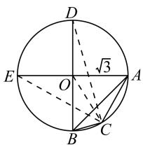

# 代数本质，“数”“形”切入:破解一道取值范围题

# ● 江苏省灌云高级中学 周玉凤

给定条件下的代数关系式的最值或取值范围问题,往往以双变元为主,合理构建变元之间的联系与相互限制,进而巧妙建立相应的代数关系式来创新与应用,是近年高考数学考试中比较常见的一类创新综合应用问题,倍受各方关注.此类代数问题,以“数”的视角为主,合理数学运算;有时也可以“数形结合”,转化为“形”的视角,巧妙构建数学模型,直观形象来推理与运算.

# 1 问题呈现

问题 已知正数 x, y 满足 $\frac{x}{y} + \frac{y}{x} = \frac{6}{xy} - \sqrt{2}$ , $z = (x + y)(\sqrt{12 - x^{2}} + \sqrt{12 - y^{2}})$ ，则 z 的取值范围是 \_\_\_\_.

此题以分式形式及双变元方程为背景来巧妙创设问题情境,确定涉及双变元含根式的混合代数式的取值范围问题,条件与结论对应的代数关系式都比较复杂,没有明显的直接联系.合理的代数式恒等变形与转化是基础,也是问题的“试探”,在此条件下借助基本不等式思维或三角函数思维进行数学运算,或借助数学模型通过解三角形思维进行数形结合等,巧思维切入,妙方法破解.

# 2 问题破解

# 2.1 思维视角一: 基本不等式思维

解法 1: (配凑法 1) 由 $\frac{x}{y} + \frac{y}{x} = \frac{6}{xy} - \sqrt{2}$ ，变形整理，可得 $x^{2} + y^{2} = 6 - \sqrt{2} xy$ ，则有

$$
\begin{array}{c} 1 2 - x ^ {2} = 2 (x ^ {2} + y ^ {2} + \sqrt {2} x y) - x ^ {2} = x ^ {2} + 2 y ^ {2} + \\ 2 \sqrt {2} x y = (x + \sqrt {2} y) ^ {2}, \end{array}
$$

$$
\begin{array}{c} 1 2 - y ^ {2} = 2 (x ^ {2} + y ^ {2} + \sqrt {2} x y) - y ^ {2} = 2 x ^ {2} + y ^ {2} + \\ 2 \sqrt {2} x y = (\sqrt {2} x + y) ^ {2}. \end{array}
$$

所以 $z = (x + y)(\sqrt{12 - x^2} +\sqrt{12 - y^2})$

$$
= (x + y) \left[ (x + \sqrt {2} y) + (\sqrt {2} x + y) \right]
$$

$$
= (\sqrt {2} + 1) (x + y) ^ {2}.
$$

由 $x^{2}+y^{2}=6-\sqrt{2}xy$ ，通过配方并结合基本不等式，可得 $(x+y)^{2}=6+(2-\sqrt{2})xy\leqslant6+(2-\sqrt{2})\cdot\frac{(x+y)^{2}}{4}$ ，当且仅当 x=y 时，等号成立.

解得 $(x + y)^2 \leqslant \frac{24}{2 + \sqrt{2}}$ ，即 $(x + y)^2 \leqslant 12(2 - \sqrt{2})$ 。

又 $(x + y)^2 = 6 + (2 - \sqrt{2})xy > 6$ ，所以

$$
6 <   (x + y) ^ {2} \leqslant \frac {2 4}{2 + \sqrt {2}}.
$$

故 z 的取值范围为 $(6(\sqrt{2}+1),12\sqrt{2}]$ .

点评:根据双变元关系式进行变形整理,对比所求的参数关系式合理配凑,巧妙借助配方及基本不等式合理转化为二次函数型的取值范围问题.有目的的配凑处理,为进一步利用基本不等式提供条件.

解法 2: (配凑法 2) 由 x > 0, y > 0, 得 $\frac{6}{xy} - \sqrt{2} = \frac{x}{y} + \frac{y}{x} \geqslant 2\sqrt{\frac{x}{y} \cdot \frac{y}{x}} = 2$ , 当且仅当 x = y 时等号成立, 解得 $xy \leqslant \frac{6}{2 + \sqrt{2}} = 3(2 - \sqrt{2})$ , 则 $xy \in (0, 6 - 3\sqrt{2}]$ .

由 $\frac{x}{y} +\frac{y}{x} = \frac{6}{xy} -\sqrt{2}$ ，变形整理可得 $x^{2} + y^{2}+$ $\sqrt{2} xy = 6$ ，则有

$$
\begin{array}{c} 1 2 - x ^ {2} = 2 \left(x ^ {2} + y ^ {2} + \sqrt {2} x y\right) - x ^ {2} = x ^ {2} + 2 y ^ {2} + \\ 2 \sqrt {2} x y = (x + \sqrt {2} y) ^ {2}, \end{array}
$$

$$
\begin{array}{c} 1 2 - y ^ {2} = 2 \left(x ^ {2} + y ^ {2} + \sqrt {2} x y\right) - y ^ {2} = 2 x ^ {2} + y ^ {2} + \\ 2 \sqrt {2} x y = (\sqrt {2} x + y) ^ {2}. \end{array}
$$

所以 $z = (x + y)(\sqrt{12 - x^2} +\sqrt{12 - y^2})$

$$
= (x + y) \left[ (x + \sqrt {2} y) + (\sqrt {2} x + y) \right]
$$

$$
= (\sqrt {2} + 1) (x + y) ^ {2}
$$

$$
= (\sqrt {2} + 1) (6 - \sqrt {2} x y + 2 x y)
$$

$$
= 6 (\sqrt {2} + 1) + \sqrt {2} x y,
$$

可得 $6\sqrt{2} + 6 < z \leqslant 12\sqrt{2}$ .

故 z 的取值范围为 $(6\sqrt{2}+6,12\sqrt{2}]$ .

点评:结合题目中双变元关系式的变形整理,借助所求的参数关系式进行有目的性的配凑处理,转化为一次函数型的取值范围问题,进而利用基本不等式求解对应关系式的取值范围.

解法3:(配凑法3)由x>0,y>0,可得 $\frac{6}{xy}-\sqrt{2}=\frac{x}{y}+\frac{y}{x}\geqslant2\sqrt{\frac{x}{y}\cdot\frac{y}{x}}=2$ ,当且仅当x=y时等号成立,

解得 $xy \leqslant \frac{6}{2 + \sqrt{2}} = 3(2 - \sqrt{2})$ ，则有 $0 < xy \leqslant 3(2 - \sqrt{2})$ .

又由 $\frac{x}{y} +\frac{y}{x} = \frac{6}{xy} -\sqrt{2}$ ，变形整理可得 $x^{2} + y^{2} =$ $6 - \sqrt{2} xy.$

$$
\begin{array}{l} \text {所以} z ^ {2} = (x + y) ^ {2} (\sqrt {1 2 - x ^ {2}} + \sqrt {1 2 - y ^ {2}}) ^ {2} = \\ (x ^ {2} + y ^ {2} + 2 x y) [ 2 \sqrt {1 4 4 - 1 2 (x ^ {2} + y ^ {2}) + x ^ {2} y ^ {2}} + 1 2 - \\ \left. x ^ {2} + 1 2 - y ^ {2} \right] = [ 6 + (2 - \sqrt {2}) x y ] (1 8 + \sqrt {2} x y + \\ 2 \sqrt {7 2 + 1 2 \sqrt {2} x y + x ^ {2} y ^ {2}}) = [ 6 + (2 - \sqrt {2}) x y ] [ 1 8 + \\ 1 2 \sqrt {2} + (2 + \sqrt {2}) x y ] = 2 (x y + 6 + 3 \sqrt {2}) ^ {2}. \\ \end{array}
$$

由 $0 < xy \leqslant 6 - 3\sqrt{2}$ , 得 $2(6 + 3\sqrt{2})^2 \leqslant z^2 \leqslant 288$ .

故 z 的取值范围为 $(6\sqrt{2}+6)$ , $12\sqrt{2}]$ .

点评:利用基本不等式确定双变元关系式的取值范围,以 xy 为整体,通过对所求式的平方处理、恒等变形与配凑转化,利用二次函数的图象与性质来求解.这样的配凑处理,目的非常明确,只是数学运算与解题过程比较繁杂.

# 2.2 思维视角二:三角函数思维

解法 4: (三角换元法) 由 $\frac{x}{y} + \frac{y}{x} = \frac{6}{xy} - \sqrt{2}$ ，变形整理可得 $x^{2} + y^{2} + \sqrt{2}xy = 6$ ，配方可得

$$
\left(x + \frac {\sqrt {2}}{2} y\right) ^ {2} + \left(\frac {\sqrt {2}}{2} y\right) ^ {2} = 6.
$$

设 $x + \frac{\sqrt{2}}{2} y = \sqrt{6}\cos \theta ,\frac{\sqrt{2}}{2} y = \sqrt{6}\sin \theta$ ，则

$$
x = \sqrt {6} \cos \theta - \sqrt {6} \sin \theta , y = 2 \sqrt {3} \sin \theta .
$$

结合 $x > 0, y > 0$ ，不妨令 $\theta \in \left(0, \frac{\pi}{4}\right)$ .

由于 $12 - x^{2} = 2(x^{2} + y^{2} + \sqrt{2} xy) - x^{2} = x^{2} + 2y^{2} + 2\sqrt{2} xy = (x + \sqrt{2} y)^{2}$

$$
\begin{array}{c} 1 2 - y ^ {2} = 2 (x ^ {2} + y ^ {2} + \sqrt {2} x y) - y ^ {2} = 2 x ^ {2} + y ^ {2} + \\ 2 \sqrt {2} x y = (\sqrt {2} x + y) ^ {2}, \end{array}
$$

因此 $z=(x+y)(\sqrt{12-x^{2}}+\sqrt{12-y^{2}})=(x+y)\cdot$

$$
[ (x + \sqrt {2} y) + (\sqrt {2} x + y) ] = (\sqrt {2} + 1) (x + y) ^ {2} =
$$

$$
(\sqrt {2} + 1) (\sqrt {6} \cos \theta - \sqrt {6} \sin \theta + 2 \sqrt {3} \sin \theta) ^ {2} = 6 (\sqrt {2} + 1) \cdot
$$

$$
\left[ \cos \theta + (\sqrt {2} - 1) \sin \theta \right] ^ {2} = 6 \sqrt {2} \left[ 1 + \sin \left(2 \theta + \frac {\pi}{4}\right) \right].
$$

由 $\theta \in \left(0, \frac{\pi}{4}\right)$ , 易得 $\frac{\sqrt{2}}{2} \leqslant \sin \left(2\theta + \frac{\pi}{4}\right) \leqslant 1$ .

故 z 的取值范围为 $(6\sqrt{2}+6,12\sqrt{2}]$ .

点评:根据题目中双变元关系式的变形整理,合理配方处理,利用三角换元将所求式转化为三角函数的形式,利用三角函数的图象与性质来确定对应的取值范围.三角换元是解决最值或取值范围等相关问题

中最常用的一种技巧,目的性强,操作性好.

# 2.3 思维视角三: 解三角形思维

解法 5: (解三角形法) 由 $\frac{x}{y} + \frac{y}{x} = \frac{6}{xy} - \sqrt{2}$ ，变形整理可得 $x^{2} + y^{2} - 6 = -\sqrt{2}xy = 2xy\cos\frac{3\pi}{4}$ .

如图 1 所示, 构造一个半径为 $\sqrt{3}$ 的圆 O 的内接三角形 ABC, 其中 $AB = \sqrt{6}$ , BC = x, AC = y, $C = \frac{3\pi}{4}$ , 由点 C 在劣弧 $\widehat{AB}$ 上运动, 可以得到 $\sqrt{12 - x^{2}} = CD$ , $\sqrt{12 - y^{2}} = CE$ , 所以 $z = (BC + AC)(CD + CE)$

text_image

D
√3
E
O
A
B
C

图1

结合对称性, 当点 C 运动到与点 A(或 B) 重合时, $z=AB\cdot(AD+AE)=\sqrt{6}(\sqrt{6}+2\sqrt{3})=6+6\sqrt{2}$ .

当点 C 运动到劣弧 $\widehat{AB}$ 的中点时，结合余弦定理，得 $BC = \sqrt{OB^{2} + OC^{2} - 2OB \cdot OC \cdot \cos \frac{\pi}{4}} = \sqrt{6 - 3\sqrt{2}} = AC, CD = CE = \sqrt{OD^{2} + OC^{2} - 2OD \cdot OC \cdot \cos \frac{3\pi}{4}} = \sqrt{6 + 3\sqrt{2}}$ ，此时可得 $z = 2BC \cdot 2CD = 4\sqrt{6 - 3\sqrt{2}} \cdot \sqrt{6 + 3\sqrt{2}} = 12\sqrt{2}$ .

综上，可知 $z \in (6 + 6\sqrt{2}, 12\sqrt{2}]$ .

点评:根据题目中双变元关系式的变形整理,转化为解三角形中余弦定理的形式,通过合理构建三角形,将代数问题转化为平面几何问题,综合解三角形以及动点的变形规律来直观分析与处理.合理构建数学模型也是解决代数关系式最值或取值范围问题比较常用的一种技巧策略,“数”转化为“形”,更加直观形象.

# 3 教学启示

解决复杂代数式的最值或取值范围问题的基本技巧与策略主要可以归纳总结为以下两点：

(1)从“数”的视角切入.抓住代数式的本质,通过代数思维,从函数与方程、不等式、三角函数等基本视角来恒等转化与巧妙应用,结合相关的知识进行合理代数运算、逻辑推理等,巧妙分析与处理,确定对应代数式最值或取值范围问题.  
(2)从“形”的视角切入.抓住代数式的几何结构特征,联系相应的几何内涵与几何意义,巧妙构建数学模型,化“数”为“形”,利用几何思维,从直观图形及其对应的几何意义视角来直观想象,实现对应代数式的最值等问题的确定.Z