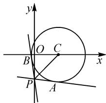
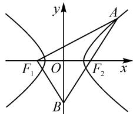
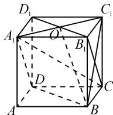
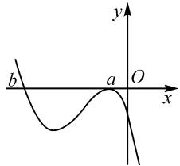
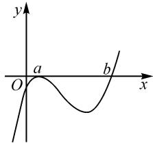
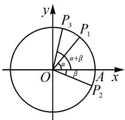
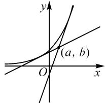
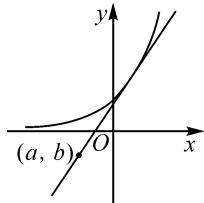

# 例谈“数形结合”思想在高考数学中的应用\*

# 湖北江汉大学数学与大数据系 周岭 许璐

著名数学家华罗庚曾说过：“数缺形时少直观，形少数时难入微；数形结合百般好，隔离分家万事休”。所谓“数形结合”就是把抽象的数学语言、数量关系与直观的几何图形、位置关系结合起来，通过“以形助数”或“以数解形”，即通过抽象思维与形象思维的结合，将复杂问题简单化，抽象问题具体化，达到实现优化解题路径的目的，起到事半功倍的效果。下面将结合高考数学试题实例，分析说明“数形结合”思想在解决问题中的作用和简捷。

# 1 数形结合思想在解析几何中的应用

例 1 （2023 年全国新高考 I 卷）过点 $(0, -2)$ 与圆 $x^{2} + y^{2} - 4x - 1 = 0$ 相切的两条直线的夹角为 $\alpha$ ，则 $\sin \alpha = (\quad)$ .

A.1 B. $\frac{\sqrt{15}}{4}$ C. $\frac{\sqrt{10}}{4}$ D. $\frac{\sqrt{6}}{4}$

分析:此题可以先将圆的方程化为标准形式,设出切线方程,利用点到直线的距离公式求出两条切线的斜率,最后利用夹角公式求得 $\sin \alpha$ 的值,但是计算相对复杂.

解析:依题意,圆的方程可化为 $(x-2)^{2}+y^{2}=5$ .

如图 1, 得到圆心 $C(2,0)$ , $r=\sqrt{5},P(0,-2)$ .所以 $|PC|=2\sqrt{2}$ .

设过点 P 的两条切线为 PA 和 PB，则 $\angle APB = \alpha$ ，可得

text_image

y
O C
B x
P A

$$
\sin \frac {\alpha}{2} = \frac {r}{| P C |} = \frac {\sqrt {5}}{2 \sqrt {2}} = \frac {\sqrt {1 0}}{4},
$$

$$
\cos \frac {\alpha}{2} = \sqrt {1 - \left(\sin \frac {\alpha}{2}\right) ^ {2}} = \frac {\sqrt {6}}{4}.
$$

所以 $\sin\alpha=2\sin\frac{\alpha}{2}\cos\frac{\alpha}{2}=\frac{\sqrt{15}}{4}$ . 故选: B.

例2（2023年新高考I卷）已知双曲线 $C: \frac{x^2}{a^2} - \frac{y^2}{b^2} = 1 (a > 0, b > 0)$ 的左、右焦点分别为 $F_1, F_2$ . 点 $A$ 在 $C$ 上，点 $B$ 在 $y$ 轴上， $\overrightarrow{F_1A} \perp \overrightarrow{F_1B}, \overrightarrow{F_2A} = -\frac{2}{3}\overrightarrow{F_2B}$ ，则

C 的离心率为 \_\_\_\_.

分析: 此题常见解法是设出点 A, B 的坐标, 利用已知条件列出三个方程, 再解出方程求得点 A, B 的坐标, 进而得出双曲线 C 的离心率. 这样计算量会很大, 如果利用数形结合的思想结合双曲线的定义求其离心率将会大大简化计算.

解析：由 $\overrightarrow{F_2A} = -\frac{2}{3}\overrightarrow{F_2B}$ ，得 $\frac{|F_2A|}{|F_2B|} = \frac{2}{3}$ . 设 $|F_{2}A| = 2x$ ，则 $|F_{2}B| = 3x, |AB| = 5x, |F_{1}B| = |F_{2}B| = 3x.$

由双曲线的定义, 得 $\left|AF_{1}\right|=\left|AF_{2}\right|+2a=2x+2a.$

设 $\angle F_{1}AF_{2} = \theta$ ，则 $\sin \theta = \frac{3x}{5x} = \frac{3}{5}$ 所以 $\cos \theta = \frac{4}{5} = \frac{2x + 2a}{5x}$ 解得 $= a$ ，则 $|AF_1| = 4a, |AF_2| = 2a.$

如图 2, 在 $\triangle F_{1}AF_{2}$ 中, 由余弦定理, 可得

$$
\cos \theta = \frac {1 6 a ^ {2} + 4 a ^ {2} - 4 c ^ {2}}{1 6 a ^ {2}} = \frac {4}{5}.
$$

整理，得 $5c^{2} = 9a^{2}$

故 $e = \frac{c}{a} = \frac{3}{5}\sqrt{5}$

text_image

y
A
F₁ O F₂ x
B

图2

点评:这类题目考查了学生“数学抽象”的核心素养.解决此类题的关键在于将数学符号语言和图形语言相互转化,利用图形的直观性,结合相关定义、公式即可快速解题.

# 2 数形结合思想在立体几何中的应用

例 3 （2022 年新高考 I 卷）已知正方体 ABCD- $A_{1}B_{1}C_{1}D_{1}$ ，则（）.

A. 直线 $BC_{1}$ 与 $DA_{1}$ 所成的角为 $90^{\circ}$   
B. 直线 $BC_{1}$ 与 $CA_{1}$ 所成的角为 $90^{\circ}$   
C. 直线 $BC_{1}$ 与平面 $BB_{1}D_{1}D$ 所成的角为 $45^{\circ}$   
D. 直线 $BC_{1}$ 与平面 ABCD 所成的角为 $45^{\circ}$

分析: 此题可以通过建立空间直角坐标系来判断各选项是否正确, 但计算较繁琐.

解析:选项 A,B 的判断略.

如图3所示，连接 $A_{1}C_{1}$ ，设 $A_{1}C_{1}\cap$ $B_{1}D_{1} = O$ ，连接BO.由 $BB_{1}\perp$ 平面 $A_{1}B_{1}C_{1}D_{1},C_{1}O\subset$ 平面 $A_{1}B_{1}C_{1}D_{1}$ 得 $C_1O\bot B_1B.$ 因为 $C_1O\bot B_1D_1$ $B_{1}D_{1}\cap B_{1}B = B_{1}$ ，所以 $C_1O\perp$ 平面 $BB_{1}D_{1}D$ ，所以 $\angle C_1BO$ 为直线 $BC_{1}$ 与平面 $BB_{1}D_{1}D$ 的夹角.设正方体棱长为 1，则 $C_{1}O = \frac{\sqrt{2}}{2}, BC_{1} = \sqrt{2}$ ，于是 $\sin \angle C_{1}BO = \frac{C_{1}O}{BC_{1}} = \frac{1}{2}$ . 所以直线 $BC_{1}$ 与平面 $BB_{1}D_{1}D$ 所成的角为 $30^{\circ}$ ，故选项 C 错误.

text_image

D₁
C₁
A₁
O
B₁
D
C
A
B

图3

因为 $C_{1}C \perp$ 平面 ABCD，所以 $\angle C_{1}BC$ 为直线 $BC_{1}$ 与平面 ABCD 的夹角，易得 $\angle C_{1}BC = 45^{\circ}$ ，故选项 D 正确.

综上所述,此题选:ABD.

点评:本题主要考查立体几何中直线与直线的夹角、直线与平面的夹角,是对学生“逻辑推理”“直观想象”核心素养的考查.此题如果通过建系来计算,将比较复杂,耗时较长;若采取“传统”方法,结合图形并运用立体几何、三角函数相关知识,即可快速、直观作出判断.

# 3 数形结合思想在函数中的应用

例 4 （2021 年全国乙卷）设 $a \neq 0$ ，若 x = a 为函数 $f(x) = a(x - a)^{2}(x - b)$ 的极大值点，则有（）.

A.a<b

B.a>b

C. $ab < a^{2}$

D. $ab > a^{2}$

分析:此题如果利用导数知识来求该函数的极大值点,再通过a与b的大小来判断选项将非常复杂.如果通过数形结合先考虑函数的零点情况,注意零点附近左右两侧函数值是否变号,结合极大值点的性质,对a进行分类画出该函数的图象再来判断选项将大大简化了问题,既直观又方便快捷 $^{[1]}$ .

解析: 若 a=b，则 $f(x)=a(x-a)^{3}$ 为单调函数，无极值点，不符合题意，故 $a\neq b$ .

所以 $f(x)$ 有 x=a 和 x=b 两个不同零点，且在 x=a 附近左右两侧不变号，在 x=b 附近左右两侧变号.

因为 x=a 为函数 $f(x)=a(x-a)^{2}(x-b)$ 的极大值点，所以 $f(x)$ 在 x=a 附近左右都小于 0.

① 当 a<0 时，由 x>b, $f(x)\leqslant0$ ，画出 $f(x)$ 的图象如图 4 所示。由 b<a<0，得 $ab>a^{2}$ 。

text_image

y
b	a	O
x

图4

text_image

y
O a b x

图5

② 当 a > 0 时，由 x > b, $f(x) > 0$ ，画出 $f(x)$ 的图象如图 5 所示。由 b > a > 0，得 $ab > a^{2}$ 。

综上 $ab > a^{2}$ 成立. 故选: D.

例 5 （2021 年新高考 I 卷）已知 O 为坐标原点，点 $A(1,0)$ , $P_{1}(\cos \alpha, \sin \alpha)$ , $P_{2}(\cos \beta, -\sin \beta)$ ,

$P_{3}(\cos(\alpha+\beta),\sin(\alpha+\beta))$ ，则().

A. $|\overrightarrow{OP_1}| = |\overrightarrow{OP_2}|$   
B. $|\overrightarrow{AP_1}| = |\overrightarrow{AP_2}|$   
C. $\overrightarrow{OA}\cdot\overrightarrow{OP_{3}}=\overrightarrow{OP_{1}}\cdot\overrightarrow{OP_{2}}$   
D. $\overrightarrow{OA}\cdot\overrightarrow{OP_{1}}=\overrightarrow{OP_{2}}\cdot\overrightarrow{OP_{3}}$

分析: 此题如果画出图形, 利用数形结合思想解题, 既直观又简捷.

解析:如图 6, 可得 $\left|\overrightarrow{OP_{1}}\right|=\left|\overrightarrow{OP_{2}}\right|=1$ , 故选项 A 正确.

仅当 $\alpha = -\beta$ 时， $|\overrightarrow{AP_{1}}| = |\overrightarrow{AP_{2}}|$ 成立. 故选项 B 错误.

由 $\overrightarrow{OA}\cdot\overrightarrow{OP_{3}}=|\overrightarrow{OA}|\cdot|\overrightarrow{OP_{3}}|\cdot\cos(\alpha+\beta)$ ,

text_image

y
P₃ P₁
α+β
α
β
O A x
P₂

图6

$\overrightarrow{OP_1} \cdot \overrightarrow{OP_2} = |\overrightarrow{OP_1}| \cdot |\overrightarrow{OP_2}| \cdot \cos (\alpha + \beta)$ ,

$|\overrightarrow{OA}| = |\overrightarrow{OP_{3}}| = |\overrightarrow{OP_{1}}| = |\overrightarrow{OP_{2}}| = 1,$

可知 $\overrightarrow{OA}\cdot\overrightarrow{OP_{3}}=\overrightarrow{OP_{1}}\cdot\overrightarrow{OP_{2}}$ .故选项C正确.

观察图象, 易得 $\langle\overrightarrow{OA},\overrightarrow{OP_{1}}\rangle=\alpha,\langle\overrightarrow{OP_{2}},\overrightarrow{OP_{3}}\rangle=\alpha+2\beta.$ 故选项 D 错误. 此题应选: AC.

例 6 （2021 年新高考 I 卷）若过点 $(a, b)$ 可以作曲线 $y = e^{x}$ 的两条切线，则（）.

A. $e^{b}<a$

B. $e^{a}<b$

C. $0 < a < \mathrm{e}^{b}$

D. $0 < b < \mathrm{e}^{a}$

分析: 此题要求作出曲线 $y = e^{x}$ 的两条切线, 通过几何图形进行直观想象, 很容易判断各选项是否正确.

解析:作出 $y=e^{x}$ 的图象.

易得, 若想作出切线, 点 $(a,b)$ 需在曲线 $y=e^{x}$ 的下方和x轴上方, 如图7, 即 $b<e^{a}$ .

text_image

y
(a, b)
O
x

图 7

text_image

(a, b)
O
x
y

图8

但点 $(a,b)$ 在x轴及其下方时，仅能作出一条切线，如图8.所以点 $(a,b)$ 需在y轴上方，即b>0.

综上,可得 $0 < b < e^{a}$ . 故选:D.

综上所述，在高考数学中利用数形结合思想解题往往可以起到简化计算、提高解题效率的作用。因此，平时教学中教师应通过数形结合思想丰富的展现形式不断对其进行渗透，促进学生数与形相互转换的能力，刺激学生学习数学的欲望，引导学生投入到数形结合分析的专题探究中[2]，从而达到数学抽象思维具象化、发散化的教学目的，最终达到提升学生核心素养和全面发展的教育目的。

# 参考文献：

[1] 常国良. 数学教学中渗透直观想象素养的三重境界 [J]. 教学与管理, 2020(31): 62-64.  
[2] 李兆芹. 探究数形结合思想如何有效运用于高中数学教学 [J]. 数学学习与研究, 2018(5): 43. Z