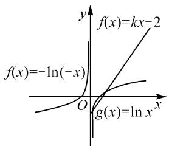
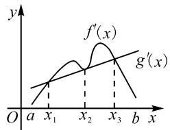

# 借助化归思想提升导数教学效率

● 江苏省江阴高级中学 毛庆华

《普通高中数学课程标准(2017年版2020年修订)》指出：“数学教育帮助学生掌握现代生活和进一步学习所必需的数学知识、技能、思想和方法。”数学思想被纳入数学教育的内容。教学实践中需要把握导数教学的良好契机，注重化归思想的有效渗透，促进教学效率的有效提升。

# 1 函数与方程的转化

函数与方程联系紧密.在导数教学中,结合化归思想,创设函数与方程相互转化的教学情境,有助于加深学生对函数与方程关系的认识,掌握解答导数问题的高效思路.

# 1.1 函数向方程转化

函数在高中数学中占有重要地位.导数部分涉及的函数通常较为复杂,采用常规思路有时无法直接求解,需要将函数转化为方程,通过研究方程根的情况加以突破.教学实践中,教师应以函数图象为媒介,借助多媒体技术,展示函数与方程的内在联系及对应参数的逻辑关系,将二者之间的关系根植于学生内心.同时,围绕教学内容创设相关问题情境,做好转化后具体处理方法的指引,使学生不仅会转化,而且能掌握转化后的作答技巧.

例如,在课堂上展示习题:已知函数 $f(x)=ax+\sin x$ 的图象上存在两条相互垂直的切线,求实数 a 的取值范围.该题目中涉及的函数是超越函数,无法直接求出切线方程,究竟该怎么转化呢?授课时,教师可以引导学生挖掘与提取题干的有用信息,寻找转化的切入点.设计支架问题:(1)如何求两条切线方程的斜率?(2)两条切线方程的斜率之间有什么关系?(3)转化成对应方程之后,如何运用方程的判别式 $\Delta$ 构建不等关系?

其中,问题(1)启发学生从直线斜率入手分析;问题(2)指引学生联系切线垂直知识构建方程,实现函数问题向方程问题的转化;问题(3)指向方程问题的解决,需要借助方程的判别式与三角函数的有界性,求出对应三角函数的值,进而构造函数得出结果.

三个问题由浅入深,实现了从函数向方程转化以及转化后顺利解答的有效辅助.学生在思考、回答问题的过程中既加深了对函数与方程关系的认识,又通过寻找转化,积累了一定的转化解题经验.

# 1.2 方程向函数转化

方程向函数转化是解决方程问题的有效方法，在导数部分中体现的尤为明显。一般情况下，通常将复杂的方程问题转化为函数问题，借助导数研究对应函数的增减性以及零点个数、零点范围等进行求解。当然，部分习题技巧性较强，转化后还需要进行针对性变形，以更好地体现隐含的规律。教学实践中，教师需要立足学情与教学实际，给学生提供交流、讨论的机会，让学生在交流、讨论的过程中获得深刻感悟，体会将方程转化为函数解题的乐趣。

例如,教学过程中展示习题:若正实数 $x_{0}$ 是方程 $\mathrm{e}^{x}+1=a\ln(ax-1)$ 的根,则 $e^{x_{0}}-ax_{0}=$ \_\_\_\_.该题题干较为简单,但却较为抽象,直接将 $x_{0}$ 代入方程后,无论怎样变形均无法与要求解的问题建立联系,也就无法解答.教学过程中,教师可以引导学生从给出的方程入手,尝试着将其转化成函数问题,从函数角度探寻解题思路.课堂上预留时间,要求学生相互交流,讨论如何对已知方程变形.

同时,为使学生能尽快找到正确的思考方向,需要做好课堂观察,了解学生的分析思路以及讨论的结果,必要情况下给予点拨.事实上,由题干中的指数型、对数型函数容易联想到函数的同构,借助指数、对数运算的规律将所给方程的左右两边构造出同一形式的新的函数,利用导数得出新函数的单调性.如此通过等量代换便可得出结果.

教师引导学生交流、讨论,进行思维的碰撞.学生带着问题主动思考,并在教师的引导下探寻方程向函数转化的思路,在活跃的课堂氛围中,掌握方程向函数转化的相关技巧,实现课堂学习效率的提高.

# 2 数与形的转化

数与形是数学中两个非常重要的对象.以数助形,可探究形的细微之处.以形助数,可使数的问题更易解决.高中导数教学中,应通过数与形的转化教学,促进课堂教学实效的提升.

# 2.1 数向形的转化

高中导数部分的“数”多指“函数”.导数在函数研究中发挥着探寻函数的变化趋势、最值、极值、零点等作用.在具体的函数问题中,基于对题干的理解以及巧妙转化,运用导数进行推理、判断,画出函数的大致图象,可以确保抽象、复杂问题得到创造性的解决.导数教学中,教师应运用多媒体进行函数及其导函数图象的展示,明晰两个图象的对应关系,使学生把握函数图象绘制的关键点.同时,围绕具体习题,进行由数向形转化的解题示范,给学生带来启发.

例如，课堂上讲解如下习题：已知函数 $f(x)=\left\{\begin{aligned}&kx-2,x\geqslant0,\\&-\ln(-x),x<0\end{aligned}\right.$ 的图象上有两个关于坐标原点对称的点，则实数 k 的取值范围是 \_\_\_\_. 解答该题的关键在于深入理解“图象上有两个关于坐标原点对称的点”. 教学过程中, 可通过由数向形的转化, 帮助学生理解题意, 寻找突破口. 课堂上要求学生观察如图1所示的函数 $f(x)$ 图象的特点, 尤其可在同一平面直角坐标系中作出函数 $g(x) = \ln x$ 的图象, 然后提出启发性问题: $f(x) = -\ln (-x)(x < 0)$ 的图象和 $g(x) = \ln x$ 的图象之间存在什么关系?

line

| x     | f(x) = -ln(-x) | f(x) = kx - 2 |
|-------|----------------|--------------|
| O     | -              | -            |
| x     | -              | kx - 2       |

图 1

学生通过观察,容易发现两个函数图象关于原点对称.而要想满足题意,则需要函数 $f(x)=kx-2$ $(x\geqslant0)$ 的图象和 $g(x)=\ln x$ 的图象有两个不同的交点,此时只需找临界点,即直线 y=kx-2 和 $g(x)=\ln x$ 的图象相切.运用导数以及 $f(x)=kx-2$ $(x\geqslant0)$ 恒过点 $(0,-2)$ ,容易求得对应的切线为 $y=ex-2$ ,观察图形容易得出 k 的取值范围为 $(0,e)$ .由此可见,通过数向形的转化,抽象的函数问题就会变得直观易解.

# 2.2 形向数的转化

形向数的转化主要借助平面直角坐标系以及空间直角坐标系来实现.高中数学导数部分中的形向数的转化,以平面直角坐标系为主.如给出某函数的导函数图象,要求判断原函数的增减性、极值点或极值点个数等.教学实践中,教师应注重解题方法的引导,要求学生认真观察给出的图象,使用列表法,通过导函数的值与0的关系进行判断,体会形向数转化的思维过程,掌握转化的细节.

例如,给出以下习题:已知 $f(x)$ 和 $g(x)$ 是定义在 $(a,b)$ 上的函数,对应的导函数 $f'(x)$ , $g'(x)$ 的图象如图2所示, $g'(x)$ 的图象在 $x_{2}$ 处与 $f'(x)$ 相切,则有关函数 $h(x)=f(x)-g(x)$ 的说法正确的是().

text_image

y
f'(x)
g'(x)
O a x₁ x₂ x₃ b x

图2

A. 在区间 $(x_{1}, x_{2})$ 上先增后减

B. $x_{2}$ 为极小值点  
C. 在区间 $(x_{1}, x_{3})$ 上单调递减  
D. 极大值和极小值点各 1 个

该习题给出的是两个函数的导函数图象,可以很好地考查学生对导函数含义的理解.该问题的难点在于给出的函数是抽象函数,还涉及到导函数的运算.由函数的求导法则,可得出 $h'(x)=f'(x)-g'(x)$ .课堂上要求学生按照 x,h(x), $h'(x)$ ,通过对图象的观察列表,根据 $h'(x)$ 在 0 左右的符号做出推理.

导数教学中,部分题目既要进行形向数的转化,又要应用到有关导数的基础知识或一些技巧,可以启发学生联系常规的解题思路解答一些看似复杂的问题.

# 3 特殊与一般的转化

特殊与一般的转化是进行数学推理的常用方法.导数教学中,通过特殊向一般的转化可以证明相关的结论,通过一般向特殊的转化可求解具体的求值问题.

# 3.1 特殊向一般转化

归纳法是特殊向一般转化的常用方法.特殊向一般的转化在导数部分通常用于证明相关结论,对学生分析问题的能力以及推理的严谨性要求较高.导数部分教学中,教师应做好归纳法理论知识的讲解,并结合具体解题过程做好解释以及细节的说明,使学生充分理解归纳法的本质.同时,课堂上给出难度适中的习题,组织学生开展以小组为单位的合作学习活动,要求学生积极回顾归纳法的相关知识,相互配合,积极讨论,共同完成解答.

例如，课堂上展示如下习题：已知函数 $f(x) = x - x \ln x$ ，数列 $\{a_n\}$ 满足 $0 < a_1 < 1$ ，且有 $a_{n+1} = f(a_n)$ .

(1) 判断函数 $f(x)$ 在区间 $(0,1)$ 上的单调性；  
(2) 证明: $a_{n} < a_{n+1} < 1$ .

该习题是导数和数列的综合问题.其中,第(1)问难度不大,通过求导不难作出判断.第(2)问难度稍大,需要挖掘出 $0<a_{n}<1$ 这一条件,证明的过程中不仅需要应用到第(1)问的结论,还需要采用特殊向一般的转化,通过归纳得出要证明的结论.教学过程中,教师可以预留一定时间,比一比哪个小组最先找到解题思路,并邀请学生代表板书证明过程,激发出学生主动思考的热情以及竞争意识,更好地活跃课堂气氛.教师根据学生代表板书的推理过程进行评价,指出问题所在,使学生在完善解题细节的过程中牢记不足,实现推理能力的提升.

由于特殊向一般转化的相关知识以及对应的过程较为抽象,因此导数教学中应灵活运用多种教学方法,给学生带来良好的学习体验.正如上文中的合作学习法,使学生在愉悦欢快的氛围中完成证明.另外,根据需要,还可应用互动式教学法、项目教学法、翻转课堂教学法等.

# 3.2 一般向特殊转化

一般向特殊的转化又称演绎推理,即运用一般的数学结论求解一些实际的、具体情境下的数学问题.为确保问题得以顺利解决,需要牢记一般的数学结论,或能够用一般的结论作出进一步的推理.导数教学实践中,教师需要与学生一起完成一般数学结论的推理,使学生把握一般结论的由来,为其进行更深层的推理奠定基础.当然,为提高一般向特殊转化的灵活性,增强解答导数问题的能力,导数教学中,教师应结合教学内容进行习题的优选,组织学生开展课堂训练活动.

例如:已知函数 $f(x)=\frac{2}{\mathrm{e}^{x}+1}+\sin x$ 的导函数为 $f'(x)$ ，则 $f(2018)+f(-2018)+f'(2018)-f'(-2018)$ 的值为 \_\_\_\_.

该问题给出的函数较为特殊,所求问题的自变量较大,直接代入根本不可能求解.教学中,引导学生不要急于动笔,观察所求问题的特点,结合题干尝试推出相关结论,再通过一般向特殊的转化巧妙求出结果.根据经验,该类问题一般需要用到函数的奇偶性.基于此,分别求出 $f(-x)$ , $f'(x)$ , $f'(-x)$ 以及 $f(x) + f(-x)$ , $f'(x) + f'(-x)$ 的表达式.通过推出一般结论,可以发现要求解的问题和自变量的大小无关,如此问题便迎刃而解.

总之,授课中,为使学生能够形成高效的解题经验,实现灵活应用,要求学生树立正确的课堂训练态度,关注解题正确率的同时,更要认真审视解题过程,明确在训练中暴露出的问题,及时查漏补缺.对于较为典型的习题,可以摘抄到错题本中并做好批注,定期翻阅.

# 4 其他类型的转化

除上述介绍的转化方法外,直接转化与换元转化在导数问题的解答中也较为常用.导数教学中应注重换元转化方法的应用讲解.

# 4.1 直接转化

直接转化是指将问题转化为基本定理、基本公式以及基本图形问题。可以看出，牢固掌握基本定理、基本公式以及基本图形是进行直接转化的重点，导数教学中应和学生一起运用思维导图做好归纳与总结。同时，带领学生一起运用直接转化解答相关习题，进一步加深学生印象，使学生能更好地理解与掌握。

例如: 函数 $f(x)=\mathrm{e}^{x}+\sin x-x-1$ 在区间 $[-π,+\infty)$ 上的零点个数为 \_\_\_\_.

该问题中的函数由指数函数、三角函数与一次函数组合而成.课堂上可以采用提问的方式,要求学生回顾零点存在性定理,将问题转化为零点存在性问题,通过判断导函数值与0的大小关系,结合函数的单调性得出函数的零点个数.

直接转化是解答导数问题的常用方法.教学中应引导学生理解和牢记基本定理、基本公式以及基本图形,多开展利用直接转化解答导数问题的训练活动,增强学生的转化技能.

# 4.2 换元转化

通过换元可以减少参数个数,将看似复杂的式子转化为简洁的式子,降低解题难度.换元转化在解决导数多变量问题中表现出明显的优势,因此,课堂上应紧跟换元理论知识的讲解针对性地设计多变量导数问题,展示换元的具体过程,提高学生运用换元转化解决导数多变量问题的意识,使其在以后遇到类似问题能够迅速找到突破口.

例如:若对任意的正实数 x, y, 均有 $\left(2y - \frac{x}{e}\right) \cdot (\ln x - \ln y) - \frac{y}{m} \leqslant 0$ , 则实数 m 的取值范围为 \_\_\_\_.

该导数问题涉及三个参数,难度较大.观察给出的不等关系,难以从中寻找到规律.教学时,可以引导学生先对其进行适当变形,而后作进一步的观察与分析.通过变形可以得到 $\left(2-\frac{x}{ye}\right)\left(\ln\frac{x}{y}\right)\leqslant\frac{1}{m}$ ,将“ $\frac{x}{y}$ ”换元为参数“t”,如此将参数转化成两个,不等式也更为简洁,很好地达到了化陌生为熟悉的目的.换元转化最容易出错的一点在于对换元后参数取值范围的判断.该题问题中,因x,y均为正实数,则“t>0”.

导数教学中,可以采用“讲解理论→分析习题→专题训练”的流程进行授课.其中在专题训练环节,要求学生重点关注换元过程以及换元后如何高效、正确地确定参数的取值范围,总结专题训练中获得的启示,将在专题训练中学习到的知识、技巧内化为自身能力.

综上所述,化归思想在高中导数教学中发挥出了提高教学效率、推动教学活动有序开展的积极作用.教学实践中,教师应增强认识,做好化归思想理论的自主学习,储备丰富的理论知识,增强在教学中融入化归思想的意识,做好教学活动的针对性设计,运用各种教学策略,将化归思想与课堂教学内容有机衔接,使学生在习得数学知识的同时,获得熟练运用化归思想的方法与技巧.Z