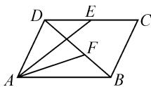
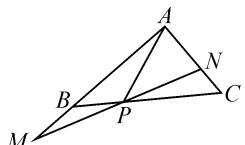
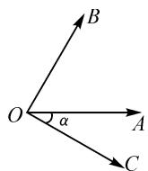
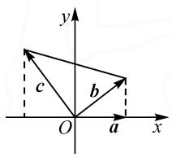

# 基于向量最值(或范围)问题的解题教学

# ● 江苏省东海县第二高级中学 胡陈梅

平面向量的范围与最值问题是热点问题,也是难点问题.此类问题综合性强,体现了知识的交汇整合,其基本题型是根据已知条件求某个变量的范围、最值,比如,向量的模、数量积、向量夹角、系数的范围等;解决思路是建立目标函数的解析式,转化为求函数的最值,同时向量兼有“数”与“形”双重身份,故平面向量的范围与最值问题的另一种思路是数形结合.

题型 1 与系数有关的最值(范围)问题

例 1 如图 1, 在平行四边形 ABCD 中, E 是 CD 的中点, F 为线段 BD 上的一动点, 若 $\overrightarrow{AF} = x \overrightarrow{AE} + y \overrightarrow{DC} (x > 0, y > 0)$ , 则 $\frac{2 - 3x}{2y^{2} + 1}$ 的最大值为 \_\_\_\_.

  
图1

分析:根据题设条件,通过平面向量的线性表示与转化,利用线性组合的构建,结合三点共线的等价条件得到系数x,y之间的等量关系,代入目标关系式进行消参处理,进而利用基本不等式加以放缩处理,得以确定系数关系式的最值问题.

解析: 设 BD, AE 交于点 O. 因为 DE // AB, 所以 $\triangle AOB \sim \triangle EOD$ , 所以 $\frac{AO}{OE} = \frac{AB}{DE} = 2$ , 即 AO = 2OE, 则 $\overrightarrow{AE} = \frac{3}{2} \overrightarrow{AO}$ . 所以 $\overrightarrow{AF} = x \overrightarrow{AE} + y \overrightarrow{DC} = \frac{3}{2} x \overrightarrow{AO} + y \overrightarrow{AB}$ . 因为 O, F, B 三点共线, 所以 $\frac{3}{2} x + y = 1$ , 即 2 - 3x = 2y. 所以 $\frac{2 - 3x}{2y^{2} + 1} = \frac{2y}{2y^{2} + 1} = \frac{2}{2y + \frac{1}{y}}$ . 因为 x > 0, y > 0, 利用基本不等式有 $2y + \frac{1}{y} \geqslant 2\sqrt{2y \times \frac{1}{y}} = 2\sqrt{2}$ , 当且仅当 $2y = \frac{1}{y}$ , 即 $y = \frac{\sqrt{2}}{2}$ 时等号成立, 此时 $x = \frac{2 - \sqrt{2}}{3}$ , 所以 $\frac{2 - 3x}{2y^{2} + 1} = \frac{2}{2y + \frac{1}{y}} \leqslant \frac{2}{2\sqrt{2}} = \frac{\sqrt{2}}{2}$ .

感悟提升: 解此类问题一般分两步走. 第一步, 利用平面向量的运算、性质等将问题中的系数等相关信息转化为相应的等式关系; 第二步, 运用基本不等式或函数的性质求其最值.

针对训练 （2023 年辽宁省葫芦岛市高考数学二模试卷）如图 2 所示，在 $\triangle ABC$ 中，点 P 满足 $2 \overrightarrow{BP} = \overrightarrow{PC}$ ，过点 P 的直线与 AB, AC 所在的直线分别交于点 M, N, 若 $\overrightarrow{AM} = x \overrightarrow{AB} (x > 0)$ , $\overrightarrow{AN} = y \overrightarrow{AC} (y > 0)$ , 则 $2x + y$ 的最小值为 ( ). (A)

  
图2

A.3

B. $3\sqrt{2}$

C.1

D. $\frac{1}{3}$

题型 2 与数量积有关的最值(范围)问题

例 2 已知平面向量 a, b, c 满足 $\left|a\right| = \left|b\right| = \left|c\right| = 1$ ， $a \cdot b = \frac{1}{2}$ ，则 $(a + b) \cdot (2b - c)$ 的最小值为（）.

A. $3+\sqrt{3}$

B. $3-\sqrt{3}$

C. $2+\sqrt{2}$

D. $2-\sqrt{2}$

分析:根据平面向量的数量积的定义 $a \cdot b = |a||b|\cos\alpha$ ，借助两向量的夹角的构建与应用来合理变形与转化，通过平面几何思维来直观，有时也是解决此类问题时比较常用的一种技巧方法。这里要注意的是平面向量的夹角应与平面几何中的对应角加以联系，结合图形直观来分析即可。

解析: 设 $\overrightarrow{OA} = a, \overrightarrow{OB} = b, \overrightarrow{OC} = c.$

由 $|a|=|b|=1,a\cdot b=\frac{1}{2}$ ，得 $a\cdot b=\cos\angle AOB=\frac{1}{2}$ ，
则有 $\angle AOB=\frac{\pi}{3}$ .

如图3所示，设平面向量 $\pmb{a}$ 与 $\pmb{c}$ 的夹角为 $\alpha$ ，其中 $\alpha \in [0,2\pi)$ ，则知平面向量 $\pmb{b}$ 与 $\pmb{c}$ 的夹角为 $\alpha +\frac{\pi}{3}$ 那么 $(a + b)\cdot (2b - c) = 2a\cdot b - a\cdot c+$ $2b^{2} - b\cdot c = 2\times \frac{1}{2} -\cos \alpha +2\times 1^{2}-$

  
图3

$$
\begin{array}{l} \cos \left(\alpha + \frac {\pi}{3}\right) = 3 - \cos \alpha - \cos \left(\alpha + \frac {\pi}{3}\right) = 3 - \cos \alpha - \\ \left(\frac {1}{2} \cos \alpha - \frac {\sqrt {3}}{2} \sin \alpha\right) = 3 - \frac {3}{2} \cos \alpha + \frac {\sqrt {3}}{2} \sin \alpha = 3 + \\ \sqrt {3} \sin \Bigl (\alpha - \frac {\pi}{3} \Bigr) \geqslant 3 - \sqrt {3}, \text {当且仅当} \sin \Bigl (\alpha - \frac {\pi}{3} \Bigr) = - 1, \\ \end{array}
$$

即 $\alpha=\frac{11\pi}{6}$ 时, 等号成立.

所以 $(a+b)\cdot(2b-c)$ 的最小值为 $3-\sqrt{3}$ .

感悟提升: 求数量积的最值(范围)的方法通常有两种。(1)坐标法. 通过建立直角坐标系, 运用向量的坐标运算转化为代数问题处理; (2)向量法. 运用向量数量积的定义、不等式、极化恒等式等有关向量知识解决.

针对训练〔2023届山东省潍坊市高考模拟试卷(2023潍坊东营一模)〕单位圆 $O: x^{2} + y^{2} = 1$ 上有两定点 $A(1,0), B(0,1)$ 及两动点 $C, D$ ，且 $\overrightarrow{OC} \cdot \overrightarrow{OD} = \frac{1}{2}$ ，则 $\overrightarrow{CA} \cdot \overrightarrow{CB} + \overrightarrow{DA} \cdot \overrightarrow{DB}$ 的最大值是（ ）.

A. $2+\sqrt{6}$

B. $2+2\sqrt{3}$

C. $\sqrt{6}-2$

D. $2\sqrt{3}-2$

题型 3 与模有关的最值(范围)问题

例 3 已知平面向量 a, b, c 满足 $\left|a\right|=1, b \cdot c=0$ , $a \cdot b=1, a \cdot c=-1$ , 则 $\left|b+c\right|$ 的最小值为().

A.1

B. $\sqrt{2}$

C.2

D.4

分析:根据平面向量的“数”的结构属性,构建平面直角坐标系,合理引入平面向量的坐标,利用平面向量中的相关要素,转化为涉及坐标的函数、方程或不等式等,进而从代数视角来数学运算与逻辑推理.这里通过平面向量所对应的坐标的构建,利用题设条件确定对应坐标的关系式,再利用基本不等式、三角函数的应用等来确定最值.

解析: 在平面直角坐标系 xOy 中, 设向量 $\boldsymbol{a}=(1,0)$ , $\boldsymbol{b}=(x_{1},y_{1})$ , $\boldsymbol{c}=(x_{2},y_{2})$ , 如图 4 所示.

因为 $a \cdot b = 1, a \cdot c = -1,$ $b \cdot c = 0$ ，所以 $x_{1} = 1, x_{2} = -1,$ $x_{1}x_{2}+y_{1}y_{2}=0$ ，即 $y_{1}y_{2}=1$ 。利用基本不等式，可得 $|\pmb {b} + \pmb{c}| = \sqrt{(x_1 + x_2)^2 + (y_1 + y_2)^2} =$ $\sqrt{y_1^2 + y_2^2 + 2}\geqslant \sqrt{2y_1y_2 + 2} = 2$ ，当且仅当 $y_{1} = y_{2} = 1$ 或 $y_{1} = y_{2} = -1$ 时，等号成立，则 $|\pmb {b} + \pmb{c}|$ 的最小值为2.

text_image

y
c
b
O
a
x

图4

感悟提升:求向量模的最值(范围)的方法通常有两种.(1)代数法.把所求的模表示成某个变量的函数,或通过建立平面直角坐标系,借助向量的坐标表示;需要构造不等式,利用基本不等式、三角函数,再用求最值的方法求解.(2)几何法(数形结合法).弄清所求的模表示的几何意义,注意题目中所给的垂直、平行,以及其他数量关系,合理的转化,使得过程更加简单;结合动点表示的图形求解.

针对训练 若向量 a, b 互相垂直, 且满足 $(a + b) \cdot$ $(2a-b)=2$ , 则 $|a+b|$ 的最小值为().

A.-2

B.1

C.2

D. $\sqrt{2}$

题型 4 与夹角有关的最值(范围)问题

例 4 平面向量 a, b 满足 $\left|a - b\right| = 3, \left|a\right| = 2|b|$ ，则 a - b 与 a 夹角最大时， $\left|a\right|$ 为（）.

A. $\sqrt{2}$

B. $\sqrt{3}$

C. $2\sqrt{2}$

D. $2\sqrt{3}$

分析:根据题设,由平面向量的数量积运算加以合理变形与转化,通过平面向量的夹角公式合理消参,利用基本不等式的应用进行放缩,进而确定夹角的余弦值的最小值,利用三角函数的性质来进一步分析与处理.

解析: 因为平面向量 a, b 满足 $\left|a - b\right| = 3, \left|a\right| = 2\left|b\right|$ ，所以 $(a - b)^{2} = a^{2} - 2a \cdot b + b^{2} = 4b^{2} - 2a \cdot b + b^{2} = 9$ ，则有 $a \cdot b = \frac{5}{2}b^{2} - \frac{9}{2}$ 。所以 $(a - b) \cdot a = a^{2} - a \cdot b = 4b^{2} - \frac{5}{2}b^{2} + \frac{9}{2} = \frac{3}{2}b^{2} + \frac{9}{2}$ 。由夹角公式，得

$\cos \langle a - b, a \rangle = \frac{(a - b) \cdot a}{|a - b||a|} = \frac{\frac{3}{2}b^2 + \frac{9}{2}}{6|b|} = \frac{1}{4}|b| + \frac{3}{4|b|} \geqslant \frac{\sqrt{3}}{2}$ , 当且仅当 $\frac{1}{4}|b| = \frac{3}{4|b|}$ , 即 $|b| = \sqrt{3}$ 时, 等号成立. 因为 $0 \leqslant \langle a - b, a \rangle \leqslant \pi$ , 所以 $0 \leqslant \langle a - b, a \rangle \leqslant \frac{\pi}{6}$ , 即 $|b| = \sqrt{3}$ 时, $\langle a - b, a \rangle$ 的最大值为 $\frac{\pi}{6}$ , 此时 $|a| = 2|b| = 2\sqrt{3}$ .

感悟提升: 求夹角的最值(范围)问题时, 往往要选取对应夹角的三角函数值, 以选取夹角余弦值为主, 通过余弦值的三角函数表达式, 利用关系式的变形与转化, 采用基本不等式或函数的性质进行求解.

针对训练 已知矩形 ABCD 中, AB = 2, AD = 1, 点 E, F, G, H 分别在边 AB, BC, CD, AD 上 (包含端点), 若 $\overrightarrow{EG} \cdot \overrightarrow{HF} = 2$ , 则 $\overrightarrow{EG}$ 与 $\overrightarrow{HF}$ 夹角的余弦值的最大值是 \_\_\_\_. $\left(\frac{4}{5}\right)$

平面向量中的最值(范围)问题,是高考对平面向量比较常见的考查形式之一,也是常考常新的基本考点之一,主要考查的知识点涉及平面向量的模、坐标、夹角、数量积以及相关的参数等.在实际解答与应用时,挖掘题目内涵,结合题意,从平面向量的本质出发,选取函数法、三角法、不等式法、图形法等行之有效的基本方法来解决,进而达到解决相关的最值(范围)问题的目的.Z