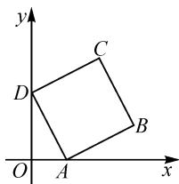

# 巧借复数三角形式,妙解数学综合问题

# 山东省阳信县第二高级中学 王守亮

摘要: 复数三角形式是复数模块知识中的一个课外补充与阅读知识, 对学有余力的学生加以知识空间与应用场景的拓展. 结合复数三角形式在一些数学综合问题中的应用, 剖析复数三角形式的知识内涵、几何意义与应用场景, 归纳总结规律, 拓展数学解题研究与竞赛辅导.

关键词: 复数; 三角形式; 概念; 图形; 方程

高中数学人教 A 版教材(2019 年版)必修第二册第七章“复数”章节通过选学内容“7.3 复数的三角表示”的方式给出复数的三角形式,结合相关的概念、运算与几何意义等,将代数、函数与方程、三角函数、平面向量、平面解析几何等相关知识点巧妙融为一体,很好地考查学生的数学基础知识、数学思维能力与知识灵活应用能力等,在数学竞赛及诸项考试中备受命题者青睐.

# 1 基本概念的应用

例 1 已知平面向量 $\overrightarrow{OZ_{1}},\overrightarrow{OZ_{2}}$ 分别对应非零复数 $z_{1},z_{2}$ ，若满足 $\overrightarrow{OZ_{1}}\perp\overrightarrow{OZ_{2}}$ ，则 $\frac{z_{1}}{z_{2}}$ 表示的是()。

A. 负实数

B. 纯虚数

C. 正实数

D. 虚数 $a + b\mathrm{i}(a, b \in \mathbf{R}, a \neq 0)$

分析:根据题设条件,分别设出两个复数的三角形式,抓住两向量的垂直关系确定两向量的夹角为 $90^{\circ}$ ,进一步转化为两复数的三角形式中辐角之差为 $90^{\circ}$ ,结合复数的三角形式的除法运算,确定两复数除式的结果,综合复数的基本概念来分析与判断.

解析:依题可知, $z_{1},z_{2}$ 为非零复数,设复数 $z_{1}=r_{1}\left(\cos\theta_{1}+\mathrm{i}\sin\theta_{1}\right),z_{2}=r_{2}\left(\cos\theta_{2}+\mathrm{i}\sin\theta_{2}\right)$ ,其中 $r_{1}>0,r_{2}>0,\theta_{1},\theta_{2}\in[0,2\pi)$ .由于 $\overrightarrow{OZ_{1}}\perp\overrightarrow{OZ_{2}}$ ,则有 $\frac{z_{1}}{z_{2}}=\frac{r_{1}\left(\cos\theta_{1}+\mathrm{i}\sin\theta_{1}\right)}{r_{2}\left(\cos\theta_{2}+\mathrm{i}\sin\theta_{2}\right)}=\frac{r_{1}}{r_{2}}\left[\cos\left(\theta_{1}-\theta_{2}\right)+\mathrm{i}\sin\left(\theta_{1}-\theta_{2}\right)\right]=\frac{r_{1}}{r_{2}}\left[\cos\left(\pm90^{\circ}\right)+\mathrm{i}\sin\left(\pm90^{\circ}\right)\right]=\pm\frac{r_{1}}{r_{2}}i$ ,所以 $\frac{z_{1}}{z_{2}}$ 为纯虚数.故选:B.

点评:在明确两个复数所对应的平面向量的夹角、两个复数所对应的模的长度关系或比例关系等情况下,经常可以考虑采用复数的三角形式来设置与应用,通过复数三角形式的变形与转化,这样问题更加直接,目标会更加明确,在一定程度上可以减少数学运算,优化解题过程.

# 2 图形形状的识别

例 2 设点 A, B 分别对应非零复数 $z_{1}, z_{2}$ ，且满足 $z_{1}^{2} + z_{1}z_{2} + z_{2}^{2} = 0$ ，则 $\triangle AOB$ 的形状特征为（）.

A. 直角三角形

B.等边三角形

C. 等腰三角形

D.等腰直角三角形

分析:根据题设条件,结合条件中涉及两个复数的方程,通过同除一个非零的复数加以恒等变形与转化,通过整体思维来求解对应的二次方程,并将结果中复数的代数形式转化为三角形式,利用复数的几何意义来确定对应角的大小以及两边长的关系,进而得以确定三角形的形状特征.

解析:依题知 $z_{2} \neq 0$ ，由条件 $z_{1}^{2} + z_{1}z_{2} + z_{2}^{2} = 0$ ，变形可得 $\left(\frac{z_{1}}{z_{2}}\right)^{2} + \left(\frac{z_{1}}{z_{2}}\right) + 1 = 0$ ，解得 $\frac{z_{1}}{z_{2}} = -\frac{1}{2} \pm \frac{\sqrt{3}}{2} i = \cos \left( \pm \frac{2\pi}{3} \right) + i \sin \left( \pm \frac{2\pi}{3} \right)$ ，则有 $\angle AOB = \frac{2}{3}\pi$ ，而 $\left|\frac{z_{1}}{z_{2}}\right| = 1$ ，所以 $|z_{1}| = |z_{2}|$ .

综上, $\triangle AOB$ 是顶角为 $\frac{2\pi}{3}$ 的等腰三角形,故选:C.

点评: 涉及复数的模、复数三角形式的几何意义等, 这些都具有实际的平面几何图形的结构特征内涵. 在实际解决综合问题时, 经常借助复数的三角形式等相关知识, 巧妙处理平面几何中相关图形结构特征的判断与应用等, “数”与“形”巧妙结合与转化, 实现问题的突破与求解.

# 3 二次方程的求解

例 3 已知实系数二次方程 $ax^{2} + bx + c = 0$ 的两根为 $\alpha$ 和 $\beta$ ，且满足 $\alpha$ 是虚数， $\frac{\alpha^{2}}{\beta}$ 是实数，则 $\frac{\alpha}{\beta} =$ \_\_\_\_ .

分析:根据题设条件,直接设出对应的复数,利用复数三角形式的相关运算来处理对应虚数的乘积、次幂与除法等.

解析: 由 $\alpha$ 是虚数, 可设 $\alpha = r(\cos \theta + \mathrm{i}\sin \theta)$ , 其中 $r > 0, \theta \in (0, 2\pi)$ , 且 $\theta \neq \pi$ . 由实系数一元二次方程的虚根成对的基本性质, 可知 $\beta = \overline{\alpha} = r(\cos \theta - \mathrm{i}\sin \theta) = r[\cos (-\theta) + \mathrm{i}\sin (-\theta)]$ . 又 $\frac{\alpha^{2}}{\beta} = \frac{r^{2}(\cos 2\theta + \mathrm{i}\sin 2\theta)}{r[\cos (-\theta) + \mathrm{i}\sin (-\theta)]} = r(\cos 3\theta + \mathrm{i}\sin 3\theta)$ 是实数, 所以可得 $\sin 3\theta = 0$ , 则有 $3\theta = k\pi, k \in Z$ .

而 $\theta \in (0,2\pi)$ ，且 $\theta \neq \pi$ ，可得 $3\theta \in (0,6\pi)$ ，且 $3\theta \neq 3\pi$ ，则有 $3\theta = \pi, 2\pi, 4\pi, 5\pi$ .

当 $3\theta = \pi, 4\pi$ 时，可得 $\theta = \frac{\pi}{3}, \frac{4\pi}{3}$ ，此时 $\frac{\alpha}{\beta} = \cos 2\theta + \mathrm{i}\sin 2\theta = -\frac{1}{2} + \frac{\sqrt{3}}{2}\mathrm{i}$ ;

当 $3\theta = 2\pi, 5\pi$ 时，可得 $\theta = \frac{2\pi}{3}, \frac{5\pi}{3}$ ，此时 $\frac{\alpha}{\beta} = \cos 2\theta + \mathrm{i}\sin 2\theta = -\frac{1}{2} - \frac{\sqrt{3}}{2}\mathrm{i}$ .

综上分析,可得 $\frac{\alpha}{\beta}=-\frac{1}{2}\pm\frac{\sqrt{3}}{2}i.$

点评: 涉及复数范围内的实系数一元二次方程问题, 有其对应的求根公式, 常规方法就是利用复数的基本性质——“实系数一元二次方程的虚根成对”, 进而加以分析与应用. 借助复数的三角形式和待定系数法处理, 也是一个不错的解决问题的方法.

# 4 最值问题的探究

例 4 设复数 z 满足 $\left|z\right|=2$ ，则 $\left|z+\frac{1}{z}\right|$ 的最大值与最小值之和为 \_\_\_\_.

分析:根据题设条件,结合复数的模,借助复数的三角形式,可以快速找到解决问题的突破口.结合复数三角形式的除法运算、复数的四则运算等,并通过复数求模运算及三角函数的相关公式与基本性质的应用,分别确定对应复数的模的最大值与最小值,进而加以分析与求解.

解析:依题可设 $z=2(\cos\theta+\mathrm{i}\sin\theta)$ ，其中 $\theta\in[0,2\pi)$ ，则有 $\frac{1}{z}=\frac{1}{2}[\cos(-\theta)+\mathrm{i}\sin(-\theta)]=\frac{1}{2}(\cos\theta-\mathrm{i}\sin\theta)$ ，于是 $z+\frac{1}{z}=\frac{5}{2}\cos\theta+\frac{3}{2}\mathrm{i}\cdot\sin\theta$ ，所以 $\left|z+\frac{1}{z}\right|=\sqrt{4\cos^{2}\theta+\frac{9}{4}}$ .

故 $\left|z + \frac{1}{z}\right|_{\max} = \frac{5}{2},\left|z + \frac{1}{z}\right|_{\min} = \frac{3}{2}.$

因此 $\left|z + \frac{1}{z}\right|$ 的最大值与最小值之和为4.

点评:相比复数代数形式的运算与求解来言,复数的三角形式可以很好地减少数学运算量,解题过程更加简洁清晰,提升了解题的准确率.

# 5 平面向量的转化

例 5 如图 1 放置的边长为 2 的正方形 ABCD，顶点 A, D 分别在 x 轴、y 轴的正半轴（含坐标原点 O）上滑动，则 $\overrightarrow{OB} \cdot \overrightarrow{OC}$ 的最大值是 \_\_\_\_.

text_image

y
C
D
B
O A x

图1

分析:根据题设条件,通过图 图1
形直观,先设出坐标轴上的两个顶点的坐标确定,结合平面向量的线性运算与坐标表示,确定向量对应的复数,并通过图形中的直角旋转,利用复数三角形式的几何意义,借助复数的运算来确定对应的平面向量,进而利用向量的数量积以及不等式的性质等来分析与应用.

解析: 设 $A(a,0)$ , $D(0,d)$ ，其中 $a \geqslant 0$ , $d \geqslant 0$ ，且满足 $a^{2} + d^{2} = 4$ ，则有 $\overrightarrow{AD} = (-a, d)$ ，其对应的复数为 $-a + di$ .

结合图形直观,可得 $\overrightarrow{AB}$ 所对应的复数为 $(-a+di)\cdot\left[\cos\left(-\frac{\pi}{2}\right)+\mathrm{i}\sin\left(-\frac{\pi}{2}\right)\right]=d+a\mathrm{i}$ ，即 $\overrightarrow{AB}=(d,a)$ .

又 $\overrightarrow{OB} = \overrightarrow{OA} +\overrightarrow{AB} = (a,0) + (d,a) = (a + d,a)$ $\overrightarrow{OC} = \overrightarrow{OD} +\overrightarrow{DC} = \overrightarrow{OD} +\overrightarrow{AB} = (0,d) + (d,a) =$ $(d,a + d)$ ，所以 $\overrightarrow{OB}\cdot \overrightarrow{OC} = (a + d,a)\cdot (d,a + d) =$ $a^2 +d^2 +2ad = 4 + 2ad\leqslant 4 + a^2 +d^2 = 4 + 4 = 8$ ，当且仅当 $a = d = \sqrt{2}$ 时等号成立，即 $\overrightarrow{OB}\cdot \overrightarrow{OC}$ 的最大值是8.

点评:解决此类问题时,可以很好地将平面向量、复数以及平面解析几何中相关的点的坐标等知识加以合理化归与转化,“数”与“形”结合,并借助复数三角形式在乘除运算方面的便捷性以及对应的几何意义,使得“数”与“形”的转化与结合更加密切,操作起来更加直观简捷.

巧妙借助复数的三角形式,综合相应的运算规则、运算性质以及几何意义等,合理联系复数与代数、三角函数、平面向量、平面解析几何等知识之间的联系,可以用来解决一些复杂的数学综合问题,使数学知识的应用与思想方法的拓展得到更好的升华,对于学生学习过程中的“学懂数学”“学会数学”“会学数学”以及“会用数学”等知识、思想、方法等方面的积累与螺旋上升等大有裨益. Z