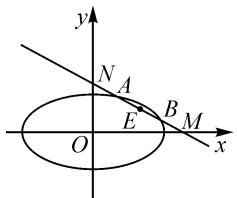
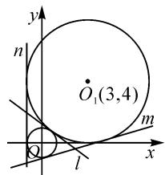
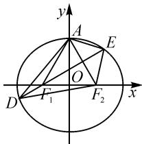

# 拓宽思路找方法,准确与否靠检验

——高考数学填空题答题思路与方法初探

湖北省恩施土家族苗族自治州高级中学 刘秀军

高考数学填空题通常是将一个数学真命题写成其中缺少一些语句的形式,要求考生将缺少的语句填写在指定的空位上,使之成为一个完整而正确的数学命题.根据填空题的内容可将其分为两种题型:一种是定量型的,要求考生填写数值或数量关系,如方程、不等式的解,函数的定义域、值域、周期,某参变量的值或变化范围,等等;另一种是定性型的,要求填写具有某种性质的数学对象或数学对象的某种性质等.

从湖北省近几年的数学高考试题(新高考I卷)来看,填空题的分值较高(一般4个小题,总分为20分),内容覆盖面广,难易适中.由于填空题无需解答过程,没有步骤分,因而要求解答过程中的每一步都必须保证准确,一步失误就可能导致全题零分.所以说,填空题比选择题、解答题更容易失分,这更应该引起我们的高度重视.

# 1 本校考生填空题的答题现状

# 1.1 思想上不够重视

2023年1月本校高三学生进行了一次高考模拟考试，从考试成绩分析来看，填空题失分的现象很严重。笔者所任教的高三(8)班56名学生中，仅有3名学生填空题获得满分，有7名学生的填空题竟然是零分。在班会总结中，很多学生说把主要时间和精力都花在了解答题上，还说解答题分值高是“西瓜”，填空题是“芝麻”，况且解答题的每一步都有步骤分，值得花时间。可见，学生思想上的不重视是导致填空题严重失分的因素之一。

# 1.2 时间不够用

高考数学试题量大面宽,时间紧.这次模拟考试用的是“金太阳教育”的数学试题,共有23道大题,150分,考试时间2小时.如何在有限的时间内做完所有试题,的确考验学生的速度与能力.

# 1.3 缺乏思考与答题技巧

很多学生由于平时训练不踏实,面对陌生的题型缺乏清晰的解题思路与答题技巧,只知道一味地按照试题的先后顺序硬着头皮往下答,答到哪儿算哪儿,只顾着赶时间,顾不上正确与否.

# 2 解答填空题的常用思路与方法

解答填空题,要开阔思路,不断探索和总结方法.填空题与其他题型(选择题、解答题)不同,更要注重填空题与其他题型的密切联系,例如,可以借鉴某些选择题、解答题的答题思路,通过观察、分析、转化等方法,将某些未知的题型变为已知的或自己非常熟悉的基本题型来解决;要充分利用题干和选择支两方面提供的信息,依据题目的具体特点,灵活、巧妙、快速地选择解法,准确作答.

# 2.1 直接求解法

直接求解法是指直接从题设条件出发,利用定义、性质、定理、公式和一些规律性的结论等,经过变形、计算得出结论,然后将结论填在空位处.这是解填空题最常用的一种方法.

例 1 （2022 年全国数学新高考 I 卷第 13 题） $\left(1-\frac{y}{x}\right)(x+y)^{8}$ 的展开式中 $x^{2}y^{6}$ 的系数为 \_\_\_\_（用数字作答）.

解析：因为 $\left(1 - \frac{y}{x}\right)(x + y)^8 = (x + y)^8 - \frac{y}{x} (x + y)^8$ ，所以 $\left(1 - \frac{y}{x}\right)(x + y)^8$ 的展开式中含 $x^2 y^6$ 的项为 $\mathrm{C}_8^6 x^2 y^6 - \frac{y}{x} \cdot \mathrm{C}_8^5 x^3 y^5 = -28x^2 y^6$ ，则 $\left(1 - \frac{y}{x}\right)(x + y)^8$ 的展开式中 $x^2 y^6$ 的系数为-28.

故填答案: -28.

思路与方法:首先将 $\left(1-\frac{y}{x}\right)(x+y)^{8}$ 变形,化为 $(x+y)^{8}-\frac{y}{x}(x+y)^{8}$ ,然后用二项展开式的通项公式即可求解.可见,求解二项展开式的某一项的系数问题,可直接用通项公式展开.

# 2.2 数形结合法

对于一些含有几何背景与特征的填空题,可根据题目已知条件的特点,画出符合题意的图形,做到“数”中思“形”,以“形”助“数”,“数”“形”结合,通过对图形的直观分析、判断,辅以简单运算即可得出正确答案.

例 2 （2022 年全国新高考Ⅱ卷第 16 题）已知椭圆 $\frac{x^{2}}{6} + \frac{y^{2}}{3} = 1$ ，直线 l 与椭圆在第一象限交于 A, B 两点，与 x 轴、y 轴分别交于 M, N 两点，且 $|MA| = |NB|$ , $|MN| = 2\sqrt{3}$ ，则直线 l 的方程为 \_\_\_\_.

解析:如图1,令AB的中点为E,因为 $|MA|=|NB|$ ,所以 $|ME|=|NE|$ .

text_image

y
N A
E B M
O x

图1

设 $A(x_{1},y_{1}), B(x_{2},y_{2})$ ,
则 $\frac{x_{1}^{2}}{6}+\frac{y_{1}^{2}}{3}=1,\frac{x_{2}^{2}}{6}+\frac{y_{2}^{2}}{3}=1$ ，所以$\frac{x_{1}^{2}}{6}-\frac{x_{2}^{2}}{6}+\frac{y_{1}^{2}}{3}-\frac{y_{2}^{2}}{3}=0,$ 可得 $\frac{(y_{1}+y_{2})(y_{1}-y_{2})}{(x_{1}-x_{2})(x_{1}+x_{2})}=-\frac{1}{2},$ 即 $k_{OE}\cdot k_{AB}=-\frac{1}{2}.$

设直线 $l: y = kx + m (k < 0, m > 0)$ ，令 $x = 0$ 得 $y = m$ ，令 $y = 0$ 得 $x = -\frac{m}{k}$ ，即 $M\left(-\frac{m}{k}, 0\right), N(0, m)$ ，所以 $E\left(-\frac{m}{2k}, \frac{m}{2}\right)$ .

所以 $k \times \frac{\frac{m}{2}}{-\frac{m}{2k}} = -\frac{1}{2}$ ，解得 $k = -\frac{\sqrt{2}}{2}$ 或 $k = \frac{\sqrt{2}}{2}$ （舍去）.

又 $|MN|=2\sqrt{3}$ ，则 $|MN|=\sqrt{m^{2}+(-\sqrt{2}m)^{2}}=2\sqrt{3}$ ，解得m=2或m=-2（舍去）.

所以直线 $l: y = -\frac{\sqrt{2}}{2}x + 2$ ，即 $x + \sqrt{2}y - 2\sqrt{2} = 0$ .

思路与方法:令 AB 的中点为 E, 设 $A(x_{1}, y_{1})$ , $B(x_{2}, y_{2})$ , 利用点差法即可得到 $k_{OE} \cdot k_{AB} = -\frac{1}{2}$ ; 设直线 AB: $y = kx + m (k < 0, m > 0)$ , 先求出点 M, N 的坐标, 再根据 $|MN|$ 求出 k, m, 即可得到直线 l 的方程. 本题把数量变化与图形结合起来, 通过直观分析, 辅以简捷运算即可轻松获解.

# 2.3 分类讨论法

有些几何问题,由于几何图形的形状、点的位置的不确定性,有时需要根据图形的特征与变化情况进行分类讨论.

例 3 （2022 年全国新高考 I 卷第 14 题）写出与圆 $x^{2} + y^{2} = 1$ 和 $(x - 3)^{2} + (y - 4)^{2} = 16$ 都相切的一条直线的方程 \_\_\_\_.

解析: 因为圆 $x^{2} + y^{2} = 1$ 的圆心为 $O(0,0)$ ，半径为 1，圆 $(x-3)^{2} + (y-4)^{2} = 16$ 的圆心为 $O_{1}(3,4)$ ，半径为 4，两圆的圆心距为 5，等于两圆半径之和，故两圆外切，如图 2.

text_image

y
n
O₁(3,4)
m
Q
l
x

图2

(1) 当切线为 l 时, 由 $k_{OO_{1}}=\frac{4}{3}$ ,

得 $k_{t}=-\frac{3}{4}$ . 设直线 l 的方程为 $y=-\frac{3}{4}x+t(t>0)$ ，则点 O 到 l 的距离 $d=\frac{|4t|}{5}=1$ ，解得 $t=\frac{5}{4}$ ，所以 l 的方程为 $y=-\frac{3}{4}x+\frac{5}{4}$ .

(2) 当切线为 m 时, 设其方程为 $kx + y + p = 0$ , 其中 p > 0, k < 0.

由题意，得 $\left\{\begin{aligned}\frac{|p|}{\sqrt{1+k^{2}}}&=1,\\ \frac{|3k+4+p|}{\sqrt{1+k^{2}}}&=4,\end{aligned}\right.$ 解得 $\left\{\begin{aligned}k&=-\frac{7}{24},\\ p&=\frac{25}{24}.\end{aligned}\right.$

所以 m 的方程为 $y=\frac{7}{24}x-\frac{25}{24}$ .

(3) 当切线为 n 时, 易知切线方程为 x = -1.

故填： $y=-\frac{3}{4}x+\frac{5}{4}$ 或 $y=\frac{7}{24}x-\frac{25}{24}$ 或x=-1.

思路与方法: 这是一道由于图形位置关系不确定而引起分类讨论的典型例题. 本题首先要判断两圆的位置关系, 然后根据切线的不同(位置)情况进行分类讨论. 解决此类问题要根据题设条件, 结合图形的某一性质, 对各种情况逐个分析, 否则容易漏解.

# 2.4 转化法

转化法是一种应用广泛且非常实用的数学思想与解题方法.其思路是:将不熟悉和难解的问题转化为熟知、易解的或已经解决的问题;将抽象的问题转化为具体的、直观的问题;将复杂的问题转化为简单的问题;将一般性的问题转化为直观的、特殊的问题;将实际问题转化为数学问题,便于问题解决.

例 4 （2022 年全国新高考 I 卷第 16 题）已知椭圆 $C: \frac{x^{2}}{a^{2}} + \frac{y^{2}}{b^{2}} = 1 (a > b > 0)$ ，C 的上顶点为 A，两个焦点为 $F_{1}, F_{2}$ ，离心率为 $\frac{1}{2}$ 。过 $F_{1}$ 且垂直于 $AF_{2}$ 的直线与 C 交于 D, E 两点， $|DE| = 6$ ，则 $\triangle ADE$ 的周长是 \_\_\_\_.

解析:由椭圆的离心率 $e=\frac{c}{a}=\frac{1}{2}$ ，可得 a=2c，
所以 $b^{2}=a^{2}-c^{2}=3c^{2}$ . 故椭圆的方程为 $\frac{x^{2}}{4c^{2}}+\frac{y^{2}}{3c^{2}}=1$ .

不妨设左焦点为 $F_{1}$ ，右焦点为 $F_{2}$ ，如图3所示.

由 $\left|AF_{2}\right|=a,\left|OF_{2}\right|=c,$ a=2c，可得 $\angle AF_{2}O=\frac{\pi}{3}$ ，所以三角形 $AF_{1}F_{2}$ 为正三角形.

text_image

y
A
E
O
D
F₁
F₂
x

图3

由题意知, DE 为线段 $AF_{2}$ 的

垂直平分线，所以直线 DE 的斜率为 $\frac{\sqrt{3}}{3}$ . 设直线 DE 的方程为 $x = \sqrt{3}y - c$ ，将其代入椭圆方程，整理化简，得 $13y^{2} - 6\sqrt{3}cy - 9c^{2} = 0$ ，其中 $\Delta = 6^{2} \times 16 \times c^{2}$ .

所以 $|DE| = \sqrt{1 + (\sqrt{3})^2} |y_1 - y_2| = 2 \times \frac{\sqrt{\Delta}}{13} = 2 \times 6 \times 4 \times \frac{c}{13} = 6$ ，解得 $c = \frac{13}{8}$ . 故 $a = 2c = \frac{13}{4}$ .

由 DE 为线段 $AF_{2}$ 的垂直平分线，可得 $|AD| = |DF_{2}|, |AE| = |EF_{2}|$ ，则 $\triangle ADE$ 的周长等于 $\triangle F_{2}DE$ 的周长，即 $\triangle ADE$ 的周长为 $|AD| + |AE| + |DE| = |DF_{2}| + |EF_{2}| + |DE| = 4a = 13$ 。故填：13。

思路与方法:首先利用椭圆的离心率及直线的垂直关系,结合弦长公式求出 a, 然后根据对称性将 $\triangle ADE$ 的周长转化为 $\triangle F_{2}DE$ 的周长, 利用椭圆的定义即可求得周长.本题灵活运用了垂直、相交、对称等性质和等价转化的方法.

# 2.5 填空题的检验方法

掌握了常用的答题方法与技巧,如何才能在有限的时间内确保填空题的准确率呢?这就要靠细心检验.常用的检验方法有以下三种.

(1) 回顾审题

例 5 满足条件 $\cos \alpha = -\frac{1}{2}$ 且 $-\pi \leqslant \alpha < \pi$ 的角 $\alpha$ 的集合为 \_\_\_\_.

错解: 因为 $\cos\left(\pm\frac{2\pi}{3}\right)=-\frac{1}{2},\cos\frac{4\pi}{3}=-\frac{1}{2}$ ，所以 $\alpha=\pm\frac{2\pi}{3}$ 或 $\frac{4\pi}{3}$ .

分析: 回顾再仔细看一下, 可发现 $\frac{4\pi}{3}$ 不在 $-\pi \leqslant \alpha < \pi$ 内, 故答案肯定错了.

正解: 由 $\cos\alpha=-\frac{1}{2}$ ，得 $\alpha=\pm\frac{2\pi}{3}+2k\pi, k\in Z.$

因为 $-\pi \leqslant \alpha < \pi$ ，所以 $\alpha = \pm \frac{2\pi}{3}$ .

故角 $\alpha$ 的集合为 $\left\{-\frac{2\pi}{3},\frac{2\pi}{3}\right\}$ .

(2)估算检验

例 6 不等式 $\sqrt{1+\lg x}>1-\lg x$ 的解集是 \_\_\_\_.

错解:两边平方,得 $1+\lg x>(1-\lg x)^{2}$ , 整理得 $\lg x(\lg x-3)<0$ , 则 $0<\lg x<3$ , 解得 $1<x<10^{3}$ .

分析: 取 $x=10^{4}$ ，则 $1-\lg 10^{4}=-3<0$ ，不等式 $\sqrt{1+\lg 10^{4}}>1-\lg 10^{4}$ 也成立，但 $10^{4}$ 不在 $1<x<10^{3}$ 内，故可以肯定上述解法错了.

正解: 当 $1 - \lg x < 0$ ，且 $1 + \lg x \geqslant 0$ ，即 x > 10 时，不等式成立；当 $1 - \lg x \geqslant 0$ ，且 $1 + \lg x \geqslant 0$ ，即 $\frac{1}{10} \leqslant x \leqslant 10$ 时，原不等式等价于 $1 + \lg x > (1 - \lg x)^{2}$ ，解得 $1 < x < 10^{3}$ ，故 $1 < x \leqslant 10$ 。

综上,不等式的解集是 $\{x\mid x>1\}$ .

(3)逆代检验

例 7 方程 $3z + |z| = 1 - 3i$ (i 为虚数单位) 的解是 \_\_\_\_.

错解: 设 $z=a+b\mathrm{i}(a,b\in\mathbf{R})$ ，则

$$
(3 a + \sqrt {a ^ {2} + b ^ {2}}) + 3 b \mathrm{i} = 1 - 3 \mathrm{i}.
$$

由 $\left\{\begin{aligned}3a+\sqrt{a^{2}+b^{2}}=1,\\ 3b=-3,\end{aligned}\right.$ 解得 $\left\{\begin{aligned}a=0,\\ b=-1,\end{aligned}\right.$ 或 $\left\{\begin{aligned}a=\frac{3}{4},\\ b=-1.\end{aligned}\right.$

故 $z = -\mathrm{i}$ 或 $z = \frac{3}{4} -\mathrm{i}.$

分析: 把 z 代入方程, 即可检验出 $z=\frac{3}{4}-i$ 是增根.

正解:由错解及分析即可知方程的解是 z = -i.

除上述三种方法外,还有作图检验、换用解法检验、赋值检验等多种方法.总之,为确保答题的准确率,检验是必不可少的一个环节.

# 3 结语

不同的填空题和不同的题型具有不同的解题思路与方法,即使同一种问题在不同的情境下所采用的方法也不尽相同.从上述例题的解析中我们可以看到,填空题的解离不开数形结合、分类讨论、等价转化、从特殊到一般等数学思想的灵活运用,很多具体的解题方法与技巧就是这些数学思想的细化与落实.在具体答题过程中,无论面对哪种题型,务必要读懂题意,弄清概念,明白算理,正确表达,仔细检验,确保答案准确无误.Z