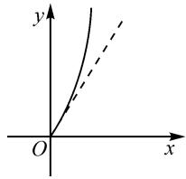
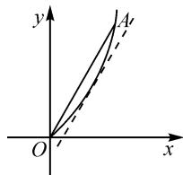
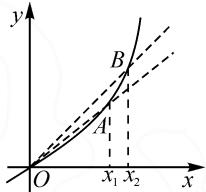

2023年讲题比赛获奖论文之六：

# 求导换元破三角,必要探路亦可为\*

——2023 全国甲卷理科第 21 题解法探究和变式拓展

# - 四川省双流中学 李小波 曹军才 洛嘎

摘要:本文中分别从分类讨论、必要性探路、参变分离三个视角,七种思路对2023年全国甲卷理科第21题进行解法探究,给出了此题的几何背景以及变式探究与拓展,以期读者对含三角函数的导数问题有更深刻的理解与更丰富的处理策略.

关键词: 必要性探路; 参变分离; 拓展变式

# 1 试题呈现

已知函数 $f(x)=ax-\frac{\sin x}{\cos^{3}x},x\in\left(0,\frac{\pi}{2}\right)$ .

(1) 当 a=8 时, 讨论函数 $f(x)$ 的单调性;

(2) 若 $f(x) < \sin 2x$ ，求 a 的取值范围.

2023年全国高考数学甲卷导数题目，以三角函数为背景，巧妙结合导数和三角函数，通过对导函数的分析，解决函数的单调性、不等式恒成立等问题，深入考查分类讨论、化归与转化思想，考查学生思维的条理性、严谨性。同时，突出素养和能力的考查，考查学生的数学运算、逻辑推理、数学抽象等核心素养，助力创新人才的选拔。下面从三个视角、七种思路对本试题进行解析。

# 2 解法探究

# 2.1 第(1)问的解法探究

$$
f ^ {\prime} (x) = a - \frac {1 + 2 \sin^ {2} x}{\cos^ {4} x} = - \frac {3}{\cos^ {4} x} + \frac {2}{\cos^ {2} x} + a.
$$

(1) 当 a=8 时， $f'(x)=-\frac{3}{\cos^{4}x}+\frac{2}{\cos^{2}x}+8=\frac{(2\cos^{2}x-1)(4\cos^{2}x+3)}{\cos^{4}x}$ . 又因为 $x\in\left(0,\frac{\pi}{2}\right)$ ，所以令 $f'(x)>0$ ，得 $\cos x>\frac{\sqrt{2}}{2}$ ，解得 $0<x<\frac{\pi}{4}$ ; 令 $f'(x)<0$ ，得 $0<\cos x<\frac{\sqrt{2}}{2}$ ，解得 $\frac{\pi}{4}<x<\frac{\pi}{2}$ . 故当 a=8 时，函数 $f(x)$ 在 $\left(0,\frac{\pi}{4}\right)$ 上单调递增，在 $\left(\frac{\pi}{4},\frac{\pi}{2}\right)$ 上单调递减.

# 2.2 第(2)问的解法探究

视角一: 直接分类讨论.

思路 1: 分类讨论.

令 $g(x)=\frac{\sin x}{\cos^{3}x}+\sin 2x-ax, x\in\left(0,\frac{\pi}{2}\right)$ ，则原问题等价于 $x\in\left(0,\frac{\pi}{2}\right)$ 时， $g(x)>0$ 恒成立.

又 $g^{\prime}(x) = 4\cos^{2}x - \frac{2}{\cos^{2}x} +\frac{3}{\cos^{4}x} -2 - a$ ，令 $t =$ $\cos^2 x$ ，则由 $x\in \left(0,\frac{\pi}{2}\right)$ 得 $t\in (0,1)$ .记 $S(t) = 4t-$ $\frac{2}{t} +\frac{3}{t^2} -2 - a,t\in (0,1)$ ，则 $S^{\prime}(t) = \frac{4t^{3} + 2t - 6}{t^{3}}.$

再令 $h(x)=4x^{3}+2x-6,x\in[0,1]$ ，则 $h(x)$ 在 $[0,1]$ 上单调递增，于是 $h(t)<h(1)=0$ ，所以 $S'(t)<0$ ，故 $S(t)$ 在 $(0,1)$ 上单调递减。又 $t\to0^{+}$ 时， $S(t)\to+\infty$ ，所以 $S(t)\in(3-a,+\infty)$ 。

讨论如下：

(i) 当 $a \leqslant 3$ 时, $g'(x) = S(t) > 0$ 恒成立, 则 $g(x)$ 在 $\left(0, \frac{\pi}{2}\right)$ 上单调递增, 所以当 $x \in \left(0, \frac{\pi}{2}\right)$ 时, $g(x) > g(0) = 0$ , 符合题意.

(ii) 当 $a > 3$ 时, $S(1) = 3 - a < 0$ , $S\left(\frac{1}{a}\right) = \frac{4}{a} + 3a(a - 1) - 2 > 0$ , 则存在 $t_0 \in \left(\frac{1}{a}, 1\right)$ , 使得 $S(t_0) = 0$ . 由 $S(t)$ 在 $(0,1)$ 上单调递减, 得 $t \in (t_0,1)$ 时, $S(t) < 0$ . 又函数 $t = \cos^2 x$ 在 $\left(0, \frac{\pi}{2}\right)$ 上单调递减, 所以存在 $x_0 \in \left(0, \frac{\pi}{2}\right)$ , 使得 $x \in (0, x_0)$ 时, $t \in (t_0,1)$ , 此时 $g'(x) = S(t) < 0$ , 即 $g(x)$ 在 $(0, x_0)$ 上递减, 则当 $x \in (0, x_0)$ 时, $g(x) < g(0) = 0$ , 与条件矛盾, 不合题意.

综上所述,实数 a 的取值范围是 $(-∞,3]$ .

评注: 对函数 $g(x)$ 求导后, 为便于分析导函数的正负, 通过适当的换元化归为函数 $S(t)$ , 再研究函数 $S(t)$ 的单调性及取值范围, 根据 $S(t)$ 的取值范围, 确定分类讨论的标准, 分类讨论即可. 此种解法中分类讨论标准的确定自然合理, 学生易于理解操作.

视角二:先探必要性.

思路 2: 必要性探路一——端点效应.

令 $g(x) = \frac{\sin x}{\cos^3 x} + \sin 2x - ax, x \in \left(0, \frac{\pi}{2}\right)$ ，则原问题等价于 $x \in \left(0, \frac{\pi}{2}\right)$ 时， $g(x) > 0$ 恒成立.

又 $g^{\prime}(x) = 4\cos^{2}x - \frac{2}{\cos^{2}x} +\frac{3}{\cos^{4}x} -2 - a$ ，且 $g(0) = 0$ ，所以 $g(x) > 0$ 要在 $\left(0,\frac{\pi}{2}\right)$ 上恒成立，需要满足 $g^{\prime}(0)\geqslant 0$ ，即 $a\leqslant 3.$ 下证充分性，即对所有的 $a\leqslant 3$ 都有 $ax <   \frac{\sin x}{\cos^3x} +\sin 2x$ 在 $\left(0,\frac{\pi}{2}\right)$ 上恒成立.只需证 $3x <   \frac{\sin x}{\cos^3x} +\sin 2x$ 在 $\left(0,\frac{\pi}{2}\right)$ 上恒成立即可.令 $h(x) =$ $\frac{\sin x}{\cos^3x} +\sin 2x - 3x,x\in \left(0,\frac{\pi}{2}\right)$ ，则 $h^{\prime}(x) =$ $\frac{(\cos^2x - 1)^2(4\cos^2x + 3)}{\cos^4x}\geqslant 0$ ，所以 $h(x)$ 在 $\left(0,\frac{\pi}{2}\right)$ 上单调递增，则 $h(x) > h(0) = 0$ ，充分性得证.综上，实数 $a$ 的取值范围是 $(- \infty ,3]$

评注:此种方法是观察到 $g(0)=0$ , $g(x)$ 在原点右侧附近要恒成立, 利用端点效应, 则函数 $g(x)$ 在 x=0 处的瞬时变化率即 $g'(0)$ 要大于或等于零, 得到问题成立的一个必要条件, 这样可将实数 a 的取值范围限定在 $a \leqslant 3$ , 再对充分性进行验证即可.

思路 3: 必要性探路二——不等式放缩.

(i) 当 $a \leqslant 0$ 时, 显然成立.

(ii) 当 $a > 0$ 时, 易证 $x \in \left(0, \frac{\pi}{2}\right)$ 时, $x > \sin x$ , 则 $\frac{\sin x}{\cos^3 x} + \sin 2x > ax > a \sin x$ .

又 $x \in \left(0, \frac{\pi}{2}\right)$ 时， $\sin x > 0$ ，则 $a < \frac{1}{\cos^3 x} + 2\cos x$ 对任意 $x \in \left(0, \frac{\pi}{2}\right)$ 恒成立。令 $t = \cos x \in (0, 1)$ ，则 $S(t) = 2t + \frac{1}{t^3}, t \in (0, 1)$ 。又 $S'(t) = \frac{2t^4 - 3}{t^4} < 0$ ，则 $S(t)$ 在 $(0, 1)$ 上单调递减，所以 $S(t) > S(1) = 3$ 。故实数 $a$ 需要满足 $0 < a \leqslant 3$ 。然后验证充分性即可。

评注:本题利用不等式放缩很难直接求得参数取值范围,可以利用不等式 $x \in \left(0, \frac{\pi}{2}\right)$ 时, $\sin x < x$ 成

立,先研究原不等式恒成立的必要条件.此种方法巧在放缩后两边都含有 $\sin x$ , 约分后很容易实现参变分离,且分离后右端函数只含有 $\cos x$ , 其范围容易求得,从而可缩小参数 a 的取值范围,但需对充分性进行证明.

思路 4: 必要性探路三——重要极限.

由 $ax < \frac{\sin x}{\cos^3 x} + \sin 2x$ ，可得 $a \cdot \frac{x}{\sin x} < \frac{1}{\cos^3 x} + 2\cos x$ 在 $x \in \left(0, \frac{\pi}{2}\right)$ 上恒成立，故两边可取极限，即 $\lim_{x \to 0^+} \left(a \cdot \frac{x}{\sin x}\right) \leqslant \lim_{x \to 0^+} \left(\frac{1}{\cos^3 x} + 2\cos x\right)$ . 由于 $y = \cos x$ 在 $\left(0, \frac{\pi}{2}\right)$ 上连续，其他涉及的函数在 $(0, +\infty)$ 上也连续，因此结合重要极限 $\lim_{x \to 0^+} \frac{x}{\sin x} = 1$ ，可化简得到原不等式恒成立的一个必要条件为 $a \leqslant 3$ ，然后再验证充分性即可.

评注:此种方法仍然是从必要条件入手,由不等式恒成立,结合函数的连续性,两边取极限,不等式从严格不等式变为不严格不等式.若直接取极限,两边均为0,所以可以两边同时除以x或 $\sin x$ ,再取极限,结合重要极限 $\lim_{x\to0^{+}}\frac{x}{\sin x}=1$ 或 $\lim_{x\to0^{+}}\frac{\sin x}{x}=1$ ,可得到原不等式恒成立的一个必要条件为 $a\leqslant3$ ,再验证充分性.

视角三: 参变分离.

思路 5: 曲直分离——单调性结合凹凸性分析.

从 $ax < \frac{\sin x}{\cos^{3}x} + \sin 2x, x \in \left(0, \frac{\pi}{2}\right)$ 入手，分析 $h(x) = \frac{\sin x}{\cos^{3}x} + \sin 2x$ 在区间 $\left(0, \frac{\pi}{2}\right)$ 上的性质. 由 $h'(x) = \frac{(2\cos^{2}x - 1)(2\cos^{4}x - 1) + 2}{\cos^{4}x} > 0$ ，得 $h(x)$ 在 $\left(0, \frac{\pi}{2}\right)$ 上单调递增. 又 $h''(x) = \frac{4t^{3} + 2t - 6}{t^{2}} \times (-\sin x)$ ，其中 $t = \cos^{2}x \in (0, 1)$ ，则 $h''(x) > 0$ ，即

$h(x)$ 的图象在区间 $\left(0, \frac{\pi}{2}\right)$ 上是下凸函数，则考虑函数 $h(x)$ 在 x=0 处的切线 y=3x，结合函数图象（图1）可知，实数 a 的取值范围是 $(-∞,3]$ .

text_image

y
O
x

图1

评注:曲直分离后,通过分析函数 $h(x)$ 的性质,数形结合,得出此题的一个几何背景.实际上,函数 $h(x)$ 在 $\left(0,\frac{\pi}{2}\right)$ 上单调递增,且为下凸函数,函数 y=ax 的增长率是定值,而函数 $h(x)$ 的增长率越来越大,并且函数 $h(x)$ 与 y=ax 在 x=0 处的初始值都为 0,所以当且仅当函数 $h(x)$ 在 $x = 0$ 处的瞬时变化率即导数值大于等于 $y = ax$ 在 $x = 0$ 处导数值即可.

思路 6: 参变分离之完全分离.

由 $ax < \frac{\sin x}{\cos^{3} x} + \sin 2x, x \in \left(0, \frac{\pi}{2}\right)$ ，得原问题等价于 $a < \frac{h(x)}{x}$ 在 $\left(0, \frac{\pi}{2}\right)$ 上恒成立。观察到 $h(0) = 0$ ，则有 $\frac{h(x)}{x}=\frac{h(x)-h(0)}{x-0}$ . 又由思路5知, $h(x)$ 在 $\left(0,\frac{\pi}{2}\right)$ 上单调递增, 且为下凸函数, 结合图2处理.

text_image

y
A'
O
x

图2

处理 1: 可以将直线 OA 平移至与曲线 $h(x)$ 相切，即存在 $m \in \left(0, \frac{\pi}{2}\right)$ ，使得 $h'(m) = \frac{h(x) - h(0)}{x - 0}$ （拉格朗日中值定理）。又因为 $x$ 在 $\left(0, \frac{\pi}{2}\right)$ 上具有任意性，则 $m$ 在 $\left(0, \frac{\pi}{2}\right)$ 上也具有任意性，等价于 $a < h'(m)$ 在 $\left(0, \frac{\pi}{2}\right)$ 上恒成立。又 $h'(x) = 4\cos^2 x + \frac{3}{\cos^4 x} - \frac{2}{\cos^2 x} - 2$ ，令 $t = \cos^2 x \in (0,1)$ ，记 $S(t) = 4t + \frac{3}{t^2} - \frac{2}{t} - 2, t \in (0,1)$ ，则 $S'(t) = \frac{4t^3 + 2t - 6}{t^2}, t \in (0,1)$ 。又 $t \in (0,1)$ 时， $4t^3 + 2t - 6 < 0$ ，则 $S(t)$ 在 $(0,1)$ 上单调递减，有 $S(t) > S(1) = 3$ ，则 $a \leqslant 3$ 。综上，实数 $a$ 的取值范围是 $(- \infty, 3]$ 。

处理2:令 $F(x)=\frac{h(x)}{x}$ ，如图3，
设 $0 < x_{1} < x_{2} < \frac{\pi}{2}$ ，则 $F(x_{1}) = \frac{h(x_{1})}{x_{1}} = \frac{h(x_{1}) - h(0)}{x_{1} - 0} = k_{OA}, F(x_{2}) = \frac{h(x_{2})}{x_{2}} = \frac{h(x_{2}) - h(0)}{x_{2} - 0} = k_{OB}$ . 由思

text_image

y
B
A
O
x₁ x₂
x

图3

路6的探究知函数 $h(x)$ 在 $\left(0, \frac{\pi}{2}\right)$ 上单调递增，且为下凸函数，结合图3可知， $k_{OA} < k_{OB}$ ，则有 $F(x_1) < F(x_2)$ ，所以函数 $F(x)$ 在 $\left(0, \frac{\pi}{2}\right)$ 上单调递增。又 $\lim_{x \to 0^+} F(x) = \lim_{x \to 0^+} \frac{h(x)}{x} = \lim_{x \to 0^+} \frac{h(x) - h(0)}{x - 0} = h'(0) = 3$ ，故实数 $a$ 的取值范围是 $(- \infty, 3]$ .

评注:采用参变分离的方法,通过导数求最值,思路简单,但运算很复杂,导函数值的正负相当难判断,学生在有限的时间里,此路几乎行不通,这正是出题人在反套路、反机械刷题上下的功夫.事实上,在参变

分离得到 $a < \frac{h(x)}{x}$ 后，求 $y = \frac{h(x)}{x}$ 在 $\left(0, \frac{\pi}{2}\right)$ 上的取值范围至关重要。观察到 $h(0) = 0$ ，结合其特殊的结构 $\frac{h(x)}{x} = \frac{h(x) - h(0)}{x - 0}$ ，联系直线斜率的几何意义，处理1是利用拉格朗日中值定理将 $\frac{h(x) - h(0)}{x - 0}$ 转化为某点处的导数值 $h'(m)$ ，从而求得 $a$ 的范围，而处理2则是利用函数单调性的定义，结合函数 $h(x)$ 的图象特征得到函数 $y = \frac{h(x)}{x}$ 的单调性，进而求范围。

# 3 变式拓展

为了充分发挥高考真题在教考衔接中的导向作用,将真题的教学价值最大化,在教学过程中不应只停留在题目的解析上,而更应该对题目进行适当的变式.下面基于此题的结构特点,作一些变式探究与拓展.

观察到题目中给出的两个函数 $y=\frac{\sin x}{\cos^{3}x}+\sin 2x$ 与 y=ax 均是 $\left(-\frac{\pi}{2},\frac{\pi}{2}\right)$ 上的奇函数，于是可以将这两个函数通过叠加得到新的函数，新的函数也应该具有奇偶性，再探究新函数的单调性、零点、极值等问题，这样可以培养学生的化归转化意识与对称意识。这种结构在高考题和模拟试题中常常出现，比如，2023 年全国新高考Ⅱ卷第 22 题、2023 年成都三诊第 21 题均是这种结构。

变式 1 已知不等式 $\frac{\sin x}{1+\cos x}-ax>0, x\in(0,\pi)$ 恒成立，求实数 a 的取值范围。(答案: $a\leqslant\frac{1}{2}$ .)

变式 2 函数 $h(x)=\left(\frac{\sin x}{\cos^{3}x}+\sin 2x-ax\right)x$ ，若 x=0 是函数 $y=h(x)$ 的极小值点，求实数 a 的取值范围。(答案: $a \leqslant 3$ .)

# 4 结语

近年来,为了有助于创新人才的选拔,高考试题越来越注重对学生核心素养的考查,试题在反套路、反机械刷题上下足了功夫,因此想通过题海战术取得高分的时代已经一去不复返了,这提醒教师在平时的教学中需做好教考衔接.一方面,要关注高考真题,通过真题把握教学方向,充分发挥高考试题的教学价值.另一方面,要努力追求高效课堂,课堂上除了传授知识外,更要以学生为中心,以提高学生的核心素养为目的,培养学生深度思考、自主探究能力,为学生的可持续发展和终身学习奠定基础.Z