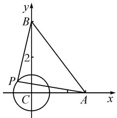
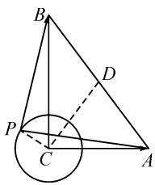
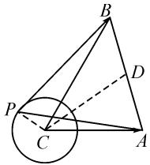

# 2022 年高考数学北京卷第 10 题赏析\*

# 北京市第五中学 许文军

摘要: 涉及平面向量的数量积问题, 是新高考中比较常见的一类基本题型, 往往是平面向量中“数”与“形”的和谐统一, 巧妙融合“动”与“静”, 巧妙实现向量概念、代数与几何等不同知识模块之间的统一. 结合一道高考题, 分析平面向量数量积取值范围的多种解法, 进而进行变式拓展与应用, 突出数学技能与核心素养的综合, 引领并指导数学学习与解题研究.

关键词: 平面向量; 数量积; 三角形; 基底; 极化恒等式

# 1 真题呈现

(2022年高考数学北京卷·10)在 $\triangle ABC$ 中，AC=3,BC=4, $\angle C=90^{\circ}$ .P为 $\triangle ABC$ 所在平面内的动点，且PC=1，则 $\overrightarrow{PA}\cdot\overrightarrow{PB}$ 的取值范围是().

A. $[-5,3]$ B. $[-3,5]$ C. $[-6,4]$ D. $[-4,6]$

此题以直角三角形为问题背景,结合单位圆上动点的“动”,带领平面向量数量积的“静”,串联起平面几何的“形”与平面向量数量积的“数”,动静结合,数形转化,展示一幅动人的画卷.

本题难度中等,切入点众多,可以借助平面向量中常用的基底思维、坐标思维以及极化恒等式思维等来展开与应用,实现问题的解决,并在此基础上进一步加以深入与拓展,形成良好的思维习惯,收获更多的知识、思想方法与能力等.

# 2 真题破解

方法 1: 基底法.

解析：由于 $\angle C = 90^{\circ}$ ，因此 $\langle \overrightarrow{CA},\overrightarrow{CP}\rangle =$ $|90^{\circ} - \langle \overrightarrow{CB},\overrightarrow{CP}\rangle |,\overrightarrow{CA}\cdot \overrightarrow{CB} = 0.$

而 $\overrightarrow{PA} \cdot \overrightarrow{PB}$

$$
= (\overrightarrow {C A} - \overrightarrow {C P}) \cdot (\overrightarrow {C B} - \overrightarrow {C P})
$$

$$
= \overrightarrow {C A} \cdot \overrightarrow {C B} - \overrightarrow {C A} \cdot \overrightarrow {C P} - \overrightarrow {C B} \cdot \overrightarrow {C P} + \overrightarrow {C P} ^ {2}
$$

$$
= - 3 \cos \langle \overrightarrow {C A}, \overrightarrow {C P} \rangle - 4 \sin \langle \overrightarrow {C A}, \overrightarrow {C P} \rangle + 1
$$

$$
= - 5 \sin (\langle \overrightarrow {C A}, \overrightarrow {C P} \rangle + \varphi) + 1 \in [ - 4, 6 ],
$$

其中 $\tan\varphi=\frac{3}{4}$ .

所以 $\overrightarrow{PA}\cdot\overrightarrow{PB}$ 的取值范围是 $[-4,6]$ .故选:D.

解后反思:根据平面向量的线性运算,抓住平面图形的几何特征,通过基底的选取与转化,利用平面向量的数量积公式加以展开与转化.再结合平面向量夹角的转化,以及三角函数中辅助角公式的应用,借助三角函数的图象与性质来确定对应的取值范围.基底法是破解平面向量问题最常用的基本技巧方法,也是平面向量中“形”的特征的重要体现.

方法 2: 坐标法.

解析: 如图 1 所示, 以点 C 为坐标原点, CA, CB 所在直线分别为 x 轴、y 轴建立平面直角坐标系 xCy, 则 A(3,0), B(0,4).

由 PC=1，可设 $P(\cos\theta, \sin\theta), \theta \in [0,2\pi)$ ，则

text_image

y
B
2
P
C
A
x

图1

$$
\overrightarrow {P A} = (3 - \cos \theta , - \sin \theta),
$$

$$
\overrightarrow {P B} = (- \cos \theta , 4 - \sin \theta).
$$

可得 $\overrightarrow{PA} \cdot \overrightarrow{PB} = (3 - \cos \theta, -\sin \theta) \cdot (-\cos \theta, 4 - \sin \theta) = 1 - 4\sin \theta - 3\cos \theta = 1 - 5\sin (\theta + \varphi) \in [-4, 6]$ , 其中 $\tan \varphi = \frac{3}{4}$ .

所以 $\overrightarrow{PA}\cdot\overrightarrow{PB}$ 的取值范围是 $[-4,6]$ .故选:D.

解后反思:根据平面直角坐标系的构建,确定对应点的坐标,借助坐标法合理表示对应的平面向量,通过坐标运算来分析与解决平面向量中的相关问题.坐标法是平面向量“数”的性质的重要体现,以“数”的运算来实现“形”的特征,达到解决问题的目的.

方法 3: 极化恒等式法.

解析：由 $\triangle ABC$ 中， $AC = 3$ $BC = 4,\angle C = 90^{\circ}$ ，可得 $AB = 5$

如图 2 所示, 取线段 AB 的中点 D, 则 $CD = \frac{1}{2} AB = \frac{5}{2}$ .

利用平面向量中的极化恒等式,可得

text_image

Geometric diagram showing triangle ABC with auxiliary point P and dashed lines forming a circle, labeled with points A, B, C, D, and P.

图2

$$
\begin{array}{l} \overrightarrow {P A} \cdot \overrightarrow {P B} \\ = \frac {1}{4} \left[ (\overrightarrow {P A} + \overrightarrow {P B}) ^ {2} - (\overrightarrow {P A} - \overrightarrow {P B}) ^ {2} \right] \\ = \frac {1}{4} \left[ (2 \overrightarrow {P D}) ^ {2} - \overrightarrow {B A} ^ {2} \right] \\ = (\overrightarrow {C D} - \overrightarrow {C P}) ^ {2} - \frac {1}{4} \overrightarrow {B A} ^ {2} \\ = \overrightarrow {C D} ^ {2} - 2 \overrightarrow {C D} \cdot \overrightarrow {C P} + \overrightarrow {C P} ^ {2} - \frac {1}{4} \overrightarrow {B A} ^ {2} \\ = - 2 \overrightarrow {C D} \cdot \overrightarrow {C P} + \overrightarrow {C P ^ {2}} \\ = - 5 \cos \langle \overrightarrow {C D}, \overrightarrow {C P} \rangle + 1 \in [ - 4, 6 ]. \\ \end{array}
$$

所以 $\overrightarrow{PA}\cdot\overrightarrow{PB}$ 的取值范围是[-4,6].故选:D.

解后反思:根据平面向量中的极化恒等式,将平面向量的数量积由平面向量的线性运算的模导出,合理沟通平面向量的数量积与线性运算之间的联系,是解决平面向量数量积问题的一种有力手段.抓住平面向量中的极化恒等式,建立起平面向量与几何长度(数量)之间的桥梁,有效实现向量与几何、代数的巧妙结合与合理转化,也为问题的深入、拓展与提升提供理论支持.

# 3 变式拓展

探究 1 结合以上高考真题以及相应的极化恒等式法的破解, 将问题中的数据加以一般化, 可以得到下面更具一般性的结论.

结论 在 $\triangle ABC$ 中, $AC=b$ , $BC=a$ , $\angle C=90^{\circ}$ . $P$ 为 $\triangle ABC$ 所在平面内的动点, 且 $PC=r$ , 则 $\overrightarrow{PA} \cdot \overrightarrow{PB}$ 的取值范围是 $[r^{2}-r \sqrt{a^{2}+b^{2}}$ , $r^{2}+r \sqrt{a^{2}+b^{2}}]$ .

证明:由 $\triangle ABC$ 中,AC=b,BC=a, $\angle C=90^{\circ}$ ,可得 $AB=\sqrt{a^{2}+b^{2}}$ .

如图(方法3中的图)所示,取线段AB的中点D,
则 $CD=\frac{1}{2}AB=\frac{1}{2}\sqrt{a^{2}+b^{2}}$ .

利用平面向量中的极化恒等式,可得

$$
\begin{array}{l} \overrightarrow {P A} \cdot \overrightarrow {P B} \\ = \frac {1}{4} \left[ (\overrightarrow {P A} + \overrightarrow {P B}) ^ {2} - (\overrightarrow {P A} - \overrightarrow {P B}) ^ {2} \right] \\ = \frac {1}{4} \left[ (2 \overrightarrow {P D}) ^ {2} - \overrightarrow {B A} ^ {2} \right] \\ = (\overrightarrow {C D} - \overrightarrow {C P}) ^ {2} - \frac {1}{4} \overrightarrow {B A} ^ {2} \\ = \overrightarrow {C D} ^ {2} - 2 \overrightarrow {C D} \cdot \overrightarrow {C P} + \overrightarrow {C P} ^ {2} - \frac {1}{4} \overrightarrow {B A} ^ {2} \\ = - 2 \overrightarrow {C D} \cdot \overrightarrow {C P} + \overrightarrow {C P ^ {2}} \\ = - r \sqrt {a ^ {2} + b ^ {2}} \cos \langle \overrightarrow {C D}, \overrightarrow {C P} \rangle + r ^ {2}, \\ \end{array}
$$

$$
= - 2 \times \frac {1}{2} \sqrt {a ^ {2} + b ^ {2}} \times r \times \cos \langle \overrightarrow {C D}, \overrightarrow {C P} \rangle + r ^ {2}
$$

所以 $\overrightarrow{PA} \cdot \overrightarrow{PB} \in [r^2 - r\sqrt{a^2 + b^2}, r^2 + r\sqrt{a^2 + b^2}]$ .

在以上结论中, 当 a=4, b=3, r=1 时, $\overrightarrow{PA} \cdot \overrightarrow{PB}$ 的取值范围是 $[-4,6]$ , 即为原高考真题答案.

探究 2 保留高考真题的情境与设置,只改变三角形中角的度数,其他条件不改变,可以得到以下对应的变式问题,考查的基本知识点与能力点更多,难度更大.

变式 在 $\triangle ABC$ 中, AC=3, BC=4, $\angle C=60^{\circ}$ . P 为 $\triangle ABC$ 所在平面内的动点, 且 PC=1, 则 $\overrightarrow{PA}\cdot\overrightarrow{PB}$ 的取值范围是

解析:由 $\triangle ABC$ 中,AC=3,BC=4, $\angle C=60^{\circ}$ ,可得 $\overrightarrow{CA}\cdot\overrightarrow{CB}=3\times4\times\cos60^{\circ}=6$ .

利用余弦定理,可得

$$
A B = \sqrt {A C ^ {2} + B C ^ {2} - 2 A C \cdot B C \cdot \cos C} = \sqrt {1 3}.
$$

如图 3 所示, 取线段 AB 的中点 D, 则有 $\overrightarrow{CA} + \overrightarrow{CB} = 2\overrightarrow{CD}$ .

$$
\begin{array}{l} \begin{array}{r l} & \text {由} (\overrightarrow {C A} + \overrightarrow {C B}) ^ {2} = 4 \overrightarrow {C D} ^ {2} = \\ & \overrightarrow {C A} ^ {2} + 2 \overrightarrow {C A} \cdot \overrightarrow {C B} + \overrightarrow {C B} ^ {2} = 3 ^ {2} + 2 \times \end{array} \\ 6 + 4 ^ {2} = 3 7 \text {, 可得} \overrightarrow {C D ^ {2}} = \frac {3 7}{4}. \\ \end{array}
$$

利用平面向量中的极化恒等式,可得

text_image

Geometric diagram showing a triangle ABC with an inscribed circle and auxiliary points P, D, and A, including dashed lines indicating construction or proof.

图3

$$
\begin{array}{l} \overrightarrow {P A} \cdot \overrightarrow {P B} \\ = \frac {1}{4} \left[ (\overrightarrow {P A} + \overrightarrow {P B}) ^ {2} - (\overrightarrow {P A} - \overrightarrow {P B}) ^ {2} \right] \\ = \frac {1}{4} \left[ (2 \overrightarrow {P D}) ^ {2} - \overrightarrow {B A} ^ {2} \right] \\ = (\overrightarrow {C D} - \overrightarrow {C P}) ^ {2} - \frac {1}{4} \overrightarrow {B A} ^ {2} \\ = \overrightarrow {C D} ^ {2} - 2 \overrightarrow {C D} \cdot \overrightarrow {C P} + \overrightarrow {C P} ^ {2} - \frac {1}{4} \overrightarrow {B A} ^ {2} \\ = \frac {3 7}{4} - 2 \times \frac {\sqrt {3 7}}{2} \cos \langle \overrightarrow {C D}, \overrightarrow {C P} \rangle + 1 ^ {2} - \frac {1}{4} \times 1 3 \\ = 7 - \sqrt {3 7} \cos \langle \overrightarrow {C D}, \overrightarrow {C P} \rangle \\ \end{array}
$$

所以 $\overrightarrow{PA}\cdot\overrightarrow{PB}\in[7-\sqrt{37},7+\sqrt{37}]$ .

故填答案: $\left[7-\sqrt{37},7+\sqrt{37}\right]$ .

# 4 教学启示

# 4.1 技巧策略,归纳总结

解决此类平面向量数量积的值、最值或取值范围等问题,常见的技巧策略总结如下:

(1)坐标法.借助平面直角坐标系的合理构建,利用坐标表示与坐标运算,将问题转化为相关的函数(或三角函数)问题来求解.此方法比较容易想到,特别在涉及一些有直角、垂直等要素的平面几何图形时,经常采用此方法来解决.  
(2) 基底法. 借助平面向量基底的合理选择, 利用平面向量的线性运算与数量积公式等, 结合平面几何特征与图形直观来求解. 此方法的关键就是进行平面向量的合理转化, 思维量相对复杂一些, 也是比较常用的一种方法.

# 4.2 一题多变, 深入探究

对于平面向量的一些创新、综合与应用问题，可以合理深入挖掘，形成变式拓展，构建知识网络，从更多层面、更多视角进行深入思考。题目背景、条件要素、结论创设等各个视角都可以加以拓展，真正实现“一题多变”“一题多得”的良好效果，达到做一题、懂一片、会一类，脱离“题海战术”，拓宽数学基础知识，切实提高数学能力，真正达到举一反三、融会贯通的效果。Z