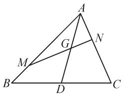
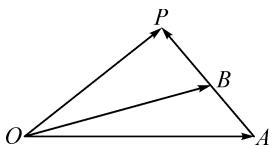
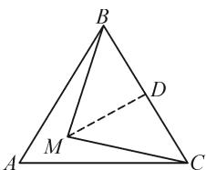
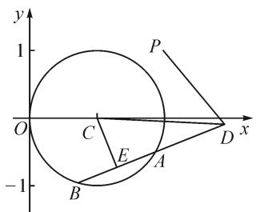
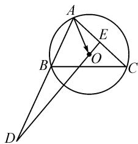
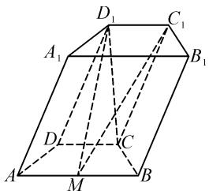
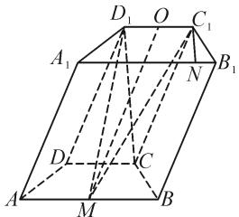

# “三点共线向量定理”及其拓展应用

# ● 江苏省常熟市中学 盛锦星

数学中的一些基本规律、结论具有极高的应用价值,可推广到实际解题中,因此挖掘习题、模考题中的结论、规律有着现实的意义.下面探究一个与三点共线相关的向量结论,并结合实例进行拓展应用.

# 1 问题引出

问题 如图 1 所示, 已知 $\triangle ABC$ 的中线为 AD, G 是 AD 的中点, 过点 G 的直线与 AB 交于点 M, 与 AC 交于点 N. 如果 $\overrightarrow{AM} = \frac{3}{4}\overrightarrow{AB}$ , 设 $\overrightarrow{AN} = \lambda\overrightarrow{AC}$ , 则 $\lambda$ 的值为 \_\_\_\_.

解析:首先需要证明“如果P,Q,R三点共线,且O为直线PQ外的一点, $\overrightarrow{OR}=m\overrightarrow{OP}+n\overrightarrow{OQ}$ ,则 $m+n=1$ .”

text_image

Geometric diagram of triangle ABC with internal points D, M, N, G and line segments AD, MG, GN labeled

图1

由题意知， $\overrightarrow{PR} // \overrightarrow{PQ}$ ，则存在 $x \in \mathbb{R}$ 使得 $\overrightarrow{PR} = x \overrightarrow{PQ}$ ，即 $\overrightarrow{OR} - \overrightarrow{OP} = x (\overrightarrow{OQ} - \overrightarrow{OP})$ ，所以 $\overrightarrow{OR} = (1 - x) \overrightarrow{OP} + x \overrightarrow{OQ}$ . 又 $\overrightarrow{OR} = m \overrightarrow{OP} + n \overrightarrow{OQ}$ ，则 $m = 1 - x, n = x$ ，所以 $m + n = 1$ .

回归本题目, 由于点 G 是 AD 的中点, 则 $\overrightarrow{AG} = \frac{1}{2}\overrightarrow{AD} = \frac{1}{4} (\overrightarrow{AB} + \overrightarrow{AC})$ , 又知 $\overrightarrow{AM} = \frac{3}{4}\overrightarrow{AB}$ , 所以 $\overrightarrow{AB} = \frac{4}{3}\overrightarrow{AM}$ , 可推得 $\overrightarrow{AG} = \frac{1}{3}\overrightarrow{AM} + \frac{1}{4}\overrightarrow{AC}$ . 因为 $\overrightarrow{AN} = \lambda\overrightarrow{AC}$ , 即 $\overrightarrow{AC} = \frac{1}{\lambda}\overrightarrow{AN}$ , 所以 $\overrightarrow{AG} = \frac{1}{3}\overrightarrow{AM} + \frac{1}{4\lambda}\overrightarrow{AN}$ . 因为点 G, M, N 三点共线, 所以 $\frac{1}{3} + \frac{1}{4\lambda} = 1$ . 解得 $\lambda = \frac{3}{8}$ , 即 $\lambda$ 的值为 $\frac{3}{8}$ .

反思:上述在求解向量参数 $\lambda$ 时,首先对三点共线向量之间的参数关系进行了证明,得出了“若 P,Q,R 三点共线,且点 O 为直线 PQ 外的一点, $\overrightarrow{OR}=m\overrightarrow{OP}+n\overrightarrow{OQ}$ ,则 $m+n=1$ ”的结论.将该结论运用到题目中推导出了关键条件“ $\frac{1}{3}+\frac{1}{4\lambda}=1$ ”.显然,三点共线的向量结论在解题中有着重要的应用.

# 2 问题溯源

# 2.1 教材追溯

上述问题中涉及到了“三点共线的向量定理”，实际上该定理在高中教材中就有体现，在教材中有下述一道题例.

例题 如图 2 所示, $\overrightarrow{OA}$ 和 $\overrightarrow{OB}$ 为不共线向量, 而 $\overrightarrow{AP}=t\overrightarrow{AB}(t\in\mathbf{R})$ , 试用 $\overrightarrow{OA}$ 和 $\overrightarrow{OB}$ 来表示向量 $\overrightarrow{OP}$ .

text_image

P
O
B
A

图2

对于上述例题,依据平

面向量的基本定理,通过向量运算,借助图形,可直接得出 $\overrightarrow{OP}=(1-t)\overrightarrow{OA}+t\overrightarrow{OB}$ ,该向量关系中就隐含了系数关系.

# 2.2 问题归纳

“三点共线向量定理”: 设点 O, A, B 为平面内不共线的三点, P 为平面上的任意一点, 点 P 与点 A 和点 B 共线的充要条件是存在实数 $\lambda$ 和 $\mu$ , 使得 $\overrightarrow{OP} = \lambda \overrightarrow{OA} + \mu \overrightarrow{OB}$ , 且 $\lambda + \mu = 1$ . 特别地, 当 P 为线段 AB 的中点时, 则有 $\overrightarrow{OP} = \frac{1}{2} \overrightarrow{OA} + \frac{1}{2} \overrightarrow{OB}$ .

该定理融合了几何与代数特性,结合图形较为容易理解.对于上述定理及三点共线的充要条件,可将其表示方式视为是 $\overrightarrow{AB}=\lambda\overrightarrow{AP}$ 的一个变形式,简单概括为“起点一致,终点共线,系数和为1”.利用该定理可探究交点位置的向量或者两条线段长度的比值.而当问题条件中出现了共起点向量的线性组合时,可向三点共线方向思考 $^{[1]}$ .

# 3 结论强化

上述结论可归为“三点共线向量定理”.在解题中可利用该定理来推导向量之间的关系,如果向量关系的系数不为1,则可以向“1”转化.

问题:如图 3,已知 M 是边长为 2 的正△ABC 内一点，且 $\overrightarrow{AM} = \lambda \overrightarrow{AB} + \mu \overrightarrow{AC}$ ，若 $\lambda + \mu = \frac{1}{3}$ ，则 $\overrightarrow{MB} \cdot \overrightarrow{MC}$ 的最小值为 \_\_\_\_.

text_image

B
D
M
A
C

图3

解析: 拼凑向量系数和为 1. 由 $\overrightarrow{AM} = \lambda \overrightarrow{AB} + \mu \overrightarrow{AC}$ ，得 $\overrightarrow{AM} = 3\lambda \left( \frac{1}{3} \overrightarrow{AB} \right) + 3\mu \left( \frac{1}{3} \overrightarrow{AC} \right)$ . 取 $\overrightarrow{AE} = \frac{1}{3} \overrightarrow{AB}, \overrightarrow{AF} = \frac{1}{3} \overrightarrow{AC}$ ，则 $\overrightarrow{AM} = 3\lambda \overrightarrow{AE} + 3\mu \overrightarrow{AF}$ . 而 $3\lambda + 3\mu = 1$ ，可得点 M, E, F 三点共线. 再由极化恒等式，可得 $\overrightarrow{MB} \cdot \overrightarrow{MC} = MD^{2} - \frac{1}{4} BC^{2} = MD^{2} - 1$ （其中 D 是 BC 的中点）. 因为 $MD_{\min} = \frac{2}{3} AD = \frac{2\sqrt{3}}{3}$ ，所以 $\overrightarrow{MB} \cdot \overrightarrow{MC}$ 的最小值为 $\frac{1}{3}$ .

总结强化:上述问题探究向量积的最小值,涉及到了共起点向量 $\overrightarrow{AM},\overrightarrow{AB}$ 和 $\overrightarrow{AC}$ 的线性组合,故可向“三点共线”方向思考,通过拼凑转化,可确定M,E,F三点共线,后续直接将向量积转化为关于线段MD的函数,进而确定最小值.

应用三点共线向量定理时,需要关注以下几点:一是理解所涉点的位置关系,涉及到四点,其中点O与A,B不共线;二是理解定理的向量形式,定理中的三向量之间有着公共的起点,即 $\overrightarrow{OP}$ 和 $\overrightarrow{OA},\overrightarrow{OB}$ 的起点均为O;三是线性视角理解定理,可将定理视为是一种线性关系,可用基向量来表示目标向量 $^{[2]}$ .

# 4 拓展应用

“三点共线向量定理”在实际解题中有着广泛的应用，可用于向量推导、系数求解、求最值或范围分析，同时向量的几何属性可用于立体几何问题破解。使用时除了可以直接由定理推导系数关系外，还可以结合系数关系构造新的向量，形成几何特性。下面结合实例加以探究拓展。

# 4.1 应用一: 构造向量求范围

例 1 在平面直角坐标系 xOy 中, 已知圆 $C: (x-1)^{2} + y^{2} = 1$ , 点 A 和 B 是圆 C 上的两点, 且 $AB = \sqrt{2}$ , 点 P 的坐标为 $(2, 1)$ , 则 $2\overrightarrow{PA} - \overrightarrow{PB}$ 的模的取值范围为 \_\_\_\_.

text_image

y
1
P
O
C
E
A
D
x
-1
B

图4

解析:由题意可设 $2 \overrightarrow{PA} - \overrightarrow{PB} = \overrightarrow{PD}$ ，则 $\overrightarrow{PA} = \frac{1}{2} \overrightarrow{PB} + \frac{1}{2} \overrightarrow{PD}$ 。延长 BA 至点 D，使得 AD = AB，如图 4 所示。由于点 P 为定点，求 $\left|2 \overrightarrow{PA} - \overrightarrow{PB}\right|$ 即 $\left|\overrightarrow{PD}\right|$ 的取值范围，只需确定点 D 的轨迹即可。

图形中出现了圆的弦长，可取弦的中点，运用垂径定理分析. 取 $AB$ 的中点 $E$ ，在 $\mathrm{Rt}\triangle CDE$ 中，已知 $CE = \frac{\sqrt{2}}{2}, DE = \frac{3\sqrt{2}}{2}$ 故 $CD = \sqrt{5}$ ，即点 $D$ 的轨迹为以点 $C$ 为圆心， $\sqrt{5}$ 为半径的圆. 所以 $|\overrightarrow{PD}| \in [\sqrt{5} - \sqrt{2}, \sqrt{5} + \sqrt{2}]$ ，即 $|2\overrightarrow{PA} - \overrightarrow{PB}|$ 的取值范围为 $[\sqrt{5} - \sqrt{2}, \sqrt{5} + \sqrt{2}]$ .

评析:例1是对三点共线向量定理的逆用,通过构造向量 $\overrightarrow{PD}$ ,最终将问题转化为探索点D的轨迹的问题.图形中出现了圆中弦,求线段长度时可充分联想“取中点、垂径定理”,通过构造直角三角形来推导.另外,对于所求问题,还可以进行变式,如若其他条件不变,求 $\left|3\overrightarrow{PA}-\overrightarrow{PB}\right|$ 的取值范围,则可设 $3\overrightarrow{PA}-\overrightarrow{PB}=2\overrightarrow{PD}$ ,生成 $\overrightarrow{PA}=\frac{1}{3}\overrightarrow{PB}+\frac{2}{3}\overrightarrow{PD}$ ,这是由“三点共线向量定理”所决定的.

# 4.2 应用二: 构造向量生成模型

例 2 已知点 O 是锐角三角形 ABC 的外心，且 AB = 6, AC = 10, $\overrightarrow{AO} = x \overrightarrow{AB} + y \overrightarrow{AC}, 2x + 10y = 5$ ，则 $\angle BAC$ 的余弦值为 \_\_\_\_.

解析: 已知 $2x + 10y = 5$ ，则 $\frac{2}{5}x + 2y = 1$ ，可将 $\overrightarrow{AO} = x\overrightarrow{AB} + y\overrightarrow{AC}$ 变形为 $\overrightarrow{AO} = \frac{2}{5}x \cdot \left(\frac{5}{2}\overrightarrow{AB}\right) + 2y \cdot \left(\frac{1}{2}\overrightarrow{AC}\right)$ . 如图 5

text_image

A
E
B
O
C
D

图 5

所示，作 $\overrightarrow{AD}=\frac{5}{2}\overrightarrow{AB},\overrightarrow{AE}=\frac{1}{2}\overrightarrow{AC}$ ，则点D,O,E三点共线，且 $OE\perp AC$ ，从而 $\triangle ADE$ 为直角三角形.

在 Rt△ADE 中，因为 AD=15, AE=5，所以 $\cos\angle BAC=\frac{1}{3}$ ，即 $\angle BAC$ 的余弦值为 $\frac{1}{3}$ .

评析:例 2 要求 $\angle BAC$ 的余弦值,显然需要构造直角三角形,题目中给出了 $2x+10y=5$ ,虽然图形中不存在三点共线的情形,但对向量关系式变形即可获得“共线”,通过构造向量推出垂直关系.因此三点共线的向量定理可用于特殊位置关系的构建,基本思路是“系数变形→构造向量→推导共线→生成模型”.

# 4.3 应用三: 空间推导求系数

例 3 如图 6 所示, 在四棱柱 $ABCD-A_{1}B_{1}C_{1}D_{1}$ 中, 底面 ABCD 为等腰梯形, $\angle DAB = 60^{\circ}, AB = 2CD = 2, M$ 为线段 AB 的中点.

(1) 证明: $C_{1}M \parallel$ 平面 $A_{1}ADD;$   
(2) 若 $CD_{1}$ 垂直于平面 ABCD，且 $CD_{1} = \sqrt{3}$ ，求平面 $C_{1}D_{1}M$ 和平面 ABCD 所成的角（锐角）的余弦值.

解析: 主要探究第(2)问, 可取 $\overrightarrow{CD}, \overrightarrow{CB}$ 和 $\overrightarrow{CD_{1}}$ 为一组基向量, 由题意可知 $\langle\overrightarrow{CD}, \overrightarrow{CB}\rangle = 120^{\circ}, \langle\overrightarrow{CD}, \overrightarrow{CD_{1}}\rangle = 90^{\circ}, \langle\overrightarrow{CD_{1}}, \overrightarrow{CB}\rangle = 90^{\circ}$ . 平面 $C_{1}D_{1}M$ 和平面 ABCD 所成的角等价于平面 $C_{1}D_{1}M$ 和平面 $A_{1}B_{1}C_{1}D_{1}$ 所成的角, 二面角的棱为 $C_{1}D_{1}$ . 如图 7, 作 $C_{1}N \perp C_{1}D_{1}$ 交 $A_{1}B_{1}$ 于点 N, 可得 $\overrightarrow{C_{1}N} = \overrightarrow{B_{1}N} + \overrightarrow{C_{1}B_{1}} = \frac{1}{2}\overrightarrow{CD} + \overrightarrow{CB}$ , 则 $|\overrightarrow{C_{1}N}| = \frac{\sqrt{3}}{2}$ .

text_image

D₁
C₁
A₁
B₁
D
C
A
M
B

图6

作 $OM \perp C_{1}D_{1}$ 于点 O，由点 $C_{1}, D_{1}$ 和 O 三点共线，得 $\overrightarrow{MO} = (1 - t)\overrightarrow{MC_{1}} + t\overrightarrow{MD_{1}}$ ，然后通过向量代换，可得 $\overrightarrow{MO} = (t - 2)\overrightarrow{CD} - \overrightarrow{CB} + \overrightarrow{CD_{1}}$ 。又 $OM \perp CD$ ，故 $\overrightarrow{MO} \cdot \overrightarrow{CD} = 0$ ，

text_image

D₁ O C₁
A₁ N B₁
D C
A M B

图 7

即 $\left[(t-2)\overrightarrow{CD}-\overrightarrow{CB}+\overrightarrow{CD_{1}}\right]\cdot\overrightarrow{CD}=0$ , 可解得 $t=\frac{3}{2}$ 所以 $\overrightarrow{OM}=\frac{1}{2}\overrightarrow{CD}+\overrightarrow{CB}-\overrightarrow{CD_{1}}$ , 即 $\left|\overrightarrow{OM}\right|=\frac{\sqrt{15}}{2}$ .

进一步分析可知，所探究的角等价于向量 $\overrightarrow{OM}$ 和向量 $\overrightarrow{C_1N}$ 所成的角，因此由 $\cos \langle \overrightarrow{OM},\overrightarrow{C_1N}\rangle =$ $\frac{\overrightarrow{OM}\cdot\overrightarrow{C_1N}}{|\overrightarrow{OM}||\overrightarrow{C_1N}|} = \frac{\sqrt{5}}{5}$ ，可知平面 $C_1D_1M$ 和平面ABCD所成的角（锐角）的余弦值为 $\frac{\sqrt{5}}{5}$

评析:“三点共线向量定理”具有几何属性,故同样可用于空间几何问题中.上述解二面角问题时,进行了基底向量转化,利用“三点共线向量定理”来推导系数的值,直接求出了向量关系及向量的模.从应用过程来看,是对该定理的正向使用,与平面向量系数问题的使用策略是一致的.

# 5 教学建议

“三点共线向量定理”来源于教材习题,是三点共线情形下的拓展总结,深刻发掘教材的概念、定理,总结定理的思想方法十分重要.下面深入反思,提出几点建议.

(1)关注定理,挖掘内涵

“三点共线向量定理”本质上是基于几何特性，利用向量运算生成的特殊结论。定理体现了共线点之间的位置关系，以及共线向量的代数关系。定理探究要关注定理特征、构建方法、论证过程，以及适用的条件，为后续的定理应用打好基础。同时，定理中往往隐含了丰富的数学思想，如等量代换、模型构造、化归转化等，看似“平常”的向量，实则是知识与数学思想的融合，教学中要充分发挥向量定理的数学思想价值，促进学生数学思想的提升。

(2) 提炼策略, 应用解题

“三点共线向量定理”有着广泛的应用性,可以优化解法,简化过程.学生往往只能掌握定理的常规应用思路,即利用三点共线来推导向量关系中的系数,但该思路仅是定理的浅层应用.实际上可充分结合定理来构造新向量,图形特征重塑,即对于向量系数和不为“1”的情形,通过向量的拼凑变形,形成满足定理的特殊情形,从而生成三点共线以及特殊的几何特性.该种思路可最大化发挥向量的价值,同时也体现出向量“数”与“形”的双重属性.

(3)知识联想,拓展探究

三点共线是几何中的特殊情形,以向量的形式表示共线充分体现了知识的关联性.教学中,在完成定理探究的前提下,可引导学生思考哪些几何知识还可以用向量来表述,从基本的“向量积为零的几何意义”,深入到“三角形四心的向量形式”,帮助学生完成知识的拓展与升华.而举例探究中建议立足问题本质,变换问题形式,让学生在探究中经历思维的碰撞,在变式中激活学生的思维,发挥探究教学的价值.

# 参考文献：

[1] 张艳萍. 深剖观向量, 多思谋题法——对 2020 年江苏高考平面向量问题的解法探究 [J]. 数学教学通讯, 2020(36): 84-86.  
[2] 黄锦龙, 黄思勤. 聚焦“四基”落实 优化解题教学——以 “平面向量模的和”为例 [J]. 中学数学, 2020(3): 20-22. Z