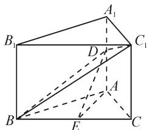
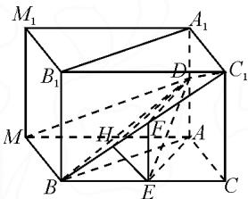
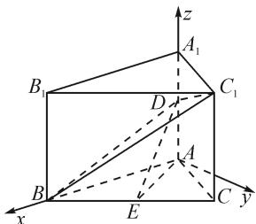
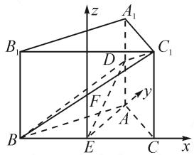
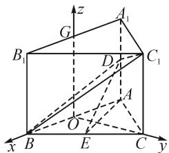

# 不同思路求解一道立体几何空间角问题

# ●浙江省嘉兴市清华附中嘉兴实验高中 陈蓬碧

摘要:立体几何的空间角相关问题是高中数学的常考内容,其问题具有一定的难度和挑战,对学生的解题思路和知识储备都具有一定要求.掌握常见不同解答立体几何空间角问题的思路和方法,有助于提升解题效率.本文中主要从一道立体几何例题的不同求解思路着手,拓展解题策略和思考角度.

关键词: 立体几何; 空间角; 解法探究

# 1 题目呈现

如图 1, 在直三棱柱 ABC- $A_{1}B_{1}C_{1}$ 中, $\triangle ABC$ 是边长为 6 的等边三角形, D, E 分别为 $AA_{1}$ , BC 的中点, 若异面直线 $BC_{1}$ 与 AC 所成角的余弦值为 $\frac{\sqrt{3}}{4}$ , 求 DE 与平面 $BDC_{1}$ 所成角的正弦值.

text_image

A₁
B₁
C₁
D
A
B
E
C

图 1

# 2 几何性质求解

运用几何性质求解立体几何空间角问题,需要利用几何定理找到所求空间角所处的平面,借助平面几何及解三角形知识对问题解答即可.解答问题时,首先要作图找到空间角所在的三角形平面,然后根据余弦定理公式 $\cos A = \frac{b^{2} + c^{2} - a^{2}}{2bc}$ 对问题作出解答,具体解题步骤如解法一 $^{[1]}$ 所示.

解法一:如图2,把直三棱柱 $ABC-A_{1}B_{1}C_{1}$ 补成直四棱柱 $ACBM-A_{1}C_{1}B_{1}M_{1}$ , MB//AC 且 MB=AC, 连接 $MC_{1}$ , 则 $\angle MBC_{1}$ 或其补角为异面直线 $BC_{1}$ 与 AC 所成的角. 根据余弦定理, 得

text_image

M₁
A₁
B₁
D
C₁
M
H
E
A
B
E
C

图2

$$
\cos \angle M B C _ {1} = \frac {B M ^ {2} + B C _ {1} ^ {2} - C _ {1} M ^ {2}}{2 \times B M \times B C _ {1}} = \frac {- 3}{\sqrt {3 6 + C C _ {1} ^ {2}}}.
$$

由异面直线 $BC_{1}$ 与 $AC$ 所成角的余弦值为 $\frac{\sqrt{3}}{4}$ ，得 $\left|\frac{-3}{\sqrt{36 + CC_1^2}}\right| = \frac{\sqrt{3}}{4}$ ，解得 $CC_{1} = 2\sqrt{3}$ .

取 $BC_{1}$ 的中点 F，连接 DF, EF.

由 $\triangle ABC$ 是边长为6的等边三角形,且AE//

DF, 得 $AE \perp BC$ , $DF \perp BC$ .

由 D 是 $AA_{1}$ 的中点，得 $DB = \sqrt{39}$ ， $DC_{1} = \sqrt{39}$ ， $DC_{1} = DB$ ，则 $DF \perp BC_{1}$ .

因为 $BC \cap BC_{1} = B$ ，所以 $DF \perp$ 平面 $BCC_{1}B_{1}$ .

又 $DF \subset$ 平面 $BDC_{1}$ , 所以平面 $BDC_{1} \perp$ 平面 $BCC_{1}B_{1}$ .

过点 E 作 $EH \perp BC_{1}$ 于点 H，连接 DH.

因为平面 $BDC_{1} \cap$ 平面 $BCC_{1}B_{1} = BC_{1}$ ，所以 $EH \perp$ 平面 $BDC_{1}$ ，故 $\angle EDH$ 即为 DE 与平面 $BDC_{1}$ 所成的角.

因为 $DE = \sqrt{AE^2 + AD^2} = \sqrt{30}$ , $BC_{1} = \sqrt{BC^{2} + CC_{1}^{2}} = 4\sqrt{3}$ , 所以 $HE = \frac{BC \times CC_{1}}{2 \times BC_{1}} = \frac{3}{2}$ .

在 Rt△EDH 中， $\sin\angle EDH=\frac{HE}{DE}=\frac{\sqrt{30}}{20}$ .

故 DE 与平面 $BDC_{1}$ 所成角的正弦值为 $\frac{\sqrt{30}}{20}$ .

# 3 空间向量求解

运用空间向量解答立体几何的空间角问题,主要在于构建空间直角坐标系以及向量坐标表达.首先根据问题条件构建合适的直角坐标系,然后对所求空间角有关量作出准确表达,通过公式 $\left|\cos\langle m,n\rangle\right|=\frac{\left|m\cdot n\right|}{\left|m\right|\cdot\left|n\right|}$ 对空间角的余弦值求解,问题也就迎刃而解.具体如解法二 $^{[2]}$ 所示.

解法二: 以 A 为坐标原点, 分别以 $\overrightarrow{AB}, \overrightarrow{AA_{1}}$ 的方向为 x 轴、z 轴的正方向, 建立如图 3 所示的空间直角坐标系.

设 $AA_{1}=2t(t>0)$ ，则 $B(6,0,0), C_{1}(3,3\sqrt{3},2t)$ ,

text_image

z
A₁
B₁
C₁
D
A
B
E
C
y
x

图3

$A(0,0,0),C(3,3\sqrt{3},0),D(0,0,t),E\left(\frac{9}{2},\frac{3\sqrt{3}}{2},0\right)$ ，
所以 $\overrightarrow{BD}=(-6,0,t),\overrightarrow{BC_{1}}=(-3,3\sqrt{3},2t),\overrightarrow{AC}=(3,3\sqrt{3},0)$ .

因为 $|\cos \langle \overrightarrow{BC_1},\overrightarrow{AC}\rangle | = \frac{|\overrightarrow{BC_1}\cdot\overrightarrow{AC}|}{|\overrightarrow{BC_1}|\cdot|\overrightarrow{AC}|} = \frac{\sqrt{3}}{4}$ 所以 $t = \sqrt{3}$

设平面 $BDC_{1}$ 法向量为 $\pmb {n} = (x,y,z)$ ，由 $\left\{ \begin{array}{l}\pmb {n}\cdot \overrightarrow{BC_1} = 0,\\ \pmb {n}\cdot \overrightarrow{BD} = 0, \end{array} \right.$ 得 $\left\{ \begin{array}{l} - 3x + 3\sqrt{3} y + 2\sqrt{3} z = 0,\\ -6x + \sqrt{3} z = 0. \end{array} \right.$

令 x=1，可得 $\boldsymbol{n}=(1,-\sqrt{3},2\sqrt{3})$ .

故 $\cos\langle\overrightarrow{ED},n\rangle=\frac{\sqrt{30}}{20}.$

解法三: 取 $BC_{1}$ 的中点 F，由题意可知，BC, EA, EF 三条直线两两垂直，令 E 为坐标原点，分别以 $\overrightarrow{EC}, \overrightarrow{EA}, \overrightarrow{EF}$ 的方向为 x, y, z 轴的正方向，建立如图 4 所示的空间直角坐标系 E-xyz.

text_image

z
A₁
B₁
C₁
D
F
y
A
B
E
C
x

图4

设 $AA_{1}=2t(t>0)$ ，则 $B(-3,0,0)$ ， $C_{1}(3,0,2t)$ ， $A(0,3\sqrt{3},0)$ ， $C(3,0,0)$ ， $D(0,3\sqrt{3},t)$ 。所以 $\overrightarrow{BD}=(3,3\sqrt{3},t)$ ， $\overrightarrow{BC_{1}}=(6,0,2t)$ ， $\overrightarrow{AC}=(3,-3\sqrt{3},0)$ 。故 $|\cos\langle\overrightarrow{BC_{1}},\overrightarrow{AC}\rangle|=\frac{\overrightarrow{|\overrightarrow{AC}\cdot BC_{1}|}}{|\overrightarrow{BC_{1}}|\cdot|\overrightarrow{AC}|}=$ $\frac{6\times3}{\sqrt{6^{2}+(2t)^{2}}\cdot\sqrt{3^{2}+(-3\sqrt{3})^{2}}}=\frac{\sqrt{3}}{4}$ ，解得 $t=\sqrt{3}$ .

假设平面 $BDC_{1}$ 的法向量为 $m=(x,y,z)$ .

由 $\left\{\begin{aligned}m\cdot\overrightarrow{BD}&=0,\\ m\cdot\overrightarrow{BC_{1}}&=0,\end{aligned}\right.$ 得 $\left\{\begin{aligned}3x+3\sqrt{3}y+\sqrt{3}z&=0,\\ 6x+2\sqrt{3}z&=0.\end{aligned}\right.$

令 x=1，则 $\boldsymbol{m}=(1,0,-\sqrt{3})$ .

$$
\begin{array}{r l} & {\text {又} \overrightarrow {E D} = (0, 3   \sqrt {3}, \sqrt {3})  , \text {所以} \cos \langle   \overrightarrow {E D},   \boldsymbol {m}   \rangle =} \\ & {\frac {\overrightarrow {E D} \cdot \boldsymbol {m}}{|   \overrightarrow {E D}   |   |   \boldsymbol {m}   |} = \frac {- 3}{\sqrt {(3 \sqrt {3}) ^ {2} + (\sqrt {3}) ^ {2}} \cdot \sqrt {1 + (- \sqrt {3}) ^ {2}}} =} \\ & {- \frac {\sqrt {3 0}}{2 0}.} \end{array}
$$

故直线 $DE$ 与平面 $BDC_{1}$ 所成角的正弦值为 $\frac{\sqrt{30}}{20}$ .

解法四: 设 $AB, A_{1}B_{1}$ 的中点分别是 O, G, 连接 OG, OC, 则 OB, OC, OG 三条直线两两垂直.

以点 O 为坐标原点, 分别以 $\overrightarrow{OB}, \overrightarrow{OC}, \overrightarrow{OG}$ 的方向为 x, y, z 轴的正方向, 建立如图 5 所示的空间直角坐标系 O-xyz.

假设 $AA_{1}=2t(t>0)$ ，则B(3,0,0)， $C_{1}(0,3\sqrt{3},2t)$ ， $A(-3,0,0)$ , $C(0,3\sqrt{3},0)$ ,

text_image

z
A₁
G
B₁
D
C₁
A
O
B
E
C
y
x

图5

$D(-3,0,t),E\left(\frac{3}{2},\frac{3\sqrt{3}}{2},0\right)$ ，所以 $\overrightarrow{BD} = (-6,0,t),\overrightarrow{BC_1} =$ $(-3,3\sqrt{3},2t),\overrightarrow{AC} = (3,3\sqrt{3},0)$ ，故 $|\cos \langle \overrightarrow{BC_1},\overrightarrow{AC}\rangle | =$ $\frac{|\overrightarrow{AC}\cdot\overrightarrow{BC_1}|}{|\overrightarrow{BC_1}|\cdot|\overrightarrow{AC}|} = \frac{-9 + 27}{\sqrt{9 + 27 + (2t)^2}\times\sqrt{9 + 27}} = \frac{\sqrt{3}}{4}$ 解得 $t = \sqrt{3}.$

假设平面 $BDC_{1}$ 的法向量为 $m=(x,y,z)$ .

由 $\left\{\begin{aligned}m\cdot\overrightarrow{BD}&=0,\\ m\cdot\overrightarrow{BC_{1}}&=0,\end{aligned}\right.$ 得

$$
\left\{ \begin{array}{l} - 6 x + \sqrt {3} z = 0, \\ - 3 x + 3 \sqrt {3} y + 2 \sqrt {3} z = 0. \end{array} \right.
$$

令 x=1，则 $\boldsymbol{m}=(1,-\sqrt{3},2\sqrt{3})$ .

又 $\overrightarrow{ED} = \left(-\frac{9}{2}, - \frac{3\sqrt{3}}{2},\sqrt{3}\right)$ ，所以

$$
\begin{array}{l} \cos \langle \overrightarrow {E D}, \boldsymbol {m} \rangle \\ = \frac {\overrightarrow {E D} \cdot m}{| \overrightarrow {E D} | \cdot | m |} \\ = \frac {- \frac {9}{2} + \frac {9}{2} + 6}{\sqrt {\left(- \frac {9}{2}\right) ^ {2} + \left(- \frac {3 \sqrt {3}}{2}\right) ^ {2} + 3} \cdot \sqrt {1 + 1 2 + 3}} \\ = \frac {\sqrt {3 0}}{2 0}. \\ \end{array}
$$

故直线 DE 与平面 $BDC_{1}$ 所成角的正弦值为 $\frac{\sqrt{30}}{20}$ .

通过上述不同思路和角度求立体几何空间角的例题分析,学生可以对立体几何空间角问题的求解有更深刻的认识,几何性质、空间向量都是解答空间角问题的有效思路和方法.

# 参考文献：

[1] 王焱坤.“基底搭桥”，不一样的解题精彩——一道高考立体几何题的教学运用[J].中学数学教学参考：上半月高中，2011(12):45-47.  
[2]龙宇.立体几何中解决空间角问题的一个新视角[J].数理化学习(高中版),2020(1):8-10.Z