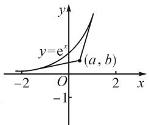
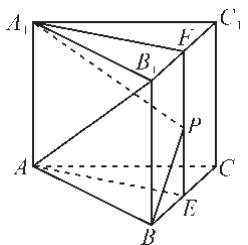
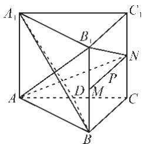

# 例谈新课标高考数学选择题的解答方法

# ●江苏省扬州市新华中学 张衡

摘要: 在考试中既快又好地完成选择题和填空题部分, 学生除了需要有扎实的基础知识外, 还要掌握一些解题方法. 本文中结合具体例题说明了解答选择题的一些方法, 为学生准确、迅速地解题提供帮助.

关键词: 多选题; 直接法; 特例法; 数形结合法; 逆推验证法

从 2021 年实施新高考以来, 高考数学试题新课标 I 卷和 II 卷在选择题上作了很大的调整, 从原来的 12 道单选题, 变为现在的 8 道单选题、4 道多选题, 评分标准都是每题满分 5 分. 选择题的备选项都是 4 个, 对于单选题, 选对得 5 分, 选错得 0 分; 而对于多选题, 正确答案往往为 2 项、3 项或 4 项, 全部选对得 5 分, 部分选对得 2 分, 所选答案中有错选或不选的得 0 分, 这无形中增加了试题的难度, 减少了考生蒙对选择题的几率, 降低了投机性, 从而反映了考生的真实水平.

虽然选择题是卷面中的小题,但从内容上讲,其涵盖的知识面广,很多题目具有一定的综合性,渗透对各种数学思想和方法的考查,体现了对考生“基础+能力”考查的导向性.从卷面分值上讲,选择题在整套试卷中的占分比重大,分值60分,占总分的40%,因此能否提高选择题的准确率获得高分,关系到考生能否取得良好的高考数学成绩.既然选择题如此重要,那如何更快更好地做好选择题呢?

由于选择题只由题干和选择项组成,不需要在卷面上写运算、推理等解答过程,因此,在稿纸上解题时学生常常运用不同于常规的方法和技巧,以求更快更准地求解.那么解答选择题有哪些策略呢?首先,无论是单选题还是多选题,要注意审题,看清题目的关键字眼.如,题干中出现最大(小)的、至(多)少、错误的、不正确等这些字眼时一定要仔细看清楚,以免造成错误选择,丢了不该丢的分.其次,对于多选题的选项,在没有充分把握的情况下,要做到“宁缺毋滥”.因为只要选了正确选项中的任何一个,都可以得到2分.但如果选项中出现错误选项,哪怕只有一个错误选项,也只能得0分,因此只选择把握最大的选项,以免造成出现错误选项而不得分的遗憾情况.最后,要掌握选择题的一些常用解题方法和技巧,如直接法、数形结合法、逆推验证法、特例法等.下面就这些方法与技巧进行举例说明.

# 1 直接法

从题目提供的已知条件出发,运用相关的数学知识,如性质、定理、公式等,经过严密的推理和准确的运算,得出结论,再对照选择项,从中选出正确答案的方法叫直接法.

例 1 （2022 年高考新课标 I 卷）记函数 $f(x)=\sin\left(\omega x+\frac{\pi}{4}\right)+b(\omega>0)$ 的最小正周期为 T，若 $\frac{2\pi}{3}<T<\pi$ ，且 $y=f(x)$ 的图象关于点 $(\frac{3\pi}{2},2)$ 中心对称，则 $f\left(\frac{\pi}{2}\right)=(\quad)$ .

A.1 B. $\frac{3}{2}$ C. $\frac{5}{2}$ D.3

解析:由 $\frac{2\pi}{3}<T<\pi$ ,且 $T=\frac{2\pi}{\omega}$ ,得 $\frac{2\pi}{3}<\frac{2\pi}{\omega}<\pi$ ,所以 $2<\omega<3$ .

由 $y=f(x)$ 的图象关于点 $\left(\frac{3\pi}{2},2\right)$ 中心对称，得 b=2，且 $\sin\left(\frac{3\pi}{2}\omega+\frac{\pi}{4}\right)=0$ ，则 $\frac{3\pi}{2}\omega+\frac{\pi}{4}=k\pi,k\in Z$ ，所以 $\omega=\frac{2}{3}\left(k-\frac{1}{4}\right),k\in Z.$

取 k=4，可得 $\omega=\frac{5}{2}$ ，所以 $f(x)=\sin\left(\frac{5}{2}x+\frac{\pi}{4}\right)+2$ ，则 $f\left(\frac{\pi}{2}\right)=\sin\left(\frac{5}{2}\times\frac{\pi}{2}+\frac{\pi}{4}\right)+2=1.$

故选项 A 正确.

直接法是解答选择题最基本的方法,适用于任何难度的题目.一些基础性的选择题用直接法可迅速求解.对于中高难度的选择题,需要学生具备扎实的基础知识,准确把握题目的特征和本质,才能选择直接法按部就班地求解.

# 2 数形结合法

根据题目的已知条件呈现出的数量关系,如方程、函数等,转化成相应的曲线或几何图形,结合曲线或图形的性质特征,作出正确判断的方法叫数形结合法.

例 2 （2021 年高考新课标 I 卷）若过点 $(a, b)$ 可以作曲线 $y = e^{x}$ 的两条切线，则（）.

A. $e^{b}<a$

B. $e^{a}<b$

C. $0 < a < e^{b}$

D. $0 < b < \mathrm{e}^{a}$

解析: 函数的图象如图 1, 若点 $(a,b)$ 在 x 轴上或 x 轴下方, 则只有一条切线;

若点 $(a,b)$ 在曲线上，则只有一条切线；

若点 $(a,b)$ 在曲线上方，则没有切线；

text_image

y
y=e^x
(a, b)
-2 O 2 x
-1

图1

所以点 $(a, b)$ 只能在函数图象的下方，且在 $x$ 轴上方时，有两条切线，从而 $0 < b < \mathrm{e}^a$ 。故选项D正确。

以形助数,或以数解形,通过这种直观的几何图形来解答,无疑给解题带来很大的方便,尤其是对于复杂的函数类题目而言.在画图时一定要注意题中变量的取值范围对图象的影响,注意图象的准确性.

# 3 逆推验证法

将各个选择项的部分或全部结论分别作为已知条件,再结合题目的条件一起进行推导,看是否得出矛盾,从而判断对错,获得正确选项的方法叫逆推验证法.

例 3 （2021 年高考新课标Ⅱ卷）已知直线 l: $ax + by - r^{2} = 0$ 与圆 $C: x^{2} + y^{2} = r^{2}$ ，点 $A(a, b)$ ，则下列说法正确的是（）.

A. 若点 A 在圆 C 上, 则直线 l 与圆 C 相切  
B. 若点 A 在圆 C 内, 则直线 l 与圆 C 相离  
C. 若点 A 在圆 C 外, 则直线 l 与圆 C 相离  
D. 若点 A 在直线 l 上, 则直线 l 与圆 C 相切

解析: 圆心 $C(0,0)$ 到直线 l 的距离 $d=\frac{r^{2}}{\sqrt{a^{2}+b^{2}}}$ .

若点 $A(a,b)$ 在圆 $C$ 上，则 $a^2 + b^2 = r^2$ ，所以 $d = |r|$ ，直线 $l$ 与圆 $C$ 相切，故选项 A 正确；

若点 $A(a,b)$ 在圆 C 内，则 $a^{2}+b^{2}<r^{2}$ ，所以 d> |r|，直线 l 与圆 C 相离，故选项 B 正确；

若点 $A(a,b)$ 在圆 C 外，则 $a^{2}+b^{2}>r^{2}$ ，所以 $d<|r|$ ，直线 l 与圆 C 相交，故选项 C 错误；

若点 $A(a,b)$ 在直线 l 上，则 $a^{2}+b^{2}-r^{2}=0$ ，所以 $d=|r|$ ，直线 l 与圆 C 相切，故选项 D 正确。

故选: ABD.

逆推验证法是逆向思维的具体运用,正难则反,将各选择项的假设部分作为题中的补充条件,反向去推理、检验,看选择项中的命题是否成立,能成立的选择项就是正确的答案.通常适用于题设条件相对简单,且把选择项作为附加条件的选择题.

# 4 特例法

从题干(或选项)出发,通过选取特殊的情形,代入题中的条件,推导出特殊函数或者图形位置,再对各个选项进行检验,从而作出正确判断的方法叫特例法.这种特殊化的方法简化了题目的运算和推理,体现了以繁化简的策略.

例 4 （2021 年高考新课标 I 卷）在正三棱柱 $ABC-A_{1}B_{1}C_{1}$ 中， $AB = AA_{1} = 1$ ，点 P 满足 $\overrightarrow{BP} = \lambda \overrightarrow{BC} + \mu \overrightarrow{BB_{1}}$ ，其中 $\lambda \in [0,1], \mu \in [0,1]$ ，则（）.

A. 当 $\lambda=1$ 时， $\triangle AB_{1}P$ 的周长为定值  
B. 当 $\mu=1$ 时, 三棱锥 $P-A_{1}BC$ 的体积为定值  
C. 当 $\lambda = \frac{1}{2}$ 时，有且仅有一个点 P，使得 $A_{1}P \perp BP$   
D. 当 $\mu=\frac{1}{2}$ 时, 有且仅有一个点 P, 使得 $A_{1}B \perp$ 平面 $AB_{1}P$

解析:对于选项 A, 当 $\lambda=1$ 时, 经判断点 P 在线段 $CC_{1}$ 上 (含点 $C, C_{1}$ ). 采用特例法, 取 P 为 $CC_{1}$ 的中点时, 求得 $\triangle AB_{1}P$ 的周长为 $\sqrt{5}+\sqrt{2}$ ; 取点 P 与点 $C_{1}$ 重合时, $\triangle AB_{1}P$ 的周长为 $2\sqrt{2}+1$ . 所以周长不是定值, 故选项 A 错误.

对于选项 B, 如图 2, 当 $\mu=1$ 时, 经判断点 P 在线段 $B_{1}C_{1}$ 上. 因为 $B_{1}C_{1} \parallel$ 平面 $A_{1}BC$ , 所以直线 $B_{1}C_{1}$ 上的任意一点到平面 $A_{1}BC$ 的距离相等, 即点 P 到平面 $A_{1}BC$ 的距离为定值. 又 $\triangle A_{1}BC$ 的面积为定值, 所以三棱锥 $P-A_{1}BC$ 的体积为定值, 故选项 B 正确.

对于选项 C, 如图 2, 当 $\lambda = \frac{1}{2}$ 时, 取线段 BC, $B_{1}C_{1}$ 的中点分别为 E, F, 连接 EF, 则点 P 在线段 EF 上.

用特例法，取点 P 在 E 处时， $AE \perp BC, EF \perp BC$ ，又 $AE \cap EF = E$ ，所以 $BC \perp$ 平面 $A_{1}AEF$ 。又 $A_{1}P \subset$ 平面 $A_{1}AEF$ ，所以 $BC \perp A_{1}P$ ，即 $A_{1}P \perp BP$ 。

(下转第97页)

# (上接第83页)

同理，当点 $P$ 在 $F$ 处时，可证 $A_{1}P \perp BP$ . 故选项C错误.

text_image

A₁
B₁
C₁
A
B
C
E
P

图2

text_image

A₁
B₁
C₁
N
P
D
M
A
B
C

图3

对于选项 D, 如图 3, 当 $\mu = \frac{1}{2}$ 时, 取 $BB_{1}$ 的中点 M, $CC_{1}$ 的中点 N, 可推出点 P 在线段 MN 上.

当点 P 在点 N 处时, 取 AC 的中点 D, 连接 $A_{1}D$ , BD.

由 $BD \perp$ 平面 $ACC_{1}A_{1}$ , 可推出 $AN \perp BD$ ,

又 $AN \perp A_{1}D$ ，故可推出 $AN \perp$ 平面 $A_{1}BD$ .

又 $A_{1}B \subset$ 平面 $A_{1}BD$ , 所以 $A_{1}B \perp AN$ .

因为 $AB_{1} \perp AB_{1}$ , 又 $AN \cap AB_{1} = A$ , 所以 $A_{1}B \perp$ 平面 $AB_{1}N$ . 而过一点 $A$ 与定直线 $A_{1}B$ 垂直的平面有且仅有一个, 故有且仅有一点 $P$ , 使得 $A_{1}B \perp$ 平面 $AB_{1}P$ , 选项 D 正确.

故选：BD.

本题难度较大,不仅用了数形结合法,即结合正三棱柱的几何特性,借助图形的直观性来研究线面和线线之间的关系,还用了特例法,通过对特殊情况如端点处、中点处的研究由此得出普遍性规律.这也是解答一些几何类选择题常用的方法.

总之，为了准确、迅速地解答选择题，学生除了需要认真审题、细心推算，初选后还要检验以确保准确外，还要掌握一些基本的解题方法和技巧，针对不同的题目条件选择不同的解法，以达到事半功倍的效果。对于有些难度较大的题目，往往是各种方法糅杂在一起，交替使用。学生要熟练掌握这些方法，以到达融会贯通，“通一题会一类”。Z

# 中国近代数学之父——熊庆来

■复旦大学附属中学 汪杰良

熊庆来（1893—1969），字迪之，云南省弥勒县息宰村人。中国数学家、教育家。1933年获得法国巴黎大学理科博士学位。中国科学院院士。中国数学会首届理事。任东南大学和清华大学算学系主任、教授，云南大学校长。任中国科学院数学研究所研究员、函数论研究室主任，全国政协常委。

他创办了东南大学算学系、清华大学算学系、清华大学算学研究部、中国《数学学报》，致力于开展整函数、亚纯函数、代数体函数及正规族的研究，他所引进的无穷级的定义被国际上称为“熊氏无穷级”。先后在《科学记录》《中国科学》《数学学报》《数学汇刊》等期刊上发表了20多篇具有国际水平的学术论文。

他先后培养指导的学生有许宝騄、段学复、庄圻泰、华罗庚、陈省身、胡坤升（陞）、柯召、徐贤修、林家翘、吴新谋、杨乐、张广厚等一大批数学家。

熊庆来以 “熊氏无穷数” 理论载入世界数学史册，为中国数学作出了卓越贡献。他被誉为：“中国现代数学先驱”，“中国函数论的主要开拓者之一”。1992年中国邮政为数学家熊庆来发行《中国现代科学家（第三组）》全套4枚纪念邮票。

2022年在东南大学建校120周年、第九届世界华人数学家大会召开之际，熊庆来先生铜像在南京揭幕。菲尔兹奖得主、清华大学讲席教授丘成桐，东南大学党委书记左惟，院士杨乐，黄卫，薛其坤等参加了揭幕仪式。丘成桐寄语：正是熊庆来先生这样一批严谨求实、初心报国的伟大数学家、教育家孜孜不倦、上下求索，才推动我国数学学科从蹒跚学步到阔步前行，希望广大青年学子学习熊庆来先生的精神和风范，守正创新，锐意进取，为国家科学发展作出新贡献。

位于云南省红河州弥勒市的熊庆来故居，被公布为第七批全国重点文物保护单位。昆明熊庆来李广田故居为云南省文物保护单位。国家人文地理杂志《中国高校最美地方排行榜》将其列为“中国高校最美的八座大师故居”之一。

熊庆来院士的名言：“太华巍巍，拔海千寻；滇池淼淼，万山为襟。卓哉吾校，其与同高深。北极低悬赤道近，节候宜物复宜人。四时读书好，探研境界更无垠。努力求新，以作我民；努力求真，文明允臻。以作我民，文明允臻。”（云南大学校歌歌词）