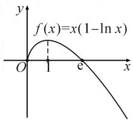

# 例谈极值点偏移问题的处理方略

# ●安徽省安庆市宿松县花凉中学 张琼琴

摘要:一个函数在某区间内存在一个极值点和两个零点,若该极值点在两个零点的中点的左侧,则称极值点左偏移;若该极值点在两个零点的中点的右侧,则称极值点右偏移.处理极值点偏移问题的常用方法是构造相应的函数,并利用函数的单调性处理.

关键词: 极值点; 偏移; 导数

极值点偏移问题是近年高考或模拟考试的常见题型,处理此类问题的关键是要明确偏移的类型及判定方法,进而构造偏移函数.本文中以2021年全国新高考Ⅰ卷导数压轴题为例,探究极值点偏移问题的处理策略.

# 1 考题呈现

问题 （2021年新高考Ⅰ卷第22题）已知函数 $f(x)=x(1-\ln x)$ .

(1) 讨论 $f(x)$ 的单调性；  
(2) 设 $a, b$ 为两个不相等的正数，且 $b \ln a - a \ln b = a - b$ ，证明： $2 < \frac{1}{a} + \frac{1}{b} < e$ .

# 2 极值点偏移的判定

定理 对于可导函数 $y=f(x)$ 在区间 $(a,b)$ 内唯一一个极大值点（或极小值点） $x_{0}$ ，且存在 $x_{1},x_{2}$ 是函数 $y=f(x)$ 的两个零点，其中 $a<x_{1}<x_{2}<b$ .

如果 $f(x_{1})<f(2x_{0}-x_{2})$ ，那么 $\frac{x_{1}+x_{2}}{2}<x_{0}$ （或 $\frac{x_{1}+x_{2}}{2}>x_{0}$ ），即函数 $y=f(x)$ 在区间 $(x_{1},x_{2})$ 内，极大值点（或极小值点） $x_{0}$ 右偏移（或左偏移）.

证明: 因为 $x_{0}$ 为函数 $y=f(x)$ 在区间 $(a,b)$ 内的唯一一个极大值点（或极小值点），所以 $f(x)$ 在区间 $(a,x_{0})$ 单调递增（或单调递减），在区间 $(x_{0},b)$ 内单调递减（或单调递增）。而 $a<x_{1}<x_{0}<x_{2}<b$ ，且 $2x_{0}-x_{2}<x_{0}$ ，又因为 $f(x_{1})<f(2x_{0}-x_{2})$ ，所以 $x_{1}<2x_{0}-x_{2}$ （或 $x_{1}>2x_{0}-x_{2}$ ），所以 $\frac{x_{1}+x_{2}}{2}<x_{0}$ （或 $\frac{x_{1}+x_{2}}{2}>$ $x_{0}$ ，即极大值点(或极小值点) $x_{0}$ 右偏移(或左偏移).

同理, 如果 $f(x_{1}) > f(2x_{0} - x_{2})$ , 那么 $\frac{x_{1} + x_{2}}{2} > x_{0}$ (或 $\frac{x_{1} + x_{2}}{2} < x_{0}$ ), 即函数 $y = f(x)$ 在区间 $(x_{1}, x_{2})$ 内, 极大值点 (或极小值点) $x_{0}$ 左偏移 (或右偏移).

# 3 方法总结

通过对判定定理的证明,我们可得出处理极值点偏移问题的基本步骤及方法:

(1) 判断函数 $f(x)$ 的单调情况并求出其极值点 $x_{0}$ .  
(2)构造函数 $g(x)=f(x)-f(2x_{0}-x)$ .

以 $x_{1} + x_{2} > 2x_{0}$ 的情况为例，即 $x_{2} > 2x_{0} - x_{1}$ 其中 $a < x_{1} < x_{0} < x_{2} < b$ ，所以 $x_{2}$ 与 $2x_{0} - x_{1}$ 在同一单调区间 $(x_0,b)$ 内，故 $x_{2}$ 与 $2x_{0} - x_{1}$ 的大小关系可通过 $f(x_{2})$ 与 $f(2x_0 - x_1)$ 的大小关系来判断.又因为 $f(x_{1}) = f(x_{2})$ ，所以将问题转化为判断 $f(x_{1})$ 与 $f(2x_0 - x_1)$ 的关系，而这两个函数的变量均为 $x_{1}$ ，故可构造函数 $g(x) = f(x) - f(2x_0 - x)$

(3) 判断函数 $g(x) = f(x) - f(2x_0 - x)$ 的单调性.

# 4 考题解答

本题所给函数较为简单,且不含参数,第(1)问讨论函数的单调性属于基础设问.第(2)问所给关系式 $b\ln a-a\ln b=a-b$ 是关于a,b的对称式,可先考虑将a,b分离,即将等式两端同除以ab,得 $\frac{\ln a}{a}+\frac{1}{a}=$

$\frac{\ln b}{b}+\frac{1}{b}$ ，结合所给函数关系可将其变形为 $\frac{1}{a}\left(1-\ln\frac{1}{a}\right)=\frac{1}{b}\left(1-\ln\frac{1}{b}\right)$ ，从而可知 $\frac{1}{a},\frac{1}{b}$ 为方程 $f(x)=k$ （k取何值对问题本身没有影响）的两个根，在此条件下证明 $2<\frac{1}{a}+\frac{1}{b}<e$ 。至此极值点偏移问题直观地展现在我们面前。具体证明过程如下。

解析:(1)函数 $f(x)$ 的定义域为 $(0,+\infty)$ ，且 $f'(x)=1-\ln x-1=-\ln x$ .

所以，当 $x \in (0,1)$ 时， $f'(x) > 0$ ；当 $x \in (1, +\infty)$ 时， $f'(x) < 0$ .

故函数 $f(x)$ 的递增区间为 $(0,1)$ ，递减区间为 $(1,+\infty)$ .

(2) 证明: 由 $b \ln a - a \ln b = a - b$ , 得 $b (\ln a + 1) = a (\ln b + 1)$ , 即 $\frac{\ln a + 1}{a} = \frac{\ln b + 1}{b}$ , 故 $f\left(\frac{1}{a}\right) = f\left(\frac{1}{b}\right)$ . 设 $\frac{1}{a} = x_1, \frac{1}{b} = x_2$ , 由 (1) 不妨设 $0 < x_1 < 1, x_2 > 1$ .

因为 $x \in (0,1)$ 时， $f(x) = x \cdot (1 - \ln x) > 0, x \in (\mathrm{e}, +\infty)$ 时， $f(x) < 0$ ，所以 $1 < x_{2} < e$ 。如图 1.

先证 $x_{1} + x_{2} > 2$

若 $x_{2} \geqslant 2$ ，则 $x_{1} + x_{2} > 2$ 必成立.

text_image

f(x)=x(1-ln x)
O
e
x
y

图 1

若 $x_{2}<2$ ，要证 $x_{1}+x_{2}>2$ ，即证 $x_{1}>2-x_{2}$ ，而 $0<2-x_{2}<1$ ，故即证 $f(x_{1})>f(2-x_{2})$ ，即证 $f(x_{2})>f(2-x_{2})$ ，其中 $1<x_{2}<2$ 。

设 $g(x) = f(x) - f(2 - x), 1 < x < 2$ ，则 $g'(x) = -\ln x - \ln (2 - x) = -\ln [x(2 - x)]$ .

因为 1<x<2，所以 $0<x(2-x)<1$ ，从而可知 $-\ln[x(2-x)]>0$ ，即 $g'(x)>0$ ，故 $g(x)$ 在 $(1,2)$ 上为增函数。所以 $g(x)>g(1)=0$ ，故 $f(x)>f(2-x)$ ，即 $f(x_{2})>f(2-x_{2})$ 成立，因此 $x_{1}+x_{2}>2$ 成立。

综上， $x_{1}+x_{2}>2$ 成立.

再证 $x_{1} + x_{2} < \mathrm{e}$ ，即证 $x_{2} < \mathrm{e} - x_{1}$

因为 $x_{2}>1$ ，所以 $1<x_{2}<e-x_{1}$ 。又因为函数 $f(x)$ 在 $(1,+\infty)$ 上单调递减，所以转化为证明 $f(x_{2})>f(e-x_{1})$ ，而 $f(x_{1})=f(x_{2})$ ，从而只需要证明 $f(x_{1})>f(e-x_{1})$ 即可。

设函数 $g(x)=f(x)-f(\mathrm{e}-x)(0<x<1)$ ，求导得 $g'(x) = -\ln x - \ln(e - x)$ .

令 $h(x)=-\ln x-\ln(\mathrm{e}-x)$ ，则 $h'(x)=-\frac{1}{x}+\frac{1}{\mathrm{e}-x}=\frac{2x-\mathrm{e}}{x(\mathrm{e}-x)}<0$ ，所以 $h(x)=-\ln x-\ln(\mathrm{e}-x)$ 在区间 $(0,1)$ 上单调递减。当 $x\to1$ 时， $h(x)<0$ ，即 $g'(x)<0$ ，当 $x\to0^{+}$ 时， $h(x)>0$ ，即 $g'(x)>0$ ，所以 $\exists x_{0}\in(0,1)$ ，使 $g'(x_{0})=0$ 。所以当 $x\in(0,x_{0})$ 时， $g'(x)>0,g(x)$ 单调递增；当 $x\in(x_{0},1)$ 时， $g'(x)<0,g(x)$ 单调递减。又因为在 $x\to1$ 时， $g(x)>0$ ，在 $x\to0^{+}$ 时， $g(x)>0$ ，所以 $g(x)>0$ 恒成立。因此 $f(x)>f(\mathrm{e}-x)(0<x<1)$ 得证。

综上可知， $2<\frac{1}{a}+\frac{1}{b}<e$ 得证.

# 5 解题反思

本题第(2)问所要证明的式子 $2<\frac{1}{a}+\frac{1}{b}<e$ 中，左边的不等式 $\frac{1}{a}+\frac{1}{b}>2$ 属于标准的极值点偏移问题，右边的不等式 $\frac{1}{a}+\frac{1}{b}<e$ 并不是标准的极值点偏移问题，但仍然可采用统一变量的思想处理。当然也可利用其他方法，例如，在 $x_{1}(1-\ln x_{1})=x_{2}(1-\ln x_{2})$ 中，因为 $0<x_{1}<1$ ，所以 $1-\ln x_{1}>1$ ，从而 $x_{1}(1-\ln x_{1})>x_{1}$ ，即 $x_{1}<x_{2}(1-\ln x_{2})$ 。欲证 $x_{1}+x_{2}<e$ ，即证 $x_{2}(1-\ln x_{2})+x_{2}<e$ ，进而构造函数 $g(x)=x(1-\ln x)+x$ ，求函数 $g(x)$ 的最大值即可。

另外，在本题的求解中，对 $b \ln a - a \ln b = a - b$ 变形得到 $\frac{1}{a} (1 - \ln a) = \frac{1}{b} (1 + \ln b)$ 后，还可继续变形得 $\frac{1}{a} \ln (\mathrm{e}a) = \frac{1}{b} \ln (\mathrm{e}b)$ ，即 $\frac{1}{\mathrm{e}a} \ln (\mathrm{e}a) = \frac{1}{\mathrm{e}b} \ln (\mathrm{e}b)$ . 设 $\frac{1}{\mathrm{e}x} = t$ ，则 $\frac{1}{x} = \mathrm{e}t$ ，于是 $t_1 \ln t_1 = t_2 \ln t_2$ ，进而所证的结论转化为 $2 < \mathrm{e}t_1 + \mathrm{e}t_2 < \mathrm{e}$ ，即 $\frac{2}{\mathrm{e}} < t_1 + t_2 < 1$ . 再利用极值点偏移问题进行处理.

总之,高考命题虽然常考常新,但只要我们明确常考类型、透析命题原理、精通相应的处理方法,即可“以不变应万变”.Z