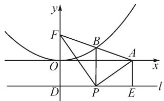
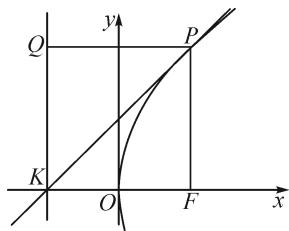
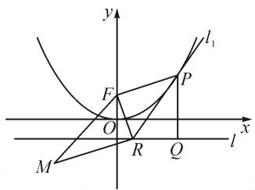
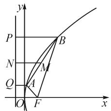

# 借助定义,妙破问题

# ●安徽省临泉田家炳实验中学 石朝阳

定义是相关知识的理论基础和精神灵魂,借助定义,回归本质,往往是破解问题的一个基本切入点.圆锥曲线中的抛物线,其定义很好地反映了曲线的本质特征,揭示了曲线存在的几何性质与规律.回归抛物线定义,应用抛物线定义,实现抛物线上的点到焦点的距离与该点到准线距离之间的合理转化,即实现“两点距离”和“点线距离”之间的合理转化,是破解抛物线问题中非常常用的一个技巧方法.

# 1 线段长度的计算

例 1 [2021 届广东省(新高考)高三卫冕联考数学试卷·16]已知抛物线 $x^{2}=8y$ 的焦点为 F，准线为 l，点 P 是 l 上一点，过点 P 作 PF 的垂线交 x 轴的正半轴于点 A，AF 交抛物线于点 B，PB 与 y 轴平行，则 $\left|FA\right|=$ \_\_\_\_.

分析:作出对应的图形,通过辅助线的构建,借助抛物线定义的转化,结合平面几何知识,利用角的等价转化确定直角三角形的性质,并利用平行关系以及梯形中位线的性质加以转化，数形结合，巧妙求解.

text_image

y
F
B
O
A
x
D
P
E
l

图 1

解析:如图1,由题意可得 $F(0,2)$ ,设直线l与y轴的交点为D,可得 $|OD|=|OF|=2$ .过点A作直线l的垂线,垂足为E.

根据抛物线的定义, 可得 $\left|BF\right| = \left|BP\right|$ , 从而 $\angle BFP = \angle BPF$ .

又 $PA \perp PF$ ，则有 $\angle BFP + \angle BAP = \angle BPF + \angle BPA$ ，可得 $\angle BAP = \angle BPA$ ，从而 $|BA| = |BP|$ .

易知 $PB$ 是 $\mathrm{Rt}\triangle APF$ 斜边 $AF$ 上的中线，可得 $B$ 是 $AF$ 的中点. 又 $PB$ 与 $y$ 轴平行，可得 $P$ 是 $DE$ 的中点. 所以 $|FA| = 2|PB| = |DF| + |OD| = 4 + 2 = 6$ .

故填答案:6.

点评:合理借助抛物线的定义,实现线段长度之间的转化,利用平面几何知识,数形结合,直观想象,可以很好地加以分析与处理.在实际利用抛物线定义时,为了实现抛物线上的点到焦点的距离与该点到准线距离之间的转化,经常要通过辅助线的构建来达到目的.

# 2 参数取值的求解

例 2 [2021 届广东省佛山市高中教学质量检测 (二) 高三数学试卷·15] 已知抛物线 $C: y^{2} = 2px (p > 0)$ 的焦点为 F, K 为 C 的准线 l 与 x 轴的交点，过点 K 且倾斜角为 $45^{\circ}$ 的直线与 C 仅有一个公共点 $P(3, t)$ ，则 t = \_\_\_\_.

分析:根据题目条件作出对应的图形,过切点作直线垂直于抛物线的准线,利用三角形形状的判定,设出对应的边长,并结合抛物线的定义以及题目条件,利用余弦定理在 $\triangle PKF$ 中建立关系式,进而确定两参数之间的关系,结合题目条件中切点的坐标信息加以综合,进而确定对应的参数值.

解析: 如图 2 所示, 过点 $P(3, t)$ 作 PQ 垂直准线 l 于点 Q, 连接 PF, 易知 $\triangle PQK$ 为等腰直角三角形. 设 $|PQ| = |QK| = a$ , 可得 $|PK| = \sqrt{2}a$ .

text_image

Q
y
P
K
O
F
x

图2

在 $\triangle PKF$ 中， $|PK|=\sqrt{2}a$ ，由抛物线的定义， $|PF|=|PQ|=a$ ， $|KF|=p.$ 又 $\angle PKF=45^{\circ}$ ，由余弦定理，可得 $a^{2}=2a^{2}+p^{2}-2\cdot\sqrt{2}a\cdot p\cos45^{\circ}$ ，解得 $p=a$ ，从而 $\triangle PKF$ 也是等腰直角三角形，可得 $\frac{p}{2}=3$ ，即 $p=6$ ，所以 $t=p=6$ 。

故填答案:6.

点评:利用平面几何法破解与抛物线有关的数学问题时,经常通过抛物线的定义巧妙转化,数形结合,直观想象,有机“串联”起解三角形、平面向量、平面解析几何等相关知识,结合平面几何图形与性质,综合相关知识来解决问题.

# 3 最值问题的确定

例 3 （2021 届山东省济南市高三十一校联考数学试卷·15）已知点 $M(-4,-2)$ ，抛物线 $x^{2}=4y$ 的焦点为 F，准线为 l，P 为抛物线上一点，过 P 作 $PQ \perp l$ ，点 Q 为垂足，过 P 作抛物线的切线 $l_{1}, l_{1}$ 与 l 交于点 R，则 $|QR| + |MR|$ 的最小值为 \_\_\_\_.

分析:根据题目条件,设出点 P 的坐标,进而确定相关点的坐标,结合导数的几何意义以及两直线垂直的斜率关系来确定直线的垂直问题,利用抛物线的定义以及平面几何的性质加以转化,数形结合来确定线段长度的和式的最值问题.

解析: 如图 3, 由抛物线 $x^{2}=4y$ , 可得焦点 $F(0,1)$ , 准线 l 的方程为 y=-1. 设 $P(t,\frac{t^{2}}{4})$ , 则 $Q(t,-1)$ .

text_image

y
l₁
F
P
O
x
M
R
Q
l

图3

求导可得 $y'=\frac{1}{2}x$ ,
则过点 P 的切线 $l_{1}$ 的斜

由 $k_{\mathrm{QF}} = \frac{1 + 1}{0 - t} = -\frac{2}{t}$ ，可知 $k_{\mathrm{QF}}\cdot k = \left(-\frac{2}{t}\right)\cdot \frac{t}{2} =$ -1，而根据抛物线的定义有 $|PF| = |PQ|$ ，则知切线 $l_{1}$ 为线段 $FQ$ 的垂直平分线，从而 $|RF| = |RQ|$

数形结合，可知 $|QR| + |MR| = |FR| + |MR| \geqslant |MF| = \sqrt{(-4 - 0)^2 + (-2 - 1)^2} = 5$ ，当且仅当点 $R$ 为准线 $l$ 与直线 $MF$ 的交点时， $|QR| + |MR|$ 的最小值为5.

故填答案:5.

点评: 确定抛物线上一些相关线段长度代数式的最值问题时, 经常借助抛物线的定义, 把对应的线段加以合理转化, 实现抛物线上的点到焦点的距离与该点到准线距离之间的转化, 并与其他线段加以有机融合, 或数形结合, 或利用几何意义, 或不等式放缩, 直观想象, 逻辑推理, 巧妙确定.

# 4 取值范围中的应用

例 4 （名校联考联合体 2021 届高考仿真演练联合考试数学试卷）抛物线 $y^{2}=2px$ (p>0) 的焦点为 F, A, B 为抛物线上的两个动点，且满足 $\angle AFB=$ $60^{\circ}$ , 过线段 $AB$ 的中点 $M$ 作抛物线准线的垂线 $MN$ , 垂足为 $N$ , 则 $\frac{|MN|}{|AB|}$ 的取值范围为 \_\_\_\_.

分析:借助图形直观,通过辅助线的构建,结合抛物线定义加以转化,合理借助梯形性质,利用余弦定理建立关系式,结合基本不等式加以合理放缩,进而建立相应的不等式,得以判断对应线段比值的取值范围问题.

text_image

y
P
B
N
M
Q
A
O
F
x

图4

解析:如图4,设 $|AF|=a$ , $|BF|=b$ ,过点A,B分别作抛物线准线的垂线AQ,BP,垂足分别为Q,P.

根据抛物线定义，可得 $\left|AF\right| = \left|AQ\right|$ ， $\left|BF\right| = \left|BP\right|$ .

所以，在梯形ABPQ中，有 $2\mid MN\mid = \mid AQ\mid +$ $\mid BP\mid = a + b.$

在 $\triangle ABF$ 中，由余弦定理，得 $|AB|^2 = a^2 + b^2 - 2ab\cos 60^\circ = a^2 + b^2 - ab = (a + b)^2 - 3ab.$

由基本不等式，得 $ab \leqslant \left(\frac{a + b}{2}\right)^2$ ，则 $|AB|^2 = (a + b)^2 - 3ab \geqslant (a + b)^2 - \frac{3}{4}(a + b)^2 = \frac{1}{4}(a + b)^2$ ，解得 $|AB| \geqslant \frac{1}{2}(a + b)$ .

所以 $\frac{|MN|}{|AB|}\leqslant1$ ，当且仅当 a=b，即 $|AF|=|BF|$ 时，等号成立.

显然 $\frac{|MN|}{|AB|} > 0$ ，则有 $0 < \frac{|MN|}{|AB|} \leqslant 1$ ，即 $\frac{|MN|}{|AB|}$ 的取值范围为 $(0,1]$ .

故填答案:(0,1].

点评:巧妙融合抛物线的定义和简单几何性质、基本不等式以及余弦定理等相关数学知识,借助抛物线的定义加以合理转化,数形结合,合理放缩,为线段比值取值范围的确定提供条件.

利用抛物线定义,往往能达到回归问题本质的目的.借助合理构建“两点距离”和“点线距离”之间的关系,特别是在破解一些抛物线中与焦点有关的线段长度问题时有奇效,实现有机转化,巧妙应用.在有关数学问题的实际应用时,借助定义,合理转化,巧妙应用,全面融合数学知识、数学思想方法和数学能力,提升学生数学应用能力,养成良好的思维品质,培养数学核心素养.Z